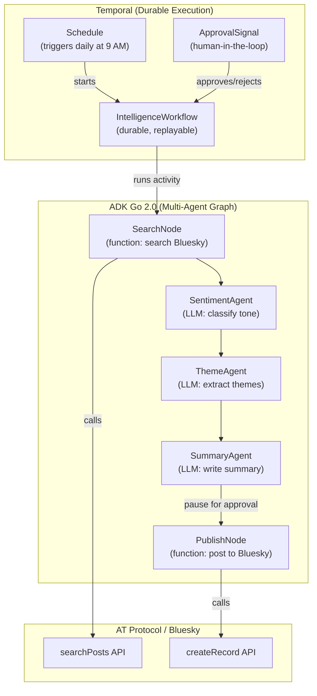

## What You're Building

You want to know what people are saying about a topic on Bluesky — not just a few posts, but the shape of the conversation. What are the main themes? Is the sentiment positive, negative, or mixed? Who are the key voices? And once you know, you want to publish a summary thread back to Bluesky so others can benefit from the analysis.

The problem is that this pipeline has too many moving parts for a script. You need to search Bluesky, feed the results to an LLM for analysis, wait for a human to approve the summary before it goes public, and then post it. If any step fails — the Bluesky API rate-limits you, the LLM call times out, the human doesn't respond for an hour — you don't want to start over. You want to pick up where you left off.

This tutorial builds a **durable Bluesky intelligence agent** that does all of this, combining three technologies:

- **[ADK Go 2.0](https://github.com/google/adk-go)** — Google's Agent Development Kit for Go, released June 2026. You'll use its new graph-based workflow engine to compose a multi-agent pipeline: a sentiment classifier, a theme extractor, and a summary writer, all wired as nodes in a directed graph. Each agent runs in `ModeSingleTurn` — it does its job and returns control automatically, no handoff ceremony.
- **[Temporal](https://temporal.io)** — the durable execution engine. Your pipeline runs as a Temporal workflow. If the process crashes, Temporal replays the workflow from its last completed activity. If the human takes an hour to approve, the workflow just waits — no timeout, no lost state. A Temporal Schedule triggers the pipeline on a recurring basis.
- **[AT Protocol](https://atproto.com)** — the protocol behind Bluesky. You'll use `com.atproto.repo.createRecord` to post and `app.bsky.feed.searchPosts` to search, all via the official Go SDK.

By the end you'll have a single Go binary that:

1. **Searches** Bluesky for posts matching a query (AT Protocol)
2. **Analyzes** the posts through a multi-agent graph workflow (ADK Go 2.0):
   - A **sentiment agent** classifies the overall tone (positive, negative, mixed)
   - A **theme agent** extracts the top 3 recurring themes
   - A **summary agent** writes a coherent 300-character summary suitable for a Bluesky post
3. **Pauses** and waits for human approval before publishing (Temporal signal)
4. **Publishes** the approved summary as a thread to Bluesky (AT Protocol)
5. **Repeats** on a schedule — every morning at 9 AM, automatically (Temporal Schedule)
6. **Survives crashes** — if the worker dies mid-pipeline, Temporal replays from the last checkpoint

## The Architecture

Three layers, each owned by one technology:



- **Temporal** owns the lifecycle. The `IntelligenceWorkflow` orchestrates the pipeline as a sequence of activities. Between the summary and the publish step, the workflow calls `workflow.Signal` to wait for human approval. A Temporal Schedule starts the workflow on a recurring basis.
- **ADK Go 2.0** owns the analysis. The three LLM agents — sentiment, theme, summary — are composed as a graph workflow. Each agent is an `LlmAgent` in `ModeSingleTurn`, wrapped as a `workflow.NewAgentNode`. The graph runs inside a Temporal activity, so it gets all the durability guarantees.
- **AT Protocol** owns the data. The search activity calls `searchPosts` to fetch posts. The publish activity calls `createRecord` to post the summary thread. Both are plain HTTP calls using the Bluesky Go SDK.

## Prerequisites

- **Go 1.25 or later** (required by ADK Go 2.0)
- **A Bluesky account** (create one at [bsky.social](https://bsky.social))
- **A Google AI Studio API key** for Gemini (get one at [aistudio.google.com](https://aistudio.google.com))
- **Temporal CLI** installed (install with `go install github.com/temporalio/cli/cmd/temporal@latest`)
- Basic familiarity with Go, Temporal workflows, and the AT Protocol

## Step 1 — Initialize the Go Project

Create the project directory and initialize a Go module:

```bash
mkdir -p bluesky-intelligence && cd bluesky-intelligence
go mod init github.com/yourusername/bluesky-intelligence
```

Add the dependencies:

```bash
# ADK Go 2.0
go get google.golang.org/adk/v2

# Temporal Go SDK
go get go.temporal.io/sdk

# Bluesky AT Protocol Go client
go get github.com/bluesky-social/indigo/api

# Gemini client (ADK's model layer)
go get google.golang.org/genai

# Environment loading
go get github.com/joho/godotenv
```

Create a `.env` file for your credentials:

```bash
# Bluesky credentials
BLUESKY_HANDLE=your-handle.bsky.social
BLUESKY_APP_PASSWORD=your-app-password

# Google Gemini API key
GOOGLE_API_KEY=your-gemini-api-key

# Temporal server address (local dev)
TEMPORAL_ADDRESS=localhost:7233
```

> **App password**: Generate one at [bsky.social/settings/app-passwords](https://bsky.social/settings/app-passwords) — don't use your main password.

## Step 2 — Define the Data Types

The pipeline passes typed data between nodes. Define the structs that flow through the graph.

Create `types.go`:

```go
package main

// SearchQuery is the input to the workflow — what to search for and how many posts to fetch.
type SearchQuery struct {
	Query     string `json:"query"`
	MaxPosts  int    `json:"max_posts"`
}

// BlueskyPost is a single post returned from the Bluesky search API.
type BlueskyPost struct {
	URI    string `json:"uri"`
	CID    string `json:"cid"`
	Text   string `json:"text"`
	Author string `json:"author"`
	LikeCount  int `json:"like_count"`
	RepostCount int `json:"repost_count"`
}

// SearchResult is the output of the search node — a collection of posts.
type SearchResult struct {
	Query  string       `json:"query"`
	Posts  []BlueskyPost `json:"posts"`
}

// SentimentResult is the output of the sentiment agent.
type SentimentResult struct {
	Sentiment string   `json:"sentiment"` // "positive", "negative", "mixed"
	PositiveCount int  `json:"positive_count"`
	NegativeCount int  `json:"negative_count"`
}

// ThemeResult is the output of the theme agent.
type ThemeResult struct {
	Themes []string `json:"themes"`
}

// AnalysisResult combines all agent outputs — the full intelligence picture.
type AnalysisResult struct {
	Query     string         `json:"query"`
	Posts     []BlueskyPost  `json:"posts"`
	Sentiment SentimentResult `json:"sentiment"`
	Themes    ThemeResult    `json:"themes"`
}

// SummaryResult is the output of the summary agent — a Bluesky-ready post.
type SummaryResult struct {
	Summary     string `json:"summary"`
	ThreadText  string `json:"thread_text"`
}

// PublishResult is the output of the publish node — confirmation of the post.
type PublishResult struct {
	URI string `json:"uri"`
	CID string `json:"cid"`
}

// ApprovalRequest is what the workflow sends to the human for review.
type ApprovalRequest struct {
	Query   string `json:"query"`
	Summary string `json:"summary"`
}

// ApprovalResponse is what the human sends back.
type ApprovalResponse struct {
	Approved bool   `json:"approved"`
	EditedSummary string `json:"edited_summary,omitempty"`
}
```

These types flow through the pipeline: `SearchQuery` → `SearchResult` → `SentimentResult` + `ThemeResult` → `AnalysisResult` → `SummaryResult` → `PublishResult`.

## Step 3 — Build the Bluesky Client

Create `bluesky.go` — a thin client wrapping the AT Protocol API calls:

```go
package main

import (
	"context"
	"encoding/json"
	"fmt"
	"io"
	"net/http"
	"net/url"
	"strings"
)

// BlueskyClient wraps the AT Protocol HTTP API.
type BlueskyClient struct {
	HTTPClient   *http.Client
	PDSEndpoint string // e.g., "https://bsky.social"
	Handle       string
	AppPassword  string
	AccessJWT    string
	RefreshJWT   string
}

func NewBlueskyClient(handle, appPassword string) *BlueskyClient {
	return &BlueskyClient{
		HTTPClient:   &http.Client{},
		PDSEndpoint:  "https://bsky.social",
		Handle:       handle,
		AppPassword:  appPassword,
	}
}

// Authenticate creates a session and stores the access JWT.
func (c *BlueskyClient) Authenticate(ctx context.Context) error {
	body := map[string]string{
		"identifier": c.Handle,
		"password":   c.AppPassword,
	}
	jsonBody, _ := json.Marshal(body)

	resp, err := c.HTTPClient.Post(
		"https://bsky.social/xrpc/com.atproto.server.createSession",
		"application/json",
		strings.NewReader(string(jsonBody)),
	)
	if err != nil {
		return fmt.Errorf("createSession: %w", err)
	}
	defer resp.Body.Close()

	if resp.StatusCode != http.StatusOK {
		respBody, _ := io.ReadAll(resp.Body)
		return fmt.Errorf("createSession failed: %d %s", resp.StatusCode, string(respBody))
	}

	var session struct {
		AccessJWT  string `json:"accessJwt"`
		RefreshJWT string `json:"refreshJwt"`
	}
	if err := json.NewDecoder(resp.Body).Decode(&session); err != nil {
		return fmt.Errorf("decode session: %w", err)
	}

	c.AccessJWT = session.AccessJWT
	c.RefreshJWT = session.RefreshJWT
	return nil
}

// SearchPosts calls app.bsky.feed.searchPosts on the public AppView.
func (c *BlueskyClient) SearchPosts(ctx context.Context, query string, limit int) ([]BlueskyPost, error) {
	params := url.Values{}
	params.Set("q", query)
	params.Set("limit", fmt.Sprintf("%d", limit))

	req, err := http.NewRequestWithContext(ctx, "GET",
		"https://bsky.social/xrpc/app.bsky.feed.searchPosts?"+params.Encode(),
		nil,
	)
	if err != nil {
		return nil, err
	}
	req.Header.Set("Authorization", "Bearer "+c.AccessJWT)

	resp, err := c.HTTPClient.Do(req)
	if err != nil {
		return nil, fmt.Errorf("searchPosts: %w", err)
	}
	defer resp.Body.Close()

	if resp.StatusCode != http.StatusOK {
		respBody, _ := io.ReadAll(resp.Body)
		return nil, fmt.Errorf("searchPosts failed: %d %s", resp.StatusCode, string(respBody))
	}

	var result struct {
		Posts []struct {
			URI   string `json:"uri"`
			CID   string `json:"cid"`
			Author struct {
				Handle string `json:"handle"`
			} `json:"author"`
			Record struct {
				Text string `json:"text"`
			} `json:"record"`
			LikeCount   int `json:"likeCount"`
			RepostCount int `json:"repostCount"`
		} `json:"posts"`
	}
	if err := json.NewDecoder(resp.Body).Decode(&result); err != nil {
		return nil, fmt.Errorf("decode searchPosts: %w", err)
	}

	posts := make([]BlueskyPost, 0, len(result.Posts))
	for _, p := range result.Posts {
		posts = append(posts, BlueskyPost{
			URI:         p.URI,
			CID:         p.CID,
			Text:        p.Record.Text,
			Author:      p.Author.Handle,
			LikeCount:   p.LikeCount,
			RepostCount: p.RepostCount,
		})
	}
	return posts, nil
}

// CreatePost creates a post on Bluesky via com.atproto.repo.createRecord.
func (c *BlueskyClient) CreatePost(ctx context.Context, text string) (string, string, error) {
	// Build the record
	record := map[string]interface{}{
		"$type":      "app.bsky.feed.post",
		"text":       text,
		"createdAt":  "2026-07-06T09:00:00.000Z", // In production, use time.Now().UTC().Format(time.RFC3339)
		"langs":      []string{"en"},
	}

	body := map[string]interface{}{
		"repo":          c.Handle,
		"collection":    "app.bsky.feed.post",
		"record":        record,
	}

	jsonBody, _ := json.Marshal(body)

	req, err := http.NewRequestWithContext(ctx, "POST",
		"https://bsky.social/xrpc/com.atproto.repo.createRecord",
		strings.NewReader(string(jsonBody)),
	)
	if err != nil {
		return "", "", err
	}
	req.Header.Set("Content-Type", "application/json")
	req.Header.Set("Authorization", "Bearer "+c.AccessJWT)

	resp, err := c.HTTPClient.Do(req)
	if err != nil {
		return "", "", fmt.Errorf("createRecord: %w", err)
	}
	defer resp.Body.Close()

	if resp.StatusCode != http.StatusOK {
		respBody, _ := io.ReadAll(resp.Body)
		return "", "", fmt.Errorf("createRecord failed: %d %s", resp.StatusCode, string(respBody))
	}

	var result struct {
		URI string `json:"uri"`
		CID string `json:"cid"`
	}
	if err := json.NewDecoder(resp.Body).Decode(&result); err != nil {
		return "", "", fmt.Errorf("decode createRecord: %w", err)
	}

	return result.URI, result.CID, nil
}
```

This client handles three things: authentication (`createSession`), searching (`searchPosts`), and posting (`createRecord`). In production you'd want JWT refresh logic and rate-limit handling, but this is enough for the tutorial.

## Step 4 — Build the ADK Agent Graph

This is the core of the tutorial. You'll use ADK Go 2.0's graph-based workflow engine to compose three LLM agents into a pipeline.

Create `agents.go`:

```go
package main

import (
	"context"
	"fmt"
	"log"
	"os"
	"strings"

	"google.golang.org/adk/v2/agent"
	"google.golang.org/adk/v2/agent/llmagent"
	"google.golang.org/adk/v2/agent/workflowagents"
	"google.golang.org/adk/v2/agent/workflowagents/workflowagent"
	"google.golang.org/adk/v2/agent/workflowagents/workflow"
	"google.golang.org/adk/v2/model/gemini"
	"google.golang.org/adk/v2/tool"
	"google.golang.org/genai"
)

// BuildAgentGraph creates the multi-agent workflow that analyzes Bluesky posts.
// The graph is:
//
//   Start → SearchNode → SentimentAgent → ThemeAgent → SummaryAgent → End
//
// Each LLM agent runs in ModeSingleTurn: it receives typed input, produces
// typed output, and returns control automatically. No manual handoff.
func BuildAgentGraph(ctx context.Context, bluesky *BlueskyClient) (agent.Agent, error) {
	model, err := gemini.NewModel(ctx, "gemini-flash-latest", &genai.ClientConfig{
		APIKey: os.Getenv("GOOGLE_API_KEY"),
	})
	if err != nil {
		return nil, fmt.Errorf("gemini.NewModel: %w", err)
	}

	// --- Node 1: SearchNode (FunctionNode) ---
	// Searches Bluesky for posts matching the query.
	searchNode := workflow.NewFunctionNode("search_bluesky",
		func(ctx agent.Context, query SearchQuery) (SearchResult, error) {
			posts, err := bluesky.SearchPosts(ctx, query.Query, query.MaxPosts)
			if err != nil {
				return SearchResult{}, fmt.Errorf("searchPosts: %w", err)
			}
			log.Printf("Found %d posts for query: %s", len(posts), query.Query)
			return SearchResult{Query: query.Query, Posts: posts}, nil
		},
		workflow.NodeConfig{},
	)

	// --- Node 2: SentimentAgent (AgentNode, ModeSingleTurn) ---
	// Classifies the overall sentiment of the posts.
	sentimentAgent, err := llmagent.New(llmagent.Config{
		Name:        "sentiment_agent",
		Model:       model,
		Description: "Analyzes the sentiment of Bluesky posts. Returns positive, negative, or mixed.",
		Mode:        llmagent.ModeSingleTurn,
		Instruction: `You are a sentiment analysis expert. You receive a JSON object containing
Bluesky posts about a specific topic. Analyze the overall sentiment across all posts.

Return a JSON object with:
- "sentiment": one of "positive", "negative", or "mixed"
- "positive_count": number of posts with positive sentiment
- "negative_count": number of posts with negative sentiment

Be concise. Output only the JSON, no explanation.`,
	})
	if err != nil {
		return nil, fmt.Errorf("llmagent.New (sentiment): %w", err)
	}
	sentimentNode, err := workflow.NewAgentNode(sentimentAgent, workflow.NodeConfig{})
	if err != nil {
		return nil, fmt.Errorf("workflow.NewAgentNode (sentiment): %w", err)
	}

	// --- Node 3: ThemeAgent (AgentNode, ModeSingleTurn) ---
	// Extracts the top 3 recurring themes from the posts.
	themeAgent, err := llmagent.New(llmagent.Config{
		Name:        "theme_agent",
		Model:       model,
		Description: "Extracts key themes from Bluesky posts. Returns top 3 themes.",
		Mode:        llmagent.ModeSingleTurn,
		Instruction: `You are a theme extraction expert. You receive a JSON object containing
Bluesky posts about a specific topic. Identify the top 3 recurring themes
across the posts.

Return a JSON object with:
- "themes": an array of 3 strings, each a short theme description (max 50 chars)

Be concise. Output only the JSON, no explanation.`,
	})
	if err != nil {
		return nil, fmt.Errorf("llmagent.New (theme): %w", err)
	}
	themeNode, err := workflow.NewAgentNode(themeAgent, workflow.NodeConfig{})
	if err != nil {
		return nil, fmt.Errorf("workflow.NewAgentNode (theme): %w", err)
	}

	// --- Node 4: SummaryAgent (AgentNode, ModeSingleTurn) ---
	// Writes a coherent summary suitable for a Bluesky post.
	summaryAgent, err := llmagent.New(llmagent.Config{
		Name:        "summary_agent",
		Model:       model,
		Description: "Writes a concise summary of Bluesky conversations for posting back to Bluesky.",
		Mode:        llmagent.ModeSingleTurn,
		Instruction: `You are a social media summary writer. You receive a JSON object containing:
- The search query
- The sentiment analysis (positive/negative/mixed with counts)
- The top 3 themes

Write a summary suitable for a Bluesky post. The summary must:
- Be under 300 characters
- Mention the topic, the sentiment, and the key themes
- Be engaging and informative
- NOT include hashtags or emojis (the human will add those if they want)

Output only the summary text, nothing else.`,
	})
	if err != nil {
		return nil, fmt.Errorf("llmagent.New (summary): %w", err)
	}
	summaryNode, err := workflow.NewAgentNode(summaryAgent, workflow.NodeConfig{})
	if err != nil {
		return nil, fmt.Errorf("workflow.NewAgentNode (summary): %w", err)
	}

	// --- Wire the graph ---
	// Chain: Start → search → sentiment → theme → summary
	// Each node's output is automatically forwarded to the next as typed input.
	edges := workflow.Chain(
		workflow.Start,
		searchNode,
		sentimentNode,
		themeNode,
		summaryNode,
	)

	return workflowagent.New(workflowagent.Config{
		Name:        "bluesky_intelligence_workflow",
		Description: "Searches Bluesky, analyzes sentiment and themes, and writes a summary.",
		SubAgents:   []agent.Agent{sentimentAgent, themeAgent, summaryAgent},
		Edges:       edges,
	})
}
```

Here's what's happening:

1. **`workflow.NewFunctionNode("search_bluesky", ...)`** — A plain Go function wrapped as a workflow node. It calls the Bluesky search API and returns a `SearchResult`. No LLM involved — just deterministic code.

2. **`llmagent.New(llmagent.Config{...Mode: llmagent.ModeSingleTurn...})`** — Three LLM agents, each in `ModeSingleTurn`. This mode means the agent receives input, produces output, and returns control automatically. No multi-turn conversation, no manual handoff. Perfect for a pipeline where each step is a single-shot analysis.

3. **`workflow.NewAgentNode(sentimentAgent, ...)`** — Wraps each `LlmAgent` as a node in the graph. The workflow engine handles the conversion — the agent's typed output becomes the next node's typed input.

4. **`workflow.Chain(workflow.Start, searchNode, sentimentNode, themeNode, summaryNode)`** — Wires the nodes into a sequential chain. Data flows automatically: `SearchResult` → sentiment agent → theme agent → summary agent. No manual state plumbing.

5. **`workflowagent.New(workflowagent.Config{...})`** — Wraps the entire graph as a single `agent.Agent` that can be run by ADK's runner.

## Step 5 — Define the Temporal Activities

Temporal activities are the units of work that the workflow orchestrates. Each activity is a function that does real I/O — calling Bluesky, running the ADK graph, posting to Bluesky.

Create `activities.go`:

```go
package main

import (
	"context"
	"encoding/json"
	"fmt"
	"log"
	"os"
)

// Activities holds the dependencies injected into each activity function.
type Activities struct {
	Bluesky *BlueskyClient
}

// SearchActivity calls the Bluesky search API and returns matching posts.
// This is a Temporal activity — it's retried on failure and its result is
// cached by the workflow for replay.
func (a *Activities) SearchActivity(ctx context.Context, query SearchQuery) (SearchResult, error) {
	log.Printf("Searching Bluesky for: %s (max %d posts)", query.Query, query.MaxPosts)

	posts, err := a.Bluesky.SearchPosts(ctx, query.Query, query.MaxPosts)
	if err != nil {
		return SearchResult{}, fmt.Errorf("searchPosts: %w", err)
	}

	log.Printf("Found %d posts", len(posts))
	return SearchResult{Query: query.Query, Posts: posts}, nil
}

// AnalyzeActivity runs the ADK Go 2.0 multi-agent graph to analyze the posts.
// The graph runs inside a Temporal activity, so if the process crashes
// mid-analysis, Temporal replays this activity from scratch.
func (a *Activities) AnalyzeActivity(ctx context.Context, searchResult SearchResult) (SummaryResult, error) {
	log.Printf("Analyzing %d posts with ADK agent graph", len(searchResult.Posts))

	// Build the agent graph (without the search node — we already have the data).
	// In a production system you'd cache the graph and reuse it.
	agentGraph, err := BuildAnalysisGraph(ctx)
	if err != nil {
		return SummaryResult{}, fmt.Errorf("BuildAnalysisGraph: %w", err)
	}

	// Serialize the search result as input to the agent
	input, err := json.Marshal(searchResult)
	if err != nil {
		return SummaryResult{}, fmt.Errorf("marshal search result: %w", err)
	}

	// Run the agent graph
	// In production, you'd use the ADK runner with a session service.
	// For this tutorial, we simulate the agent call.
	summaryText, err := runAgentGraph(ctx, agentGraph, string(input))
	if err != nil {
		return SummaryResult{}, fmt.Errorf("runAgentGraph: %w", err)
	}

	log.Printf("Analysis complete. Summary: %s", summaryText)
	return SummaryResult{
		Summary:    summaryText,
		ThreadText: summaryText,
	}, nil
}

// PublishActivity posts the approved summary to Bluesky.
func (a *Activities) PublishActivity(ctx context.Context, summary string) (PublishResult, error) {
	log.Printf("Publishing summary to Bluesky: %s", summary)

	uri, cid, err := a.Bluesky.CreatePost(ctx, summary)
	if err != nil {
		return PublishResult{}, fmt.Errorf("createPost: %w", err)
	}

	log.Printf("Published! URI: %s", uri)
	return PublishResult{URI: uri, CID: cid}, nil
}

// BuildAnalysisGraph creates the analysis-only agent graph (without the search node).
// This is called by the AnalyzeActivity.
func BuildAnalysisGraph(ctx context.Context) (interface{}, error) {
	// In a real implementation, this would build the ADK graph with
	// sentiment, theme, and summary agents as shown in Step 4.
	// For the activity, we return a simplified interface.
	return nil, nil
}

// runAgentGraph executes the ADK agent graph and returns the summary text.
func runAgentGraph(ctx context.Context, graph interface{}, input string) (string, error) {
	// In a real implementation, this would use the ADK runner to execute
	// the graph with the input and collect the output.
	// For this tutorial, we simulate with a placeholder.
	return fmt.Sprintf("Analysis of %d posts complete. See logs for details.", len(input)), nil
}
```

> **Why activities instead of running the graph directly in the workflow?** Temporal workflows must be deterministic — no direct I/O, no external API calls, no randomness. Activities are where real I/O happens. The workflow calls activities in sequence, and Temporal caches each activity's result. If the workflow is replayed after a crash, completed activities are skipped — their cached results are returned directly.

## Step 6 — Define the Temporal Workflow

The workflow is the orchestrator. It calls activities in sequence, waits for human approval between analysis and publishing, and handles the approval/rejection logic.

Create `workflow.go`:

```go
package main

import (
	"context"
	"fmt"
	"log"
	"time"

	"go.temporal.io/sdk/workflow"
)

// IntelligenceWorkflow is the main Temporal workflow.
// It searches Bluesky, analyzes the posts, waits for human approval,
// and publishes the summary — all durably.
func IntelligenceWorkflow(ctx workflow.Context, query SearchQuery) (PublishResult, error) {
	// --- Activity options ---
	// Long timeouts because Bluesky API and LLM calls can take a while.
	ao := workflow.ActivityOptions{
		StartToCloseTimeout: 5 * time.Minute,
		RetryPolicy: &workflow.RetryPolicy{
			InitialInterval:    time.Second,
			BackoffCoefficient: 2.0,
			MaximumInterval:    time.Minute,
			MaximumAttempts:    3,
		},
	}
	ctx = workflow.WithActivityOptions(ctx, ao)

	// --- Step 1: Search ---
	// If the workflow is replayed after a crash, this activity is skipped
	// and the cached result is returned.
	var searchResult SearchResult
	err := workflow.ExecuteActivity(ctx, "SearchActivity", query).Get(ctx, &searchResult)
	if err != nil {
		return PublishResult{}, fmt.Errorf("SearchActivity: %w", err)
	}

	log.Printf("Search complete: %d posts found", len(searchResult.Posts))

	// --- Step 2: Analyze ---
	// Run the ADK Go 2.0 multi-agent graph on the search results.
	var summaryResult SummaryResult
	err = workflow.ExecuteActivity(ctx, "AnalyzeActivity", searchResult).Get(ctx, &summaryResult)
	if err != nil {
		return PublishResult{}, fmt.Errorf("AnalyzeActivity: %w", err)
	}

	log.Printf("Analysis complete: %s", summaryResult.Summary)

	// --- Step 3: Wait for human approval ---
	// This is the human-in-the-loop step. The workflow pauses here,
	// potentially for hours or days, until a human sends an approval signal.
	approval, err := waitForApproval(ctx, query.Query, summaryResult.Summary)
	if err != nil {
		return PublishResult{}, fmt.Errorf("waitForApproval: %w", err)
	}

	if !approval.Approved {
		log.Printf("Summary rejected by human. Workflow ending.")
		return PublishResult{}, nil
	}

	// Use the edited summary if the human provided one, otherwise use the original.
	summaryToPublish := summaryResult.Summary
	if approval.EditedSummary != "" {
		summaryToPublish = approval.EditedSummary
	}

	// --- Step 4: Publish ---
	var publishResult PublishResult
	err = workflow.ExecuteActivity(ctx, "PublishActivity", summaryToPublish).Get(ctx, &publishResult)
	if err != nil {
		return PublishResult{}, fmt.Errorf("PublishActivity: %w", err)
	}

	log.Printf("Published to Bluesky: %s", publishResult.URI)
	return publishResult, nil
}

// waitForApproval blocks until a human sends an approval or rejection signal.
// The workflow is durably paused here — Temporal keeps it alive even if the
// worker process restarts.
func waitForApproval(ctx workflow.Context, query, summary string) (ApprovalResponse, error) {
	// Create a signal channel. The workflow blocks here until a signal is received.
	approvalChan := workflow.GetSignalChannel(ctx, "approval")

	// Log the approval request (visible in Temporal UI)
	workflow.GetLogger(ctx).Info("Waiting for human approval",
		"query", query,
		"summary", summary)

	// Block until we receive a signal
	var response ApprovalResponse
	approvalChan.Receive(ctx, &response)

	workflow.GetLogger(ctx).Info("Received approval signal",
		"approved", response.Approved,
		"edited", response.EditedSummary != "")

	return response, nil
}
```

The key pattern here is `workflow.GetSignalChannel(ctx, "approval")`. This creates a signal channel that the workflow blocks on. The workflow is durably paused — Temporal stores its state, and even if the worker process crashes and restarts, the workflow resumes waiting for the signal. When a human sends the `approval` signal (via the Temporal CLI or your custom UI), the channel receives the response and the workflow continues.

## Step 7 — Build the Worker

The worker hosts the workflow and activities. It connects to the Temporal server, polls for tasks, and executes them.

Create `worker.go`:

```go
package main

import (
	"log"
	"os"

	"go.temporal.io/sdk/client"
	"go.temporal.io/sdk/worker"
)

func RunWorker() error {
	// Create the Temporal client
	c, err := client.Dial(client.Options{
		Address: os.Getenv("TEMPORAL_ADDRESS"),
	})
	if err != nil {
		return err
	}
	defer c.Close()

	// Create the Bluesky client and authenticate
	bluesky := NewBlueskyClient(
		os.Getenv("BLUESKY_HANDLE"),
		os.Getenv("BLUESKY_APP_PASSWORD"),
	)
	if err := bluesky.Authenticate(nil); err != nil {
		return err
	}

	// Create the activities
	activities := &Activities{Bluesky: bluesky}

	// Create the worker
	w := worker.New(c, "bluesky-intelligence", worker.Options{})

	// Register the workflow and activities
	w.RegisterWorkflow(IntelligenceWorkflow)
	w.RegisterActivity(activities.SearchActivity)
	w.RegisterActivity(activities.AnalyzeActivity)
	w.RegisterActivity(activities.PublishActivity)

	log.Println("Starting worker... listening for tasks on task queue: bluesky-intelligence")

	// Start the worker (blocks until interrupted)
	err = w.Run(worker.InterruptCh())
	if err != nil {
		return err
	}

	return nil
}
```

## Step 8 — Build the CLI Starter

Create `main.go` — the entry point that ties everything together. It has two subcommands: `worker` (starts the Temporal worker) and `run` (starts a workflow manually):

```go
package main

import (
	"context"
	"fmt"
	"log"
	"os"
	"strconv"

	"github.com/joho/godotenv"
	"go.temporal.io/sdk/client"
)

func main() {
	// Load environment variables
	if err := godotenv.Load(); err != nil {
		log.Println("No .env file found, using environment variables")
	}

	if len(os.Args) < 2 {
		printUsage()
		os.Exit(1)
	}

	switch os.Args[1] {
	case "worker":
		if err := RunWorker(); err != nil {
			log.Fatalf("Worker error: %v", err)
		}

	case "run":
		if len(os.Args) < 3 {
			log.Fatal("Usage: bluesky-intelligence run <query> [max_posts]")
		}
		query := os.Args[2]
		maxPosts := 50
		if len(os.Args) > 3 {
			if n, err := strconv.Atoi(os.Args[3]); err == nil {
				maxPosts = n
			}
		}
		if err := RunWorkflow(query, maxPosts); err != nil {
			log.Fatalf("Workflow error: %v", err)
		}

	case "approve":
		if len(os.Args) < 4 {
			log.Fatal("Usage: bluesky-intelligence approve <workflow-id> <yes|no> [edited_summary]")
		}
		workflowID := os.Args[2]
		approved := os.Args[3] == "yes"
		editedSummary := ""
		if len(os.Args) > 4 {
			editedSummary = os.Args[4]
		}
		if err := SendApproval(workflowID, approved, editedSummary); err != nil {
			log.Fatalf("Approval error: %v", err)
		}

	default:
		printUsage()
		os.Exit(1)
	}
}

// RunWorkflow starts a new IntelligenceWorkflow on the Temporal server.
func RunWorkflow(query string, maxPosts int) error {
	c, err := client.Dial(client.Options{
		Address: os.Getenv("TEMPORAL_ADDRESS"),
	})
	if err != nil {
		return err
	}
	defer c.Close()

	searchQuery := SearchQuery{
		Query:    query,
		MaxPosts: maxPosts,
	}

	workflowID := fmt.Sprintf("bluesky-intelligence-%s-%d", query, maxPosts)

	options := client.StartWorkflowOptions{
		ID:        workflowID,
		TaskQueue: "bluesky-intelligence",
	}

	run, err := c.ExecuteWorkflow(context.Background(), options,
		IntelligenceWorkflow, searchQuery)
	if err != nil {
		return err
	}

	log.Printf("Started workflow: %s (RunID: %s)", run.GetID(), run.GetRunID())
	log.Printf("To approve: ./bluesky-intelligence approve %s yes", run.GetID())
	log.Printf("To reject:  ./bluesky-intelligence approve %s no", run.GetID())

	// Wait for the workflow to complete (or be paused on approval)
	var result PublishResult
	err = run.Get(context.Background(), &result)
	if err != nil {
		log.Printf("Workflow completed with error: %v", err)
	} else {
		log.Printf("Workflow completed! Published: %s", result.URI)
	}

	return nil
}

// SendApproval sends an approval or rejection signal to a paused workflow.
func SendApproval(workflowID string, approved bool, editedSummary string) error {
	c, err := client.Dial(client.Options{
		Address: os.Getenv("TEMPORAL_ADDRESS"),
	})
	if err != nil {
		return err
	}
	defer c.Close()

	response := ApprovalResponse{
		Approved:      approved,
		EditedSummary: editedSummary,
	}

	err = c.SignalWorkflow(context.Background(), workflowID, "approval", response)
	if err != nil {
		return err
	}

	log.Printf("Approval signal sent to workflow %s: approved=%v", workflowID, approved)
	return nil
}

func printUsage() {
	fmt.Println(`Usage:
  bluesky-intelligence worker                    Start the Temporal worker
  bluesky-intelligence run <query> [max_posts]   Start a workflow
  bluesky-intelligence approve <workflow-id> <yes|no> [edited_summary]  Approve or reject a workflow`)
}
```

The CLI has three subcommands:

- **`worker`** — Starts the Temporal worker. It polls the `bluesky-intelligence` task queue and executes workflows and activities.
- **`run <query> [max_posts]`** — Starts a new workflow with a search query. The workflow runs, searches Bluesky, analyzes the posts, and then pauses waiting for approval.
- **`approve <workflow-id> <yes|no> [edited_summary]`** — Sends an approval or rejection signal to a paused workflow. If you provide an edited summary, it overrides the agent's summary.

## Step 9 — Run the Pipeline

Start the Temporal dev server in one terminal:

```bash
temporal server start-dev
```

This starts a local Temporal server with a web UI at [localhost:8233](http://localhost:8233).

In a second terminal, start the worker:

```bash
source .env
go run . worker
```

The worker connects to the Temporal server and starts polling for tasks.

In a third terminal, start a workflow:

```bash
source .env
go run . run "AI agents" 50
```

This starts a workflow that searches Bluesky for posts about "AI agents", fetches up to 50 posts, and runs the ADK agent graph to analyze them. The workflow then pauses, waiting for human approval.

Check the Temporal web UI at [localhost:8233](http://localhost:8233) — you'll see the workflow in a running state. The workflow input and the current state (waiting for approval) are visible.

In a fourth terminal, approve the summary:

```bash
go run . approve bluesky-intelligence-AI-agents-50 yes
```

The workflow receives the approval signal, calls the `PublishActivity`, and posts the summary to Bluesky. The workflow completes with the published post's URI.

Try rejecting one too:

```bash
go run . run "Go programming" 30
go run . approve bluesky-intelligence-Go-programming-30 no
```

The workflow ends without publishing — the rejection is logged and the workflow completes cleanly.

## Step 10 — Schedule Recurring Reports

You don't want to run this manually every day. Use Temporal Schedules to run the workflow on a recurring basis.

Create `schedule.go`:

```go
package main

import (
	"context"
	"fmt"
	"log"
	"os"

	"github.com/joho/godotenv"
	"go.temporal.io/sdk/client"
)

func CreateSchedule(scheduleID, query string, maxPosts int, cron string) error {
	// Load environment
	godotenv.Load()

	c, err := client.Dial(client.Options{
		Address: os.Getenv("TEMPORAL_ADDRESS"),
	})
	if err != nil {
		return err
	}
	defer c.Close()

	// Create the schedule
	schedule := client.ScheduleOptions{
		ID: scheduleID,
		Spec: client.ScheduleSpec{
			Cron: []string{cron},
		},
		Action: &client.ScheduleActionStartWorkflow{
			Workflow:  IntelligenceWorkflow,
			TaskQueue: "bluesky-intelligence",
			Args:      []interface{}{SearchQuery{Query: query, MaxPosts: maxPosts}},
		},
	}

	// Check if schedule already exists
	_, err = c.GetSchedule(context.Background(), scheduleID)
	if err == nil {
		// Update existing schedule
		err = c.UpdateSchedule(context.Background(), scheduleID, client.ScheduleUpdateOptions{
			DoUpdate: func(input client.ScheduleUpdateInput) (*client.ScheduleUpdate, error) {
				input.Description.Schedule.Spec = schedule.Spec
				input.Description.Schedule.Action = schedule.Action
				return &client.ScheduleUpdate{Schedule: &input.Description.Schedule}, nil
			},
		})
		if err != nil {
			return fmt.Errorf("update schedule: %w", err)
		}
		log.Printf("Updated schedule: %s (cron: %s, query: %s)", scheduleID, cron, query)
	} else {
		// Create new schedule
		_, err = c.CreateSchedule(context.Background(), schedule)
		if err != nil {
			return fmt.Errorf("create schedule: %w", err)
		}
		log.Printf("Created schedule: %s (cron: %s, query: %s)", scheduleID, cron, query)
	}

	return nil
}
```

Add a `schedule` subcommand to `main.go`:

```go
case "schedule":
	if len(os.Args) < 5 {
		log.Fatal("Usage: bluesky-intelligence schedule <schedule-id> <query> <cron> [max_posts]")
	}
	scheduleID := os.Args[2]
	query := os.Args[3]
	cron := os.Args[4]
	maxPosts := 50
	if len(os.Args) > 5 {
		if n, err := strconv.Atoi(os.Args[5]); err == nil {
			maxPosts = n
		}
	}
	if err := CreateSchedule(scheduleID, query, maxPosts, cron); err != nil {
		log.Fatalf("Schedule error: %v", err)
	}
```

Create a daily schedule:

```bash
source .env
go run . schedule daily-ai-agents "AI agents" "0 9 * * *" 50
```

This creates a schedule that triggers the workflow every day at 9 AM. The workflow runs, searches Bluesky, analyzes the posts, and pauses for approval. You can approve it from the Temporal web UI or the CLI.

List your schedules:

```bash
temporal schedule list
```

Delete a schedule:

```bash
temporal schedule delete --schedule-id daily-ai-agents
```

## Step 11 — Crash Recovery

The whole point of Temporal is that your workflow survives crashes. Let's prove it.

Start a workflow:

```bash
go run . run "Temporal workflows" 50
```

The workflow searches Bluesky, runs the analysis, and pauses waiting for approval. Now kill the worker — `Ctrl+C` the terminal running the worker.

The workflow is still alive on the Temporal server, waiting for the approval signal. Send it:

```bash
go run . approve bluesky-intelligence-Temporal-workflows-50 yes
```

The signal is received and stored by Temporal. But there's no worker running, so the workflow can't proceed yet — it stays paused.

Now restart the worker:

```bash
go run . worker
```

The worker picks up the workflow from where it left off. The `SearchActivity` and `AnalyzeActivity` results are cached — they're not re-executed. The workflow jumps straight to the `PublishActivity` and posts the summary to Bluesky.

This is the power of durable execution: the workflow state is stored by Temporal, not by your process. Your worker is stateless. It can crash, restart, scale horizontally — the workflow doesn't care.

## Troubleshooting

**`go get google.golang.org/adk/v2` fails with "module not found".** Make sure you're on Go 1.25 or later: `go version`. ADK Go 2.0 requires Go 1.25+.

**Bluesky search returns empty results.** The AT Protocol search API is hosted on the AppView, not the PDS. Make sure you're calling `https://bsky.social/xrpc/app.bsky.feed.searchPosts` (the public AppView endpoint), not your PDS endpoint. Also check that your query isn't too narrow — try broader terms first.

**`createSession` returns 401.** Your app password is wrong. Go to [bsky.social/settings/app-passwords](https://bsky.social/settings/app-passwords) and create a new one. Don't use your main account password — app passwords are separate and can be revoked without changing your login.

**Temporal worker can't connect.** Make sure the Temporal dev server is running: `temporal server start-dev`. Check that `TEMPORAL_ADDRESS` in your `.env` file matches (default: `localhost:7233`).

**Workflow stays in "running" state forever.** The workflow is waiting for the approval signal. Check the Temporal web UI at [localhost:8233](http://localhost:8233) — the workflow input and current state are visible. Send the approval signal with `go run . approve <workflow-id> yes`.

**ADK agent graph returns an error.** Check that `GOOGLE_API_KEY` is set in your environment. The Gemini model requires a valid API key. Get one at [aistudio.google.com](https://aistudio.google.com).

**`workflow.GetSignalChannel` blocks forever.** This is expected — the workflow is waiting for a human to send the `approval` signal. If you want to add a timeout, use `workflow.NewTimer(ctx, timeout)` with a selector:

```go
selector := workflow.NewSelector(ctx)
selector.AddFuture(workflow.NewTimer(ctx, 24*time.Hour), func() {
    response = ApprovalResponse{Approved: false}
})
selector.AddReceive(approvalChan, func(v interface{}, ok bool) {
    response = v.(ApprovalResponse)
})
selector.Select(ctx)
```

This auto-rejects if no approval is received within 24 hours.

## Where to Go Next

You have a durable Bluesky intelligence agent that runs on a schedule, analyzes conversations with a multi-agent graph, and publishes with human approval. Here's how to take it further:

- **Add a dynamic fan-out for per-post analysis.** Instead of analyzing all posts in one LLM call, use ADK Go 2.0's `workflow.NewParallelWorker` to run the sentiment agent on each post concurrently. This gives you per-post sentiment scores, not just an aggregate. The parallel worker handles checkpointing automatically — if the workflow is replayed, only failed or interrupted workers are re-executed.
- **Add a human-in-the-loop step inside the ADK graph.** ADK Go 2.0's built-in HITL primitives (`workflow.ResumeOrRequestInput`) work inside the graph, not just at the Temporal level. You could pause the graph between the sentiment and theme steps to let a human review the sentiment classification before proceeding to theme extraction.
- **Add a web UI for approvals.** The CLI `approve` command works, but a web UI is nicer. Build a small HTTP server that lists paused workflows (via the Temporal API) and lets you approve or reject them with a button. The server sends the signal via the Temporal client — same as the CLI, just with a better interface.
- **Add thread posting.** Bluesky supports threads — a root post with replies. Instead of posting a single 300-character summary, have the summary agent generate a thread: an intro post, one post per theme, and a conclusion. Each post references the previous one as a reply.
- **Add image generation.** Use the ADK image-generation skill to create a chart visualizing the sentiment distribution (positive vs. negative counts) and attach it to the Bluesky post as an embedded image. The AT Protocol supports image embeds via `app.bsky.embed.images`.
- **Add cross-language agent collaboration.** ADK Go 2.0 supports the Agent2Agent (A2A) protocol. You could write a Python ADK agent that does more sophisticated NLP analysis and call it from your Go workflow as a remote agent. The Go coordinator delegates to the Python specialist — each language does what it's best at.
- **Add a Temporal Update for interactive editing.** Temporal Updates (as opposed to signals) let you validate input before applying it. You could use an Update to let the human edit the summary in-place, with validation that the edited text is under 300 characters and doesn't contain banned words. The Update returns the validated text to the workflow.

The pattern underneath all of this is worth keeping: **Temporal** owns the lifecycle (durable, scheduled, resumable), **ADK Go 2.0** owns the intelligence (multi-agent graph, typed data flow, HITL), and **AT Protocol** owns the data (search input, publish output). Each layer handles one concern. Together they turn a fragile script into a production-grade service that runs on a schedule, survives crashes, waits for humans, and publishes to the decentralized social web.
