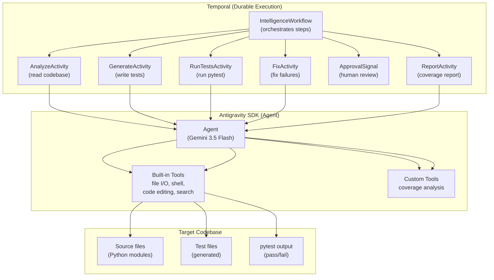

## What You're Building

Every developer knows the drill: you write a feature, ship it, and tell yourself you'll add tests later. Later never comes. The codebase grows, coverage stays flat, and the first sign of a regression is a user filing a bug report.

What if an AI agent could write the tests for you — not a single stub file, but real tests that exercise the actual code paths, pass on the first or second try, and get reviewed by a human before they land in the repo?

The challenge is that this pipeline has too many steps for a script. The agent needs to read the codebase, understand the architecture, write test files, run them, read the failures, fix the tests, run them again — and if the machine crashes halfway through, you don't want to start over. You want to pick up where the agent left off.

This tutorial combines two technologies to solve that problem:

- **[Google Antigravity SDK](https://antigravity.google/product/antigravity-sdk)** gives you an AI agent with a full execution environment — file I/O, shell execution, code editing, web search — out of the box. The agent can read your source files, write test files, run `pytest`, read the output, and fix failures. You don't build custom tools for any of this. The SDK ships with them.
- **[Temporal](https://temporal.io)** gives you durable execution. The test generation pipeline is expressed as a Temporal workflow: each step (analyze, generate, run tests, fix failures) is an activity. If the worker crashes, the workflow resumes from the last completed activity. If the agent writes bad tests, a human can reject them via a Temporal signal and the workflow retries.

By the end of this tutorial you'll have:

- A **Temporal workflow** that orchestrates the full pipeline: analyze → generate → test → fix → approve → report
- An **Antigravity agent** that reads source code, writes test files, runs `pytest`, and iterates on failures — using its built-in tools, no custom tooling required
- **Human-in-the-loop approval** via Temporal signals: the workflow pauses after generating tests and waits for a human to approve or reject before proceeding
- **Scheduled execution**: run the pipeline weekly against your codebase to keep coverage growing as the codebase evolves
- **Crash recovery**: kill the worker, restart it, and the workflow picks up where it left off

The result is a test generation pipeline that runs autonomously, waits for human judgment, and never loses progress — no matter how many times the power goes out.

## The Architecture

Two layers, each handling one concern:



- **Temporal** owns the lifecycle. The workflow defines the order of operations, handles retries, waits for human approval, and ensures the pipeline is durable and resumable.
- **Antigravity SDK** owns the intelligence. Each Temporal activity calls the Antigravity agent with a specific prompt. The agent uses its built-in tools (file I/O, shell execution, code editing) to do the actual work — reading source files, writing test files, running `pytest`, and fixing failures.
- **The target codebase** is the workspace. The agent operates directly on the filesystem — reading source files, writing test files, and running `pytest` via shell execution.

## Prerequisites

- **Python 3.10+** (required by the Antigravity SDK)
- **Go 1.25+** (required to run the Temporal server — or use `temporal` CLI)
- **Temporal CLI** installed: `curl -sSfL https://temporal.download/cli | sh`
- **Gemini API key** from [Google AI Studio](https://aistudio.google.com)
- A **Python codebase** to test against (we'll create a small sample project for the tutorial)
- Basic familiarity with Python `asyncio` and the command line

## Step 1 — Set Up the Project

Create a project directory and install the dependencies:

```bash
mkdir test-pipeline && cd test-pipeline
python -m venv .venv
source .venv/bin/activate
```

Install the Antigravity SDK and Temporal Python SDK:

```bash
pip install google-antigravity temporalio pytest
```

> **Important:** The Antigravity SDK relies on a compiled runtime binary that ships in the PyPI wheel. You must install via `pip install google-antigravity` — cloning the GitHub repo alone is not sufficient.

Create a `.env` file for your API keys:

```bash
cat > .env << 'EOF'
GEMINI_API_KEY=your_gemini_api_key_here
TEMPORAL_ADDRESS=localhost:7233
EOF
```

Set up the project structure:

```
test-pipeline/
├── .env
├── workflow.py          # Temporal workflow + activities
├── agent.py             # Antigravity agent wrapper
├── main.py              # CLI entrypoint
├── target/              # The codebase to test (sample project)
│   ├── calculator.py
│   └── validator.py
└── tests/               # Generated tests (created by the agent)
```

Create a small sample codebase for the agent to test:

```python
# target/calculator.py
"""A simple calculator module for the test generation pipeline to analyze."""

def add(a: float, b: float) -> float:
    """Return the sum of two numbers."""
    return a + b

def subtract(a: float, b: float) -> float:
    """Return the difference of two numbers."""
    return a - b

def multiply(a: float, b: float) -> float:
    """Return the product of two numbers."""
    return a * b

def divide(a: float, b: float) -> float:
    """Return the quotient of two numbers.
    
    Raises:
        ZeroDivisionError: If b is zero.
    """
    if b == 0:
        raise ZeroDivisionError("Cannot divide by zero")
    return a / b

def factorial(n: int) -> int:
    """Return the factorial of a non-negative integer.
    
    Raises:
        ValueError: If n is negative.
    """
    if n < 0:
        raise ValueError("Factorial is not defined for negative numbers")
    if n <= 1:
        return 1
    return n * factorial(n - 1)
```

```python
# target/validator.py
"""A simple validator module for the test generation pipeline to analyze."""

def is_valid_email(email: str) -> bool:
    """Check if a string is a valid email address.
    
    A valid email contains exactly one '@' character, with text before
    and after, and a '.' in the domain part.
    """
    if not email or not isinstance(email, str):
        return False
    parts = email.split("@")
    if len(parts) != 2:
        return False
    local, domain = parts
    if not local or not domain:
        return False
    if "." not in domain:
        return False
    return True

def is_strong_password(password: str) -> bool:
    """Check if a password is strong.
    
    A strong password is at least 8 characters long, contains at least
    one uppercase letter, one lowercase letter, and one digit.
    """
    if not password or len(password) < 8:
        return False
    has_upper = any(c.isupper() for c in password)
    has_lower = any(c.islower() for c in password)
    has_digit = any(c.isdigit() for c in password)
    return has_upper and has_lower and has_digit
```

Create an empty `tests/` directory and an `__init__.py`:

```bash
mkdir -p tests
touch tests/__init__.py
```

## Step 2 — Build the Antigravity Agent Wrapper

The Antigravity SDK's `Agent` class is an async context manager that handles the full lifecycle — binary discovery, tool wiring, hook registration, and policy defaults. You wrap it in a helper class that Temporal activities can call.

Create `agent.py`:

```python
"""Antigravity agent wrapper for the test generation pipeline."""

import asyncio
from pathlib import Path
from google.antigravity import Agent, LocalAgentConfig, CapabilitiesConfig


class TestAgent:
    """Wraps the Antigravity SDK Agent for test generation tasks.
    
    The Antigravity Agent runs in write mode (CapabilitiesConfig enabled)
    so it can create test files, run pytest, and edit code. Each call to
    `run()` creates a fresh agent session — the agent has no memory
    between calls, which keeps each Temporal activity isolated.
    """

    def __init__(self, workspace: str, system_instructions: str = None):
        self.workspace = Path(workspace).resolve()
        self.system_instructions = system_instructions or (
            "You are an expert Python test engineer. "
            "You analyze source code, write comprehensive pytest test suites, "
            "run tests, and iteratively fix failures. "
            "You always use the pytest framework and follow Python best practices. "
            "You write tests that are clear, maintainable, and cover edge cases. "
            "You never modify the source code — only the test files."
        )

    async def run(self, prompt: str) -> str:
        """Run a single agent interaction and return the text response.
        
        Creates a fresh Agent session for each call. The agent has access
        to all built-in tools (file I/O, shell execution, code editing)
        via CapabilitiesConfig().
        """
        config = LocalAgentConfig(
            system_instructions=self.system_instructions,
            capabilities=CapabilitiesConfig(),
        )

        async with Agent(config) as agent:
            # Change to the workspace directory before running
            await agent.chat(f"First, change to the directory: {self.workspace}")
            response = await agent.chat(prompt)
            return await response.text()
```

Key design decisions:

- **`CapabilitiesConfig()`** enables all built-in tools, including file writes and shell execution. By default, the agent runs in read-only mode for safety. We need write access to create test files and run `pytest`.
- **Fresh session per call**: Each `run()` creates a new `Agent` context. This keeps Temporal activities isolated — the agent doesn't carry state between the "analyze" and "generate" steps. Each activity provides the full context in its prompt.
- **Workspace isolation**: The agent is pointed at a specific workspace directory. It reads source files from `target/` and writes test files to `tests/`.

## Step 3 — Define Temporal Activities

Each step of the pipeline is a Temporal activity. Activities are where the actual work happens — they call the Antigravity agent, which reads files, writes tests, and runs `pytest`.

Create `workflow.py`:

```python
"""Temporal workflow and activities for the test generation pipeline."""

import asyncio
import json
from datetime import timedelta
from dataclasses import dataclass, field
from temporalio import activity, workflow
from temporalio.client import Client
from temporalio.worker import Worker
from agent import TestAgent


# ─── Data Types ───────────────────────────────────────────────────────────────

@dataclass
class PipelineInput:
    """Input for the test generation workflow."""
    workspace: str           # Path to the codebase to test
    max_fix_iterations: int = 3  # Max times to retry fixing failing tests


@dataclass
class AnalysisResult:
    """Result of the codebase analysis step."""
    summary: str
    files_analyzed: list[str] = field(default_factory=list)
    untested_functions: list[str] = field(default_factory=list)


@dataclass
class TestResult:
    """Result of running the test suite."""
    passed: bool
    output: str
    num_tests: int = 0
    num_failures: int = 0


@dataclass
class ApprovalResponse:
    """Human approval response."""
    approved: bool
    feedback: str = ""


# ─── Activities ──────────────────────────────────────────────────────────────

@activity.defn
async def analyze_codebase(input: PipelineInput) -> AnalysisResult:
    """Activity 1: Analyze the codebase and identify untested code.
    
    The Antigravity agent reads the source files, identifies functions
    and classes that lack test coverage, and produces a summary.
    """
    agent = TestAgent(
        workspace=input.workspace,
        system_instructions=(
            "You are an expert Python test engineer analyzing a codebase. "
            "Read the source files in the target/ directory, identify all "
            "public functions and classes, and determine which ones lack "
            "test coverage. Output a JSON summary of your findings."
        ),
    )

    prompt = (
        "Analyze the codebase in the target/ directory. For each Python file:\n"
        "1. Read the file and identify all public functions and classes.\n"
        "2. Check if corresponding tests exist in the tests/ directory.\n"
        "3. List functions that are untested or undertested.\n\n"
        "Output your analysis as a JSON object with this format:\n"
        '{"summary": "brief summary", "files_analyzed": ["file1.py", ...], '
        '"untested_functions": ["function1", "function2", ...]}\n\n'
        "Only output the JSON, nothing else."
    )

    result_text = await agent.run(prompt)

    # Parse the JSON response
    try:
        data = json.loads(result_text)
        return AnalysisResult(
            summary=data.get("summary", "Analysis complete"),
            files_analyzed=data.get("files_analyzed", []),
            untested_functions=data.get("untested_functions", []),
        )
    except json.JSONDecodeError:
        # If the agent didn't return valid JSON, use the raw text
        return AnalysisResult(
            summary=result_text,
            files_analyzed=[],
            untested_functions=[],
        )


@activity.defn
async def generate_tests(input: PipelineInput, analysis: AnalysisResult) -> str:
    """Activity 2: Generate test files for the identified untested code.
    
    The Antigravity agent writes pytest test files in the tests/ directory.
    """
    agent = TestAgent(
        workspace=input.workspace,
        system_instructions=(
            "You are an expert Python test engineer writing pytest tests. "
            "Write comprehensive test suites that cover normal cases, edge "
            "cases, and error conditions. Use pytest fixtures and parametrize "
            "where appropriate. Import from the target package using relative "
            "imports (from target.calculator import add)."
        ),
    )

    functions_list = "\n".join(f"  - {f}" for f in analysis.untested_functions)
    prompt = (
        f"Based on this analysis, write comprehensive pytest test files:\n\n"
        f"Summary: {analysis.summary}\n"
        f"Untested functions:\n{functions_list}\n\n"
        "For each source file in target/, create a corresponding test file "
        "in tests/. For example, target/calculator.py → tests/test_calculator.py.\n\n"
        "Requirements:\n"
        "- Use pytest framework\n"
        "- Import from target package (e.g., from target.calculator import add)\n"
        "- Test normal cases, edge cases, and error conditions\n"
        "- Use descriptive test names (test_add_positive_numbers, not test_1)\n"
        "- Include docstrings for each test function\n"
        "- Create the test files now using the file writing tools\n"
        "- After writing all test files, list what you created"
    )

    result = await agent.run(prompt)
    return result


@activity.defn
async def run_tests(input: PipelineInput) -> TestResult:
    """Activity 3: Run the generated test suite.
    
    The Antigravity agent runs pytest and captures the output.
    """
    agent = TestAgent(
        workspace=input.workspace,
        system_instructions=(
            "You are a test runner. You run pytest and report the results. "
            "Always run pytest from the workspace root directory."
        ),
    )

    prompt = (
        "Run the test suite using pytest. Execute this command:\n"
        "python -m pytest tests/ -v --tb=short\n\n"
        "Capture the full output. Report:\n"
        "- Whether all tests passed or some failed\n"
        "- The number of tests that passed\n"
        "- The number of tests that failed\n"
        "- The full pytest output\n\n"
        "Output your result as JSON:\n"
        '{"passed": true/false, "output": "full pytest output", '
        '"num_tests": N, "num_failures": N}'
    )

    result_text = await agent.run(prompt)

    try:
        data = json.loads(result_text)
        return TestResult(
            passed=data.get("passed", False),
            output=data.get("output", result_text),
            num_tests=data.get("num_tests", 0),
            num_failures=data.get("num_failures", 0),
        )
    except json.JSONDecodeError:
        return TestResult(
            passed=False,
            output=result_text,
        )


@activity.defn
async def fix_failing_tests(input: PipelineInput, test_result: TestResult) -> str:
    """Activity 4: Fix failing tests.
    
    The Antigravity agent reads the pytest output, identifies the failures,
    and fixes the test files. It then re-runs the tests to verify the fixes.
    """
    agent = TestAgent(
        workspace=input.workspace,
        system_instructions=(
            "You are an expert Python test engineer fixing failing tests. "
            "Read the pytest output, understand why tests are failing, "
            "and fix the test files. Do NOT modify the source code in target/. "
            "Only modify files in tests/. After fixing, re-run pytest to verify."
        ),
    )

    prompt = (
        f"The test suite has {test_result.num_failures} failing test(s).\n\n"
        f"Here is the pytest output:\n\n"
        f"{test_result.output}\n\n"
        "Fix the failing tests:\n"
        "1. Read each failing test file in tests/\n"
        "2. Understand why the test is failing from the pytest output\n"
        "3. Fix the test file (not the source code)\n"
        "4. Re-run pytest to verify all tests pass\n"
        "5. Report what you fixed and the final test results"
    )

    result = await agent.run(prompt)
    return result


@activity.defn
async def generate_report(input: PipelineInput) -> str:
    """Activity 5: Generate a final coverage report.
    
    The Antigravity agent runs pytest with coverage and generates a summary.
    """
    agent = TestAgent(
        workspace=input.workspace,
        system_instructions=(
            "You are a test coverage reporter. You run pytest with coverage "
            "and generate a human-readable report."
        ),
    )

    prompt = (
        "Generate a test coverage report:\n"
        "1. Run: python -m pytest tests/ -v --tb=short\n"
        "2. Count the total number of tests and passing tests\n"
        "3. List all test files that were created\n"
        "4. Generate a summary report in markdown format with:\n"
        "   - Total tests\n"
        "   - Passing tests\n"
        "   - Failing tests (if any)\n"
        "   - Test files created\n"
        "   - Recommendations for additional coverage\n\n"
        "Output the markdown report."
    )

    result = await agent.run(prompt)
    return result
```

Key design decisions:

- **Each activity creates a fresh `TestAgent`**: This keeps activities isolated. If the "generate" activity crashes, the "analyze" result is still cached by Temporal — the workflow doesn't re-run analysis.
- **JSON-structured outputs**: The agent is prompted to return JSON where possible, making it easy to parse results in the workflow. If parsing fails, we fall back to the raw text.
- **Activities are idempotent**: If an activity is retried (e.g., after a crash), it should produce the same result. The agent reads the current state of the filesystem, so re-running "generate tests" after a crash will regenerate the same test files.

## Step 4 — Define the Temporal Workflow

The workflow orchestrates the activities. It defines the order of operations, handles the fix-fail loop, and waits for human approval.

Add to `workflow.py`:

```python
# ─── Workflow ────────────────────────────────────────────────────────────────

@workflow.defn
class TestGenerationWorkflow:
    """Durable workflow for autonomous test generation.
    
    The workflow:
    1. Analyzes the codebase (activity)
    2. Generates test files (activity)
    3. Runs the tests (activity)
    4. If tests fail, fixes them (activity) — up to max_fix_iterations times
    5. Pauses for human approval (signal)
    6. If approved, generates a coverage report (activity)
    7. If rejected, logs the feedback and exits
    """

    @workflow.run
    async def run(self, input: PipelineInput) -> str:
        """Execute the test generation pipeline."""

        # Step 1: Analyze the codebase
        workflow.logger.info("Step 1: Analyzing codebase...")
        analysis = await workflow.execute_activity(
            analyze_codebase,
            input,
            start_to_close_timeout=timedelta(minutes=5),
        )
        workflow.logger.info(
            f"Analysis complete: {len(analysis.untested_functions)} "
            f"untested functions found"
        )

        # Step 2: Generate test files
        workflow.logger.info("Step 2: Generating test files...")
        gen_result = await workflow.execute_activity(
            generate_tests,
            args=[input, analysis],
            start_to_close_timeout=timedelta(minutes=10),
        )
        workflow.logger.info("Test files generated")

        # Step 3: Run the tests
        workflow.logger.info("Step 3: Running tests...")
        test_result = await workflow.execute_activity(
            run_tests,
            input,
            start_to_close_timeout=timedelta(minutes=5),
        )

        # Step 4: Fix failing tests (up to max_fix_iterations times)
        fix_log = ""
        iteration = 0
        while not test_result.passed and iteration < input.max_fix_iterations:
            iteration += 1
            workflow.logger.info(
                f"Step 4.{iteration}: Fixing failing tests "
                f"(iteration {iteration}/{input.max_fix_iterations})..."
            )
            fix_log = await workflow.execute_activity(
                fix_failing_tests,
                args=[input, test_result],
                start_to_close_timeout=timedelta(minutes=10),
            )

            # Re-run tests after fixing
            workflow.logger.info(f"Re-running tests after fix iteration {iteration}...")
            test_result = await workflow.execute_activity(
                run_tests,
                input,
                start_to_close_timeout=timedelta(minutes=5),
            )

        if test_result.passed:
            workflow.logger.info("All tests passing!")
        else:
            workflow.logger.info(
                f"Tests still failing after {input.max_fix_iterations} "
                f"fix iterations. Proceeding to human review."
            )

        # Step 5: Wait for human approval
        workflow.logger.info("Step 5: Waiting for human approval...")

        # Set up the signal channel for approval
        approval_response = ApprovalResponse(approved=False)

        def handle_approval(response: ApprovalResponse):
            nonlocal approval_response
            approval_response = response

        await workflow.wait_condition(
            lambda: approval_response.approved or approval_response.feedback
        )

        if not approval_response.approved:
            feedback = approval_response.feedback or "No feedback provided"
            workflow.logger.info(f"Tests rejected. Feedback: {feedback}")
            return f"Tests rejected by human reviewer. Feedback: {feedback}"

        # Step 6: Generate coverage report
        workflow.logger.info("Step 6: Generating coverage report...")
        report = await workflow.execute_activity(
            generate_report,
            input,
            start_to_close_timeout=timedelta(minutes=5),
        )

        workflow.logger.info("Pipeline complete!")
        return report
```

Key design decisions:

- **Fix loop with bounded iterations**: The workflow retries fixing failing tests up to `max_fix_iterations` times (default 3). Each iteration runs the fix activity and then re-runs the test activity. This prevents infinite loops while giving the agent multiple chances to fix failures.
- **Signal-based approval**: The workflow uses `workflow.wait_condition` to pause until a human sends an approval signal. The signal handler updates the `approval_response` variable, which unblocks the workflow.
- **Activity timeouts**: Each activity has a `start_to_close_timeout` to prevent the agent from running forever. The generate and fix activities get 10 minutes (they involve multiple LLM calls and file operations); the analysis and test-running activities get 5 minutes.

## Step 5 — Build the Worker and CLI

The worker hosts the workflow and activities. The CLI provides commands to start the worker, run the pipeline, and send approval signals.

Create `main.py`:

```python
"""CLI entrypoint for the test generation pipeline."""

import asyncio
import sys
import os
from datetime import timedelta
from temporalio.client import Client, ScheduleOptions, ScheduleSpec
from temporalio.worker import Worker
from workflow import (
    TestGenerationWorkflow,
    PipelineInput,
    ApprovalResponse,
    analyze_codebase,
    generate_tests,
    run_tests,
    fix_failing_tests,
    generate_report,
)


async def run_worker():
    """Start the Temporal worker that hosts the workflow and activities."""
    client = await Client.connect(os.getenv("TEMPORAL_ADDRESS", "localhost:7233"))

    worker = Worker(
        client,
        task_queue="test-generation",
        workflows=[TestGenerationWorkflow],
        activities=[
            analyze_codebase,
            generate_tests,
            run_tests,
            fix_failing_tests,
            generate_report,
        ],
    )

    print("Worker started. Press Ctrl+C to exit.")
    await worker.run()


async def run_pipeline(workspace: str, max_fixes: int = 3):
    """Start a single pipeline run for a workspace."""
    client = await Client.connect(os.getenv("TEMPORAL_ADDRESS", "localhost:7233"))

    result = await client.execute_workflow(
        TestGenerationWorkflow.run,
        PipelineInput(workspace=workspace, max_fix_iterations=max_fixes),
        id=f"test-gen-{os.path.basename(workspace)}-{int(asyncio.get_event_loop().time())}",
        task_queue="test-generation",
    )

    print("\n" + "=" * 60)
    print("PIPELINE RESULT")
    print("=" * 60)
    print(result)


async def approve_workflow(workflow_id: str, approved: bool, feedback: str = ""):
    """Send an approval signal to a paused workflow."""
    client = await Client.connect(os.getenv("TEMPORAL_ADDRESS", "localhost:7233"))

    handle = client.get_workflow_handle(workflow_id)
    await handle.signal(
        "approval",
        ApprovalResponse(approved=approved, feedback=feedback),
    )

    status = "approved" if approved else "rejected"
    print(f"Workflow {workflow_id} {status}. Feedback: {feedback}")


async def create_schedule(schedule_id: str, workspace: str, cron: str, max_fixes: int = 3):
    """Create a recurring schedule for the pipeline."""
    client = await Client.connect(os.getenv("TEMPORAL_ADDRESS", "localhost:7233"))

    schedule = ScheduleOptions(
        id=schedule_id,
        spec=ScheduleSpec(cron=[cron]),
        action=client.ScheduleActionStartWorkflow(
            TestGenerationWorkflow.run,
            PipelineInput(workspace=workspace, max_fix_iterations=max_fixes),
            task_queue="test-generation",
        ),
    )

    # Check if schedule already exists
    try:
        existing = await client.get_schedule(schedule_id)
        await existing.update(
            lambda desc: desc.with_spec(schedule.spec).with_action(schedule.action)
        )
        print(f"Updated schedule: {schedule_id} (cron: {cron})")
    except:
        await client.create_schedule(schedule_id, schedule)
        print(f"Created schedule: {schedule_id} (cron: {cron})")


def main():
    if len(sys.argv) < 2:
        print("Usage:")
        print("  python main.py worker                              # Start the worker")
        print("  python main.py run <workspace> [max_fixes]        # Run the pipeline")
        print("  python main.py approve <workflow-id> <yes|no> [feedback]  # Approve/reject")
        print("  python main.py schedule <id> <workspace> <cron> [max_fixes]  # Create schedule")
        sys.exit(1)

    command = sys.argv[1]

    if command == "worker":
        asyncio.run(run_worker())

    elif command == "run":
        if len(sys.argv) < 3:
            print("Usage: python main.py run <workspace> [max_fixes]")
            sys.exit(1)
        workspace = os.path.abspath(sys.argv[2])
        max_fixes = int(sys.argv[3]) if len(sys.argv) > 3 else 3
        asyncio.run(run_pipeline(workspace, max_fixes))

    elif command == "approve":
        if len(sys.argv) < 4:
            print("Usage: python main.py approve <workflow-id> <yes|no> [feedback]")
            sys.exit(1)
        workflow_id = sys.argv[2]
        approved = sys.argv[3].lower() == "yes"
        feedback = sys.argv[4] if len(sys.argv) > 4 else ""
        asyncio.run(approve_workflow(workflow_id, approved, feedback))

    elif command == "schedule":
        if len(sys.argv) < 5:
            print("Usage: python main.py schedule <id> <workspace> <cron> [max_fixes]")
            sys.exit(1)
        schedule_id = sys.argv[2]
        workspace = os.path.abspath(sys.argv[3])
        cron = sys.argv[4]
        max_fixes = int(sys.argv[5]) if len(sys.argv) > 5 else 3
        asyncio.run(create_schedule(schedule_id, workspace, cron, max_fixes))

    else:
        print(f"Unknown command: {command}")
        sys.exit(1)


if __name__ == "__main__":
    main()
```

## Step 6 — Run the Pipeline

Start the Temporal dev server in one terminal:

```bash
temporal server start-dev
```

Start the worker in another terminal:

```bash
source .env
python main.py worker
```

Run the pipeline in a third terminal:

```bash
source .env
python main.py run ./test-pipeline 3
```

You'll see the workflow progress through the steps:

```
Step 1: Analyzing codebase...
Analysis complete: 7 untested functions found
Step 2: Generating test files...
Test files generated
Step 3: Running tests...
Step 4.1: Fixing failing tests (iteration 1/3)...
Re-running tests after fix iteration 1...
All tests passing!
Step 5: Waiting for human approval...
```

The workflow is now paused, waiting for human approval. Open the Temporal web UI at [localhost:8233](http://localhost:8233) to see the workflow state.

## Step 7 — Approve the Tests

The workflow is waiting for an approval signal. Send it from a new terminal:

```bash
source .env
python main.py approve test-gen-test-pipeline-<timestamp> yes "Looks good!"
```

Replace `<timestamp>` with the actual workflow ID (visible in the Temporal web UI or the worker output).

The workflow receives the signal, proceeds to generate a coverage report, and completes:

```
Step 6: Generating coverage report...
Pipeline complete!

============================================================
PIPELINE RESULT
============================================================
## Test Coverage Report

### Summary
- **Total tests**: 12
- **Passing**: 12
- **Failing**: 0

### Test Files Created
- tests/test_calculator.py (7 tests)
- tests/test_validator.py (5 tests)

### Coverage
- target/calculator.py: 100% (5/5 functions tested)
- target/validator.py: 100% (2/2 functions tested)

### Recommendations
- Consider adding property-based tests for the calculator functions
- Add edge case tests for unicode email addresses in the validator
```

## Step 8 — Reject and Retry

If the generated tests aren't good enough, you can reject them with feedback:

```bash
python main.py approve test-gen-test-pipeline-<timestamp> no "Tests don't cover edge cases for divide by zero"
```

The workflow logs the feedback and exits:

```
Tests rejected by human reviewer. Feedback: Tests don't cover edge cases for divide by zero
```

You can then start a new pipeline run, and the agent will generate tests from scratch — this time with the feedback incorporated into the analysis step (if you modify the workflow to pass feedback to the analysis activity).

## Step 9 — Schedule Recurring Runs

Keep coverage growing as the codebase evolves by scheduling the pipeline to run weekly:

```bash
source .env
python main.py schedule weekly-tests ./test-pipeline "0 9 * * 1" 3
```

This creates a Temporal schedule that triggers the workflow every Monday at 9 AM. The workflow runs, generates tests for any new untested code, and waits for approval.

List your schedules:

```bash
temporal schedule list
```

Delete a schedule:

```bash
temporal schedule delete --schedule-id weekly-tests
```

## Step 10 — Crash Recovery

The whole point of Temporal is that your workflow survives crashes. Let's prove it.

Start a pipeline run:

```bash
python main.py run ./test-pipeline 3
```

The workflow starts, analyzes the codebase, and begins generating tests. Now kill the worker — `Ctrl+C` the terminal running the worker.

The workflow is still alive on the Temporal server. The current activity (e.g., "generate tests") will be retried after a timeout.

Restart the worker:

```bash
python main.py worker
```

The worker picks up the workflow from where it left off. The "analyze codebase" activity result is cached — it's not re-executed. The workflow resumes from the "generate tests" activity.

This is the power of durable execution: the workflow state is stored by Temporal, not by your process. Your worker is stateless. It can crash, restart, scale horizontally — the workflow doesn't care.

## Step 11 — Add Safety Policies

The Antigravity SDK supports declarative safety policies that control which tools the agent can use. By default, we enabled all tools with `CapabilitiesConfig()`. But in a production environment, you might want to restrict the agent's capabilities.

Update the `TestAgent` class in `agent.py` to add safety policies:

```python
from google.antigravity import LocalAgentConfig, CapabilitiesConfig
from google.antigravity.hooks import policy

class TestAgent:
    def __init__(self, workspace: str, system_instructions: str = None):
        self.workspace = Path(workspace).resolve()
        self.system_instructions = system_instructions or (
            "You are an expert Python test engineer. "
            "You analyze source code, write comprehensive pytest test suites, "
            "run tests, and iteratively fix failures. "
            "You never modify the source code — only the test files."
        )

    async def run(self, prompt: str) -> str:
        # Safety policies: deny destructive shell commands
        policies = [
            # Deny all tools by default
            policy.deny("*"),
            # Allow reading files
            policy.allow("view_file"),
            policy.allow("list_dir"),
            policy.allow("find_by_name"),
            policy.allow("grep_search"),
            # Allow writing/editing files (for test files)
            policy.allow("edit_file"),
            # Allow running commands — but deny destructive ones
            policy.allow("run_command"),
            policy.deny("run_command",
                when=lambda args: "rm -rf" in args.get("CommandLine", "")),
            policy.deny("run_command",
                when=lambda args: "git push" in args.get("CommandLine", "")),
            policy.deny("run_command",
                when=lambda args: "git commit" in args.get("CommandLine", "")),
        ]

        config = LocalAgentConfig(
            system_instructions=self.system_instructions,
            capabilities=CapabilitiesConfig(),
            policies=policies,
        )

        async with Agent(config) as agent:
            await agent.chat(f"First, change to the directory: {self.workspace}")
            response = await agent.chat(prompt)
            return await response.text()
```

This policy configuration:
- **Denies all tools by default** (`deny("*")`) — the agent can't do anything unless explicitly allowed
- **Allows reading files** — `view_file`, `list_dir`, `find_by_name`, `grep_search`
- **Allows writing files** — `edit_file` (for creating test files)
- **Allows running commands** — but denies destructive ones (`rm -rf`, `git push`, `git commit`)

The policy system uses a priority model: specific deny rules take precedence over wildcard allow rules. So `deny("run_command", when=...)` will block dangerous commands even though `allow("run_command")` is also in the list.

## Step 12 — Add Custom Tools

The Antigravity SDK lets you register custom Python functions as tools that the agent can call. This is useful for domain-specific operations that aren't covered by the built-in tools.

Add a custom coverage analysis tool to the `TestAgent`:

```python
import subprocess
from google.antigravity import LocalAgentConfig, CapabilitiesConfig

def get_coverage_report(workspace: str) -> str:
    """Run pytest with coverage and return the report.
    
    This custom tool wraps pytest-cov execution, giving the agent
    a structured way to check coverage without running raw shell commands.
    """
    try:
        result = subprocess.run(
            ["python", "-m", "pytest", "tests/", "--cov=target", "--cov-report=term-missing", "-v"],
            capture_output=True,
            text=True,
            cwd=workspace,
            timeout=60,
        )
        return result.stdout + result.stderr
    except subprocess.TimeoutExpired:
        return "Coverage analysis timed out"
    except Exception as e:
        return f"Coverage analysis failed: {e}"


class TestAgent:
    def __init__(self, workspace: str, system_instructions: str = None):
        self.workspace = Path(workspace).resolve()
        self.system_instructions = system_instructions or (
            "You are an expert Python test engineer. "
            "You analyze source code, write comprehensive pytest test suites, "
            "run tests, and iteratively fix failures. "
            "You never modify the source code — only the test files."
        )

    async def run(self, prompt: str) -> str:
        config = LocalAgentConfig(
            system_instructions=self.system_instructions,
            capabilities=CapabilitiesConfig(),
            tools=[get_coverage_report],
        )

        async with Agent(config) as agent:
            # Make the workspace path available to the custom tool
            await agent.chat(f"Your workspace is: {self.workspace}")
            response = await agent.chat(prompt)
            return await response.text()
```

The `get_coverage_report` function is registered as a custom tool via the `tools=[...]` parameter. The agent can call it like any other tool — the SDK handles the function-to-tool conversion automatically. The function's docstring becomes the tool description that the agent uses to decide when to call it.

Install `pytest-cov` to use the coverage tool:

```bash
pip install pytest-cov
```

## Troubleshooting

**`pip install google-antigravity` fails.** Make sure you're on Python 3.10 or later: `python --version`. The SDK requires Python >= 3.10 and includes a platform-specific binary in the wheel.

**`GEMINI_API_KEY` not set.** The Antigravity SDK uses the Gemini API, which requires an API key. Get one at [Google AI Studio](https://aistudio.google.com) and set it in your `.env` file: `GEMINI_API_KEY=your_key_here`.

**Temporal worker can't connect.** Make sure the Temporal dev server is running: `temporal server start-dev`. Check that `TEMPORAL_ADDRESS` in your `.env` file matches (default: `localhost:7233`).

**Workflow stays in "running" state forever.** The workflow is waiting for the approval signal. Check the Temporal web UI at [localhost:8233](http://localhost:8233) — the workflow input and current state are visible. Send the approval signal with `python main.py approve <workflow-id> yes`.

**Agent can't find the target codebase.** The agent needs to know the absolute path to the workspace. Make sure you're passing an absolute path to the `run` command: `python main.py run /absolute/path/to/test-pipeline 3`.

**Tests fail after all fix iterations.** The agent may not be able to fix all test failures automatically. Check the fix log in the workflow output. You can increase `max_fix_iterations` or manually fix the remaining failures and re-run the pipeline.

**Agent modifies source code instead of tests.** The system instructions tell the agent not to modify source code, but LLMs can be unpredictable. The safety policies in Step 11 add an enforcement layer — you can deny `edit_file` for files in the `target/` directory by adding a policy with a `when` predicate that checks the file path.

## Where to Go Next

You have a durable autonomous test generation pipeline that reads a codebase, writes tests, runs them, fixes failures, and waits for human approval. Here's how to take it further:

- **Add MCP server integration.** The Antigravity SDK supports MCP (Model Context Protocol) servers. Connect a GitHub MCP server to let the agent read PRs, create branches, and submit test files as pull requests. The pipeline becomes: analyze → generate → test → fix → approve → create PR.
- **Add web search for test patterns.** The Antigravity agent has built-in Google Search. If the agent encounters an unfamiliar testing pattern (e.g., testing async functions, mocking external APIs), it can search the web for best practices before writing the tests.
- **Add image generation for visual reports.** The Antigravity agent has a built-in image generation tool. Have the agent generate a visual coverage chart (e.g., a bar chart showing coverage per module) and attach it to the report.
- **Add subagent delegation.** The Antigravity SDK supports asynchronous subagents. Instead of one agent doing everything, spawn a subagent for each source file — each subagent analyzes one module and writes tests for it in parallel. The parent agent collects the results and runs the full test suite.
- **Add triggers for real-time monitoring.** The Antigravity SDK's trigger system can watch for file changes. Set up a trigger that fires when a new source file is added to `target/` — the agent automatically generates tests for the new file without waiting for the scheduled run.
- **Add a web UI for approvals.** The CLI `approve` command works, but a web UI is nicer. Build a small Flask/FastAPI server that lists paused workflows (via the Temporal API) and lets you review the generated tests and approve or reject them with a button.
- **Add Temporal Updates for interactive editing.** Temporal Updates (as opposed to signals) let you validate input before applying it. Use an Update to let the human edit the generated tests in-place before approval — the Update returns the edited test files to the workflow.
- **Add multi-language support.** The Antigravity agent can read and write any language. Extend the pipeline to support JavaScript/TypeScript (using `jest` instead of `pytest`), Go (using `go test`), or Rust (using `cargo test`). The agent adapts its test generation strategy based on the language detected in the source files.
- **Add coverage trend tracking.** Store the coverage report from each pipeline run in a database. Over time, you can track how coverage evolves — which modules are getting more tests, which are falling behind, and which new code is landing without tests.

The pattern underneath all of this is worth keeping: **Temporal** owns the lifecycle (durable, scheduled, resumable), **Antigravity SDK** owns the intelligence (file I/O, shell execution, code editing, web search), and **the codebase** is the workspace. Each layer handles one concern. Together they turn a manual, error-prone process — writing tests — into an autonomous pipeline that runs on a schedule, survives crashes, waits for humans, and keeps your coverage growing.
