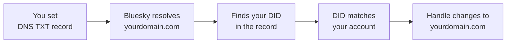

## What You're Building

Your social media handle is your identity. On most platforms, that identity is rented — `@username` on Twitter, `username` on Instagram — and it lives at the pleasure of the platform. If the platform decides to rename you, suspend you, or shut down, your handle goes with it.

The AT Protocol — the protocol that powers Bluesky — does something different. It lets you bring your own domain name as your handle. Instead of `alice.bsky.social`, you can be `alice.com` or `@alice.com`. The domain is yours. You own it through a registrar, you control its DNS records, and you can point it at any AT Protocol server you want. The protocol verifies ownership through a simple DNS TXT record or an HTTP file, and once verified, the domain becomes your portable, self-owned identity.

In this tutorial you'll take a domain you own and turn it into your AT Protocol handle. You'll set up the verification record, confirm it in Bluesky, and walk away with an identity that no platform can take away.

## How AT Protocol Identity Works

The AT Protocol separates identity from storage. Three pieces fit together:

| Piece | What it is | Example |
|-------|-----------|---------|
| **DID** | A Decentralized Identifier — a permanent, globally unique ID assigned when you create an account | `did:plc:abcdef123456...` |
| **Handle** | A human-readable name that resolves to your DID | `alice.com` or `alice.bsky.social` |
| **PDS** | A Personal Data Server — where your data actually lives | `bsky.social` or your own server |

Your DID never changes. Your handle can change — you can move from `alice.bsky.social` to `alice.com` to `blog.alice.com` without losing your account, your followers, or your posts. The protocol resolves your handle to your DID by looking up a DNS record or an HTTP file, then uses the DID to find your data.

The verification flow works like this:



You prove you own the domain by placing a record that contains your DID. The protocol checks the record, confirms the DID matches your account, and updates your handle. No manual approval, no waiting period — just DNS propagation.

## Prerequisites

- **A domain name.** Any domain works — `.com`, `.xyz`, `.dev`, `.io`, anything. You need access to its DNS settings (the ability to add TXT records). If you don't have one, registrars like Namecheap, Porkbun, and Cloudflare sell domains for $10–15/year.
- **A Bluesky account.** If you don't have one, sign up at [bsky.app](https://bsky.app) or in the Bluesky mobile app. You'll get a default handle like `yourname.bsky.social`.
- **Access to your DNS provider.** This is wherever you manage your domain's DNS records — your registrar's dashboard, Cloudflare, AWS Route 53, DigitalOcean, etc.
- **Optional: a web server for your domain.** If you want to use the `.well-known` method instead of DNS (or in addition to it), you need a server that can serve a static file at `https://yourdomain.com/.well-known/atproto-did`. This is optional — the DNS method is simpler and works for almost everyone.

## Step 1 — Find Your DID

Your DID was created when you signed up for Bluesky. It's a long string that starts with `did:plc:` (or `did:web:` if you're on a self-hosted PDS, but that's rare for beginners).

The easiest way to find it is through the Bluesky web app:

1. Open [bsky.app](https://bsky.app) and sign in.
2. Go to **Settings** (the gear icon, bottom left on desktop).
3. Go to **Account**.
4. Under **Change handle**, click **I have my own domain**.

You'll see a text box for your domain and, below it, your DID displayed in a help message. It looks like:

```text
did=did:plc:abcdef1234567890abcdefghijklmnopqrstuvwxyz
```

Copy the full `did:plc:...` string. You'll need it in the next step.

Alternatively, you can look up your DID programmatically using the Bluesky API:

```bash
curl -s "https://bsky.social/xrpc/com.atproto.identity.resolveHandle?handle=yourname.bsky.social" | python3 -m json.tool
```

This returns a JSON object with your DID:

```json
{
  "did": "did:plc:abcdef1234567890abcdefghijklmnopqrstuvwxyz"
}
```

## Step 2 — Set Up the DNS TXT Record (Recommended)

The DNS method is the simplest and works for any domain. You add a TXT record at the subdomain `_atproto` of your domain, with your DID as the value.

### In your DNS provider's dashboard

Add a new DNS record with these settings:

| Field | Value |
|-------|-------|
| **Type** | TXT |
| **Name / Host** | `_atproto` |
| **Value** | `did=did:plc:abcdef1234567890abcdefghijklmnopqrstuvwxyz` |
| **TTL** | 3600 (or the default) |

The exact steps depend on your DNS provider:

**Cloudflare:**
1. Go to your domain's DNS page.
2. Click **Add record**.
3. Set Type to `TXT`, Name to `_atproto`, Content to `did=did:plc:...`.
4. Click **Save**.

**Namecheap:**
1. Go to **Domain List → Manage → Advanced DNS**.
2. Add a new record: Type `TXT`, Host `_atproto`, Value `did=did:plc:...`.
3. Click **Save All Changes**.

**AWS Route 53:**
1. Go to your hosted zone.
2. Click **Create record**.
3. Set Record type to `TXT`, Record name to `_atproto`, Value to `did=did:plc:...`.
4. Click **Create records**.

**DigitalOcean:**
1. Go to your domain's DNS page.
2. Click **Add TXT record**.
3. Set Hostname to `_atproto`, Value to `did=did:plc:...`.
4. Click **Create Record**.

### Verify the record propagated

DNS changes take time to propagate — usually a few minutes, occasionally up to an hour. Check that the record is visible using `dig` or an online tool:

```bash
dig TXT _atproto.yourdomain.com +short
```

You should see your DID:

```text
"did=did:plc:abcdef1234567890abcdefghijklmnopqrstuvwxyz"
```

If you don't have `dig` installed, use an online DNS lookup tool like [dnschecker.org](https://dnschecker.org) — enter `_atproto.yourdomain.com`, select TXT, and check.

## Step 3 — Alternative: Set Up the .well-known File

If you can't add DNS TXT records (some providers limit record types), or if you prefer an HTTP-based approach, the AT Protocol also supports verification via a `.well-known` file.

Serve a plain text file at this URL:

```text
https://yourdomain.com/.well-known/atproto-did
```

The file's content should be exactly your DID — nothing else, no JSON, no quotes:

```text
did:plc:abcdef1234567890abcdefghijklmnopqrstuvwxyz
```

### With a static file host (Netlify, Vercel, Cloudflare Pages)

Create a file at `.well-known/atproto-did` in your site's public directory with your DID as the content. Deploy the site. The file should be served as `text/plain`.

### With nginx

Add this to your server block:

```nginx
location = /.well-known/atproto-did {
    default_type text/plain;
    return 200 "did:plc:abcdef1234567890abcdefghijklmnopqrstuvwxyz";
}
```

Reload nginx:

```bash
sudo systemctl reload nginx
```

### With a simple static server

If you just need to serve this one file, any static file server works:

```bash
mkdir -p /var/www/.well-known
echo "did:plc:abcdef1234567890abcdefghijklmnopqrstuvwxyz" > /var/www/.well-known/atproto-did
```

Then serve the directory with any web server — nginx, Caddy, Python, or even a CDN like Cloudflare.

### Verify the file is accessible

```bash
curl https://yourdomain.com/.well-known/atproto-did
```

You should see your DID as plain text:

```text
did:plc:abcdef1234567890abcdefghijklmnopqrstuvwxyz
```

Make sure the response is served over HTTPS. The AT Protocol requires TLS for `.well-known` verification.

## Step 4 — Verify in Bluesky

Now that your DNS record (or `.well-known` file) is in place, tell Bluesky to verify it.

1. Open [bsky.app](https://bsky.app) and sign in.
2. Go to **Settings → Account**.
3. Under **Change handle**, click **I have my own domain**.
4. Enter your domain (e.g., `yourdomain.com` — no `@` prefix, no `https://`).
5. Click **Verify**.

Bluesky resolves your domain, finds your DID in the DNS TXT record (or `.well-known` file), confirms it matches your account, and updates your handle. You should see a confirmation message, and your handle changes from `yourname.bsky.social` to `yourdomain.com`.

If verification fails, see the troubleshooting section below.

## Step 5 — Confirm Your New Handle

Your handle is now `yourdomain.com`. Verify it:

1. View your Bluesky profile — your handle should display as `yourdomain.com`.
2. Check that other users can find you by searching for `yourdomain.com`.
3. Verify programmatically that the handle resolves to your DID:

```bash
curl -s "https://bsky.social/xrpc/com.atproto.identity.resolveHandle?handle=yourdomain.com" | python3 -m json.tool
```

This should return your DID:

```json
{
  "did": "did:plc:abcdef1234567890abcdefghijklmnopqrstuvwxyz"
}
```

If the API returns your DID, your handle is fully operational. Anyone who resolves your handle — whether through Bluesky, a third-party client, or a custom app — will find your DID and, through it, your data.

## Step 6 — Use Subdomains for Multiple Accounts

You can use subdomains to create multiple handles on the same domain. Each subdomain gets its own `_atproto` TXT record pointing to a different DID.

For example, if you want `blog.yourdomain.com` for your blog account and `personal.yourdomain.com` for your personal account:

| DNS Record | Value |
|------------|-------|
| `_atproto.blog.yourdomain.com` | `did=did:plc:blog-account-did...` |
| `_atproto.personal.yourdomain.com` | `did=did:plc:personal-account-did...` |

Add each TXT record in your DNS provider's dashboard, then verify each subdomain in Bluesky separately (sign in to each account, go to Settings → Change handle, and enter the subdomain).

This is useful if you run multiple accounts — a personal account, a project account, a bot — and want them all under your domain.

## Step 7 — Use Your Handle in Code

Once your custom handle is set up, you can use it in any AT Protocol client or library. The handle resolves to your DID, which is what the protocol uses internally.

### Python (atproto SDK)

```python
from atproto import Client

client = Client()
client.login("yourdomain.com", "your-app-password")

# Post using your custom handle
client.send_post("Hello from my custom domain!")
```

### JavaScript/TypeScript (@atproto/api)

```javascript
import { BskyAgent } from "@atproto/api";

const agent = new BskyAgent({ service: "https://bsky.social" });
await agent.login({
  identifier: "yourdomain.com",
  password: "your-app-password",
});

await agent.post({
  text: "Hello from my custom domain!",
});
```

### social-cli (from the Leaflet tutorial)

If you followed [Build an Autonomous Leaflet Blog Manager with Letta](/tutorials/letta-leaflet-blog-manager), your `config.yaml` can use the custom handle:

```yaml
accounts:
  bsky:
    handle: yourdomain.com
    credentials: .env
```

The handle works exactly the same as a default `.bsky.social` handle — it just resolves to your DID through your domain's DNS instead of through Bluesky's directory.

## Troubleshooting

### Verification fails with "Could not resolve handle"

The DNS record hasn't propagated yet, or it's configured incorrectly. Check:

1. **The record exists:** `dig TXT _atproto.yourdomain.com +short` should return your DID.
2. **The format is correct:** The value should be `did=did:plc:...` — note the `did=` prefix. A common mistake is putting just the DID without the `did=` prefix.
3. **The record is at the right subdomain:** It should be at `_atproto.yourdomain.com`, not at `yourdomain.com` directly.

DNS propagation can take up to an hour. If the record looks correct but verification still fails, wait 15 minutes and try again.

### Verification fails with "DID mismatch"

The DID in your DNS record doesn't match the DID of the account you're signed in as. This happens if you copied the wrong DID or if you have multiple accounts. Go back to Step 1, find the correct DID for the account you want to use, and update the DNS record.

### The .well-known file returns the wrong content type

The file must be served as `text/plain`. Some web servers default to `application/octet-stream` or add extra content. Check with `curl -I`:

```bash
curl -I https://yourdomain.com/.well-known/atproto-did
```

The `Content-Type` header should be `text/plain`. If it's not, configure your web server to serve `.well-known/atproto-did` as `text/plain`.

### The .well-known file is not served over HTTPS

The AT Protocol requires TLS for `.well-known` verification. If your domain doesn't have HTTPS set up, either add a TLS certificate (Let's Encrypt is free) or use the DNS TXT method instead, which doesn't require HTTPS.

### Your handle works but old links break

When you change your handle from `yourname.bsky.social` to `yourdomain.com`, old links to `@yourname.bsky.social` may stop resolving. This is expected — the old handle is released back to the pool. If you need to keep the old handle working, you can set up a redirect at the DNS level, but most users won't need this.

### You want to switch back to a .bsky.social handle

If you ever want to revert to a default handle, go to Settings → Change handle in Bluesky and select a new `.bsky.social` handle. Your custom domain handle will be released, and you can reassign it to a different account later.

## Why This Matters

A custom domain on the AT Protocol is more than a vanity handle. It's the difference between renting your identity and owning it.

When you use `yourname.bsky.social`, your identity is tied to Bluesky's infrastructure. If Bluesky changes its handle policy, shuts down, or restricts your account, your handle goes with it. When you use `yourdomain.com`, your identity is tied to your domain — something you own independently of any platform. You can point it at Bluesky today, a self-hosted PDS tomorrow, and a completely different AT Protocol service next year, all without losing your identity, your followers, or your post history.

This is the core promise of the AT Protocol: identity is portable. Your DID is permanent. Your handle is a human-readable alias that you control. And the verification mechanism — a single DNS TXT record or a single static file — is simple enough that anyone with a domain can set it up in five minutes.

If you want to go further:

- **Self-host your PDS** to take full control of your data, not just your identity. The AT Protocol is designed for this — your data lives on your server, and your DID (verified through your domain) points to it.
- **Use your custom handle in apps** you build on the AT Protocol. The [atproto SDK](https://atproto.com) for Python and the [@atproto/api](https://github.com/bluesky-social/atproto) package for JavaScript both resolve custom handles transparently.
- **Set up multiple subdomains** for different accounts — `blog.yourdomain.com`, `bot.yourdomain.com`, `personal.yourdomain.com` — all under one domain, each with its own DID and PDS.
