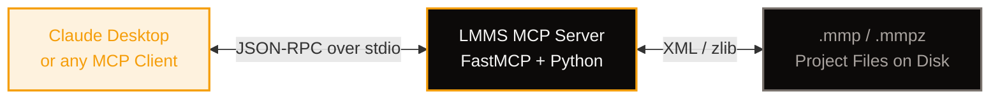

## What You're Building

LMMS is a free, cross-platform digital audio workstation that lets you produce music with your computer — synthesizing sounds, arranging samples, and mixing tracks. Its project files are XML-based, which means an AI agent can read, analyze, and even compose music by manipulating that XML programmatically.

The Model Context Protocol (MCP) is the standard way to connect AI agents to external tools and data. In this two-part tutorial, you'll build an MCP server that bridges the gap between an LLM and LMMS — letting an AI agent open project files, inspect their structure, and eventually compose new music.

**In Part 1 (this tutorial), you'll build:**

- A FastMCP server with tools for parsing `.mmp` and `.mmpz` project files
- Tools to list tracks, instruments, patterns, and notes
- A resource that exposes project metadata
- A prompt template for project analysis
- Integration with Claude Desktop for natural-language project inspection

**In Part 2, you'll extend the server** to create new projects from scratch, add tracks and instruments, compose melodies by writing notes, and export playable `.mmp` files — all driven by AI.

Here's what the architecture looks like:



## Prerequisites

Before you start, make sure you have:

- **Python 3.10 or later** — FastMCP requires modern async features
- **`uv`** installed — Astral's fast Python package manager (recommended)
- **LMMS** installed if you want to test with real project files (optional but helpful)
- **Claude Desktop** or another MCP-compatible client for testing

Install `uv` if you don't have it:

```bash
# macOS
brew install uv

# Linux
curl -LsSf https://astral.sh/uv/install.sh | sh
```

## Understanding the LMMS Project File Format

LMMS stores projects as XML. The uncompressed format is `.mmp`; the compressed format is `.mmpz` (zlib-compressed XML). Both contain the same data — a hierarchical XML document rooted at `<lmms-project>`.

### The XML Structure

Here's a simplified example of an LMMS project file:

```xml
<?xml version="1.0"?>
<lmms-project version="20" type="song" creator="LMMS" creatorversion="1.3.0">
  <head>
    <bpm>140</bpm>
    <mastervol>100</mastervol>
    <masterpitch>0</masterpitch>
  </head>
  <song>
    <trackcontainer>
      <!-- Instrument track -->
      <track type="0" name="TripleOscillator" muted="0" solo="0">
        <instrumenttrack>
          <instrument name="tripleoscillator">
            <tripleoscillator userwavefile="" coarse0="0" ..."
              vol0="100" vol1="0" vol2="0"/>
          </instrument>
          <pattern pattern="0" pos="0" len="192" muted="0" name="Piano">
            <note pos="0" key="57" len="48" vol="100" pan="0"/>
            <note pos="48" key="59" len="48" vol="100" pan="0"/>
            <note pos="96" key="60" len="48" vol="100" pan="0"/>
          </pattern>
        </instrumenttrack>
      </track>

      <!-- Beat/Bassline track -->
      <track type="1" name="Kicker" muted="0" solo="0">
        <bbtrack>
          <instrumenttrack>
            <instrument name="kicker">
              <kicker env="..." />
            </instrument>
            <pattern pos="0" len="192" muted="0" name="Beat">
              <note pos="0" key="36" len="48" vol="100" pan="0"/>
              <note pos="96" key="36" len="48" vol="100" pan="0"/>
            </pattern>
          </instrumenttrack>
        </bbtrack>
      </track>
    </trackcontainer>

    <timeline>
      <tco pos="0" len="192" muted="0" track="0"/>
      <tco pos="0" len="192" muted="0" track="1"/>
    </timeline>

    <mixer>
      <fxchannel num="0" name="Master" volume="100"/>
      <fxchannel num="1" name="FX 1" volume="100"/>
    </mixer>
  </song>
</lmms-project>
```

### Key Elements

| Element | Purpose | Key Attributes |
|---------|---------|----------------|
| `<lmms-project>` | Root node | `version`, `type`, `creator`, `creatorversion` |
| `<head>` | Project metadata | Contains `<bpm>`, `<mastervol>`, `<masterpitch>` |
| `<song>` | Main content container | Holds `trackcontainer`, `timeline`, `mixer` |
| `<trackcontainer>` | All tracks | Contains `<track>` elements |
| `<track>` | Individual track | `type` (0=instrument, 1=BB, 2=sample, 3=automation), `name`, `muted`, `solo` |
| `<instrumenttrack>` | Instrument settings | Contains `<instrument>` and `<pattern>` elements |
| `<instrument>` | Synth definition | `name` (e.g., `tripleoscillator`, `kicker`, `sid`) |
| `<pattern>` | A pattern of notes | `pos` (position in ticks), `len` (length in ticks), `name` |
| `<note>` | A single note | `pos` (position), `key` (MIDI note), `len` (duration), `vol`, `pan` |
| `<bbtrack>` | Beat/Bassline track | Contains patterns for rhythmic content |
| `<mixer>` | Mixer channels | `<fxchannel>` elements with volume and effects |
| `<timeline>` | Timeline arrangement | `<tco>` (Track Content Object) positions patterns in time |

### Ticks and Timing

LMMS uses **ticks** for timing. The default resolution is:

- **192 ticks** = 1 bar (4/4 time)
- **48 ticks** = 1 beat (quarter note)
- **24 ticks** = 1 eighth note
- **12 ticks** = 1 sixteenth note

### MIDI Note Numbers

Notes are stored as MIDI note numbers. Here's a quick reference:

| Note | MIDI Number | Note | MIDI Number |
|------|------------|------|------------|
| C2 | 36 | C4 | 60 |
| D2 | 38 | D4 | 62 |
| E2 | 40 | E4 | 64 |
| F2 | 41 | F4 | 65 |
| G2 | 43 | G4 | 67 |
| A2 | 45 | A4 | 69 |
| B2 | 47 | B4 | 71 |
| C3 | 48 | C5 | 72 |

### Built-in Instruments

LMMS includes several built-in synthesizers you can reference by name:

| Instrument Name | Description |
|----------------|-------------|
| `tripleoscillator` | Three-oscillator subtractive synth |
| `kicker` | Kick drum synthesizer |
| `bassbooster` | Bass enhancement |
| `bitinvader` | Bit-crusher / waveshaper |
| `sfxr` | Sound effect synthesizer |
| `sid` | Commodore 64 SID chip emulator |
| `pluck` | Plucked string synthesizer |
| `monstro` | Three-oscillator super synth |
| `audiofileprocessor` | Sample player |
| `sf2player` | SoundFont player |
| `lb302` | TB-303 bass synth |
| `zynaddsubfx` | Additive synthesizer (requires plugin) |

## Setting Up the Project

Create a new project directory and set up the Python environment:

```bash
mkdir lmms-mcp-server
cd lmms-mcp-server

# Initialize a Python project with uv
uv init
uv venv
source .venv/bin/activate

# Install FastMCP and dependencies
uv add fastmcp pydantic

# Create the main server file
touch lmms_mcp.py
```

Your project structure should look like:

```
lmms-mcp-server/
├── .venv/
├── pyproject.toml
├── uv.lock
└── lmms_mcp.py
```

Verify the installation:

```bash
python -c "from fastmcp import FastMCP; print('FastMCP ready')"
```

## Building the Server Foundation

Open `lmms_mcp.py` and let's start building. We'll begin with imports, constants, and the server instance.

```python
#!/usr/bin/env python3
"""
LMMS MCP Server — Part 1: Parsing and Analyzing DAW Projects

An MCP server that lets AI agents read and analyze LMMS project files
(.mmp uncompressed XML and .mmpz compressed XML).
"""

import gzip
import json
import os
import xml.etree.ElementTree as ET
from enum import Enum
from pathlib import Path
from typing import Any, Dict, List, Optional

from fastmcp import FastMCP
from pydantic import BaseModel, Field, field_validator, ConfigDict

# ---------------------------------------------------------------------------
# Constants
# ---------------------------------------------------------------------------

CHARACTER_LIMIT = 25_000  # Maximum response size in characters

# MIDI note number to name mapping
MIDI_TO_NOTE: Dict[int, str] = {}
NOTE_NAMES = ["C", "C#", "D", "D#", "E", "F", "F#", "G", "G#", "A", "A#", "B"]
for midi_num in range(128):
    octave = (midi_num // 12) - 1
    note_name = NOTE_NAMES[midi_num % 12]
    MIDI_TO_NOTE[midi_num] = f"{note_name}{octave}"

# Track type mapping
TRACK_TYPES = {
    "0": "Instrument",
    "1": "Beat/Bassline",
    "2": "Sample",
    "3": "Automation",
}

# Common LMMS built-in instruments
BUILTIN_INSTRUMENTS = {
    "tripleoscillator": "Three-oscillator subtractive synthesizer",
    "kicker": "Kick drum synthesizer",
    "bassbooster": "Bass enhancement effect",
    "bitinvader": "Bit-crusher / waveshaper",
    "sfxr": "Sound effect synthesizer",
    "sid": "Commodore 64 SID chip emulator",
    "pluck": "Plucked string synthesizer",
    "vibedstrings": "Vibed string synthesizer",
    "monstro": "Three-oscillator super synthesizer",
    "audiofileprocessor": "Audio sample player",
    "sf2player": "SoundFont 2 player",
    "lb302": "TB-303 bass synthesizer",
    "zynaddsubfx": "ZynAddSubFX additive synthesizer",
}

# ---------------------------------------------------------------------------
# Initialize the MCP server
# ---------------------------------------------------------------------------

mcp = FastMCP("lmms_mcp")
```

### Understanding the Foundation

Let's break down what we just set up:

**Imports:**
- `gzip` — for decompressing `.mmpz` files
- `xml.etree.ElementTree` — Python's built-in XML parser
- `FastMCP` — the MCP framework that handles protocol plumbing
- `Pydantic` — for input validation on tool parameters

**Constants:**
- `CHARACTER_LIMIT` — prevents overwhelming the agent's context with huge responses
- `MIDI_TO_NOTE` — converts MIDI note numbers (57) to readable names (A3)
- `TRACK_TYPES` — maps LMMS track type codes to human-readable names
- `BUILTIN_INSTRUMENTS` — known instrument names and descriptions

**Server initialization:**
- `FastMCP("lmms_mcp")` creates the server instance. The name follows the `{service}_mcp` convention.

## Parsing LMMS Project Files

The first thing our server needs to do is read LMMS project files from disk. Both `.mmp` (uncompressed XML) and `.mmpz` (zlib-compressed XML) contain the same data — we just need to handle the decompression step for `.mmpz`.

Add these helper functions to `lmms_mcp.py`:

```python
# ---------------------------------------------------------------------------
# File I/O helpers
# ---------------------------------------------------------------------------

def _read_project_file(file_path: str) -> ET.Element:
    """Read an LMMS project file and return the XML root element.

    Handles both .mmp (uncompressed XML) and .mmpz (zlib-compressed XML).
    """
    path = Path(file_path).expanduser().resolve()

    if not path.exists():
        raise FileNotFoundError(f"Project file not found: {path}")

    suffix = path.suffix.lower()

    if suffix == ".mmp":
        # Uncompressed XML — just read and parse
        tree = ET.parse(str(path))
        return tree.getroot()

    elif suffix == ".mmpz":
        # Compressed XML — decompress with zlib/gzip first
        with open(path, "rb") as f:
            compressed_data = f.read()

        # LMMS uses Qt's qCompress which prepends a 4-byte big-endian size
        # header. Skip the first 4 bytes and decompress with zlib.
        try:
            raw_xml = gzip.decompress(compressed_data[4:])
        except Exception:
            # Fallback: try raw zlib decompression without the header
            import zlib
            raw_xml = zlib.decompress(compressed_data[4:])

        return ET.fromstring(raw_xml)

    else:
        raise ValueError(
            f"Unsupported file extension '{suffix}'. "
            "Expected .mmp or .mmpz. "
            "Use 'lmms --dump project.mmpz > project.mmp' to convert .mmpz to .mmp."
        )


def _parse_head(root: ET.Element) -> Dict[str, Any]:
    """Extract project metadata from the <head> element."""
    head = root.find("head")
    if head is None:
        return {}

    result: Dict[str, Any] = {}
    for child in head:
        tag = child.tag
        text = child.text
        if text is not None:
            try:
                result[tag] = int(text)
            except ValueError:
                try:
                    result[tag] = float(text)
                except ValueError:
                    result[tag] = text
        # Also capture attributes
        for attr_name, attr_val in child.attrib.items():
            result[f"{tag}_{attr_name}"] = attr_val
    return result


def _parse_tracks(root: ET.Element) -> List[Dict[str, Any]]:
    """Extract all tracks from the <song><trackcontainer> element."""
    track_container = root.find(".//trackcontainer")
    if track_container is None:
        return []

    tracks = []
    for track_elem in track_container.findall("track"):
        track: Dict[str, Any] = {
            "name": track_elem.get("name", "Unnamed"),
            "type": TRACK_TYPES.get(track_elem.get("type", ""), "Unknown"),
            "type_code": track_elem.get("type", ""),
            "muted": track_elem.get("muted", "0") == "1",
            "solo": track_elem.get("solo", "0") == "1",
        }

        # Find instrument if present
        instrument = track_elem.find(".//instrument")
        if instrument is not None:
            inst_name = instrument.get("name", "unknown")
            track["instrument"] = inst_name
            track["instrument_description"] = BUILTIN_INSTRUMENTS.get(
                inst_name, "Unknown instrument"
            )

        # Count patterns and notes
        patterns = track_elem.findall(".//pattern")
        track["pattern_count"] = len(patterns)

        total_notes = 0
        for pattern in patterns:
            notes = pattern.findall("note")
            total_notes += len(notes)
        track["total_notes"] = total_notes

        tracks.append(track)

    return tracks


def _parse_patterns(root: ET.Element) -> List[Dict[str, Any]]:
    """Extract all patterns with their notes from the XML."""
    patterns = []
    for pattern_elem in root.findall(".//pattern"):
        pattern: Dict[str, Any] = {
            "name": pattern_elem.get("name", "Unnamed Pattern"),
            "pos": int(pattern_elem.get("pos", "0")),
            "len": int(pattern_elem.get("len", "0")),
            "muted": pattern_elem.get("muted", "0") == "1",
            "note_count": 0,
            "notes": [],
        }

        notes = []
        for note_elem in pattern_elem.findall("note"):
            key = int(note_elem.get("key", "60"))
            note: Dict[str, Any] = {
                "pos": int(note_elem.get("pos", "0")),
                "key": key,
                "note_name": MIDI_TO_NOTE.get(key, f"Unknown({key})"),
                "len": int(note_elem.get("len", "0")),
                "vol": int(note_elem.get("vol", "100")),
                "pan": int(note_elem.get("pan", "0")),
            }
            notes.append(note)

        pattern["notes"] = notes
        pattern["note_count"] = len(notes)
        patterns.append(pattern)

    return patterns


def _parse_mixer(root: ET.Element) -> List[Dict[str, Any]]:
    """Extract mixer channels from the <mixer> element."""
    mixer = root.find(".//mixer")
    if mixer is None:
        return []

    channels = []
    for fx in mixer.findall("fxchannel"):
        channel: Dict[str, Any] = {
            "num": int(fx.get("num", "0")),
            "name": fx.get("name", f"FX {fx.get('num', '0')}"),
            "volume": int(fx.get("volume", "100")),
        }
        channels.append(channel)

    return channels


def _parse_project_summary(root: ET.Element) -> Dict[str, Any]:
    """Build a complete summary of the project."""
    head = _parse_head(root)
    tracks = _parse_tracks(root)
    patterns = _parse_patterns(root)
    mixer = _parse_mixer(root)

    # Count totals
    total_notes = sum(p["note_count"] for p in patterns)
    instrument_tracks = [t for t in tracks if t["type"] == "Instrument"]
    bb_tracks = [t for t in tracks if t["type"] == "Beat/Bassline"]

    return {
        "project_version": root.get("version", "unknown"),
        "project_type": root.get("type", "unknown"),
        "creator": root.get("creator", "unknown"),
        "creator_version": root.get("creatorversion", "unknown"),
        "head": head,
        "track_count": len(tracks),
        "instrument_track_count": len(instrument_tracks),
        "bb_track_count": len(bb_tracks),
        "pattern_count": len(patterns),
        "total_notes": total_notes,
        "mixer_channels": len(mixer),
        "tracks": tracks,
        "mixer": mixer,
    }
```

### How the Parser Works

The parsing functions walk the XML tree using ElementTree's `find` and `findall` methods:

1. **`_read_project_file`** — Reads `.mmp` files directly as XML. For `.mmpz`, it skips the 4-byte Qt size header and decompresses the rest with zlib/gzip.

2. **`_parse_head`** — Extracts BPM, master volume, and master pitch from the `<head>` element. It tries to convert numeric strings to integers or floats.

3. **`_parse_tracks`** — Walks the `<trackcontainer>` and extracts each track's name, type, mute/solo state, instrument name, and note/pattern counts.

4. **`_parse_patterns`** — Finds all `<pattern>` elements anywhere in the tree, extracts their notes, and converts MIDI note numbers to readable names (e.g., 60 → "C4").

5. **`_parse_mixer`** — Extracts mixer FX channels with their names and volumes.

6. **`_parse_project_summary`** — Aggregates everything into a single dictionary with totals and counts.

## Building the MCP Tools

Now let's expose these parsing functions as MCP tools that an AI agent can call.

### Tool 1: Get Project Info

The first tool provides a high-level overview of an LMMS project:

```python
# ---------------------------------------------------------------------------
# Pydantic models for input validation
# ---------------------------------------------------------------------------

class ProjectFileInput(BaseModel):
    """Input model for tools that operate on a project file path."""
    model_config = ConfigDict(
        str_strip_whitespace=True,
        validate_assignment=True,
        extra="forbid",
    )

    file_path: str = Field(
        ...,
        description=(
            "Path to the LMMS project file (.mmp or .mmpz). "
            "Example: '/home/user/projects/my_song.mmp' or "
            "'~/music/beat.mmpz'"
        ),
        min_length=1,
        max_length=500,
    )

    @field_validator("file_path")
    @classmethod
    def validate_path(cls, v: str) -> str:
        if not v.strip():
            raise ValueError("File path cannot be empty")
        return v.strip()


class ResponseFormat(str, Enum):
    """Output format for tool responses."""
    MARKDOWN = "markdown"
    JSON = "json"


class ProjectInfoInput(ProjectFileInput):
    """Input for the get_project_info tool."""
    response_format: ResponseFormat = Field(
        default=ResponseFormat.MARKDOWN,
        description="Output format: 'markdown' for human-readable or 'json' for machine-readable",
    )


# ---------------------------------------------------------------------------
# Tool: Get Project Info
# ---------------------------------------------------------------------------

@mcp.tool(
    name="lmms_get_project_info",
    annotations={
        "title": "Get LMMS Project Info",
        "readOnlyHint": True,
        "destructiveHint": False,
        "idempotentHint": True,
        "openWorldHint": False,
    },
)
async def lmms_get_project_info(params: ProjectInfoInput) -> str:
    """Get a high-level overview of an LMMS project file.

    This tool reads an .mmp or .mmpz file and returns a summary including
    BPM, track count, instrument list, pattern count, total notes, and mixer
    channels. It does NOT modify the file.

    Args:
        params (ProjectInfoInput): Validated input containing:
            - file_path (str): Path to the .mmp or .mmpz file
            - response_format (ResponseFormat): 'markdown' or 'json' output

    Returns:
        str: Project summary in the requested format. Markdown includes
        formatted headers and lists. JSON includes the full structured data.

    Examples:
        - Use when: "What's in my LMMS project?" → params with file_path
        - Use when: "Analyze the structure of beat.mmpz" → params with file_path
        - Don't use when: You need individual track details (use lmms_list_tracks)
        - Don't use when: You need note-level data (use lmms_get_pattern_details)

    Error Handling:
        - Returns "Error: Project file not found: <path>" if the file doesn't exist
        - Returns "Error: Unsupported file extension" for non-.mmp/.mmpz files
        - Returns "Error: Failed to parse XML" for corrupted files
    """
    try:
        root = _read_project_file(params.file_path)
        summary = _parse_project_summary(root)
    except FileNotFoundError as e:
        return f"Error: {e}"
    except ValueError as e:
        return f"Error: {e}"
    except ET.ParseError as e:
        return f"Error: Failed to parse XML in project file: {e}"
    except Exception as e:
        return f"Error: Unexpected error: {type(e).__name__}: {e}"

    if params.response_format == ResponseFormat.JSON:
        result = json.dumps(summary, indent=2, default=str)
        if len(result) > CHARACTER_LIMIT:
            result = result[:CHARACTER_LIMIT] + "\n... (truncated)"
        return result

    # Markdown format
    lines = [
        f"# LMMS Project: {Path(params.file_path).stem}",
        "",
        f"**File**: `{params.file_path}`",
        f"**LMMS Version**: {summary['project_version']} "
        f"(created with {summary['creator']} {summary['creator_version']})",
        "",
        "## Project Settings",
        "",
    ]

    head = summary.get("head", {})
    bpm = head.get("bpm", "unknown")
    master_vol = head.get("mastervol", "unknown")
    master_pitch = head.get("masterpitch", "unknown")
    lines.append(f"- **BPM**: {bpm}")
    lines.append(f"- **Master Volume**: {master_vol}")
    lines.append(f"- **Master Pitch**: {master_pitch}")
    lines.append("")

    lines.append("## Track Summary")
    lines.append("")
    lines.append(f"- **Total tracks**: {summary['track_count']}")
    lines.append(f"- **Instrument tracks**: {summary['instrument_track_count']}")
    lines.append(f"- **Beat/Bassline tracks**: {summary['bb_track_count']}")
    lines.append(f"- **Patterns**: {summary['pattern_count']}")
    lines.append(f"- **Total notes**: {summary['total_notes']}")
    lines.append(f"- **Mixer channels**: {summary['mixer_channels']}")
    lines.append("")

    if summary["tracks"]:
        lines.append("## Tracks")
        lines.append("")
        for i, track in enumerate(summary["tracks"]):
            muted = " [muted]" if track.get("muted") else ""
            solo = " [solo]" if track.get("solo") else ""
            instrument = track.get("instrument", "—")
            inst_desc = track.get("instrument_description", "")
            lines.append(
                f"{i + 1}. **{track['name']}** ({track['type']}){muted}{solo}"
            )
            lines.append(f"   - Instrument: `{instrument}` — {inst_desc}")
            lines.append(
                f"   - Patterns: {track['pattern_count']}, "
                f"Notes: {track['total_notes']}"
            )
        lines.append("")

    if summary["mixer"]:
        lines.append("## Mixer Channels")
        lines.append("")
        for ch in summary["mixer"]:
            lines.append(f"- **{ch['name']}** (ch {ch['num']}) — Volume: {ch['volume']}")

    result = "\n".join(lines)
    if len(result) > CHARACTER_LIMIT:
        result = result[:CHARACTER_LIMIT] + "\n\n... (truncated — use JSON format for full data)"
    return result
```

### Tool 2: List Tracks

This tool provides detailed information about each track:

```python
# ---------------------------------------------------------------------------
# Tool: List Tracks
# ---------------------------------------------------------------------------

class ListTracksInput(ProjectFileInput):
    """Input for the lmms_list_tracks tool."""
    track_type: Optional[str] = Field(
        default=None,
        description=(
            "Filter by track type: 'Instrument', 'Beat/Bassline', 'Sample', "
            "or 'Automation'. Omit to list all tracks."
        ),
    )
    response_format: ResponseFormat = Field(
        default=ResponseFormat.MARKDOWN,
        description="Output format: 'markdown' or 'json'",
    )


@mcp.tool(
    name="lmms_list_tracks",
    annotations={
        "title": "List LMMS Tracks",
        "readOnlyHint": True,
        "destructiveHint": False,
        "idempotentHint": True,
        "openWorldHint": False,
    },
)
async def lmms_list_tracks(params: ListTracksInput) -> str:
    """List all tracks in an LMMS project with their instruments and note counts.

    This tool reads an .mmp or .mmpz file and returns a detailed list of
    tracks, optionally filtered by type. Each track entry includes the
    instrument name, pattern count, and total note count.

    Args:
        params (ListTracksInput): Validated input containing:
            - file_path (str): Path to the .mmp or .mmpz file
            - track_type (Optional[str]): Filter by type ('Instrument', 'Beat/Bassline', etc.)
            - response_format (ResponseFormat): 'markdown' or 'json' output

    Returns:
        str: Track list in the requested format. Markdown includes a numbered
        list with instrument details. JSON includes structured track data.

    Examples:
        - Use when: "What tracks are in my project?" → params with file_path
        - Use when: "List all instrument tracks" → params with track_type='Instrument'
        - Use when: "Show me the beat tracks" → params with track_type='Beat/Bassline'
        - Don't use when: You need project-level summary (use lmms_get_project_info)

    Error Handling:
        - Returns "Error: Project file not found" if the file doesn't exist
        - Returns "Error: No tracks found matching type '<type>'" if filter yields nothing
    """
    try:
        root = _read_project_file(params.file_path)
        tracks = _parse_tracks(root)
    except FileNotFoundError as e:
        return f"Error: {e}"
    except Exception as e:
        return f"Error: {type(e).__name__}: {e}"

    # Apply filter
    if params.track_type:
        filtered = [t for t in tracks if t["type"] == params.track_type]
        if not filtered:
            return f"No tracks found matching type '{params.track_type}'."
        tracks = filtered

    if not tracks:
        return "No tracks found in this project."

    if params.response_format == ResponseFormat.JSON:
        return json.dumps(tracks, indent=2, default=str)

    # Markdown format
    lines = [
        f"# Tracks in {Path(params.file_path).stem}",
        f"_{len(tracks)} track(s)_",
        "",
    ]

    for i, track in enumerate(tracks):
        muted = " 🔇" if track.get("muted") else ""
        solo = " 🎯" if track.get("solo") else ""
        lines.append(f"## {i + 1}. {track['name']}{muted}{solo}")
        lines.append(f"- **Type**: {track['type']}")
        if track.get("instrument"):
            lines.append(f"- **Instrument**: `{track['instrument']}`")
            lines.append(f"  - {track.get('instrument_description', '')}")
        lines.append(f"- **Patterns**: {track['pattern_count']}")
        lines.append(f"- **Total Notes**: {track['total_notes']}")
        lines.append("")

    return "\n".join(lines)
```

### Tool 3: Get Pattern Details

This tool dives into individual patterns to show the actual notes:

```python
# ---------------------------------------------------------------------------
# Tool: Get Pattern Details
# ---------------------------------------------------------------------------

class PatternDetailsInput(ProjectFileInput):
    """Input for the lmms_get_pattern_details tool."""
    pattern_index: int = Field(
        ...,
        description=(
            "Index of the pattern to inspect (0-based). "
            "Use lmms_list_patterns to find available indices."
        ),
        ge=0,
    )
    include_notes: bool = Field(
        default=True,
        description="Whether to include individual note data in the response",
    )
    response_format: ResponseFormat = Field(
        default=ResponseFormat.MARKDOWN,
        description="Output format: 'markdown' or 'json'",
    )


@mcp.tool(
    name="lmms_get_pattern_details",
    annotations={
        "title": "Get LMMS Pattern Details",
        "readOnlyHint": True,
        "destructiveHint": False,
        "idempotentHint": True,
        "openWorldHint": False,
    },
)
async def lmms_get_pattern_details(params: PatternDetailsInput) -> str:
    """Get detailed information about a specific pattern in an LMMS project.

    This tool reads an .mmp or .mmpz file, finds the pattern at the given
    index, and returns its name, position, length, and optionally all notes
    with their pitch, position, duration, volume, and panning.

    Args:
        params (PatternDetailsInput): Validated input containing:
            - file_path (str): Path to the .mmp or .mmpz file
            - pattern_index (int): 0-based index of the pattern
            - include_notes (bool): Whether to include note data (default: true)
            - response_format (ResponseFormat): 'markdown' or 'json'

    Returns:
        str: Pattern details in the requested format. Markdown includes a
        formatted table of notes. JSON includes structured note data.

    Examples:
        - Use when: "Show me the notes in pattern 0" → params with pattern_index=0
        - Use when: "What notes are in the bass pattern?" → find index first, then call
        - Don't use when: You just need a list of patterns (use lmms_list_patterns)

    Error Handling:
        - Returns "Error: Pattern index X out of range (0 to Y)" if index is invalid
    """
    try:
        root = _read_project_file(params.file_path)
        patterns = _parse_patterns(root)
    except FileNotFoundError as e:
        return f"Error: {e}"
    except Exception as e:
        return f"Error: {type(e).__name__}: {e}"

    if params.pattern_index >= len(patterns):
        return (
            f"Error: Pattern index {params.pattern_index} out of range "
            f"(0 to {len(patterns) - 1}). Use lmms_list_patterns to see available indices."
        )

    pattern = patterns[params.pattern_index]

    if not params.include_notes:
        pattern_data = {k: v for k, v in pattern.items() if k != "notes"}
        if params.response_format == ResponseFormat.JSON:
            return json.dumps(pattern_data, indent=2, default=str)
        lines = [
            f"# Pattern: {pattern['name']}",
            f"- **Position**: {pattern['pos']} ticks",
            f"- **Length**: {pattern['len']} ticks ({pattern['len'] / 48:.1f} beats)",
            f"- **Note Count**: {pattern['note_count']}",
            f"- **Muted**: {'Yes' if pattern['muted'] else 'No'}",
        ]
        return "\n".join(lines)

    if params.response_format == ResponseFormat.JSON:
        return json.dumps(pattern, indent=2, default=str)

    # Markdown format with note table
    lines = [
        f"# Pattern: {pattern['name']}",
        f"- **Position**: {pattern['pos']} ticks",
        f"- **Length**: {pattern['len']} ticks ({pattern['len'] / 48:.1f} beats)",
        f"- **Note Count**: {pattern['note_count']}",
        f"- **Muted**: {'Yes' if pattern['muted'] else 'No'}",
        "",
    ]

    if pattern["notes"]:
        lines.append("| # | Position | Note | MIDI | Length | Volume | Pan |")
        lines.append("|---|----------|------|------|--------|--------|-----|")
        for i, note in enumerate(pattern["notes"]):
            lines.append(
                f"| {i + 1} | {note['pos']} | {note['note_name']} | "
                f"{note['key']} | {note['len']} | {note['vol']} | {note['pan']} |"
            )
    else:
        lines.append("_No notes in this pattern._")

    result = "\n".join(lines)
    if len(result) > CHARACTER_LIMIT:
        result = result[:CHARACTER_LIMIT] + "\n\n... (truncated)"
    return result
```

### Tool 4: List Patterns

This tool lists all patterns in a project:

```python
# ---------------------------------------------------------------------------
# Tool: List Patterns
# ---------------------------------------------------------------------------

class ListPatternsInput(ProjectFileInput):
    """Input for the lmms_list_patterns tool."""
    response_format: ResponseFormat = Field(
        default=ResponseFormat.MARKDOWN,
        description="Output format: 'markdown' or 'json'",
    )


@mcp.tool(
    name="lmms_list_patterns",
    annotations={
        "title": "List LMMS Patterns",
        "readOnlyHint": True,
        "destructiveHint": False,
        "idempotentHint": True,
        "openWorldHint": False,
    },
)
async def lmms_list_patterns(params: ListPatternsInput) -> str:
    """List all patterns in an LMMS project with their names and note counts.

    This tool reads an .mmp or .mmpz file and returns a list of all patterns
    across all tracks, including their index, name, position, length, and
    note count. Use the index with lmms_get_pattern_details for note-level data.

    Args:
        params (ListPatternsInput): Validated input containing:
            - file_path (str): Path to the .mmp or .mmpz file
            - response_format (ResponseFormat): 'markdown' or 'json'

    Returns:
        str: Pattern list in the requested format. Markdown includes a table.
        JSON includes structured pattern data.

    Examples:
        - Use when: "What patterns are in my project?" → params with file_path
        - Use when: "How many patterns does this song have?" → params with file_path
        - Don't use when: You need note-level data (use lmms_get_pattern_details)

    Error Handling:
        - Returns "Error: Project file not found" if the file doesn't exist
        - Returns "No patterns found in this project." if the project has no patterns
    """
    try:
        root = _read_project_file(params.file_path)
        patterns = _parse_patterns(root)
    except FileNotFoundError as e:
        return f"Error: {e}"
    except Exception as e:
        return f"Error: {type(e).__name__}: {e}"

    if not patterns:
        return "No patterns found in this project."

    if params.response_format == ResponseFormat.JSON:
        # Return summary without note data for the list view
        summary = [
            {
                "index": i,
                "name": p["name"],
                "pos": p["pos"],
                "len": p["len"],
                "note_count": p["note_count"],
                "muted": p["muted"],
            }
            for i, p in enumerate(patterns)
        ]
        return json.dumps(summary, indent=2, default=str)

    # Markdown table
    lines = [
        f"# Patterns in {Path(params.file_path).stem}",
        f"_{len(patterns)} pattern(s)_",
        "",
        "| Index | Name | Position | Length (beats) | Notes | Muted |",
        "|-------|------|----------|----------------|-------|-------|",
    ]

    for i, p in enumerate(patterns):
        beats = p["len"] / 48 if p["len"] else 0
        muted = "Yes" if p["muted"] else "No"
        lines.append(
            f"| {i} | {p['name']} | {p['pos']} | {beats:.1f} | "
            f"{p['note_count']} | {muted} |"
        )

    return "\n".join(lines)
```

### Tool 5: List Instruments

This tool lists all instruments used in the project:

```python
# ---------------------------------------------------------------------------
# Tool: List Instruments
# ---------------------------------------------------------------------------

class ListInstrumentsInput(ProjectFileInput):
    """Input for the lmms_list_instruments tool."""
    response_format: ResponseFormat = Field(
        default=ResponseFormat.MARKDOWN,
        description="Output format: 'markdown' or 'json'",
    )


@mcp.tool(
    name="lmms_list_instruments",
    annotations={
        "title": "List LMMS Instruments",
        "readOnlyHint": True,
        "destructiveHint": False,
        "idempotentHint": True,
        "openWorldHint": False,
    },
)
async def lmms_list_instruments(params: ListInstrumentsInput) -> str:
    """List all instruments used in an LMMS project.

    This tool reads an .mmp or .mmpz file and returns a list of all
    instruments, including their name, description, and which track they
    belong to. Useful for understanding the sonic palette of a project.

    Args:
        params (ListInstrumentsInput): Validated input containing:
            - file_path (str): Path to the .mmp or .mmpz file
            - response_format (ResponseFormat): 'markdown' or 'json'

    Returns:
        str: Instrument list in the requested format. Markdown includes a
        table with descriptions. JSON includes structured data.

    Examples:
        - Use when: "What instruments does this project use?" → params with file_path
        - Use when: "Does this project use any synths?" → params with file_path
        - Don't use when: You need track-level details (use lmms_list_tracks)

    Error Handling:
        - Returns "Error: Project file not found" if the file doesn't exist
        - Returns "No instruments found in this project." if none are present
    """
    try:
        root = _read_project_file(params.file_path)
        tracks = _parse_tracks(root)
    except FileNotFoundError as e:
        return f"Error: {e}"
    except Exception as e:
        return f"Error: {type(e).__name__}: {e}"

    instruments = []
    for track in tracks:
        if track.get("instrument"):
            instruments.append({
                "name": track["instrument"],
                "description": track.get("instrument_description", ""),
                "track_name": track["name"],
                "track_type": track["type"],
                "pattern_count": track["pattern_count"],
                "total_notes": track["total_notes"],
            })

    if not instruments:
        return "No instruments found in this project."

    if params.response_format == ResponseFormat.JSON:
        return json.dumps(instruments, indent=2, default=str)

    # Markdown format
    lines = [
        f"# Instruments in {Path(params.file_path).stem}",
        f"_{len(instruments)} instrument(s)_",
        "",
        "| # | Instrument | Description | Track | Type | Patterns | Notes |",
        "|---|-----------|-------------|-------|------|----------|-------|",
    ]

    for i, inst in enumerate(instruments):
        lines.append(
            f"| {i + 1} | `{inst['name']}` | {inst['description']} | "
            f"{inst['track_name']} | {inst['track_type']} | "
            f"{inst['pattern_count']} | {inst['total_notes']} |"
        )

    return "\n".join(lines)
```

## Adding Resources and Prompts

MCP supports three primitives: tools (AI-controlled), resources (application-controlled data), and prompts (user-invoked templates). Let's add a resource and a prompt to round out our server.

### Resource: Project Metadata

Resources expose data via URI templates that clients can read on demand:

```python
# ---------------------------------------------------------------------------
# Resource: Project metadata
# ---------------------------------------------------------------------------

@mcp.resource("lmms://project/{file_path}")
async def get_project_metadata(file_path: str) -> str:
    """Expose project metadata as an MCP resource.

    Resources are useful for static or semi-static data that doesn't
    require complex parameters. The client can read this data at any time
    via the URI template.
    """
    try:
        root = _read_project_file(file_path)
        summary = _parse_project_summary(root)
        # Return just the metadata, not the full track list
        metadata = {
            "file": file_path,
            "version": summary["project_version"],
            "type": summary["project_type"],
            "creator": summary["creator"],
            "creator_version": summary["creator_version"],
            "bpm": summary.get("head", {}).get("bpm", "unknown"),
            "master_volume": summary.get("head", {}).get("mastervol", "unknown"),
            "track_count": summary["track_count"],
            "pattern_count": summary["pattern_count"],
            "total_notes": summary["total_notes"],
        }
        return json.dumps(metadata, indent=2, default=str)
    except Exception as e:
        return f"Error: {type(e).__name__}: {e}"
```

### Prompt: Project Analysis Template

Prompts are reusable templates that users can invoke:

```python
# ---------------------------------------------------------------------------
# Prompt: Project analysis template
# ---------------------------------------------------------------------------

@mcp.prompt()
async def analyze_project(file_path: str) -> str:
    """Generate a prompt for analyzing an LMMS project.

    This prompt template instructs the AI to:
    1. Get an overview of the project
    2. List all tracks and instruments
    3. List all patterns
    4. Summarize the musical structure
    """
    return f"""Analyze the LMMS project at: {file_path}

Please perform the following steps:

1. Use lmms_get_project_info to get an overview of the project
2. Use lmms_list_tracks to list all tracks
3. Use lmms_list_instruments to list all instruments
4. Use lmms_list_patterns to list all patterns
5. For each pattern, use lmms_get_pattern_details to examine the notes

After gathering all the data, provide:
- A summary of the project's musical structure
- The key and scale (if determinable from the notes)
- The tempo and time signature
- A description of the arrangement (intro, verse, chorus, etc.)
- Any potential improvements or suggestions

File path: {file_path}"""
```

## Running the Server

Add the entry point at the bottom of `lmms_mcp.py`:

```python
# ---------------------------------------------------------------------------
# Entry point
# ---------------------------------------------------------------------------

if __name__ == "__main__":
    mcp.run()
```

By default, `mcp.run()` uses the **stdio transport** — the server communicates over standard input/output, which is what Claude Desktop and other MCP hosts expect for local tools.

### Testing with the MCP Inspector

FastMCP ships with the MCP Inspector, a web-based tool for testing your server:

```bash
# Run the server with the inspector
fastmcp dev lmms_mcp.py
```

This opens a browser window where you can:
- See all registered tools, resources, and prompts
- Call tools with custom parameters
- View the auto-generated JSON schemas
- Test error handling

### Creating a Sample Project for Testing

If you don't have an LMMS project handy, create a minimal `.mmp` file:

```bash
cat > test_project.mmp << 'EOF'
<?xml version="1.0"?>
<lmms-project version="20" type="song" creator="LMMS" creatorversion="1.3.0">
  <head>
    <bpm>120</bpm>
    <mastervol>100</mastervol>
    <masterpitch>0</masterpitch>
  </head>
  <song>
    <trackcontainer>
      <track type="0" name="Lead Synth" muted="0" solo="0">
        <instrumenttrack>
          <instrument name="tripleoscillator">
            <tripleoscillator vol0="100" vol1="0" vol2="0"/>
          </instrument>
          <pattern pattern="0" pos="0" len="192" muted="0" name="Melody">
            <note pos="0" key="60" len="48" vol="100" pan="0"/>
            <note pos="48" key="62" len="48" vol="100" pan="0"/>
            <note pos="96" key="64" len="48" vol="100" pan="0"/>
            <note pos="144" key="65" len="48" vol="100" pan="0"/>
          </pattern>
        </instrumenttrack>
      </track>
      <track type="1" name="Kick Drum" muted="0" solo="0">
        <bbtrack>
          <instrumenttrack>
            <instrument name="kicker">
              <kicker/>
            </instrument>
            <pattern pos="0" len="192" muted="0" name="Beat">
              <note pos="0" key="36" len="48" vol="100" pan="0"/>
              <note pos="96" key="36" len="48" vol="100" pan="0"/>
            </pattern>
          </instrumenttrack>
        </bbtrack>
      </track>
    </trackcontainer>
    <timeline>
      <tco pos="0" len="192" muted="0" track="0"/>
      <tco pos="0" len="192" muted="0" track="1"/>
    </timeline>
    <mixer>
      <fxchannel num="0" name="Master" volume="100"/>
    </mixer>
  </song>
</lmms-project>
EOF
```

Now test the server in the inspector:

```bash
fastmcp dev lmms_mcp.py
```

In the inspector, call `lmms_get_project_info` with:
```json
{
  "params": {
    "file_path": "/absolute/path/to/test_project.mmp"
  }
}
```

You should see a formatted markdown summary of the project.

## Connecting to Claude Desktop

To use your MCP server with Claude Desktop, add it to the Claude Desktop configuration file.

**macOS**: `~/Library/Application Support/Claude/claude_desktop_config.json`
**Linux**: `~/.config/Claude/claude_desktop_config.json`

```json
{
  "mcpServers": {
    "lmms": {
      "command": "python",
      "args": ["/absolute/path/to/lmms_mcp.py"],
      "cwd": "/absolute/path/to/lmms-mcp-server"
    }
  }
}
```

> **Important**: Use absolute paths. Claude Desktop needs to find both your Python interpreter and the server script. If you're using a virtual environment, point to that Python: `"/path/to/lmms-mcp-server/.venv/bin/python"`.

Restart Claude Desktop, and you'll see a 🔨 tools icon appear. Try asking:

- "What's in my LMMS project at /path/to/test_project.mmp?"
- "List all the instruments in my project"
- "Show me the notes in pattern 0"
- "Analyze the structure of my song"

Claude will automatically call the appropriate tools and present the results in a readable format.

## The Complete Server (Part 1)

Here's the full `lmms_mcp.py` file for reference:

```python
#!/usr/bin/env python3
"""
LMMS MCP Server — Part 1: Parsing and Analyzing DAW Projects

An MCP server that lets AI agents read and analyze LMMS project files
(.mmp uncompressed XML and .mmpz compressed XML).
"""

import gzip
import json
import os
import xml.etree.ElementTree as ET
from enum import Enum
from pathlib import Path
from typing import Any, Dict, List, Optional

from fastmcp import FastMCP
from pydantic import BaseModel, Field, field_validator, ConfigDict

# Constants
CHARACTER_LIMIT = 25_000
MIDI_TO_NOTE: Dict[int, str] = {}
NOTE_NAMES = ["C", "C#", "D", "D#", "E", "F", "F#", "G", "G#", "A", "A#", "B"]
for midi_num in range(128):
    octave = (midi_num // 12) - 1
    note_name = NOTE_NAMES[midi_num % 12]
    MIDI_TO_NOTE[midi_num] = f"{note_name}{octave}"

TRACK_TYPES = {"0": "Instrument", "1": "Beat/Bassline", "2": "Sample", "3": "Automation"}

BUILTIN_INSTRUMENTS = {
    "tripleoscillator": "Three-oscillator subtractive synthesizer",
    "kicker": "Kick drum synthesizer",
    "bassbooster": "Bass enhancement effect",
    "bitinvader": "Bit-crusher / waveshaper",
    "sfxr": "Sound effect synthesizer",
    "sid": "Commodore 64 SID chip emulator",
    "pluck": "Plucked string synthesizer",
    "vibedstrings": "Vibed string synthesizer",
    "monstro": "Three-oscillator super synthesizer",
    "audiofileprocessor": "Audio sample player",
    "sf2player": "SoundFont 2 player",
    "lb302": "TB-303 bass synthesizer",
    "zynaddsubfx": "ZynAddSubFX additive synthesizer",
}

mcp = FastMCP("lmms_mcp")

# --- File I/O helpers (see full implementations above) ---
# _read_project_file, _parse_head, _parse_tracks, _parse_patterns,
# _parse_mixer, _parse_project_summary

# --- Pydantic models ---
# ProjectFileInput, ResponseFormat, ProjectInfoInput, ListTracksInput,
# PatternDetailsInput, ListPatternsInput, ListInstrumentsInput

# --- Tools ---
# lmms_get_project_info, lmms_list_tracks, lmms_get_pattern_details,
# lmms_list_patterns, lmms_list_instruments

# --- Resources ---
# get_project_metadata

# --- Prompts ---
# analyze_project

if __name__ == "__main__":
    mcp.run()
```

> The full file with all implementations is available in the [companion repository](https://github.com/greedychipmunk/lmms-mcp-server). The code blocks above contain the complete implementations — just assemble them in order.

## What You've Built

Let's review what we've accomplished in Part 1:

| Component | Name | Purpose |
|-----------|------|---------|
| Tool | `lmms_get_project_info` | High-level project overview |
| Tool | `lmms_list_tracks` | List tracks with optional type filter |
| Tool | `lmms_get_pattern_details` | Inspect individual pattern notes |
| Tool | `lmms_list_patterns` | List all patterns with summary data |
| Tool | `lmms_list_instruments` | List all instruments with descriptions |
| Resource | `lmms://project/{file_path}` | Project metadata via URI |
| Prompt | `analyze_project` | Template for full project analysis |

### Key Design Decisions

1. **Workflow-oriented tools** — Each tool serves a natural analysis step (overview → tracks → patterns → notes), not just a raw API wrapper.

2. **Dual response formats** — Markdown for human-readable output, JSON for programmatic processing. The agent can choose based on the task.

3. **Character limits** — Responses are capped at 25,000 characters to respect the agent's context window. Truncation includes guidance on how to get more data.

4. **Actionable error messages** — Errors guide the agent toward correct usage (e.g., "Use lmms_list_patterns to see available indices").

5. **Pydantic validation** — All inputs are validated with Pydantic models, including path stripping and format constraints.

## Next Steps

In **Part 2**, you'll extend this server to go beyond analysis and into composition:

- **Create new projects** from scratch with `lmms_create_project`
- **Add tracks and instruments** with `lmms_add_track` and `lmms_add_instrument`
- **Compose melodies** by writing notes with `lmms_add_notes`
- **Set project parameters** like BPM and volume
- **Generate a scale or melody** with `lmms_generate_scale`
- **Export playable .mmp files** that open directly in LMMS
- **Connect to an AI agent** for end-to-end music composition

Head to [Part 2: AI Music Composition with the LMMS MCP Server](/tutorials/fastmcp-lmms-server-part-2) to build the creative side of the server.

## References

- [LMMS GitHub Repository](https://github.com/LMMS/lmms)
- [LMMS Project File Format (DeepWiki)](https://deepwiki.com/LMMS/lmms/7.1-project-file-format)
- [FastMCP Documentation](https://gofastmcp.com/)
- [MCP Python SDK](https://github.com/modelcontextprotocol/python-sdk)
- [Model Context Protocol Specification](https://modelcontextprotocol.io/)
- [MCP Inspector](https://github.com/modelcontextprotocol/inspector)
