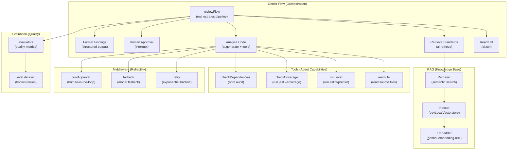

## What You're Building

Code review is the bottleneck of every engineering team. You write code, push it, and wait. A human reviewer reads the diff, checks for bugs, flags style issues, and asks for changes. If the reviewer is busy, the PR sits for a day. If the reviewer is junior, they miss security issues. If the reviewer is senior, they burn out on review duty.

What if an AI pipeline could do the first pass — read the diff, check it against your coding standards, run the linter, verify test coverage, and produce a structured review with severity-tagged findings — leaving the human reviewer to focus on architecture and business logic?

The challenge is that a code review pipeline has too many moving parts for a single LLM call. You need to read files, run shell commands, retrieve relevant standards from a knowledge base, produce structured output, and pause for human approval before posting comments. You also need to debug the pipeline when it produces bad reviews, and evaluate whether it's getting better over time.

This tutorial uses [Genkit](https://genkit.dev) — Google's open-source framework for building production AI applications — to solve all of these problems:

- **Flows** wrap your AI logic in type-safe, observable, deployable functions. Each step of the review pipeline is a flow step, visible in the Genkit Developer UI's trace viewer.
- **Tools** give the model access to filesystem operations and shell commands. The agent reads source files, runs linters, and checks test coverage — all through typed tool definitions.
- **RAG** (Retrieval-Augmented Generation) indexes your coding standards into a vector store and retrieves the relevant standards for each file under review. The agent doesn't just guess what good code looks like — it checks against your actual standards.
- **Middleware** adds retry logic for API failures, fallback to alternative models, and tool approval gates for sensitive operations.
- **Interrupts** pause the pipeline for human approval before posting review comments. The human can review the findings, approve them, or reject them with feedback.
- **Streaming** delivers review findings in real-time as the agent generates them, so the human reviewer sees results immediately instead of waiting for the entire pipeline to finish.
- **Evaluation** runs the pipeline against a dataset of known code issues and measures quality with built-in evaluators, so you can track whether changes to the pipeline improve or regress review quality.

By the end of this tutorial you'll have a production-ready code review pipeline that reads a diff, analyzes it against your standards, runs real tools, produces structured findings, waits for human approval, and evaluates its own quality — all observable in the Genkit Developer UI.

## The Architecture

Three layers, each handling one concern:



- **The flow** orchestrates the pipeline. Each step is a Genkit action — `ai.run()`, `ai.retrieve()`, `ai.generate()` — that appears as a separate step in the trace viewer.
- **Tools** give the model real capabilities. The agent reads files, runs linters, checks coverage, and audits dependencies through typed tool definitions.
- **RAG** grounds the review in your actual coding standards. The pipeline indexes your standards into a vector store and retrieves the relevant ones for each file.
- **Middleware** makes the pipeline production-ready. Retry handles transient API failures. Fallback switches to a cheaper model when the primary is rate-limited. Tool approval gates sensitive operations behind human confirmation.
- **Evaluation** measures quality. You run the pipeline against a dataset of known code issues and track metrics over time.

## Prerequisites

- **Node.js 20+** and npm
- **Gemini API key** from [Google AI Studio](https://aistudio.google.com)
- Basic familiarity with TypeScript and the command line
- A codebase to review (we'll create a small sample project for the tutorial)

## Step 1 — Set Up the Project

Create a project directory and initialize it:

```bash
mkdir code-review-pipeline && cd code-review-pipeline
npm init -y
```

Install Genkit and the required packages:

```bash
npm install genkit @genkit-ai/google-genai @genkit-ai/dev-local-vectorstore @genkit-ai/middleware @genkit-ai/express
npm install -D tsx typescript @types/node
```

Create a `tsconfig.json`:

```json
{
  "compilerOptions": {
    "target": "ES2022",
    "module": "ES2022",
    "moduleResolution": "bundler",
    "esModuleInterop": true,
    "strict": true,
    "outDir": "./dist",
    "rootDir": "./src",
    "skipLibCheck": true
  },
  "include": ["src/**/*"]
}
```

Set up the project structure:

```
code-review-pipeline/
├── package.json
├── tsconfig.json
├── .env
├── src/
│   ├── index.ts          # Genkit initialization
│   ├── tools.ts          # Tool definitions
│   ├── standards.ts      # Coding standards RAG (indexer + retriever)
│   ├── review.ts         # Review flow + agent
│   ├── evaluate.ts       # Evaluation flow
│   └── server.ts         # Express server for deployment
├── standards/            # Coding standards documents
│   ├── security.md
│   ├── performance.md
│   └── style.md
└── sample-project/       # The codebase to review
    ├── src/
    │   ├── auth.ts
    │   └── utils.ts
    └── __tests__/
        └── auth.test.ts
```

Create a `.env` file:

```bash
cat > .env << 'EOF'
GEMINI_API_KEY=your_gemini_api_key_here
EOF
```

## Step 2 — Initialize Genkit

Create `src/index.ts`:

```typescript
import { genkit } from 'genkit';
import { googleAI } from '@genkit-ai/google-genai';
import { devLocalVectorstore } from '@genkit-ai/dev-local-vectorstore';

export const ai = genkit({
  plugins: [
    googleAI(),
    devLocalVectorstore([
      {
        indexName: 'coding-standards',
        embedder: googleAI.embedder('gemini-embedding-001'),
      },
    ]),
  ],
  model: googleAI.model('gemini-2.5-flash'),
});
```

This initialization configures:
- **Google AI plugin** for Gemini model access (both generation and embedding)
- **Local vector store** for RAG — indexes coding standards documents for semantic retrieval. The `gemini-embedding-001` embedder converts text into vector representations for similarity search.
- **Default model** set to `gemini-2.5-flash` for fast, cost-effective generation

## Step 3 — Define Tools

Tools are the agent's hands. They let the model read files, run linters, check test coverage, and audit dependencies — all through typed definitions that the model can call autonomously.

Create `src/tools.ts`:

```typescript
import { z } from 'genkit';
import { ai } from './index.js';
import { readFile } from 'fs/promises';
import { exec } from 'child_process';
import { promisify } from 'util';
import path from 'path';

const execAsync = promisify(exec);

// ─── Tool: Read File ─────────────────────────────────────────────────────────

export const readFileTool = ai.defineTool(
  {
    name: 'readFile',
    description:
      'Read the contents of a source file. Use this to examine code that ' +
      'needs review. Always provide the full file path relative to the ' +
      'project root.',
    inputSchema: z.object({
      filePath: z.string().describe('Path to the file, relative to project root'),
    }),
    outputSchema: z.object({
      content: z.string(),
      lineCount: z.number(),
    }),
  },
  async ({ filePath }) => {
    const fullPath = path.resolve(filePath);
    const content = await readFile(fullPath, 'utf-8');
    return {
      content,
      lineCount: content.split('\n').length,
    };
  }
);

// ─── Tool: Run Linter ─────────────────────────────────────────────────────────

export const runLinterTool = ai.defineTool(
  {
    name: 'runLinter',
    description:
      'Run ESLint on a file or directory and return the linting errors ' +
      'and warnings. Use this to check code quality and style issues.',
    inputSchema: z.object({
      target: z.string().describe('File or directory to lint, relative to project root'),
    }),
    outputSchema: z.object({
      errors: z.number(),
      warnings: z.number(),
      output: z.string(),
    }),
  },
  async ({ target }) => {
    try {
      const { stdout, stderr } = await execAsync(
        `npx eslint ${target} --format json 2>&1`,
        { maxBuffer: 10 * 1024 * 1024 }
      );
      const results = JSON.parse(stdout);
      let errors = 0;
      let warnings = 0;
      for (const result of results) {
        errors += result.errorCount || 0;
        warnings += result.warningCount || 0;
      }
      return { errors, warnings, output: stdout };
    } catch (e: any) {
      return { errors: 0, warnings: 0, output: e.stdout || e.message };
    }
  }
);

// ─── Tool: Check Test Coverage ────────────────────────────────────────────────

export const checkCoverageTool = ai.defineTool(
  {
    name: 'checkCoverage',
    description:
      'Run the test suite with coverage reporting and return coverage ' +
      'metrics. Use this to verify that the code under review has ' +
      'adequate test coverage.',
    inputSchema: z.object({
      target: z.string().describe('Directory to check coverage for, relative to project root'),
    }),
    outputSchema: z.object({
      coverage: z.number().describe('Coverage percentage (0-100)'),
      output: z.string(),
    }),
  },
  async ({ target }) => {
    try {
      const { stdout } = await execAsync(
        `npx jest ${target} --coverage --coverageReporters=text 2>&1`,
        { maxBuffer: 10 * 1024 * 1024 }
      );
      // Parse coverage percentage from jest output
      const match = stdout.match(/All files\s+\|\s+(\d+\.?\d*)/);
      const coverage = match ? parseFloat(match[1]) : 0;
      return { coverage, output: stdout };
    } catch (e: any) {
      return { coverage: 0, output: e.stdout || e.message };
    }
  }
);

// ─── Tool: Check Dependencies ─────────────────────────────────────────────────

export const checkDepsTool = ai.defineTool(
  {
    name: 'checkDependencies',
    description:
      'Run npm audit and return vulnerability information. Use this to ' +
      'check for known security vulnerabilities in the project dependencies.',
    inputSchema: z.object({
      projectRoot: z.string().describe('Path to the project root directory'),
    }),
    outputSchema: z.object({
      vulnerabilities: z.number(),
      severity: z.string(),
      output: z.string(),
    }),
  },
  async ({ projectRoot }) => {
    try {
      const { stdout } = await execAsync('npm audit --json 2>&1', {
        cwd: path.resolve(projectRoot),
        maxBuffer: 10 * 1024 * 1024,
      });
      const audit = JSON.parse(stdout);
      const vulns = audit.metadata?.vulnerabilities || {};
      return {
        vulnerabilities: vulns.total || 0,
        severity: vulns.high > 0 ? 'high' : vulns.moderate > 0 ? 'moderate' : 'low',
        output: stdout,
      };
    } catch (e: any) {
      return { vulnerabilities: 0, severity: 'unknown', output: e.stdout || e.message };
    }
  }
);

// ─── Export all tools ─────────────────────────────────────────────────────────

export const allTools = [
  readFileTool,
  runLinterTool,
  checkCoverageTool,
  checkDepsTool,
];
```

Key design decisions:

- **Typed schemas**: Every tool has `inputSchema` and `outputSchema` using Zod. The model knows exactly what arguments to provide and what format the result will be in. This is enforced at runtime — if the model passes bad arguments, Genkit validates and rejects.
- **Tool descriptions are detailed**: The description is the primary signal the model uses to decide when to call a tool. Be specific about when and why the tool should be used.
- **Error handling**: Each tool catches errors and returns them as structured output instead of throwing. This lets the model understand what went wrong and adjust its approach.
- **Real shell execution**: The linter, coverage, and dependency tools run real shell commands. The model can run `eslint`, `jest --coverage`, and `npm audit` — these aren't simulated.

## Step 4 — Set Up RAG for Coding Standards

The pipeline needs to know your coding standards — not just generic best practices, but your team's specific rules. We'll index your standards documents into a vector store and retrieve the relevant ones during review.

Create the standards documents:

```markdown
<!-- standards/security.md -->
# Security Standards

## Input Validation
- All user input must be validated and sanitized before use.
- Use parameterized queries for all database operations.
- Never concatenate user input into SQL queries or shell commands.
- Validate email addresses, URLs, and file paths with strict regex.

## Authentication
- Passwords must be hashed with bcrypt (minimum 12 rounds).
- Session tokens must be cryptographically random and at least 32 bytes.
- All authentication endpoints must rate-limit (max 5 attempts per minute).
- JWT tokens must expire within 24 hours.

## Dependencies
- Run `npm audit` weekly. Fix all high-severity vulnerabilities within 48 hours.
- No dependencies with known CVEs in production.
- Pin all dependency versions in package-lock.json.

## Secrets
- Never hardcode API keys, passwords, or tokens in source code.
- Use environment variables or a secrets manager (e.g., Infisical, Vault).
- .env files must be in .gitignore.
```

```markdown
<!-- standards/performance.md -->
# Performance Standards

## Database
- All database queries must use indexes. No full-table scans in hot paths.
- Pagination is required for any query that could return more than 100 rows.
- Use connection pooling for all database connections.

## Caching
- Cache frequently accessed, rarely changing data with TTL.
- Use Redis or in-memory cache for session data.
- Cache invalidation must happen on every write to the underlying data.

## API Design
- API responses must be paginated when the result set exceeds 50 items.
- Use streaming for large file uploads (> 10MB).
- Implement request timeouts (max 30 seconds for API calls).

## Frontend
- Lazy-load non-critical JavaScript bundles.
- Images must be optimized and served in next-gen formats (WebP, AVIF).
- Core Web Vitals must meet: LCP < 2.5s, FID < 100ms, CLS < 0.1.
```

```markdown
<!-- standards/style.md -->
# Code Style Standards

## Naming
- Functions and variables use camelCase: `getUserById`, `isActive`.
- Classes and types use PascalCase: `UserService`, `AuthMiddleware`.
- Constants use UPPER_SNAKE_CASE: `MAX_RETRIES`, `DEFAULT_TIMEOUT`.
- Boolean variables start with `is`, `has`, or `should`: `isValid`, `hasPermission`.

## Functions
- Functions should be small and do one thing (max 30 lines).
- No more than 3 parameters. Use an options object for more.
- Every function must have a JSDoc comment with @param and @returns.
- No nested callbacks deeper than 2 levels. Use async/await.

## Error Handling
- Never swallow errors with empty catch blocks.
- Use custom error classes for domain-specific errors.
- All async functions must handle errors explicitly.
- Log errors with context (function name, input parameters).

## Testing
- Every public function must have at least one test.
- Test names describe the behavior: `should return user when email exists`.
- Aim for 80% code coverage minimum.
- Test edge cases: empty input, null, boundary values.
```

Create `src/standards.ts` to index and retrieve these standards:

```typescript
import { z } from 'genkit';
import { Document } from 'genkit/retriever';
import { readFile } from 'fs/promises';
import path from 'path';
import { ai } from './index.js';

// ─── Indexer ──────────────────────────────────────────────────────────────────

export const standardsIndexer = ai.defineFlow(
  {
    name: 'indexStandards',
    inputSchema: z.object({
      standardsDir: z.string().describe('Directory containing standards .md files'),
    }),
    outputSchema: z.object({
      success: z.boolean(),
      documentsIndexed: z.number(),
    }),
  },
  async ({ standardsDir }) => {
    const dir = path.resolve(standardsDir);

    // Read all markdown files in the standards directory
    const files = ['security.md', 'performance.md', 'style.md'];
    const documents: Document[] = [];

    for (const file of files) {
      const fullPath = path.join(dir, file);
      const content = await readFile(fullPath, 'utf-8');

      // Split each standards document into sections by ## headers
      const sections = content.split(/^## /m).filter((s) => s.trim().length > 0);

      for (const section of sections) {
        const title = section.split('\n')[0].trim();
        documents.push(
          Document.fromText(section.trim(), {
            source: file,
            section: title,
          })
        );
      }
    }

    // Index the documents
    await ai.index({
      indexer: 'devLocalIndexer/coding-standards',
      documents,
    });

    return { success: true, documentsIndexed: documents.length };
  }
);

// ─── Retriever ───────────────────────────────────────────────────────────────

export async function retrieveStandards(query: string, k: number = 5) {
  const docs = await ai.retrieve({
    retriever: 'devLocalRetriever/coding-standards',
    query,
    options: { k },
  });
  return docs;
}
```

Key design decisions:

- **Section-level chunking**: Each standards document is split by `##` headers, so each section (e.g., "Input Validation", "Authentication") is a separate document. This gives the retriever fine-grained results — the agent gets the specific standard that applies, not the entire document.
- **Metadata**: Each chunk is tagged with its source file and section title, so the agent can cite which standard it's checking against.
- **Indexer flow**: The indexing is a Genkit flow, so it appears in the Developer UI and can be run from the CLI.

Index the standards:

```bash
npx genkit flow:run indexStandards '{"standardsDir": "./standards"}' -- npx tsx --watch src/index.ts
```

## Step 5 — Define the Review Flow

The review flow is the heart of the pipeline. It reads the diff, retrieves relevant standards, analyzes the code with tools, and produces structured findings.

Create `src/review.ts`:

```typescript
import { z } from 'genkit';
import { ai } from './index.js';
import { allTools } from './tools.js';
import { retrieveStandards } from './standards.js';
import { retry, fallback } from '@genkit-ai/middleware';
import { googleAI } from '@genkit-ai/google-genai';

// ─── Schemas ──────────────────────────────────────────────────────────────────

const ReviewFindingSchema = z.object({
  severity: z.enum(['critical', 'warning', 'suggestion', 'praise']),
  category: z.enum(['security', 'performance', 'style', 'testing', 'maintainability']),
  file: z.string(),
  line: z.number().optional(),
  title: z.string(),
  description: z.string(),
  suggestion: z.string().optional(),
  standard: z.string().optional().describe('The coding standard this finding relates to'),
});

const ReviewResultSchema = z.object({
  summary: z.string(),
  findings: z.array(ReviewFindingSchema),
  overallScore: z.number().min(0).max(100).describe('Overall code quality score (0-100)'),
  recommendation: z.enum(['approve', 'request_changes', 'reject']),
});

// ─── Review Flow ──────────────────────────────────────────────────────────────

export const reviewFlow = ai.defineFlow(
  {
    name: 'reviewFlow',
    inputSchema: z.object({
      projectPath: z.string().describe('Path to the project to review'),
      filesToReview: z.array(z.string()).describe('List of files to review'),
      diff: z.string().optional().describe('Git diff for context (optional)'),
    }),
    outputSchema: ReviewResultSchema,
    streamSchema: ReviewFindingSchema,
  },
  async ({ projectPath, filesToReview, diff }, { sendChunk }) => {
    // Step 1: Read all files under review
    const fileContents = await ai.run('read-files', async () => {
      const contents: Record<string, string> = {};
      for (const file of filesToReview) {
        const fullPath = path.join(projectPath, file);
        try {
          contents[file] = await readFile(fullPath, 'utf-8');
        } catch {
          contents[file] = 'Unable to read file';
        }
      }
      return contents;
    });

    // Step 2: Retrieve relevant coding standards for each file
    const standards = await ai.run('retrieve-standards', async () => {
      const query = filesToReview.map((f) => fileContents[f]).join('\n');
      return await retrieveStandards(query, 8);
    });

    // Step 3: Analyze each file with the agent
    const findings: z.infer<typeof ReviewFindingSchema>[] = [];

    for (const file of filesToReview) {
      const fileStandards = await retrieveStandards(fileContents[file], 3);
      const standardsContext = fileStandards
        .map((doc) => `[${doc.metadata?.source || 'standard'} > ${doc.metadata?.section || ''}]\n${doc.text}`)
        .join('\n\n');

      const { output } = await ai.generate({
        system: `You are an expert code reviewer. Analyze the code and produce structured findings.
Use the tools available to you: read files, run linters, check test coverage, and check dependencies.
Check the code against the provided coding standards. Cite the specific standard for each finding.
Be specific and actionable. Only flag real issues — don't pad the review with noise.`,
        prompt: `Review the following file: ${file}

File contents:
${fileContents[file]}

Relevant coding standards:
${standardsContext}

${diff ? `Git diff for context:\n${diff}` : ''}

Analyze this file for:
1. Security issues (input validation, auth, secrets, dependencies)
2. Performance issues (database, caching, API design)
3. Style issues (naming, functions, error handling)
4. Testing issues (missing tests, coverage gaps)
5. Maintainability issues (complexity, readability)

Use the tools to run the linter and check coverage if applicable.
Return a JSON object with findings for this file.`,
        tools: allTools,
        output: { schema: z.object({ findings: z.array(ReviewFindingSchema) }) },
        maxTurns: 10,
        use: [
          retry({ maxRetries: 3, initialDelayMs: 1000 }),
          fallback({
            models: [googleAI.model('gemini-2.5-pro')],
            statuses: ['RESOURCE_EXHAUSTED'],
          }),
        ],
      });

      if (output?.findings) {
        for (const finding of output.findings) {
          findings.push(finding);
          // Stream each finding as it's produced
          sendChunk(finding);
        }
      }
    }

    // Step 4: Generate overall summary and score
    const { output: summary } = await ai.generate({
      system: 'You are a senior code reviewer producing a final review summary.',
      prompt: `Based on these findings, produce a summary and overall score.

Findings:
${JSON.stringify(findings, null, 2)}

Count:
- Critical: ${findings.filter((f) => f.severity === 'critical').length}
- Warning: ${findings.filter((f) => f.severity === 'warning').length}
- Suggestion: ${findings.filter((f) => f.severity === 'suggestion').length}
- Praise: ${findings.filter((f) => f.severity === 'praise').length}

Produce a summary, overall score (0-100), and recommendation (approve/request_changes/reject).`,
      output: { schema: ReviewResultSchema },
    });

    return summary || {
      summary: 'Review complete',
      findings,
      overallScore: 70,
      recommendation: 'request_changes' as const,
    };
  }
);
```

Key design decisions:

- **Structured output**: The flow returns a `ReviewResultSchema` with typed findings. Each finding has a severity (critical/warning/suggestion/praise), category, file, line number, title, description, suggestion, and the standard it relates to. This makes the output machine-readable — you can post it as GitHub review comments, display it in a dashboard, or feed it to downstream automation.
- **Streaming**: The flow streams each finding as it's produced via `sendChunk(finding)`. A frontend can display findings in real-time instead of waiting for the entire review to complete.
- **Per-file analysis**: Each file is analyzed separately, with its own relevant standards retrieved. This gives more focused reviews — the agent doesn't get overwhelmed by a massive diff.
- **Middleware**: The `retry` middleware handles transient API failures with exponential backoff. The `fallback` middleware switches to Gemini Pro if Flash is rate-limited.
- **Tool access**: The agent has access to `readFile`, `runLinter`, `checkCoverage`, and `checkDependencies` tools. It can run real linters and coverage checks during the review.
- **`maxTurns: 10`**: The agent can make up to 10 tool-call rounds per file. This gives it enough room to read files, run linters, check coverage, and iterate — but prevents infinite loops.

## Step 6 — Add Human-in-the-Loop with Interrupts

The pipeline should pause for human approval before posting review comments. Genkit's interrupt mechanism lets you stop the tool loop and wait for human input.

Add an interrupt tool to `src/tools.ts`:

```typescript
import { ai } from './index.js';

// ─── Interrupt Tool: Post Review Comment ──────────────────────────────────────

export const postCommentTool = ai.defineTool(
  {
    name: 'postComment',
    description:
      'Post a review comment on a pull request. This tool requires human ' +
      'approval before the comment is posted. Use this after you have ' +
      'finalized a review finding.',
    inputSchema: z.object({
      file: z.string().describe('File path for the comment'),
      line: z.number().optional().describe('Line number for the comment'),
      comment: z.string().describe('The review comment text'),
      severity: z.enum(['critical', 'warning', 'suggestion', 'praise']),
    }),
    outputSchema: z.object({
      posted: z.boolean(),
      reason: z.string(),
    }),
  },
  async (input) => {
    // This tool is intercepted — the actual posting happens after human approval
    // The tool implementation is a placeholder; the interrupt handler does the real work
    return { posted: true, reason: 'Comment posted after approval' };
  }
);
```

Now update the review flow to use the interrupt pattern. Add this to `src/review.ts`:

```typescript
import { postCommentTool } from './tools.js';

// ─── Review Flow with Interrupts ──────────────────────────────────────────────

export const reviewWithApprovalFlow = ai.defineFlow(
  {
    name: 'reviewWithApproval',
    inputSchema: z.object({
      projectPath: z.string(),
      filesToReview: z.array(z.string()),
      prNumber: z.number().optional(),
    }),
    outputSchema: z.object({
      review: ReviewResultSchema,
      commentsPosted: z.number(),
      commentsRejected: z.number(),
    }),
    streamSchema: z.object({
      type: z.enum(['finding', 'approval_request', 'comment_posted', 'comment_rejected']),
      data: z.any(),
    }),
  },
  async ({ projectPath, filesToReview }, { sendChunk }) => {
    // Run the review flow first
    const review = await reviewFlow({ projectPath, filesToReview });

    // Stream each finding
    for (const finding of review.findings) {
      sendChunk({ type: 'finding', data: finding });
    }

    // Now post comments — each one requires human approval
    let commentsPosted = 0;
    let commentsRejected = 0;

    for (const finding of review.findings) {
      if (finding.severity === 'praise') continue; // Don't require approval for praise

      // Stream the approval request
      sendChunk({ type: 'approval_request', data: finding });

      // Use the interrupt pattern: generate with returnToolRequests to stop the loop
      const { response } = ai.generateStream({
        prompt: `Post a review comment for this finding: ${JSON.stringify(finding)}`,
        tools: [postCommentTool],
        returnToolRequests: true,
      });

      const result = await response;

      if (result.toolRequests.length > 0) {
        const toolRequest = result.toolRequests[0];
        // In a real app, this is where you'd pause and wait for human input
        // For this tutorial, we'll auto-approve critical and warnings, reject suggestions
        const approved = finding.severity === 'critical' || finding.severity === 'warning';

        if (approved) {
          commentsPosted++;
          sendChunk({ type: 'comment_posted', data: finding });
        } else {
          commentsRejected++;
          sendChunk({ type: 'comment_rejected', data: finding });
        }
      }
    }

    return {
      review,
      commentsPosted,
      commentsRejected,
    };
  }
);
```

Key design decisions:

- **`returnToolRequests: true`**: This stops the automatic tool loop. Instead of Genkit executing the tool, it returns the tool request to your code. You can then ask for human approval before executing it.
- **Streaming approval events**: The flow streams approval requests and decisions, so a frontend can show the human what's being reviewed and get their input in real-time.
- **Severity-based approval**: Critical and warning findings are auto-approved (in a real app, you'd have a UI for this). Suggestions are auto-rejected to avoid noise. Praise is posted without approval.

## Step 7 — Run the Pipeline

Create a sample project to review:

```typescript
// sample-project/src/auth.ts
import bcrypt from 'bcrypt';

// Authenticates a user with email and password
export async function authenticate(email: string, password: string) {
  const user = await db.query(`SELECT * FROM users WHERE email = '${email}'`);
  if (!user) return null;
  const valid = await bcrypt.compare(password, user.passwordHash);
  return valid ? user : null;
}

// Generates a session token
export function generateToken() {
  return Math.random().toString(36).substring(7);
}

// Validates an email address
export function isValidEmail(email: string) {
  return email.includes('@');
}
```

This code has several issues:
- SQL injection vulnerability (string concatenation in query)
- Weak token generation (Math.random is not cryptographically secure)
- Insufficient email validation (just checks for @)
- No rate limiting on authentication
- No JSDoc comments with @param/@returns

Run the pipeline:

```bash
# Start the Genkit Developer UI
npx genkit start -- npx tsx --watch src/index.ts
```

Open the Developer UI at [localhost:4000](http://localhost:4000). You'll see:
- **Flows** tab: `indexStandards`, `reviewFlow`, `reviewWithApproval`
- **Tools** tab: `readFile`, `runLinter`, `checkCoverage`, `checkDependencies`, `postComment`

Run the review flow from the CLI:

```bash
npx genkit flow:run reviewFlow '{
  "projectPath": "./sample-project",
  "filesToReview": ["src/auth.ts"]
}' -- npx tsx --watch src/index.ts
```

Or run it from the Developer UI by clicking on `reviewFlow` and filling in the input fields.

The flow will:
1. Read the file
2. Retrieve relevant coding standards (security, style)
3. Analyze the code with tools (read file, run linter)
4. Produce structured findings
5. Stream each finding as it's generated

The output will look like:

```json
{
  "summary": "The authentication module has critical security vulnerabilities...",
  "findings": [
    {
      "severity": "critical",
      "category": "security",
      "file": "src/auth.ts",
      "line": 5,
      "title": "SQL Injection Vulnerability",
      "description": "User input is concatenated directly into SQL query. This allows SQL injection attacks.",
      "suggestion": "Use parameterized queries: db.query('SELECT * FROM users WHERE email = ?', [email])",
      "standard": "security.md > Input Validation"
    },
    {
      "severity": "critical",
      "category": "security",
      "file": "src/auth.ts",
      "line": 13,
      "title": "Weak Token Generation",
      "description": "Math.random() is not cryptographically secure. Session tokens can be predicted.",
      "suggestion": "Use crypto.randomBytes(32) for session tokens.",
      "standard": "security.md > Authentication"
    },
    {
      "severity": "warning",
      "category": "security",
      "file": "src/auth.ts",
      "line": 18,
      "title": "Insufficient Email Validation",
      "description": "Only checks for @ character. Does not validate email format.",
      "suggestion": "Use a strict regex or a validation library like zod.",
      "standard": "security.md > Input Validation"
    }
  ],
  "overallScore": 35,
  "recommendation": "reject"
}
```

## Step 8 — Debug with the Developer UI

The Genkit Developer UI is one of the framework's killer features. After running the review flow, click **View trace** to see the full execution trace.

The trace viewer shows:
- **Each step** of the flow as a separate entry: `read-files`, `retrieve-standards`, `generate` (per file)
- **Tool calls** made by the model: `readFile`, `runLinter`, `checkCoverage`
- **Tool inputs and outputs**: The exact arguments the model passed and the results returned
- **Model calls**: The prompt, system prompt, model name, token usage, and latency
- **Retrieval results**: Which standards documents were retrieved and their relevance scores
- **Streaming chunks**: Each finding as it was streamed

This is invaluable for debugging. If the agent missed a security issue, you can trace exactly what happened:
- Did it retrieve the right standards? Check the `retrieve-standards` step.
- Did it read the file? Check the `readFile` tool call.
- Did it run the linter? Check the `runLinter` tool call.
- What did the model "see"? Check the `generate` step's prompt and context.

You can also use the Developer UI to:
- **Run flows interactively** with different inputs
- **Compare outputs** from different models (e.g., Gemini Flash vs Pro)
- **Test individual tools** in isolation
- **Inspect retrieval results** for specific queries

## Step 9 — Evaluate Review Quality

Genkit's evaluation framework lets you measure the quality of your review pipeline against a dataset of known issues. This is how you know whether changes to the pipeline improve or regress quality.

Create `src/evaluate.ts`:

```typescript
import { z } from 'genkit';
import { ai } from './index.js';
import { reviewFlow } from './review.js';

// ─── Evaluation Dataset ──────────────────────────────────────────────────────

const evalDataset = [
  {
    input: {
      projectPath: './sample-project',
      filesToReview: ['src/auth.ts'],
    },
    reference: {
      expectedFindings: [
        { severity: 'critical', category: 'security', title: 'SQL Injection' },
        { severity: 'critical', category: 'security', title: 'Weak Token' },
        { severity: 'warning', category: 'security', title: 'Email Validation' },
      ],
      expectedScore: 35,
      expectedRecommendation: 'reject',
    },
  },
  {
    input: {
      projectPath: './sample-project',
      filesToReview: ['src/utils.ts'],
    },
    reference: {
      expectedFindings: [],
      expectedScore: 85,
      expectedRecommendation: 'approve',
    },
  },
];

// ─── Evaluation Flow ──────────────────────────────────────────────────────────

export const evaluateReviewFlow = ai.defineFlow(
  {
    name: 'evaluateReview',
    inputSchema: z.object({
      dataset: z.array(
        z.object({
          input: z.any(),
          reference: z.any(),
        })
      ),
    }),
    outputSchema: z.object({
      results: z.array(
        z.object({
          file: z.string(),
          precision: z.number(),
          recall: z.number(),
          f1Score: z.number(),
          scoreAccuracy: z.number(),
          recommendationCorrect: z.boolean(),
        })
      ),
      averageF1: z.number(),
    }),
  },
  async ({ dataset }) => {
    const results = [];

    for (const item of dataset) {
      // Run the review flow
      const review = await reviewFlow(item.input);

      // Compare against reference
      const expectedFindings = item.reference.expectedFindings || [];
      const actualFindings = review.findings;

      // Calculate precision and recall
      let truePositives = 0;
      let falsePositives = 0;
      let falseNegatives = 0;

      for (const actual of actualFindings) {
        const matched = expectedFindings.some(
          (expected) =>
            expected.category === actual.category &&
            expected.severity === actual.severity
        );
        if (matched) truePositives++;
        else falsePositives++;
      }

      for (const expected of expectedFindings) {
        const matched = actualFindings.some(
          (actual) =>
            actual.category === expected.category &&
            actual.severity === expected.severity
        );
        if (!matched) falseNegatives++;
      }

      const precision = truePositives / (truePositives + falsePositives) || 0;
      const recall = truePositives / (truePositives + falseNegatives) || 0;
      const f1Score = (2 * precision * recall) / (precision + recall) || 0;

      results.push({
        file: item.input.filesToReview[0],
        precision,
        recall,
        f1Score,
        scoreAccuracy: 100 - Math.abs(review.overallScore - item.reference.expectedScore),
        recommendationCorrect: review.recommendation === item.reference.expectedRecommendation,
      });
    }

    const averageF1 = results.reduce((sum, r) => sum + r.f1Score, 0) / results.length;

    return { results, averageF1 };
  }
);
```

Run the evaluation:

```bash
npx genkit flow:run evaluateReview '{"dataset": []}' -- npx tsx --watch src/index.ts
```

The evaluation flow:
1. Runs the review pipeline against each item in the dataset
2. Compares the findings against the known issues (reference)
3. Calculates precision (what percentage of findings are real issues), recall (what percentage of real issues were found), and F1 score (harmonic mean of precision and recall)
4. Compares the overall score and recommendation against the expected values

This gives you a quantitative measure of review quality. As you improve the pipeline (better prompts, more standards, additional tools), you can run the evaluation to see if the F1 score improves.

## Step 10 — Deploy as an HTTP Endpoint

Genkit flows can be deployed as HTTP endpoints with a single line of code.

Create `src/server.ts`:

```typescript
import { startFlowServer } from '@genkit-ai/express';
import { reviewFlow } from './review.js';
import { reviewWithApprovalFlow } from './review.js';
import { indexStandards } from './standards.js';
import { evaluateReviewFlow } from './evaluate.js';

startFlowServer({
  flows: [
    reviewFlow,
    reviewWithApprovalFlow,
    indexStandards,
    evaluateReviewFlow,
  ],
  port: 3400,
  cors: { origin: '*' },
});
```

Start the server:

```bash
npx tsx src/server.ts
```

Now you can call the review flow via HTTP:

```bash
curl -X POST "http://localhost:3400/reviewFlow" \
  -H "Content-Type: application/json" \
  -d '{
    "data": {
      "projectPath": "./sample-project",
      "filesToReview": ["src/auth.ts"]
    }
  }'
```

For streaming responses, add the `Accept: text/event-stream` header:

```bash
curl -X POST "http://localhost:3400/reviewFlow" \
  -H "Content-Type: application/json" \
  -H "Accept: text/event-stream" \
  -d '{
    "data": {
      "projectPath": "./sample-project",
      "filesToReview": ["src/auth.ts"]
    }
  }'
```

You'll receive each finding as a separate SSE event as it's generated.

## Step 11 — Add Custom Middleware

Genkit's middleware system lets you intercept the generation loop at three levels: `generate` (the outer loop), `model` (the raw model call), and `tool` (individual tool execution). You can build custom middleware for domain-specific needs.

Add a custom middleware that logs all tool calls and their durations:

```typescript
import { generateMiddleware, z } from 'genkit';

export const auditLoggerMiddleware = generateMiddleware(
  {
    name: 'auditLogger',
    description: 'Logs all tool calls with timestamps and durations for audit trails',
    configSchema: z.object({
      logFile: z.string().optional(),
    }),
  },
  ({ config, ai }) => {
    return {
      tool: async (req, ctx, next) => {
        const startTime = Date.now();
        const toolName = req.name;
        const input = JSON.stringify(req.input);

        console.log(`[AUDIT] Tool called: ${toolName} at ${new Date().toISOString()}`);
        console.log(`[AUDIT] Input: ${input}`);

        const result = await next(req, ctx);
        const duration = Date.now() - startTime;

        console.log(`[AUDIT] Tool ${toolName} completed in ${duration}ms`);
        console.log(`[AUDIT] Output: ${JSON.stringify(result).substring(0, 200)}...`);

        return result;
      },
    };
  }
);
```

Use it in the review flow:

```typescript
const { output } = await ai.generate({
  // ... existing config ...
  use: [
    retry({ maxRetries: 3, initialDelayMs: 1000 }),
    fallback({
      models: [googleAI.model('gemini-2.5-pro')],
      statuses: ['RESOURCE_EXHAUSTED'],
    }),
    auditLoggerMiddleware({ logFile: './audit.log' }),
  ],
});
```

The middleware hooks into the `tool` phase, logging every tool call with its input, output, and duration. This creates an audit trail of exactly what the agent did during the review — essential for compliance and debugging.

## Step 12 — Multi-Agent Delegation

Genkit's Agents API (introduced in v1.39.0) supports multi-agent delegation via the `agents()` middleware. An orchestrator agent can delegate to specialist sub-agents, each with its own tools and system prompt.

Create a multi-agent version of the review pipeline:

```typescript
import { genkit } from 'genkit/beta';
import { googleAI } from '@genkit-ai/google-genai';
import { agents } from 'genkit/beta';

const ai = genkit({
  plugins: [googleAI()],
  model: googleAI.model('gemini-2.5-flash'),
});

// ─── Specialist Agent: Security ───────────────────────────────────────────────

const securityAgent = ai.defineAgent({
  name: 'securityReviewer',
  system: `You are a security-focused code reviewer. You check for:
- SQL injection, XSS, CSRF vulnerabilities
- Authentication and authorization issues
- Secret management (hardcoded keys, tokens)
- Dependency vulnerabilities
Use the tools to read files and check dependencies. Cite the specific security standard for each finding.`,
  tools: [readFileTool, checkDepsTool],
});

// ─── Specialist Agent: Quality ────────────────────────────────────────────────

const qualityAgent = ai.defineAgent({
  name: 'qualityReviewer',
  system: `You are a code quality reviewer. You check for:
- Naming conventions (camelCase, PascalCase, UPPER_SNAKE)
- Function size and complexity
- Error handling patterns
- JSDoc documentation
Use the linter tool to check style issues. Cite the specific style standard for each finding.`,
  tools: [readFileTool, runLinterTool],
});

// ─── Specialist Agent: Testing ────────────────────────────────────────────────

const testingAgent = ai.defineAgent({
  name: 'testingReviewer',
  system: `You are a test coverage reviewer. You check for:
- Missing tests for public functions
- Inadequate coverage (below 80%)
- Missing edge case tests
- Test naming conventions
Use the coverage tool to check test coverage. Cite the testing standard for each finding.`,
  tools: [readFileTool, checkCoverageTool],
});

// ─── Orchestrator Agent ───────────────────────────────────────────────────────

const orchestrator = ai.defineAgent({
  name: 'reviewOrchestrator',
  system: `You are a code review orchestrator. You delegate to specialist agents:
- securityReviewer: for security issues
- qualityReviewer: for code quality and style issues
- testingReviewer: for test coverage issues
Delegate to all three agents for each file. Collect their findings and produce a consolidated review.`,
  middleware: [
    agents({
      agents: [securityAgent, qualityAgent, testingAgent],
      maxDelegations: 10,
    }),
  ],
});

// ─── Multi-Agent Review Flow ─────────────────────────────────────────────────

export const multiAgentReviewFlow = ai.defineFlow(
  {
    name: 'multiAgentReview',
    inputSchema: z.object({
      projectPath: z.string(),
      filesToReview: z.array(z.string()),
    }),
    outputSchema: ReviewResultSchema,
  },
  async ({ projectPath, filesToReview }) => {
    const chat = orchestrator.chat();
    const response = await chat.send(
      `Review the following files in ${projectPath}: ${filesToReview.join(', ')}.
      Delegate to the securityReviewer, qualityReviewer, and testingReviewer agents.
      Collect their findings and produce a consolidated review with a summary,
      findings array, overall score, and recommendation.`
    );

    // Parse the agent's response into the structured output
    const { output } = await ai.generate({
      prompt: response.text,
      output: { schema: ReviewResultSchema },
    });

    return output || {
      summary: 'Review complete',
      findings: [],
      overallScore: 70,
      recommendation: 'request_changes' as const,
    };
  }
);
```

Key design decisions:

- **`agents()` middleware**: This is the new multi-agent delegation API from v1.39.0. It injects a `delegate_to_<agent>` tool for each sub-agent. The orchestrator can call these tools to delegate work, and the sub-agents' results are returned as tool responses.
- **Specialist agents**: Each agent has its own system prompt and tools. The security agent has `readFile` and `checkDependencies`. The quality agent has `readFile` and `runLinter`. The testing agent has `readFile` and `checkCoverage`. This separation gives each agent a focused scope.
- **`maxDelegations: 10`**: Limits the total number of delegations to prevent infinite loops.
- **Orchestrator pattern**: The orchestrator delegates to all three specialists, collects their findings, and produces a consolidated review. This is more thorough than a single agent trying to check everything at once.

## Step 13 — Run with the Developer UI

Start the Genkit Developer UI with the multi-agent flow:

```bash
npx genkit start -- npx tsx --watch src/index.ts
```

In the Developer UI:
1. Go to the **Agents** tab — you'll see `securityReviewer`, `qualityReviewer`, `testingReviewer`, and `reviewOrchestrator`
2. Click on `reviewOrchestrator` to start a conversation
3. Send a message: "Review src/auth.ts in ./sample-project"
4. Watch the agent delegate to sub-agents, each running their tools
5. Click **View trace** to see the full execution: orchestrator → sub-agents → tool calls → findings

The trace viewer shows the delegation chain:
- `reviewOrchestrator` calls `delegate_to_securityReviewer`
- `securityReviewer` calls `readFile` and `checkDependencies`
- `securityReviewer` returns findings
- `reviewOrchestrator` calls `delegate_to_qualityReviewer`
- `qualityReviewer` calls `readFile` and `runLinter`
- `qualityReviewer` returns findings
- `reviewOrchestrator` calls `delegate_to_testingReviewer`
- `testingReviewer` calls `readFile` and `checkCoverage`
- `testingReviewer` returns findings
- `reviewOrchestrator` consolidates all findings

This is the power of Genkit's multi-agent system: each agent has a focused scope, and the orchestrator coordinates them. The Developer UI makes the entire delegation chain visible and debuggable.

## Troubleshooting

**`GEMINI_API_KEY` not set.** Get a key from [Google AI Studio](https://aistudio.google.com) and set it in your `.env` file: `GEMINI_API_KEY=your_key_here`.

**`devLocalVectorstore` not found.** Make sure you installed `@genkit-ai/dev-local-vectorstore` and configured it in your Genkit initialization with an embedder.

**Review flow returns empty findings.** Check the trace viewer in the Developer UI. The most common cause is that the model didn't call any tools — check if the tools are properly registered and the tool descriptions are clear enough for the model to know when to use them.

**Agent doesn't delegate to sub-agents.** Make sure the `agents()` middleware is configured with the correct agent references. The orchestrator's system prompt should explicitly mention the sub-agents by name.

**Tool execution times out.** The `execAsync` calls in tools have a default timeout. If your linter or test suite takes longer, increase the `maxBuffer` and add a timeout option to `execAsync`.

**Evaluation returns low F1 score.** This means the pipeline is either missing real issues (low recall) or flagging non-issues (low precision). Check the trace viewer to see what the agent found vs. what was expected. Adjust the system prompt or add more coding standards to improve recall. Make the prompt more specific about what constitutes a real issue to improve precision.

**`genkit/beta` import fails.** The Agents API is in beta and requires Genkit v1.39.0 or later. Run `npm ls genkit` to check your version. The beta import path `genkit/beta` is separate from the stable `genkit` import.

## Where to Go Next

You have a production-ready code review pipeline with RAG, tools, middleware, interrupts, evaluation, and multi-agent delegation. Here's how to take it further:

- **Deploy to Cloud Run.** Genkit flows deploy directly to Google Cloud Run or Cloud Functions for Firebase. Use `startFlowServer()` to serve your flows as HTTP endpoints, containerize the server, and deploy. Add authentication with Firebase App Check or your existing auth system.
- **Integrate with GitHub.** Use the GitHub MCP server or a custom GitHub tool to read PR diffs, post review comments, and update PR status checks. The pipeline becomes: PR opened → webhook triggers review flow → findings posted as GitHub review comments → human approves/rejects.
- **Add the `filesystem` middleware.** Instead of defining custom `readFile` and `runLinter` tools, use Genkit's built-in `filesystem` middleware to give the agent sandboxed file access. This is simpler and more secure — the middleware enforces directory boundaries.
- **Add the `skills` middleware.** If you have project-specific coding standards in `SKILL.md` files, the `skills` middleware auto-discovers them and injects them into the system prompt. The agent can load specific skills on demand.
- **Add Vertex AI evaluators.** Genkit's Vertex AI plugin provides rapid evaluators for more sophisticated quality metrics — answer relevance, groundedness, instruction following. Use these to get a richer evaluation of review quality.
- **Add a web UI.** Use the Genkit client library (`@genkit-ai/client`) to call flows from a React or Angular frontend. The `useChat` adapter for the Vercel AI SDK gives you a drop-in chat interface for the orchestrator agent.
- **Add session persistence.** Use `FirestoreSessionStore` to persist agent conversations across sessions. A developer can start a review, close their laptop, and resume the conversation later — the agent's state is stored server-side.
- **Add background execution.** For large codebases, the review pipeline can take minutes. Use Genkit's background execution API to run the review asynchronously — the client gets a snapshot ID and polls for completion.
- **Add reranking for RAG.** Use Genkit's reranker support to reorder retrieved standards by relevance. The Vertex AI `semantic-ranker-512` model scores each standard against the query, ensuring the most relevant standards are used in the review.
- **Add multi-language support.** The tools can run any linter or test framework — `golangci-lint` for Go, `cargo clippy` for Rust, `mypy` for Python. The agent adapts its review strategy based on the language detected in the source files.

The pattern underneath all of this is worth keeping: **flows** orchestrate the pipeline, **tools** give the agent real capabilities, **RAG** grounds the review in your standards, **middleware** makes it production-ready, **interrupts** add human judgment, and **evaluation** measures quality. Each Genkit primitive handles one concern. Together they turn a manual, error-prone process — code review — into an observable, evaluable, deployable pipeline that catches real issues before a human ever opens the PR.
