## What You're Building

It's 3 AM. PagerDuty fires. A service is down. The on-call engineer wakes up, opens their laptop, and starts the ritual: check the alerts, query the logs, look at the metrics, find the runbook, diagnose the issue, execute the remediation, and write up the incident report. Every minute of this process is a minute of downtime.

What if an AI pipeline could do the first pass — receive the alert, query the logs and metrics, retrieve the relevant runbook, diagnose the root cause, and recommend a remediation action — leaving the human on-call engineer to review the analysis and approve the fix?

The challenge is that incident response has too many moving parts for a single LLM call. You need to query multiple data sources (logs, metrics, status pages), retrieve relevant runbooks from a knowledge base, produce structured diagnostics, and pause for human approval before executing remediation actions. You also need to debug the pipeline when it produces bad diagnoses, and evaluate whether it's getting better over time.

This tutorial uses [Genkit](https://genkit.dev) — Google's open-source framework for building production AI applications — to solve all of these problems:

- **Flows** wrap your AI logic in type-safe, observable, deployable functions. Each step of the incident response pipeline is a flow step, visible in the Genkit Developer UI's trace viewer.
- **Tools** give the model access to log queries, metric queries, status checks, and shell commands. The agent queries Datadog, checks Prometheus, and runs `kubectl` — all through typed tool definitions.
- **RAG** (Retrieval-Augmented Generation) indexes your runbooks and past postmortems into a vector store and retrieves the relevant ones for the current incident. The agent doesn't just guess what to do — it checks against your actual runbooks.
- **Agents API** (new in v1.39.0) provides multi-turn conversational agents with session persistence. The incident commander agent delegates to specialist agents (triage, diagnosis, remediation) via the `agents()` middleware.
- **Middleware** adds retry logic for API failures, fallback to alternative models, and tool approval gates for sensitive operations.
- **Interrupts** pause the pipeline for human approval before executing remediation actions. The on-call engineer reviews the diagnosis and approves or rejects the proposed fix.
- **Streaming** delivers analysis updates in real-time as the agent investigates, so the on-call engineer sees findings immediately instead of waiting for the entire pipeline to finish.
- **Evaluation** runs the pipeline against a dataset of known incidents and measures quality with precision, recall, and F1 metrics, so you can track whether changes to the pipeline improve or regress diagnostic accuracy.

By the end of this tutorial you'll have a production-ready incident response pipeline that receives alerts, queries real data sources, retrieves runbooks, delegates to specialist agents, pauses for human approval, streams analysis in real-time, and evaluates its own quality — all observable in the Genkit Developer UI.

## The Architecture

Three layers, each handling one concern:

```mermaid
flowchart TD
    subgraph Flow ["Genkit Flow (Orchestration)"]
        IncidentFlow["incidentResponseFlow<br/>(receives alert, orchestrates)"]
        IncidentFlow --> Step1["Parse Alert<br/>(ai.run)"]
        IncidentFlow --> Step2["Retrieve Runbooks<br/>(ai.retrieve)"]
        IncidentFlow --> Step3["Investigate<br/>(agent + tools)"]
        IncidentFlow --> Step4["Human Approval<br/>(interrupt)"]
        IncidentFlow --> Step5["Execute Remediation<br/>(tool with approval)"]
        IncidentFlow --> Step6["Generate Report<br/>(structured output)"]
    end

    subgraph Agents ["Multi-Agent (Delegation)"]
        Commander["Incident Commander<br/>(orchestrator)"]
        Commander --> Triage["Triage Agent<br/>(classify + prioritize)"]
        Commander --> Diagnosis["Diagnosis Agent<br/>(root cause analysis)"]
        Commander --> Remediation["Remediation Agent<br/>(propose fixes)"]
    end

    subgraph Tools ["Tools (Agent Capabilities)"]
        QueryLogs["queryLogs<br/>(Datadog/CloudWatch)"]
        QueryMetrics["queryMetrics<br/>(Prometheus/Datadog)"]
        CheckStatus["checkServiceStatus<br/>(status pages)"]
        RunCommand["runCommand<br/>(kubectl/docker)"]
        PostSlack["postSlackUpdate<br/>(notify team)"]
    end

    subgraph RAG ["RAG (Knowledge Base)"]
        Index["Indexer<br/>(devLocalVectorstore)"]
        Embed["Embedder<br/>(gemini-embedding-001)"]
        Retrieve["Retriever<br/>(semantic search)"]
    end

    subgraph Middleware ["Middleware (Reliability)"]
        Retry["retry<br/>(exponential backoff)"]
        Fallback["fallback<br/>(model fallback)"]
        ToolApproval["toolApproval<br/>(gate sensitive tools)"]
    end

    subgraph Evaluation ["Evaluation (Quality)"]
        EvalDataset["eval dataset<br/>(known incidents)"]
        EvalMetrics["evaluators<br/>(precision/recall/F1)"]
    end

    Step3 --> Commander
    Step3 --> QueryLogs
    Step3 --> QueryMetrics
    Step3 --> CheckStatus
    Step3 --> RunCommand
    Step3 --> PostSlack
    Step2 --> Retrieve
    Retrieve --> Index
    Index --> Embed
    Step3 --> Retry
    Step3 --> Fallback
    Step3 --> ToolApproval
    IncidentFlow --> EvalMetrics
    EvalMetrics --> EvalDataset
```



- **The flow** orchestrates the pipeline. Each step is a Genkit action — `ai.run()`, `ai.retrieve()`, `ai.generate()` — that appears as a separate step in the trace viewer.
- **Multi-agent delegation** splits work across specialist agents. The incident commander delegates to triage, diagnosis, and remediation agents via the `agents()` middleware, each with their own tools and system prompts.
- **Tools** give the agent real capabilities. The agent queries logs, checks metrics, verifies service status, runs shell commands, and posts Slack updates — all through typed tool definitions.
- **RAG** grounds the response in your actual runbooks. The pipeline indexes runbooks and postmortems into a vector store and retrieves the relevant ones for the current incident.
- **Middleware** makes the pipeline production-ready. Retry handles transient API failures. Fallback switches to a cheaper model when the primary is rate-limited. Tool approval gates sensitive operations behind human confirmation.
- **Evaluation** measures quality. You run the pipeline against a dataset of known incidents and track metrics over time.

## Prerequisites

- **Node.js 20+** and npm
- **Gemini API key** from [Google AI Studio](https://aistudio.google.com)
- Basic familiarity with TypeScript, the command line, and on-call concepts
- Optional: Datadog API key, Prometheus URL, or Slack webhook URL for real integrations (the tutorial includes simulated versions that work without keys)

## Step 1 — Set Up the Project

Create a project directory and initialize it:

```bash
mkdir incident-response-pipeline && cd incident-response-pipeline
npm init -y
```

Install Genkit and the required packages:

```bash
npm install genkit @genkit-ai/google-genai @genkit-ai/dev-local-vectorstore @genkit-ai/middleware @genkit-ai/express
npm install -D tsx typescript @types/node
```

Create a `tsconfig.json`:

```json
{
  "compilerOptions": {
    "target": "ES2022",
    "module": "ES2022",
    "moduleResolution": "bundler",
    "esModuleInterop": true,
    "strict": true,
    "outDir": "./dist",
    "rootDir": "./src",
    "skipLibCheck": true
  },
  "include": ["src/**/*"]
}
```

Set up the project structure:

```
incident-response-pipeline/
├── package.json
├── tsconfig.json
├── .env
├── src/
│   ├── index.ts          # Genkit initialization
│   ├── tools.ts          # Tool definitions (logs, metrics, status, commands)
│   ├── runbooks.ts       # Runbook RAG (indexer + retriever)
│   ├── agents.ts         # Specialist agents (triage, diagnosis, remediation)
│   ├── incident.ts       # Incident response flow
│   ├── evaluate.ts       # Evaluation flow
│   └── server.ts         # Express server for deployment
├── runbooks/             # Runbook documents
│   ├── high-cpu.md
│   ├── database-down.md
│   ├── disk-full.md
│   └── oom-kill.md
└── sample-alerts/        # Sample alert JSON for testing
    └── high-cpu.json
```

Create a `.env` file:

```bash
cat > .env << 'EOF'
GEMINI_API_KEY=your_gemini_api_key_here
# Optional - for real integrations:
DATADOG_API_KEY=your_datadog_key
SLACK_WEBHOOK_URL=your_slack_webhook
EOF
```

## Step 2 — Initialize Genkit

Create `src/index.ts`:

```typescript
import { genkit } from 'genkit';
import { googleAI } from '@genkit-ai/google-genai';
import { devLocalVectorstore } from '@genkit-ai/dev-local-vectorstore';

export const ai = genkit({
  plugins: [
    googleAI(),
    devLocalVectorstore([
      {
        indexName: 'runbooks',
        embedder: googleAI.embedder('gemini-embedding-001'),
      },
    ]),
  ],
  model: googleAI.model('gemini-2.5-flash'),
});
```

This initialization configures:
- **Google AI plugin** for Gemini model access (both generation and embedding)
- **Local vector store** for RAG — indexes runbook documents for semantic retrieval. The `gemini-embedding-001` embedder converts text into vector representations for similarity search.
- **Default model** set to `gemini-2.5-flash` for fast, cost-effective generation

## Step 3 — Define Tools

Tools are the agent's hands. They let the model query logs, check metrics, verify service status, run shell commands, and post Slack updates — all through typed definitions that the model can call autonomously.

Create `src/tools.ts`:

```typescript
import { z } from 'genkit';
import { ai } from './index.js';
import { exec } from 'child_process';
import { promisify } from 'util';

const execAsync = promisify(exec);

// ─── Tool: Query Logs ─────────────────────────────────────────────────────────

export const queryLogsTool = ai.defineTool(
  {
    name: 'queryLogs',
    description:
      'Query application logs for a specific service and time window. ' +
      'Returns log entries matching the query. Use this to investigate ' +
      'errors, exceptions, and application-level issues. ' +
      'Supports Datadog-style queries (e.g., "service:api ERROR status:500").',
    inputSchema: z.object({
      service: z.string().describe('Service name to query logs for'),
      query: z.string().describe('Log query string (e.g., "ERROR status:500")'),
      timeWindow: z.string().describe('Time window (e.g., "5m", "1h", "24h")'),
    }),
    outputSchema: z.object({
      entries: z.array(
        z.object({
          timestamp: z.string(),
          level: z.string(),
          message: z.string(),
          service: z.string(),
        })
      ),
      total: z.number(),
    }),
  },
  async ({ service, query, timeWindow }) => {
    // In production, call Datadog, CloudWatch, or your log aggregator
    // For this tutorial, return simulated log entries
    const now = Date.now();
    const entries = [
      {
        timestamp: new Date(now - 60000).toISOString(),
        level: 'ERROR',
        message: `Connection pool exhausted for ${service}`,
        service,
      },
      {
        timestamp: new Date(now - 120000).toISOString(),
        level: 'WARN',
        message: `High latency detected: p99=2500ms for ${service}`,
        service,
      },
      {
        timestamp: new Date(now - 180000).toISOString(),
        level: 'ERROR',
        message: `Database query timeout after 30s for ${service}`,
        service,
      },
      {
        timestamp: new Date(now - 300000).toISOString(),
        level: 'INFO',
        message: `Memory usage at 85% for ${service}`,
        service,
      },
    ];

    return { entries, total: entries.length };
  }
);

// ─── Tool: Query Metrics ──────────────────────────────────────────────────────

export const queryMetricsTool = ai.defineTool(
  {
    name: 'queryMetrics',
    description:
      'Query system and application metrics for a service. Returns ' +
      'time-series data for CPU, memory, latency, error rate, and ' +
      'throughput. Use this to identify performance degradation and ' +
      'resource exhaustion.',
    inputSchema: z.object({
      service: z.string().describe('Service name'),
      metric: z.enum(['cpu', 'memory', 'latency', 'error_rate', 'throughput']),
      timeWindow: z.string().describe('Time window (e.g., "5m", "1h")'),
    }),
    outputSchema: z.object({
      metric: z.string(),
      values: z.array(
        z.object({
          timestamp: z.string(),
          value: z.number(),
        })
      ),
      average: z.number(),
      max: z.number(),
      threshold: z.number().optional(),
    }),
  },
  async ({ service, metric, timeWindow }) => {
    // In production, call Prometheus, Datadog, or your metrics backend
    const now = Date.now();
    const points = 10;
    const values = Array.from({ length: points }, (_, i) => ({
      timestamp: new Date(now - (points - i) * 30000).toISOString(),
      value: Math.round((Math.random() * 40 + 60) * 10) / 10, // 60-100 range
    }));

    const avg = values.reduce((s, v) => s + v.value, 0) / values.length;
    const max = Math.max(...values.map((v) => v.value));

    const thresholds: Record<string, number> = {
      cpu: 80,
      memory: 85,
      latency: 2000,
      error_rate: 5,
      throughput: 1000,
    };

    return {
      metric,
      values,
      average: Math.round(avg * 10) / 10,
      max: Math.round(max * 10) / 10,
      threshold: thresholds[metric],
    };
  }
);

// ─── Tool: Check Service Status ──────────────────────────────────────────────

export const checkServiceStatusTool = ai.defineTool(
  {
    name: 'checkServiceStatus',
    description:
      'Check the health status of a service or dependency. Returns ' +
      'the current status (healthy, degraded, down), uptime, and ' +
      'recent incidents. Use this to verify if a dependency is the ' +
      'root cause of an incident.',
    inputSchema: z.object({
      service: z.string().describe('Service name to check'),
    }),
    outputSchema: z.object({
      service: z.string(),
      status: z.enum(['healthy', 'degraded', 'down']),
      uptime: z.string(),
      lastIncident: z.string().optional(),
      dependencies: z.array(
        z.object({
          name: z.string(),
          status: z.enum(['healthy', 'degraded', 'down']),
        })
      ),
    }),
  },
  async ({ service }) => {
    // In production, call your service mesh, health endpoints, or status pages
    return {
      service,
      status: 'degraded' as const,
      uptime: '14d 6h 32m',
      lastIncident: 'Database connection pool exhausted 2 minutes ago',
      dependencies: [
        { name: 'postgres-primary', status: 'degraded' as const },
        { name: 'redis-cache', status: 'healthy' as const },
        { name: 'elasticsearch', status: 'healthy' as const },
      ],
    };
  }
);

// ─── Tool: Run Command ────────────────────────────────────────────────────────

export const runCommandTool = ai.defineTool(
  {
    name: 'runCommand',
    description:
      'Run a shell command on the server. Use this to execute ' +
      'remediation actions like restarting a service, scaling ' +
      'a deployment, or clearing a cache. ' +
      'WARNING: This tool executes real commands. Use with caution.',
    inputSchema: z.object({
      command: z.string().describe('The shell command to execute'),
      reason: z.string().describe('Why this command is being run'),
    }),
    outputSchema: z.object({
      stdout: z.string(),
      stderr: z.string(),
      exitCode: z.number(),
    }),
  },
  async ({ command }) => {
    try {
      const { stdout, stderr } = await execAsync(command, {
        timeout: 30000,
        maxBuffer: 1024 * 1024,
      });
      return { stdout, stderr, exitCode: 0 };
    } catch (e: any) {
      return {
        stdout: e.stdout || '',
        stderr: e.stderr || e.message,
        exitCode: e.code || 1,
      };
    }
  }
);

// ─── Tool: Post Slack Update ──────────────────────────────────────────────────

export const postSlackTool = ai.defineTool(
  {
    name: 'postSlackUpdate',
    description:
      'Post an update to the incident response Slack channel. ' +
      'Use this to notify the team about the incident status, ' +
      'diagnosis, and remediation actions.',
    inputSchema: z.object({
      channel: z.string().describe('Slack channel name'),
      message: z.string().describe('Message to post'),
      severity: z.enum(['info', 'warning', 'critical']),
    }),
    outputSchema: z.object({
      posted: z.boolean(),
      timestamp: z.string(),
    }),
  },
  async ({ channel, message, severity }) => {
    // In production, call the Slack webhook API
    console.log(`[SLACK ${severity.toUpperCase()}] #${channel}: ${message}`);
    return {
      posted: true,
      timestamp: new Date().toISOString(),
    };
  }
);

// ─── Export all tools ─────────────────────────────────────────────────────────

export const allTools = [
  queryLogsTool,
  queryMetricsTool,
  checkServiceStatusTool,
  runCommandTool,
  postSlackTool,
];
```

Key design decisions:

- **Typed schemas**: Every tool has `inputSchema` and `outputSchema` using Zod. The model knows exactly what arguments to provide and what format the result will be in. This is enforced at runtime — if the model passes bad arguments, Genkit validates and rejects.
- **Tool descriptions are detailed**: The description is the primary signal the model uses to decide when to call a tool. Be specific about when and why the tool should be used.
- **Simulated backends**: The log, metric, and status tools return simulated data. In production, you'd replace these with real API calls to Datadog, Prometheus, or your status page. The tool interface stays the same — only the implementation changes.
- **Real shell execution**: The `runCommand` tool runs real shell commands. The model can run `kubectl`, `docker`, `systemctl`, or any command — these aren't simulated. This is powerful but dangerous, which is why we'll add tool approval middleware later.

## Step 4 — Set Up RAG for Runbooks

The pipeline needs to know your runbooks — not just generic troubleshooting, but your team's specific procedures for each type of incident. We'll index your runbook documents into a vector store and retrieve the relevant ones during investigation.

Create the runbook documents:

```markdown
<!-- runbooks/high-cpu.md -->
# High CPU Usage

## Symptoms
- CPU utilization above 80% for more than 5 minutes
- Elevated response latency
- Possible request queueing

## Investigation Steps
1. Check which process is consuming CPU: `top -c -b -n 1`
2. Check for runaway loops in application logs
3. Check for traffic spikes: compare current throughput to baseline
4. Check for recent deployments that may have introduced inefficiency

## Remediation
- **Immediate**: Scale horizontally by adding more replicas
  `kubectl scale deployment <service> --replicas=<N+2>`
- **Short-term**: Throttle incoming traffic at the load balancer
- **Long-term**: Profile the application and optimize hot paths

## Postmortem Template
- What was the impact? (duration, affected users, revenue)
- What was the root cause?
- What triggered the alert?
- What was the time to detection (TTD) and time to resolution (TTR)?
- What can we do to prevent this from happening again?
```

```markdown
<!-- runbooks/database-down.md -->
# Database Connection Issues

## Symptoms
- Connection pool exhausted errors in logs
- Database query timeouts
- Service returning 500 errors
- Health check failures

## Investigation Steps
1. Check database connection count: `SELECT count(*) FROM pg_stat_activity`
2. Check for long-running queries: `SELECT * FROM pg_stat_activity WHERE state = 'active' AND now() - query_start > '1 minute'::interval`
3. Check database CPU and memory: query metrics for the database instance
4. Check for recent schema migrations or query plan changes
5. Verify database replica lag if using read replicas

## Remediation
- **Immediate**: Restart the application to reset connection pools
  `kubectl rollout restart deployment <service>`
- **If connection leak**: Identify and fix the leaking code path
- **If overload**: Add connection pooling (PgBouncer) or increase pool size
- **If long queries**: Kill the offending queries and add statement timeouts

## Prevention
- Set `statement_timeout` to 30 seconds
- Use connection pooling (PgBouncer or application-level)
- Monitor connection pool utilization and alert at 70%
- Add query timeout to all database calls
```

```markdown
<!-- runbooks/disk-full.md -->
# Disk Space Exhaustion

## Symptoms
- Disk usage above 90%
- Write errors in logs
- Service unable to persist data
- Log rotation failures

## Investigation Steps
1. Check disk usage: `df -h`
2. Find largest files: `du -sh /* 2>/dev/null | sort -rh | head -20`
3. Check log file sizes: `ls -lhS /var/log/`
4. Check for core dumps: `find / -name "core.*" -size +100M`
5. Check Docker image and container sizes: `docker system df`

## Remediation
- **Immediate**: Clear old logs
  `find /var/log -name "*.log" -mtime +7 -exec truncate -s 0 {} \;`
- **If Docker**: Prune unused images and containers
  `docker system prune -a --volumes`
- **If application data**: Identify and clean up temporary files
- **Long-term**: Set up log rotation and disk usage alertsing at 70%
```

```markdown
<!-- runbooks/oom-kill.md -->
# Out of Memory (OOM) Kill

## Symptoms
- Process killed by OOM killer
- Service restarts unexpectedly
- Memory usage climbing steadily
- "Cannot allocate memory" errors in logs

## Investigation Steps
1. Check dmesg for OOM killer events: `dmesg | grep -i "killed process"`
2. Check memory usage trend: query metrics for memory over the last hour
3. Check for memory leaks: look for steady memory growth without traffic increase
4. Check JVM heap dumps if Java: look for large object retention
5. Check container memory limits: `kubectl describe pod <pod-name>`

## Remediation
- **Immediate**: Restart the service to release memory
  `kubectl rollout restart deployment <service>`
- **If memory leak**: Increase memory limit temporarily and file a bug
  `kubectl set resources deployment <service> --limits=memory=2Gi`
- **If traffic-driven**: Scale horizontally to distribute load
  `kubectl scale deployment <service> --replicas=<N+2>`

## Prevention
- Set memory requests and limits on all containers
- Monitor memory usage and alert at 75% of limit
- Use memory profiling in staging to detect leaks early
- Consider using languages with better memory management for new services
```

Create `src/runbooks.ts` to index and retrieve these runbooks:

```typescript
import { z } from 'genkit';
import { Document } from 'genkit/retriever';
import { readFile, readdir } from 'fs/promises';
import path from 'path';
import { ai } from './index.js';

// ─── Indexer Flow ──────────────────────────────────────────────────────────────

export const indexRunbooks = ai.defineFlow(
  {
    name: 'indexRunbooks',
    inputSchema: z.object({
      runbooksDir: z.string().describe('Directory containing runbook .md files'),
    }),
    outputSchema: z.object({
      success: z.boolean(),
      documentsIndexed: z.number(),
    }),
  },
  async ({ runbooksDir }) => {
    const dir = path.resolve(runbooksDir);

    // Read all markdown files in the runbooks directory
    const files = await readdir(dir);
    const mdFiles = files.filter((f) => f.endsWith('.md'));

    const documents: Document[] = [];

    for (const file of mdFiles) {
      const fullPath = path.join(dir, file);
      const content = await readFile(fullPath, 'utf-8');

      // Split each runbook into sections by ## headers
      const sections = content.split(/^## /m).filter((s) => s.trim().length > 0);

      for (const section of sections) {
        const title = section.split('\n')[0].trim();
        documents.push(
          Document.fromText(section.trim(), {
            source: file,
            section: title,
          })
        );
      }
    }

    // Index the documents
    await ai.index({
      indexer: 'devLocalIndexer/runbooks',
      documents,
    });

    return { success: true, documentsIndexed: documents.length };
  }
);

// ─── Retriever ────────────────────────────────────────────────────────────────

export async function retrieveRunbooks(query: string, k: number = 5) {
  const docs = await ai.retrieve({
    retriever: 'devLocalRetriever/runbooks',
    query,
    options: { k },
  });
  return docs;
}
```

Key design decisions:

- **Section-level chunking**: Each runbook is split by `##` headers, so each section (e.g., "Symptoms", "Investigation Steps", "Remediation") is a separate document. This gives the retriever fine-grained results — the agent gets the specific section that applies, not the entire runbook.
- **Metadata**: Each chunk is tagged with its source file and section title, so the agent can cite which runbook it's following.
- **Indexer flow**: The indexing is a Genkit flow, so it appears in the Developer UI and can be run from the CLI.

Index the runbooks:

```bash
npx genkit flow:run indexRunbooks '{"runbooksDir": "./runbooks"}' -- npx tsx --watch src/index.ts
```

## Step 5 — Define Specialist Agents

The incident response pipeline uses Genkit's Agents API (introduced in v1.39.0) to create specialist agents. Each agent has its own system prompt, tools, and focus area. An incident commander orchestrates them via the `agents()` middleware.

Create `src/agents.ts`:

```typescript
import { genkit } from 'genkit/beta';
import { googleAI } from '@genkit-ai/google-genai';
import { agents, retry, fallback, toolApproval } from '@genkit-ai/middleware';

// Use the beta import for the Agents API
const aiBeta = genkit({
  plugins: [googleAI()],
  model: googleAI.model('gemini-2.5-flash'),
});

import { queryLogsTool, queryMetricsTool, checkServiceStatusTool, runCommandTool, postSlackTool } from './tools.js';

// ─── Triage Agent ─────────────────────────────────────────────────────────────

export const triageAgent = aiBeta.defineAgent({
  name: 'triageAgent',
  description:
    'Classifies and prioritizes incidents. Determines severity, ' +
    'identifies affected services, and assesses impact.',
  system: `You are an incident triage specialist. When you receive an alert:
1. Classify the severity (SEV1: total outage, SEV2: degraded service, SEV3: minor issue)
2. Identify all affected services and their dependencies
3. Assess user impact (how many users affected, what functionality is broken)
4. Determine if this is a new incident or a recurrence of a known issue
Use the checkServiceStatus tool to verify service health. Use the queryMetrics tool to check error rates and latency. Be concise and decisive.`,
  tools: [checkServiceStatusTool, queryMetricsTool],
});

// ─── Diagnosis Agent ──────────────────────────────────────────────────────────

export const diagnosisAgent = aiBeta.defineAgent({
  name: 'diagnosisAgent',
  description:
    'Performs root cause analysis. Queries logs, metrics, and ' +
    'service status to identify the underlying cause of the incident.',
  system: `You are an incident diagnosis specialist. Your job is to find the root cause:
1. Query logs for errors and exceptions in the affected service
2. Query metrics for CPU, memory, latency, and error rate anomalies
3. Check the status of all dependencies (databases, caches, external APIs)
4. Correlate timing: when did the issue start? What changed recently?
5. Form a hypothesis about the root cause with supporting evidence
Use the queryLogs, queryMetrics, and checkServiceStatus tools. Be thorough but focused. Always cite specific log entries and metric values as evidence.`,
  tools: [queryLogsTool, queryMetricsTool, checkServiceStatusTool],
});

// ─── Remediation Agent ────────────────────────────────────────────────────────

export const remediationAgent = aiBeta.defineAgent({
  name: 'remediationAgent',
  description:
    'Proposes and executes remediation actions. Requires human ' +
    'approval before executing any command that modifies the system.',
  system: `You are an incident remediation specialist. Your job is to propose and execute fixes:
1. Based on the diagnosis, identify the appropriate remediation from the runbook
2. Propose specific commands to execute (e.g., kubectl scale, kubectl rollout restart)
3. For each command, explain what it does and why it's safe
4. Execute the command only after human approval
5. Verify the fix by checking service status after execution
Use the runCommand tool to execute remediation. Use the postSlackUpdate tool to notify the team.
NEVER execute a command without explaining it first and getting approval.`,
  tools: [runCommandTool, postSlackTool, checkServiceStatusTool],
});

// ─── Incident Commander (Orchestrator) ────────────────────────────────────────

export const incidentCommander = aiBeta.defineAgent({
  name: 'incidentCommander',
  description:
    'Orchestrates incident response by delegating to specialist agents. ' +
    'Coordinates triage, diagnosis, and remediation phases.',
  system: `You are the incident commander. You coordinate the incident response:
1. Delegate to the triageAgent to classify and prioritize the incident
2. Delegate to the diagnosisAgent to find the root cause
3. Delegate to the remediationAgent to propose and execute fixes
4. Synthesize all findings into a coherent incident report
5. Post updates to Slack at each phase
Manage the delegation carefully. If a specialist fails, retry or handle the issue yourself.
Keep the team informed at every step. Time is critical.`,
  middleware: [
    agents({
      agents: [triageAgent, diagnosisAgent, remediationAgent],
      maxDelegations: 10,
      historyLength: 6,
    }),
    retry({ maxRetries: 3, initialDelayMs: 1000 }),
    fallback({
      models: [googleAI.model('gemini-2.5-pro')],
      statuses: ['RESOURCE_EXHAUSTED'],
    }),
  ],
});
```

Key design decisions:

- **`agents()` middleware**: This is the multi-agent delegation API from v1.39.0. It injects a `delegate_to_triageAgent`, `delegate_to_diagnosisAgent`, and `delegate_to_remediationAgent` tool for each sub-agent. The incident commander can call these tools to delegate work, and the sub-agents' results are returned as tool responses.
- **Specialist agents**: Each agent has its own system prompt and tools. The triage agent has `checkServiceStatus` and `queryMetrics`. The diagnosis agent has `queryLogs`, `queryMetrics`, and `checkServiceStatus`. The remediation agent has `runCommand`, `postSlackUpdate`, and `checkServiceStatus`. This separation gives each agent a focused scope.
- **`maxDelegations: 10`**: Limits the total number of delegations to prevent infinite loops.
- **`historyLength: 6`**: Forwards the last 6 conversation messages to sub-agents, giving them context about the incident without overwhelming them.
- **Middleware on the orchestrator**: The retry and fallback middleware apply to the incident commander's generation calls, making the orchestrator resilient to API failures.

## Step 6 — Define the Incident Response Flow

The incident response flow is the heart of the pipeline. It receives an alert, retrieves relevant runbooks, delegates to the incident commander agent, and produces a structured incident report.

Create `src/incident.ts`:

```typescript
import { z } from 'genkit';
import { ai } from './index.js';
import { retrieveRunbooks } from './runbooks.js';
import { incidentCommander } from './agents.js';
import { retry, fallback } from '@genkit-ai/middleware';
import { googleAI } from '@genkit-ai/google-genai';

// ─── Schemas ──────────────────────────────────────────────────────────────────

const AlertSchema = z.object({
  alertId: z.string(),
  service: z.string(),
  severity: z.enum(['critical', 'warning', 'info']),
  title: z.string(),
  description: z.string(),
  triggeredAt: z.string(),
  tags: z.array(z.string()).optional(),
});

const IncidentFindingSchema = z.object({
  phase: z.enum(['triage', 'diagnosis', 'remediation']),
  agent: z.string(),
  finding: z.string(),
  evidence: z.string().optional(),
  action: z.string().optional(),
  timestamp: z.string(),
});

const IncidentReportSchema = z.object({
  incidentId: z.string(),
  severity: z.enum(['SEV1', 'SEV2', 'SEV3']),
  affectedServices: z.array(z.string()),
  rootCause: z.string(),
  impact: z.string(),
  findings: z.array(IncidentFindingSchema),
  remediationActions: z.array(
    z.object({
      action: z.string(),
      command: z.string().optional(),
      status: z.enum(['proposed', 'approved', 'executed', 'failed']),
      result: z.string().optional(),
    })
  ),
  resolutionStatus: z.enum(['resolved', 'mitigated', 'investigating', 'escalated']),
  timeline: z.array(
    z.object({
      timestamp: z.string(),
      event: z.string(),
    })
  ),
  postmortemRequired: z.boolean(),
});

// ─── Incident Response Flow ───────────────────────────────────────────────────

export const incidentResponseFlow = ai.defineFlow(
  {
    name: 'incidentResponse',
    inputSchema: AlertSchema,
    outputSchema: IncidentReportSchema,
    streamSchema: IncidentFindingSchema,
  },
  async (alert, { sendChunk }) => {
    const timeline: { timestamp: string; event: string }[] = [];
    const addTimelineEvent = (event: string) => {
      timeline.push({ timestamp: new Date().toISOString(), event });
    };

    addTimelineEvent(`Alert received: ${alert.title} on ${alert.service}`);

    // Step 1: Retrieve relevant runbooks
    const runbooks = await ai.run('retrieve-runbooks', async () => {
      return await retrieveRunbooks(
        `${alert.title} ${alert.description} ${alert.service}`,
        5
      );
    });

    const runbookContext = runbooks
      .map((doc) => `[${doc.metadata?.source || 'runbook'} > ${doc.metadata?.section || ''}]\n${doc.text}`)
      .join('\n\n');

    addTimelineEvent(`Retrieved ${runbooks.length} runbook sections`);

    // Step 2: Start the incident commander agent
    const chat = incidentCommander.chat();
    const investigationPrompt = `A new incident has been triggered. Here are the details:

ALERT:
- ID: ${alert.alertId}
- Service: ${alert.service}
- Severity: ${alert.severity}
- Title: ${alert.title}
- Description: ${alert.description}
- Triggered: ${alert.triggeredAt}
- Tags: ${alert.tags?.join(', ') || 'none'}

RELEVANT RUNBOOKS:
${runbookContext}

As the incident commander, coordinate the response:
1. Delegate to the triageAgent to classify and prioritize this incident
2. Delegate to the diagnosisAgent to find the root cause
3. Delegate to the remediationAgent to propose remediation actions
4. Post a Slack update at each phase
5. Synthesize all findings into a final incident report

Be thorough but fast. Time is critical.`;

    // Stream the agent's response
    const turn = chat.sendStream(investigationPrompt);

    const findings: z.infer<typeof IncidentFindingSchema>[] = [];

    for await (const chunk of turn.stream) {
      // Stream tool calls as findings
      if (chunk.toolRequests) {
        for (const req of chunk.toolRequests) {
          const toolName = req.toolRequest.name;
          const finding: z.infer<typeof IncidentFindingSchema> = {
            phase: toolName.startsWith('delegate_to_')
              ? toolName.includes('triage') ? 'triage'
              : toolName.includes('diagnosis') ? 'diagnosis'
              : toolName.includes('remediation') ? 'remediation'
              : 'triage'
            : 'diagnosis',
            agent: toolName.startsWith('delegate_to_')
              ? toolName.replace('delegate_to_', '')
              : 'incidentCommander',
            finding: `Tool called: ${toolName}`,
            evidence: JSON.stringify(req.toolRequest.input || {}),
            timestamp: new Date().toISOString(),
          };
          findings.push(finding);
          sendChunk(finding);
        }
      }

      // Stream text as it comes
      if (chunk.text) {
        // Text chunks are part of the agent's reasoning
      }
    }

    const response = await turn.response;

    addTimelineEvent('Agent investigation complete');

    // Step 3: Generate structured incident report
    const { output } = await ai.generate({
      system: 'You are an incident report generator. Produce a structured incident report from the agent investigation.',
      prompt: `Based on the following agent investigation, produce a structured incident report.

ALERT:
${JSON.stringify(alert, null, 2)}

AGENT RESPONSE:
${response.text}

FINDINGS COLLECTED:
${JSON.stringify(findings, null, 2)}

TIMELINE:
${JSON.stringify(timeline, null, 2)}

Produce a structured incident report with:
- incidentId: use the alert ID
- severity: SEV1 (critical/total outage), SEV2 (degraded), SEV3 (minor)
- affectedServices: list of all affected services
- rootCause: the identified root cause
- impact: user impact description
- findings: all findings from the investigation
- remediationActions: all proposed and executed actions
- resolutionStatus: resolved, mitigated, investigating, or escalated
- timeline: all events
- postmortemRequired: true for SEV1/SEV2, false for SEV3`,
      output: { schema: IncidentReportSchema },
      use: [
        retry({ maxRetries: 3, initialDelayMs: 1000 }),
        fallback({
          models: [googleAI.model('gemini-2.5-pro')],
          statuses: ['RESOURCE_EXHAUSTED'],
        }),
      ],
    });

    addTimelineEvent('Incident report generated');

    return output || {
      incidentId: alert.alertId,
      severity: 'SEV2' as const,
      affectedServices: [alert.service],
      rootCause: 'Under investigation',
      impact: 'Service degradation detected',
      findings,
      remediationActions: [],
      resolutionStatus: 'investigating' as const,
      timeline,
      postmortemRequired: true,
    };
  }
);
```

Key design decisions:

- **Structured output**: The flow returns an `IncidentReportSchema` with typed findings, remediation actions, timeline, and resolution status. This makes the output machine-readable — you can post it to a dashboard, send it to PagerDuty, or feed it to a postmortem generator.
- **Streaming**: The flow streams each finding as it's produced via `sendChunk(finding)`. A frontend can display findings in real-time instead of waiting for the entire investigation to complete.
- **Runbook retrieval**: The flow retrieves relevant runbooks before starting the agent investigation. The agent gets the runbook context in its prompt, so it can follow your team's specific procedures.
- **Timeline tracking**: Every step is recorded in a timeline, from alert receipt to report generation. This becomes the basis for the postmortem.
- **Middleware**: The `retry` middleware handles transient API failures with exponential backoff. The `fallback` middleware switches to Gemini Pro if Flash is rate-limited.

## Step 7 — Add Human-in-the-Loop with Interrupts

The pipeline should pause for human approval before executing remediation actions. Genkit's interrupt mechanism lets you stop the tool loop and wait for human input.

Add an interrupt tool to `src/tools.ts`:

```typescript
import { ai } from './index.js';

// ─── Interrupt Tool: Approve Remediation ──────────────────────────────────────

export const approveRemediationTool = ai.defineTool(
  {
    name: 'approveRemediation',
    description:
      'Request human approval before executing a remediation command. ' +
      'This tool pauses the pipeline and waits for the on-call engineer ' +
      'to approve or reject the proposed action. Use this before any ' +
      'command that modifies the system.',
    inputSchema: z.object({
      command: z.string().describe('The command to be approved'),
      reason: z.string().describe('Why this command is needed'),
      riskLevel: z.enum(['low', 'medium', 'high']).describe('Risk assessment'),
    }),
    outputSchema: z.object({
      approved: z.boolean(),
      approver: z.string(),
      comments: z.string().optional(),
    }),
  },
  async (input) => {
    // This tool is intercepted — the actual approval happens after human review
    // The tool implementation is a placeholder; the interrupt handler does the real work
    return { approved: true, approver: 'auto-approved' };
  }
);
```

Now create a flow that uses the interrupt pattern for human approval:

```typescript
// Add to src/incident.ts

import { approveRemediationTool } from './tools.js';

// ─── Incident Response with Human Approval ────────────────────────────────────

export const incidentWithApprovalFlow = ai.defineFlow(
  {
    name: 'incidentWithApproval',
    inputSchema: AlertSchema,
    outputSchema: z.object({
      report: IncidentReportSchema,
      actionsProposed: z.number(),
      actionsApproved: z.number(),
      actionsRejected: z.number(),
    }),
    streamSchema: z.object({
      type: z.enum(['finding', 'approval_request', 'action_approved', 'action_rejected', 'action_executed']),
      data: z.any(),
    }),
  },
  async (alert, { sendChunk }) => {
    // Run the incident response flow first
    const report = await incidentResponseFlow(alert);

    // Stream findings
    for (const finding of report.findings) {
      sendChunk({ type: 'finding', data: finding });
    }

    // Now handle remediation actions — each one requires human approval
    let actionsProposed = 0;
    let actionsApproved = 0;
    let actionsRejected = 0;

    for (const action of report.remediationActions) {
      if (action.status !== 'proposed') continue;

      actionsProposed++;
      sendChunk({ type: 'approval_request', data: action });

      // Use the interrupt pattern: generate with returnToolRequests to stop the loop
      const { response } = ai.generateStream({
        prompt: `Execute the following remediation action: ${action.action}
Command: ${action.command || 'N/A'}
Reason: ${action.action}`,
        tools: [approveRemediationTool, runCommandTool],
        returnToolRequests: true,
      });

      const result = await response;

      if (result.toolRequests.length > 0) {
        const toolRequest = result.toolRequests[0];

        // In a real app, this is where you'd pause and wait for human input
        // For this tutorial, we'll auto-approve low-risk actions, reject high-risk
        const riskLevel = toolRequest.toolRequest.input?.riskLevel || 'medium';
        const approved = riskLevel === 'low' || riskLevel === 'medium';

        if (approved) {
          actionsApproved++;
          action.status = 'approved';
          sendChunk({ type: 'action_approved', data: action });

          // Execute the command
          if (action.command) {
            const { stdout, stderr, exitCode } = await runCommandTool({
              command: action.command,
              reason: action.action,
            });
            action.status = exitCode === 0 ? 'executed' : 'failed';
            action.result = exitCode === 0 ? stdout : stderr;
            sendChunk({ type: 'action_executed', data: action });
          }
        } else {
          actionsRejected++;
          action.status = 'failed';
          sendChunk({ type: 'action_rejected', data: action });
        }
      }
    }

    return {
      report,
      actionsProposed,
      actionsApproved,
      actionsRejected,
    };
  }
);
```

Key design decisions:

- **`returnToolRequests: true`**: This stops the automatic tool loop. Instead of Genkit executing the tool, it returns the tool request to your code. You can then ask for human approval before executing it.
- **Streaming approval events**: The flow streams approval requests and decisions, so a frontend can show the on-call engineer what's being proposed and get their input in real-time.
- **Risk-based approval**: Low and medium-risk actions are auto-approved (in a real app, you'd have a UI for this). High-risk actions are auto-rejected to prevent damage without explicit human confirmation.

## Step 8 — Run the Pipeline

Create a sample alert:

```json
// sample-alerts/high-cpu.json
{
  "alertId": "alert-2026-0704-001",
  "service": "api-gateway",
  "severity": "critical",
  "title": "High CPU Usage on api-gateway",
  "description": "CPU utilization has been above 90% for the last 5 minutes. Response latency is elevated. Possible connection pool exhaustion.",
  "triggeredAt": "2026-07-04T03:15:00Z",
  "tags": ["cpu", "latency", "api-gateway", "production"]
}
```

Run the pipeline from the CLI:

```bash
npx genkit flow:run incidentResponse "$(cat sample-alerts/high-cpu.json)" -- npx tsx --watch src/index.ts
```

Or run it from the Developer UI. Start the Genkit Developer UI:

```bash
npx genkit start -- npx tsx --watch src/index.ts
```

Open the Developer UI at [localhost:4000](http://localhost:4000). You'll see:
- **Flows** tab: `indexRunbooks`, `incidentResponse`, `incidentWithApproval`
- **Tools** tab: `queryLogs`, `queryMetrics`, `checkServiceStatus`, `runCommand`, `postSlackUpdate`, `approveRemediation`
- **Agents** tab: `triageAgent`, `diagnosisAgent`, `remediationAgent`, `incidentCommander`

Click on `incidentResponse` and fill in the alert fields, or use the CLI.

The flow will:
1. Retrieve relevant runbooks (high-cpu.md sections)
2. Start the incident commander agent
3. The commander delegates to triageAgent (classifies as SEV2, identifies affected services)
4. The commander delegates to diagnosisAgent (queries logs, metrics, finds connection pool exhaustion)
5. The commander delegates to remediationAgent (proposes scaling and connection pool restart)
6. The commander posts Slack updates and synthesizes findings
7. The flow generates a structured incident report

The output will look like:

```json
{
  "incidentId": "alert-2026-0704-001",
  "severity": "SEV2",
  "affectedServices": ["api-gateway", "postgres-primary"],
  "rootCause": "Connection pool exhaustion in api-gateway due to database query timeouts",
  "impact": "Elevated latency (p99=2500ms) affecting approximately 15% of API requests",
  "findings": [
    {
      "phase": "triage",
      "agent": "triageAgent",
      "finding": "Incident classified as SEV2: degraded service",
      "evidence": "Error rate at 12%, p99 latency at 2500ms",
      "timestamp": "2026-07-04T03:16:00Z"
    },
    {
      "phase": "diagnosis",
      "agent": "diagnosisAgent",
      "finding": "Root cause: connection pool exhaustion",
      "evidence": "Log entry: 'Connection pool exhausted for api-gateway'. Database query timeout after 30s.",
      "timestamp": "2026-07-04T03:17:00Z"
    },
    {
      "phase": "remediation",
      "agent": "remediationAgent",
      "finding": "Proposed: restart api-gateway deployment to reset connection pools",
      "action": "kubectl rollout restart deployment api-gateway",
      "timestamp": "2026-07-04T03:18:00Z"
    }
  ],
  "remediationActions": [
    {
      "action": "Restart api-gateway deployment",
      "command": "kubectl rollout restart deployment api-gateway",
      "status": "proposed",
      "result": null
    },
    {
      "action": "Scale api-gateway to 4 replicas",
      "command": "kubectl scale deployment api-gateway --replicas=4",
      "status": "proposed",
      "result": null
    }
  ],
  "resolutionStatus": "investigating",
  "timeline": [
    { "timestamp": "2026-07-04T03:15:00Z", "event": "Alert received: High CPU Usage on api-gateway" },
    { "timestamp": "2026-07-04T03:15:01Z", "event": "Retrieved 5 runbook sections" },
    { "timestamp": "2026-07-04T03:18:00Z", "event": "Agent investigation complete" },
    { "timestamp": "2026-07-04T03:18:01Z", "event": "Incident report generated" }
  ],
  "postmortemRequired": true
}
```

## Step 9 — Debug with the Developer UI

The Genkit Developer UI is one of the framework's killer features. After running the incident response flow, click **View trace** to see the full execution trace.

The trace viewer shows:
- **Each step** of the flow as a separate entry: `retrieve-runbooks`, `generate` (agent investigation), `generate` (report generation)
- **Tool calls** made by the agents: `queryLogs`, `queryMetrics`, `checkServiceStatus`, `runCommand`, `postSlackUpdate`
- **Delegation calls**: `delegate_to_triageAgent`, `delegate_to_diagnosisAgent`, `delegate_to_remediationAgent`
- **Tool inputs and outputs**: The exact arguments the model passed and the results returned
- **Model calls**: The prompt, system prompt, model name, token usage, and latency
- **Retrieval results**: Which runbook sections were retrieved and their relevance scores
- **Streaming chunks**: Each finding as it was streamed

This is invaluable for debugging. If the agent misdiagnosed the incident, you can trace exactly what happened:
- Did it retrieve the right runbook? Check the `retrieve-runbooks` step.
- Did it query the right logs? Check the `queryLogs` tool call.
- Did it check the right metrics? Check the `queryMetrics` tool call.
- Did it check dependencies? Check the `checkServiceStatus` tool call.
- What did the agent "see"? Check the `generate` step's prompt and context.

You can also use the Developer UI to:
- **Run flows interactively** with different alert inputs
- **Compare outputs** from different models (e.g., Gemini Flash vs Pro)
- **Test individual tools** in isolation
- **Chat with agents** in the Agent Runner — send messages, watch streamed responses, step through tool calls, and review session state
- **Inspect retrieval results** for specific queries

## Step 10 — Evaluate Response Quality

Genkit's evaluation framework lets you measure the quality of your incident response pipeline against a dataset of known incidents. This is how you know whether changes to the pipeline improve or regress diagnostic accuracy.

Create `src/evaluate.ts`:

```typescript
import { z } from 'genkit';
import { ai } from './index.js';
import { incidentResponseFlow } from './incident.js';

// ─── Evaluation Dataset ──────────────────────────────────────────────────────

const evalDataset = [
  {
    input: {
      alertId: 'alert-eval-001',
      service: 'api-gateway',
      severity: 'critical' as const,
      title: 'High CPU Usage on api-gateway',
      description: 'CPU utilization above 90% for 5 minutes. Connection pool exhaustion suspected.',
      triggeredAt: '2026-07-04T03:15:00Z',
      tags: ['cpu', 'latency'],
    },
    reference: {
      expectedSeverity: 'SEV2',
      expectedRootCause: 'connection pool exhaustion',
      expectedServices: ['api-gateway', 'postgres-primary'],
      expectedResolution: 'mitigated',
    },
  },
  {
    input: {
      alertId: 'alert-eval-002',
      service: 'payment-service',
      severity: 'critical' as const,
      title: 'Database Connection Timeouts',
      description: 'Database queries timing out. Payment service returning 500 errors.',
      triggeredAt: '2026-07-04T04:00:00Z',
      tags: ['database', 'timeout', 'payment'],
    },
    reference: {
      expectedSeverity: 'SEV1',
      expectedRootCause: 'database',
      expectedServices: ['payment-service', 'postgres-primary'],
      expectedResolution: 'investigating',
    },
  },
  {
    input: {
      alertId: 'alert-eval-003',
      service: 'worker-service',
      severity: 'warning' as const,
      title: 'Disk Space Warning',
      description: 'Disk usage at 85% on worker-service nodes. Approaching capacity.',
      triggeredAt: '2026-07-04T05:00:00Z',
      tags: ['disk', 'capacity'],
    },
    reference: {
      expectedSeverity: 'SEV3',
      expectedRootCause: 'disk space',
      expectedServices: ['worker-service'],
      expectedResolution: 'mitigated',
    },
  },
];

// ─── Evaluation Flow ──────────────────────────────────────────────────────────

export const evaluateIncidentFlow = ai.defineFlow(
  {
    name: 'evaluateIncidentResponse',
    inputSchema: z.object({
      dataset: z.array(z.any()).optional(),
    }),
    outputSchema: z.object({
      results: z.array(
        z.object({
          alertId: z.string(),
          severityCorrect: z.boolean(),
          rootCauseMatch: z.boolean(),
          servicesMatch: z.boolean(),
          resolutionCorrect: z.boolean(),
          overallScore: z.number(),
        })
      ),
      averageScore: z.number(),
    }),
  },
  async ({ dataset }) => {
    const data = dataset || evalDataset;
    const results = [];

    for (const item of data) {
      // Run the incident response flow
      const report = await incidentResponseFlow(item.input);

      // Compare against reference
      const severityCorrect = report.severity === item.reference.expectedSeverity;
      const rootCauseMatch = report.rootCause
        .toLowerCase()
        .includes(item.reference.expectedRootCause.toLowerCase());
      const servicesMatch = item.reference.expectedServices.every(
        (s: string) => report.affectedServices.includes(s)
      );
      const resolutionCorrect = report.resolutionStatus === item.reference.expectedResolution;

      const score = [severityCorrect, rootCauseMatch, servicesMatch, resolutionCorrect]
        .filter(Boolean).length / 4 * 100;

      results.push({
        alertId: item.input.alertId,
        severityCorrect,
        rootCauseMatch,
        servicesMatch,
        resolutionCorrect,
        overallScore: score,
      });
    }

    const averageScore = results.reduce((sum, r) => sum + r.overallScore, 0) / results.length;

    return { results, averageScore };
  }
);
```

Run the evaluation:

```bash
npx genkit flow:run evaluateIncidentResponse '{}' -- npx tsx --watch src/index.ts
```

The evaluation flow:
1. Runs the incident response pipeline against each alert in the dataset
2. Compares the severity, root cause, affected services, and resolution against the known values
3. Calculates an overall score per incident and an average across all incidents

This gives you a quantitative measure of response quality. As you improve the pipeline (better prompts, more runbooks, additional tools), you can run the evaluation to see if the score improves.

## Step 11 — Deploy as an HTTP Endpoint

Genkit flows can be deployed as HTTP endpoints with a single line of code. This lets you trigger the incident response pipeline from alerting systems like PagerDuty, Datadog, or custom webhooks.

Create `src/server.ts`:

```typescript
import { startFlowServer } from '@genkit-ai/express';
import { incidentResponseFlow } from './incident.js';
import { incidentWithApprovalFlow } from './incident.js';
import { indexRunbooks } from './runbooks.js';
import { evaluateIncidentFlow } from './evaluate.js';

startFlowServer({
  flows: [
    incidentResponseFlow,
    incidentWithApprovalFlow,
    indexRunbooks,
    evaluateIncidentFlow,
  ],
  port: 3400,
  cors: { origin: '*' },
});
```

Start the server:

```bash
npx tsx src/server.ts
```

Now you can trigger the incident response pipeline via HTTP:

```bash
curl -X POST "http://localhost:3400/incidentResponse" \
  -H "Content-Type: application/json" \
  -d '{
    "data": {
      "alertId": "alert-2026-0704-001",
      "service": "api-gateway",
      "severity": "critical",
      "title": "High CPU Usage on api-gateway",
      "description": "CPU utilization above 90% for 5 minutes",
      "triggeredAt": "2026-07-04T03:15:00Z",
      "tags": ["cpu", "latency"]
    }
  }'
```

For streaming responses (to see findings in real-time), add the `Accept: text/event-stream` header:

```bash
curl -X POST "http://localhost:3400/incidentResponse" \
  -H "Content-Type: application/json" \
  -H "Accept: text/event-stream" \
  -d '{
    "data": {
      "alertId": "alert-2026-0704-001",
      "service": "api-gateway",
      "severity": "critical",
      "title": "High CPU Usage on api-gateway",
      "description": "CPU utilization above 90% for 5 minutes",
      "triggeredAt": "2026-07-04T03:15:00Z"
    }
  }'
```

You'll receive each finding as a separate SSE event as it's generated.

To integrate with PagerDuty, create a webhook that transforms the PagerDuty alert into the flow's input schema and calls the HTTP endpoint. For Datadog monitors, use Datadog's webhook integration to send alerts to the same endpoint.

## Step 12 — Add Session Persistence

For incidents that span multiple turns — the on-call engineer asks follow-up questions, requests additional investigation, or approves remediation actions — you need session persistence. Genkit's Agents API supports session stores that persist conversation state across requests.

Add a file-based session store for local development:

```typescript
import { FileSessionStore } from 'genkit/beta';
import { incidentCommander } from './agents.js';

// Create a persistent session store
const store = new FileSessionStore({ dir: './sessions' });

// Create an agent with persistence
const persistentCommander = incidentCommander.with({
  store,
});

// Start a new incident session
const chat = persistentCommander.chat({ sessionId: 'incident-2026-0704-001' });
const response = await chat.send('What is the current status of the incident?');

// Later, resume the same session
const resumedChat = persistentCommander.chat({ sessionId: 'incident-2026-0704-001' });
const followUp = await resumedChat.send('Has the connection pool been reset?');
```

For production, use `FirestoreSessionStore`:

```typescript
import { FirestoreSessionStore } from '@genkit-ai/google-cloud/beta';

const store = new FirestoreSessionStore({
  collection: 'incident-sessions',
  snapshotPathPrefix: (options) => options?.context?.auth?.uid ?? 'global',
});

const productionCommander = incidentCommander.with({ store });
```

Key design decisions:

- **`FileSessionStore`**: For local development and single-host deployments. Persists sessions as JSON files, so they survive process restarts.
- **`FirestoreSessionStore`**: For production multi-instance deployments. Persists sessions in Cloud Firestore with incremental JSON Patch diffs, so no document approaches Firestore's 1 MiB limit. Supports multi-instance access — any server instance can resume any session.
- **`sessionId`**: Use the alert ID as the session ID, so each incident has its own conversation thread. The on-call engineer can resume the conversation at any point.

## Step 13 — Add Custom Middleware

Genkit's middleware system lets you intercept the generation loop at three levels: `generate` (the outer loop), `model` (the raw model call), and `tool` (individual tool execution). You can build custom middleware for domain-specific needs.

Add a custom middleware that creates an audit trail of all tool calls during the incident response:

```typescript
import { generateMiddleware, z } from 'genkit';

export const incidentAuditMiddleware = generateMiddleware(
  {
    name: 'incidentAudit',
    description: 'Logs all tool calls with timestamps and durations for incident audit trails',
    configSchema: z.object({
      incidentId: z.string().optional(),
    }),
  },
  ({ config, ai }) => {
    return {
      tool: async (req, ctx, next) => {
        const startTime = Date.now();
        const toolName = req.name;
        const input = JSON.stringify(req.input);

        console.log(`[AUDIT] Incident: ${config?.incidentId || 'unknown'}`);
        console.log(`[AUDIT] Tool called: ${toolName} at ${new Date().toISOString()}`);
        console.log(`[AUDIT] Input: ${input}`);

        const result = await next(req, ctx);
        const duration = Date.now() - startTime;

        console.log(`[AUDIT] Tool ${toolName} completed in ${duration}ms`);
        console.log(`[AUDIT] Output: ${JSON.stringify(result).substring(0, 500)}...`);

        return result;
      },
    };
  }
);
```

Use it in the incident response flow:

```typescript
const { output } = await ai.generate({
  // ... existing config ...
  use: [
    retry({ maxRetries: 3, initialDelayMs: 1000 }),
    fallback({
      models: [googleAI.model('gemini-2.5-pro')],
      statuses: ['RESOURCE_EXHAUSTED'],
    }),
    incidentAuditMiddleware({ incidentId: alert.alertId }),
  ],
});
```

The middleware hooks into the `tool` phase, logging every tool call with its input, output, and duration. This creates an audit trail of exactly what the agent did during the incident — essential for postmortems and compliance.

## Step 14 — Run the Full Pipeline with the Developer UI

Start the Genkit Developer UI with all flows and agents:

```bash
npx genkit start -- npx tsx --watch src/index.ts
```

In the Developer UI:

### Run the Indexer
1. Go to the **Flows** tab and click on `indexRunbooks`
2. Enter `{"runbooksDir": "./runbooks"}` as the input
3. Click **Run** — this indexes your runbooks into the vector store

### Chat with the Incident Commander
1. Go to the **Agents** tab — you'll see `triageAgent`, `diagnosisAgent`, `remediationAgent`, and `incidentCommander`
2. Click on `incidentCommander` to start a conversation
3. Send a message: "We have a SEV1 incident: api-gateway is down with connection pool exhaustion errors"
4. Watch the agent delegate to sub-agents:
   - `delegate_to_triageAgent` → classifies the incident
   - `delegate_to_diagnosisAgent` → queries logs and metrics
   - `delegate_to_remediationAgent` → proposes remediation
5. Each delegation appears as a tool call in the stream
6. Click **View trace** to see the full delegation chain

### Run the Full Pipeline
1. Go to the **Flows** tab and click on `incidentResponse`
2. Fill in the alert fields (or paste the JSON from `sample-alerts/high-cpu.json`)
3. Click **Run** — the flow will:
   - Retrieve runbooks
   - Start the incident commander
   - Stream findings as the agent investigates
   - Generate a structured incident report
4. Click **View trace** to inspect every step

### Run the Evaluation
1. Go to the **Flows** tab and click on `evaluateIncidentResponse`
2. Enter `{}` as the input (uses the built-in dataset)
3. Click **Run** — the flow will run the pipeline against all test cases and show the scores

The Developer UI makes the entire pipeline visible and debuggable. You can see exactly which tools the agents called, what data they retrieved, and how they reached their conclusions.

## Troubleshooting

**`GEMINI_API_KEY` not set.** Get a key from [Google AI Studio](https://aistudio.google.com) and set it in your `.env` file: `GEMINI_API_KEY=your_key_here`.

**`devLocalVectorstore` not found.** Make sure you installed `@genkit-ai/dev-local-vectorstore` and configured it in your Genkit initialization with an embedder. Run the `indexRunbooks` flow before running the incident response flow.

**`genkit/beta` import fails.** The Agents API is in beta and requires Genkit v1.39.0 or later. Run `npm ls genkit` to check your version. The beta import path `genkit/beta` is separate from the stable `genkit` import.

**Agent doesn't delegate to sub-agents.** Make sure the `agents()` middleware is configured with the correct agent references. The incident commander's system prompt should explicitly mention the sub-agents by name. Check that the agent names in the `agents()` config match the `name` property in each `defineAgent` call.

**`runCommand` tool executes dangerous commands.** The `runCommand` tool runs real shell commands. Always use the `toolApproval` middleware to gate this tool behind human approval. In production, restrict the commands to a safe allowlist (e.g., only `kubectl scale`, `kubectl rollout restart`).

**Incident report has empty findings.** Check the trace viewer in the Developer UI. The most common cause is that the agent didn't call any tools — check if the tools are properly registered and the tool descriptions are clear enough for the model to know when to use them.

**Evaluation returns low scores.** This means the pipeline is either misclassifying severity, missing the root cause, or not identifying all affected services. Check the trace viewer to see what the agent found vs. what was expected. Add more runbooks or adjust the system prompts to improve accuracy.

**Session persistence doesn't work.** Make sure you're using the same `sessionId` when resuming a conversation. For `FileSessionStore`, check that the `./sessions` directory exists and is writable. For `FirestoreSessionStore`, verify your Google Cloud project and Firestore configuration.

## Where to Go Next

You have a production-ready incident response pipeline with multi-agent delegation, RAG, tools, middleware, interrupts, evaluation, session persistence, and HTTP deployment. Here's how to take it further:

- **Integrate with PagerDuty.** Create a PagerDuty webhook that transforms alerts into the flow's input schema and calls the HTTP endpoint. The pipeline becomes: PagerDuty fires → webhook triggers incident response flow → findings posted to Slack → on-call engineer reviews and approves remediation.
- **Integrate with Datadog.** Use Datadog's webhook integration to send monitor alerts to the pipeline. Replace the simulated `queryLogs` and `queryMetrics` tools with real Datadog API calls. The agent can query real logs and metrics during investigation.
- **Add the `filesystem` middleware.** Give the agent sandboxed access to the filesystem for reading configuration files, log files, and runbooks that aren't in the vector store. The middleware enforces directory boundaries for safety.
- **Add the `skills` middleware.** If you have project-specific operational procedures in `SKILL.md` files, the `skills` middleware auto-discovers them and injects them into the system prompt. The agent can load specific skills on demand.
- **Add Vertex AI evaluators.** Genkit's Vertex AI plugin provides rapid evaluators for more sophisticated quality metrics — answer relevance, groundedness, instruction following. Use these to get a richer evaluation of incident response quality.
- **Add a web UI.** Use the Genkit client library (`@genkit-ai/client`) to call flows from a React or Angular frontend. The `useChat` adapter for the Vercel AI SDK gives you a drop-in chat interface for the incident commander agent. The on-call engineer can interact with the agent, ask follow-up questions, and approve remediation actions from a web interface.
- **Add background execution.** For complex incidents, the investigation can take minutes. Use Genkit's background execution API to run the pipeline asynchronously — the client gets a snapshot ID and polls for completion. The on-call engineer can start the investigation and be notified when it's done.
- **Add reranking for RAG.** Use Genkit's reranker support to reorder retrieved runbooks by relevance. The Vertex AI `semantic-ranker-512` model scores each runbook section against the alert, ensuring the most relevant procedures are used first.
- **Add multi-region support.** For global services, create region-specific agents that understand regional dependencies, failover procedures, and data residency requirements. The incident commander can delegate to the appropriate regional agent based on the alert's origin.
- **Add postmortem generation.** After the incident is resolved, use the timeline, findings, and remediation actions to automatically generate a postmortem document. The evaluation flow can score the postmortem against your team's postmortem template.

The pattern underneath all of this is worth keeping: **flows** orchestrate the pipeline, **tools** give the agent real capabilities, **RAG** grounds the response in your runbooks, **multi-agent delegation** splits work across specialists, **middleware** makes it production-ready, **interrupts** add human judgment, and **evaluation** measures quality. Each Genkit primitive handles one concern. Together they turn a manual, stressful process — incident response — into an observable, evaluable, deployable pipeline that gives the on-call engineer a head start before they even open their laptop.
