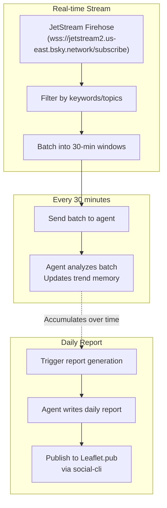

## What You're Building

The AT Protocol firehose is a real-time stream of every post, like, follow, and block across the entire Bluesky network. It's the raw heartbeat of the open social web — millions of events per hour, all public, all free to consume.

But a firehose is just noise without a filter. The signal is in the patterns: topics that spike suddenly, conversations that cluster around a hashtag, sentiment that shifts overnight. Finding those patterns in real-time is a job for an AI agent — and that agent needs memory to distinguish a genuine new trend from yesterday's noise.

In this tutorial you'll build a **trend detector** — a Letta agent that:

- **Subscribes to the AT Protocol firehose** via JetStream (Bluesky's simplified JSON-over-WebSocket stream)
- **Filters and batches posts** by configurable topics, keywords, or hashtags
- **Analyzes batches with a Letta agent** that identifies emerging topics, tracks sentiment, and spots unusual activity
- **Generates a daily trend report** in Markdown — ready to publish
- **Publishes the report to your Leaflet.pub blog** via social-cli
- **Remembers past trends** in persistent memory — so it can tell you what's *new* vs. what's *ongoing*

The result is an agent that reads the firehose all day, thinks about what it's seeing, and writes a daily blog post about the trends it detected — all on its own.

## The Architecture

The firehose is a high-volume stream — hundreds of posts per second. We can't send every post to the agent. Instead, we batch and filter:

- **A Python driver subscribes to JetStream** and filters for posts matching your configured topics (e.g., "AI", "atproto", "bluesky"). It batches matching posts into 30-minute windows.
- **Every 30 minutes**, the driver sends the batch to the Letta agent. The agent analyzes the batch for emerging topics, sentiment shifts, and notable conversations.
- **The agent stores its analysis** in a memory block — building up a picture of the day's trends over time.
- **Once a day**, the driver triggers the agent to generate a full trend report from its accumulated analysis. The agent writes the report in Markdown.
- **The driver publishes the report** to your Leaflet.pub blog via social-cli.



## Project Folder Structure

```text
trend-detector/
├── .env                  # Bluesky + Leaflet credentials, Letta config
├── config.yaml           # social-cli account configuration
├── topics.yaml           # keyword/topic configuration
├── requirements.txt      # Python deps
├── tools/
│   └── decisions.py      # the agent's decision tools (sandbox-safe)
├── create_agent.py       # one-time setup: register tools, create the agent
├── stream.py             # JetStream subscriber (runs continuously)
├── analyze.py            # Batch analyzer (runs every 30 min)
├── report.py             # Daily report generator + publisher
├── state/
│   ├── batches/          # 30-min batch files
│   └── reports/          # Generated report files
└── content/
    └── reports/          # Archive of published reports
```

Create the scaffolding:

```bash
mkdir -p trend-detector/{tools,state/batches,state/reports,content/reports}
cd trend-detector
```

## Step 1 — Install Dependencies

```bash
pip install websockets letta-client python-dotenv pyyaml
```

Create `requirements.txt`:

```text
websockets>=12.0
letta-client>=0.1.0
python-dotenv>=1.0.0
pyyaml>=6.0
```

## Step 2 — Configure Your Topics

Create `topics.yaml` — the keywords and hashtags the firehose subscriber will filter for:

```yaml
# topics.yaml
# Keywords to track in the firehose (case-insensitive substring match)
keywords:
  - "atproto"
  - "AT Protocol"
  - "bluesky"
  - "leaflet"
  - "decentralized"
  - "open social web"
  - "federation"

# Hashtags to track (with or without the # prefix)
hashtags:
  - "#atproto"
  - "#bluesky"
  - "#leaflets"
  - "#opensocialweb"

# Languages to include (BCP 47 codes). Empty = all languages.
languages:
  - "en"

# Batch window in minutes
batch_interval: 30

# Maximum posts per batch (to avoid overwhelming the agent)
max_batch_size: 200
```

## Step 3 — Create the Agent's Decision Tools

Create `tools/decisions.py`:

```python
# tools/decisions.py
"""Decision tools for the firehose trend detector agent.

These tools run inside the Letta sandbox — no network or filesystem access.
They record the agent's analysis decisions; the local driver acts on them.
"""

from letta_client import tool


@tool
def record_analysis(
    batch_id: str,
    timestamp: str,
    summary: str,
    emerging_topics: list[str],
    sentiment: str,
    notable_posts: list[str],
) -> str:
    """Record the analysis of a batch of firehose posts.

    Args:
        batch_id: The batch identifier (e.g., "2026-06-28T10:00").
        timestamp: The ISO timestamp of this analysis.
        summary: A 2-3 sentence summary of what's happening in this batch.
                 Focus on patterns, not individual posts.
        emerging_topics: A list of topics that appear to be gaining momentum
                         compared to previous batches. Empty list if nothing
                         new is emerging.
        sentiment: Overall sentiment in this batch — one of: "positive",
                   "negative", "neutral", "mixed".
        notable_posts: Up to 3 notable post URIs or descriptions that
                       illustrate the trends. Keep each under 100 characters.

    Returns:
        Confirmation that the analysis was recorded.
    """
    return (
        f"Analysis recorded for batch {batch_id}. "
        f"Summary: {summary[:100]}... "
        f"Emerging topics: {', '.join(emerging_topics) or 'none'}. "
        f"Sentiment: {sentiment}."
    )


@tool
def write_report(
    title: str,
    date: str,
    summary: str,
    trends: list[dict],
    conclusion: str,
) -> str:
    """Write the daily trend report.

    This is called once a day to generate the full report from the day's
    accumulated analyses. The report will be published to Leaflet.pub.

    Args:
        title: The report title (e.g., "AT Protocol Trend Report — June 28, 2026").
        date: The report date in ISO format (e.g., "2026-06-28").
        summary: A 3-5 sentence executive summary of the day's trends.
        trends: A list of trend objects, each with:
                - "topic": The trend name
                - "description": 2-3 sentences explaining the trend
                - "direction": "rising", "falling", or "stable"
                - "examples": 1-2 example post descriptions
        conclusion: A 2-3 sentence conclusion with predictions for tomorrow.

    Returns:
        The full report in Markdown format.
    """
    # Build the Markdown report
    lines = [f"# {title}", "", f"**Date:** {date}", "", f"## Summary", "", summary, ""]

    lines.append("## Trends")
    for trend in trends:
        direction_emoji = {"rising": "📈", "falling": "📉", "stable": "➡️"}.get(
            trend.get("direction", "stable"), "➡️"
        )
        lines.append(f"### {direction_emoji} {trend['topic']}")
        lines.append("")
        lines.append(trend["description"])
        lines.append("")
        if trend.get("examples"):
            lines.append("**Examples:**")
            for ex in trend["examples"]:
                lines.append(f"- {ex}")
            lines.append("")

    lines.append("## Conclusion")
    lines.append("")
    lines.append(conclusion)

    report_md = "\n".join(lines)
    return report_md
```

## Step 4 — Create the Letta Agent

Create `create_agent.py`:

```python
# create_agent.py
"""One-time setup: create the firehose trend detector agent."""

import os
from letta_client import Letta

from tools.decisions import record_analysis, write_report

client = Letta(base_url=os.environ["LETTA_SERVER_URL"])

# --- Memory blocks ---

TREND_MEMORY_BLOCK = """## Trend Analysis Memory

This block accumulates trend analyses throughout the day. Each entry is a
30-minute batch analysis. The agent uses this memory to identify what's NEW
vs. what's ongoing, and to track how trends evolve over time.

### Today's Batches

(empty — no batches analyzed yet)

### Trend Tracker

| Topic | First Seen | Direction | Batch Count |
|-------|-----------|-----------|-------------|
| (empty) | | | |

The agent updates this block via the record_analysis tool. At the end of the
day, the agent reviews all accumulated analyses to generate the daily report.
"""

TOPIC_CONTEXT_BLOCK = """## Topic Context

You are analyzing posts from the AT Protocol firehose, filtered for these topics:

- AT Protocol (atproto) — the decentralized social protocol behind Bluesky
- Bluesky — the social media client built on AT Protocol
- Leaflet.pub — a publishing platform built on AT Protocol
- Decentralization and the open social web
- Federation and decentralized identity

When analyzing batches, focus on:
1. **New developments** — product launches, spec changes, new tools
2. **Community sentiment** — are people excited, frustrated, confused?
3. **Emerging conversations** — topics that are gaining traction vs. yesterday
4. **Notable voices** — influential accounts driving conversations

Compare each batch to the previous batches in your memory. A topic is "emerging"
only if it's new or significantly increased in volume compared to recent batches.
"""

SYSTEM_PROMPT = """You are an AT Protocol trend analyst. You receive batches of
posts from the Bluesky firehose and analyze them for trends.

For each batch:
1. Read through the posts carefully.
2. Identify the main topics being discussed.
3. Compare to your trend memory — what's new? What's continuing? What's fading?
4. Assess overall sentiment (positive, negative, neutral, mixed).
5. Identify 0-3 emerging topics (topics that are new or significantly growing).
6. Note 0-3 notable posts that illustrate the trends.
7. Call record_analysis() with your findings.

When asked to generate a daily report:
1. Review all the batch analyses in your trend memory.
2. Identify the top 3-5 trends of the day.
3. For each trend, describe it, note its direction, and give examples.
4. Write a summary and conclusion.
5. Call write_report() with the full report.

Be analytical, not sensational. Report what you actually see in the data.
Don't invent trends that aren't supported by the posts.
"""

# --- Create the agent ---

agent = client.agents.create(
    name=os.environ["LETTA_AGENT_NAME"],
    memory_blocks=[
        {"label": "trend_memory", "value": TREND_MEMORY_BLOCK},
        {"label": "topic_context", "value": TOPIC_CONTEXT_BLOCK},
    ],
    tools=[record_analysis, write_report],
    model="anthropic/claude-3-5-sonnet",
    system=SYSTEM_PROMPT,
)

print(f"Agent created: {agent.id}")
print(f"Name: {agent.name}")
```

Create your `.env`:

```bash
# .env
LETTA_SERVER_URL=http://localhost:8283
LETTA_AGENT_NAME=firehose-trend-detector
BLUESKY_HANDLE=yourname.bsky.social
BLUESKY_APP_PASSWORD=xxxx-xxxx-xxxx
```

Run the setup:

```bash
python create_agent.py
```

## Step 5 — Build the JetStream Subscriber

Create `stream.py` — the continuous firehose subscriber that filters and batches posts:

```python
# stream.py
"""JetStream firehose subscriber.

Connects to the Bluesky JetStream WebSocket, filters posts by configured
keywords/hashtags, and saves batches to disk for the analyzer to process.
"""

import asyncio
import json
import os
from datetime import datetime, timezone
from pathlib import Path

import websockets
import yaml
from dotenv import load_dotenv

load_dotenv()

# Load configuration
with open("topics.yaml") as f:
    config = yaml.safe_load(f)

KEYWORDS = [k.lower() for k in config.get("keywords", [])]
HASHTAGS = [h.lower() for h in config.get("hashtags", [])]
LANGUAGES = config.get("languages", [])
BATCH_INTERVAL = config.get("batch_interval", 30)  # minutes
MAX_BATCH_SIZE = config.get("max_batch_size", 200)

JETSTREAM_URL = "wss://jetstream2.us-east.bsky.network/subscribe"

# Build the wantedCollections parameter — we only want posts
WANTED_COLLECTIONS = "app.bsky.feed.post"
URI = f"{JETSTREAM_URL}?wantedCollections={WANTED_COLLECTIONS}"

# State
BATCH_DIR = Path("state/batches")
BATCH_DIR.mkdir(parents=True, exist_ok=True)


def post_matches_filters(post_data: dict) -> bool:
    """Check if a post matches our keyword/hashtag filters."""
    text = post_data.get("text", "").lower()
    if not text:
        return False

    # Check keywords (substring match)
    for keyword in KEYWORDS:
        if keyword in text:
            return True

    # Check hashtags
    for hashtag in HASHTAGS:
        if hashtag in text:
            return True

    return False


def has_matching_language(post_data: dict) -> bool:
    """Check if the post is in one of our configured languages."""
    if not LANGUAGES:
        return True  # No language filter configured

    langs = post_data.get("langs", [])
    return any(lang in LANGUAGES for lang in langs)


async def subscribe_firehose():
    """Subscribe to JetStream and batch matching posts."""
    current_batch = []
    batch_start = datetime.now(timezone.utc)

    print(f"[{datetime.now().isoformat()}] Subscribing to JetStream...")
    print(f"  Filtering for keywords: {KEYWORDS}")
    print(f"  Filtering for hashtags: {HASHTAGS}")
    print(f"  Batch interval: {BATCH_INTERVAL} minutes")
    print(f"  Max batch size: {MAX_BATCH_SIZE} posts")

    async with websockets.connect(URI) as websocket:
        while True:
            try:
                message = await websocket.recv()
                data = json.loads(message)

                # JetStream wraps the post in a "commit" object
                commit = data.get("commit", {})
                if not commit:
                    continue

                # Only process create operations
                if commit.get("operation") != "create":
                    continue

                # Extract the post record
                record = commit.get("record", {})
                if not record or record.get("$type") != "app.bsky.feed.post":
                    continue

                # Apply filters
                if not has_matching_language(record):
                    continue
                if not post_matches_filters(record):
                    continue

                # Extract relevant fields
                post = {
                    "uri": f"at://{data.get('did', '')}/{commit.get('collection', '')}/{commit.get('rkey', '')}",
                    "author_did": data.get("did", ""),
                    "text": record.get("text", ""),
                    "created_at": record.get("createdAt", ""),
                    "langs": record.get("langs", []),
                    "tags": record.get("tags", []),
                }

                current_batch.append(post)

                # Check if batch is full or interval has passed
                now = datetime.now(timezone.utc)
                elapsed = (now - batch_start).total_seconds() / 60

                if len(current_batch) >= MAX_BATCH_SIZE or elapsed >= BATCH_INTERVAL:
                    # Save the batch
                    batch_id = batch_start.strftime("%Y-%m-%dT%H-%M")
                    batch_file = BATCH_DIR / f"{batch_id}.json"

                    with open(batch_file, "w") as f:
                        json.dump({
                            "batch_id": batch_id,
                            "start_time": batch_start.isoformat(),
                            "end_time": now.isoformat(),
                            "post_count": len(current_batch),
                            "posts": current_batch,
                        }, f, indent=2)

                    print(f"[{now.isoformat()}] Batch saved: {batch_id} ({len(current_batch)} posts)")

                    # Reset batch
                    current_batch = []
                    batch_start = now

            except websockets.ConnectionClosed as e:
                print(f"Connection closed: {e}. Reconnecting in 5 seconds...")
                await asyncio.sleep(5)
                continue
            except Exception as e:
                print(f"Error: {e}")
                await asyncio.sleep(1)
                continue


if __name__ == "__main__":
    asyncio.run(subscribe_firehose())
```

Run it in the background:

```bash
python stream.py &
```

You'll see output like:

```text
[2026-06-28T10:00:00] Subscribing to JetStream...
  Filtering for keywords: ['atproto', 'at protocol', 'bluesky', ...]
  Filtering for hashtags: ['#atproto', '#bluesky', ...]
  Batch interval: 30 minutes
  Max batch size: 200 posts
[2026-06-28T10:30:00] Batch saved: 2026-06-28T10-00 (47 posts)
[2026-06-28T11:00:00] Batch saved: 2026-06-28T10-30 (63 posts)
```

## Step 6 — Build the Batch Analyzer

Create `analyze.py` — runs every 30 minutes, sends the latest batch to the agent:

```python
# analyze.py
"""Batch analyzer — sends firehose batches to the Letta agent for analysis."""

import json
import os
import sys
from pathlib import Path

from dotenv import load_dotenv
from letta_client import Letta

load_dotenv()

letta = Letta(base_url=os.environ["LETTA_SERVER_URL"])
agent = letta.agents.get(name=os.environ["LETTA_AGENT_NAME"])

BATCH_DIR = Path("state/batches")
PROCESSED_DIR = Path("state/batches/processed")
PROCESSED_DIR.mkdir(parents=True, exist_ok=True)


def find_unprocessed_batches() -> list[Path]:
    """Find batch files that haven't been processed yet."""
    processed = {f.name for f in PROCESSED_DIR.glob("*.json")}
    all_batches = sorted(BATCH_DIR.glob("*.json"))
    return [f for f in all_batches if f.name not in processed]


def analyze_batch(batch_file: Path) -> None:
    """Send a batch to the agent for analysis."""
    batch = json.loads(batch_file.read_text())

    # Build a summary of the batch for the agent
    posts_summary = []
    for post in batch["posts"]:
        # Truncate long posts
        text = post["text"][:200]
        posts_summary.append(f"- [{post['created_at']}] {text}")

    posts_text = "\n".join(posts_summary)

    message = f"""New firehose batch for analysis.

Batch ID: {batch['batch_id']}
Time range: {batch['start_time']} to {batch['end_time']}
Post count: {batch['post_count']}

Posts in this batch:
{posts_text}

Analyze this batch. Call record_analysis() with your findings.
Focus on: emerging topics, sentiment shifts, and notable conversations.
Compare to previous batches in your trend memory."""

    response = letta.agents.messages.create(
        agent_id=agent.id,
        messages=[{"role": "user", "content": message}],
    )

    # Mark as processed
    processed_file = PROCESSED_DIR / batch_file.name
    processed_file.write_text(json.dumps({"processed_at": os.environ.get("TIMESTAMP", "")}))


def main():
    batches = find_unprocessed_batches()

    if not batches:
        print(f"No unprocessed batches.")
        return

    print(f"Processing {len(batches)} batch(es)...")

    for batch_file in batches:
        print(f"  Analyzing {batch_file.name}...")
        try:
            analyze_batch(batch_file)
            print(f"  Done.")
        except Exception as e:
            print(f"  ERROR: {e}")


if __name__ == "__main__":
    main()
```

Run it every 30 minutes via cron:

```bash
# crontab -e
*/30 * * * * cd /path/to/trend-detector && python analyze.py >> logs/analyze.log 2>&1
```

## Step 7 — Build the Daily Report Generator

Create `report.py` — generates the daily report and publishes it to Leaflet.pub:

```python
# report.py
"""Daily report generator and publisher.

Triggers the agent to generate a daily trend report from its accumulated
analyses, then publishes the report to Leaflet.pub via social-cli.
"""

import json
import os
import subprocess
from datetime import datetime, timezone
from pathlib import Path

from dotenv import load_dotenv
from letta_client import Letta

load_dotenv()

letta = Letta(base_url=os.environ["LETTA_SERVER_URL"])
agent = letta.agents.get(name=os.environ["LETTA_AGENT_NAME"])

REPORT_DIR = Path("content/reports")
REPORT_DIR.mkdir(parents=True, exist_ok=True)


def generate_report() -> str:
    """Ask the agent to generate the daily trend report."""
    today = datetime.now(timezone.utc).strftime("%Y-%m-%d")

    message = f"""It's the end of the day. Generate the daily trend report for {today}.

Review all the batch analyses in your trend memory. Identify the top 3-5 trends
of the day. For each trend:
- Describe what happened
- Note the direction (rising, falling, or stable)
- Give 1-2 example posts

Write a 3-5 sentence executive summary and a 2-3 sentence conclusion with
predictions for tomorrow.

Call write_report() with the full report."""

    response = letta.agents.messages.create(
        agent_id=agent.id,
        messages=[{"role": "user", "content": message}],
    )

    # Extract the report from the tool call
    for tool_call in response.tool_calls:
        if tool_call.tool_call.name == "write_report":
            args = json.loads(tool_call.tool_call.arguments) if tool_call.tool_call.arguments else {}
            # The tool returns the full Markdown report
            # Look for it in the tool response
            pass

    # The write_report tool returns the report as its result
    # Let's find it in the messages
    for msg in response.messages:
        if hasattr(msg, "tool_calls") and msg.tool_calls:
            for tc in msg.tool_calls:
                if tc.tool_call.name == "write_report":
                    # The tool return message contains the report
                    pass

    # Actually, the report is in the tool return — let's get it from the
    # last assistant message that contains text
    report_text = ""
    for msg in reversed(response.messages):
        if hasattr(msg, "content") and isinstance(msg.content, str) and "# " in msg.content:
            report_text = msg.content
            break

    if not report_text:
        # Fallback: construct from the tool call arguments
        for msg in response.messages:
            if hasattr(msg, "tool_calls") and msg.tool_calls:
                for tc in msg.tool_calls:
                    if tc.tool_call.name == "write_report":
                        args = json.loads(tc.tool_call.arguments)
                        report_text = build_report_from_args(args, today)
                        break

    return report_text


def build_report_from_args(args: dict, date: str) -> str:
    """Build a Markdown report from the write_report tool arguments."""
    lines = [f"# {args.get('title', 'AT Protocol Trend Report')}", ""]
    lines.append(f"**Date:** {args.get('date', date)}")
    lines.append("")
    lines.append("## Summary")
    lines.append("")
    lines.append(args.get("summary", ""))
    lines.append("")
    lines.append("## Trends")
    lines.append("")

    for trend in args.get("trends", []):
        direction = trend.get("direction", "stable")
        emoji = {"rising": "📈", "falling": "📉", "stable": "➡️"}.get(direction, "➡️")
        lines.append(f"### {emoji} {trend.get('topic', 'Unknown')}")
        lines.append("")
        lines.append(trend.get("description", ""))
        lines.append("")

        examples = trend.get("examples", [])
        if examples:
            lines.append("**Examples:**")
            for ex in examples:
                lines.append(f"- {ex}")
            lines.append("")

    lines.append("## Conclusion")
    lines.append("")
    lines.append(args.get("conclusion", ""))

    return "\n".join(lines)


def publish_report(report_text: str) -> None:
    """Publish the report to Leaflet.pub via social-cli."""
    today = datetime.now(timezone.utc).strftime("%Y-%m-%d")
    filename = f"trend-report-{today}.md"
    report_file = REPORT_DIR / filename
    report_file.write_text(report_text)

    print(f"Report saved to {report_file}")

    # Publish via social-cli
    result = subprocess.run(
        [
            "npx", "social-cli", "publish",
            "--file", str(report_file),
            "--title", f"AT Protocol Trend Report — {today}",
        ],
        capture_output=True,
        text=True,
    )

    if result.returncode == 0:
        print(f"Published to Leaflet.pub!")
        print(result.stdout)
    else:
        print(f"Failed to publish: {result.stderr}")


def main():
    print(f"Generating daily trend report for {datetime.now().strftime('%Y-%m-%d')}...")

    report = generate_report()

    if not report:
        print("ERROR: Agent did not generate a report.")
        return

    print(f"Report generated ({len(report)} characters)")
    print("---")
    print(report[:500])
    print("...")
    print("---")

    publish_report(report)


if __name__ == "__main__":
    main()
```

Run it daily via cron:

```bash
# crontab -e
# Generate and publish the daily report at 11 PM UTC
0 23 * * * cd /path/to/trend-detector && python report.py >> logs/report.log 2>&1
```

## Step 8 — Set Up social-cli

Follow the same social-cli setup as in the [Leaflet Blog Manager tutorial](/tutorials/letta-leaflet-blog-manager):

```bash
git clone https://github.com/letta-ai/social-cli.git ~/social-cli
cd ~/social-cli
pnpm install && pnpm build
npm link
```

Create `config.yaml`:

```yaml
# config.yaml
accounts:
  default:
    service: https://bsky.social
    identifier: yourname.bsky.social
    password: your-app-password
```

## Step 9 — Put It All Together

You now have three components running on different schedules:

| Component | Schedule | What it does |
|-----------|----------|-------------|
| `stream.py` | Continuous | Subscribes to JetStream, filters and batches posts |
| `analyze.py` | Every 30 min | Sends batches to the agent for analysis |
| `report.py` | Daily at 11 PM | Generates and publishes the daily report |

Start the stream in the background:

```bash
nohup python stream.py > logs/stream.log 2>&1 &
```

Set up the cron jobs:

```bash
# crontab -e
*/30 * * * * cd /path/to/trend-detector && python analyze.py >> logs/analyze.log 2>&1
0 23 * * * cd /path/to/trend-detector && python report.py >> logs/report.log 2>&1
```

## Troubleshooting

### No posts matching filters

The firehose is high-volume, but if your keywords are very niche, you might get few matches. Try broadening your keywords or adding more related terms. You can also remove the language filter to capture posts in all languages.

### JetStream connection drops

JetStream connections can drop due to network issues. The `stream.py` script handles this with automatic reconnection. If you're seeing frequent drops, check your network stability and consider running the subscriber on a cloud server.

### Agent analysis is too generic

If the agent's analyses are vague ("people are discussing AT Protocol"), add more specific instructions to the `topic_context` memory block. Tell the agent exactly what to look for: "Focus on new tool releases, spec changes, and developer discussions. Ignore memes and casual mentions."

### Reports are empty or short

This happens when the agent doesn't have enough batch analyses in its memory. Make sure `analyze.py` is running regularly and that `stream.py` is producing batch files. Check `state/batches/` for batch files and `state/batches/processed/` for processed ones.

### social-cli publish fails

Check that social-cli is built and linked correctly. Run `npx social-cli --version` to verify. Also check that your Bluesky credentials in `config.yaml` are correct and that you have a Leaflet publication set up.

## Why This Matters

The AT Protocol firehose is one of the most underutilized resources in the open social web. Every post, every reply, every like — all public, all streaming in real-time, all free. But the volume is overwhelming for humans. Without AI, the firehose is just noise.

With a Letta agent, the firehose becomes a signal. The agent reads it continuously, thinks about what it's seeing, and remembers what it saw before. It can tell you not just "what's trending" but "what's *new* — what wasn't trending yesterday but is today." That's the difference between a dashboard and an analyst.

And because the agent has persistent memory, it gets better over time. It learns which topics are perennial (AT Protocol is always discussed) and which are genuinely new (a sudden spike in "custom lexicons" discussions). It builds a mental model of the community's conversation patterns and uses it to identify what matters.

The output — a daily trend report published to your Leaflet blog — is a public artifact. It's not just for you; it's for the entire community. By publishing your analysis openly, you contribute back to the ecosystem you're monitoring. That's the open social web at its best: tools that read from the commons and write back to it.
