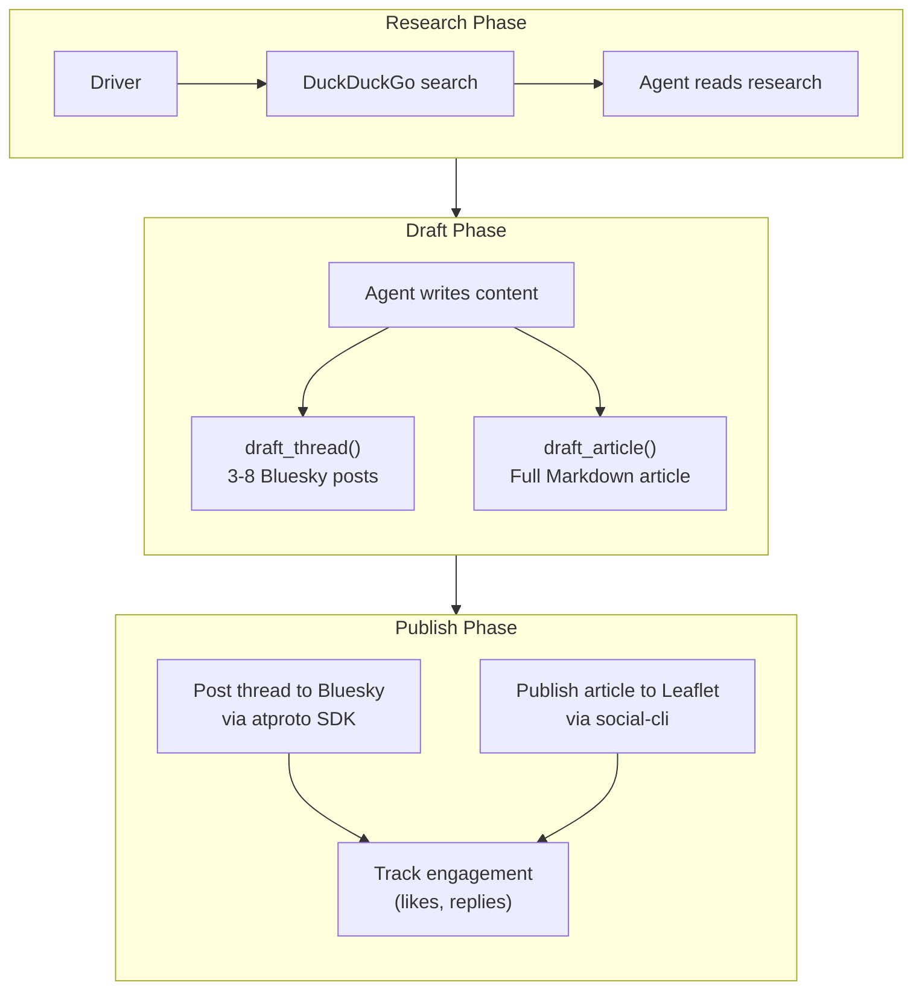

## What You're Building

Content creators face a fundamental tension: every platform wants different content. Bluesky wants short, punchy posts. Leaflet wants long-form articles. Your newsletter wants something in between. Writing for all of them manually means either writing three separate pieces (exhausting) or cross-posting the same thing (ineffective on at least two of the three platforms).

What if you could give an agent a single topic and have it produce content tailored for each platform — automatically, in your voice, with research backing it up?

In this tutorial you'll build a **cross-platform content publisher** — a Letta agent that:

- **Takes a topic** (from a content calendar, a CLI argument, or a scheduled trigger)
- **Researches the topic** on the web using DuckDuckGo
- **Writes a Bluesky thread** — 3-8 connected posts, each under 300 characters, with a hook, body, and call-to-action
- **Writes a Leaflet article** — a full-length, well-structured Markdown article with headers, code examples, and a conclusion
- **Publishes both** via the AT Protocol — the thread goes to Bluesky's `app.bsky.feed.post` collection, the article goes to Leaflet's `site.standard.document` collection
- **Remembers your voice** in persistent memory — so every piece of content sounds like you, not like an AI
- **Tracks engagement** — after publishing, it fetches likes and replies on the Bluesky thread and stores the results in memory, learning what resonates with your audience

The result is an agent that takes "write about X" and produces a coordinated content drop across two platforms — all in your voice, all backed by research, all published automatically.

## The Architecture

The same brain-hands pattern from the [Leaflet Blog Manager](/tutorials/letta-leaflet-blog-manager) tutorial applies here, but with a twist: the agent produces **two different outputs** from a single research session, and the driver publishes to **two different AT Protocol surfaces**.

- **The Letta agent is the brain.** It holds your voice, content strategy, and engagement history in memory blocks. Its tools record decisions — `draft_thread`, `draft_article`, `log_publication`. The agent researches the topic, then writes both formats.
- **A local Python driver is the hands.** It does web research (DuckDuckGo), sends research to the agent, collects the drafted thread and article, and publishes both via the `atproto` SDK (for Bluesky) and `social-cli` (for Leaflet).
- **A content calendar** (YAML) tracks each topic through the pipeline: `proposed` → `researched` → `drafted` → `published`.



## Project Folder Structure

```text
cross-publisher/
├── .env                  # Bluesky + Leaflet credentials, Letta config
├── config.yaml           # social-cli account configuration
├── calendar.yaml         # content calendar (topics, status, files)
├── requirements.txt      # Python deps
├── tools/
│   └── decisions.py      # the agent's decision tools (sandbox-safe)
├── create_agent.py       # one-time setup: register tools, create the agent
├── publisher.py          # the main driver (research, draft, publish)
├── state/
│   └── social-cli/       # social-cli state
└── content/
    ├── threads/          # Archive of published Bluesky threads
    └── articles/         # Archive of published Leaflet articles
```

Create the scaffolding:

```bash
mkdir -p cross-publisher/{tools,state/social-cli,content/threads,content/articles}
cd cross-publisher
```

## Step 1 — Install Dependencies

```bash
pip install atproto letta-client python-dotenv pyyaml duckduckgo-search
```

Create `requirements.txt`:

```text
atproto>=0.0.67
letta-client>=0.1.0
python-dotenv>=1.0.0
pyyaml>=6.0
duckduckgo-search>=6.0.0
```

## Step 2 — Set Up Credentials

Create a `.env` file:

```bash
# .env
BLUESKY_HANDLE=yourname.bsky.social
BLUESKY_APP_PASSWORD=xxxx-xxxx-xxxx
LETTA_SERVER_URL=http://localhost:8283
LETTA_AGENT_NAME=cross-publisher
```

Set up social-cli for Leaflet publishing (same as the [Leaflet Blog Manager tutorial](/tutorials/letta-leaflet-blog-manager)):

```bash
git clone https://github.com/letta-ai/social-cli.git ~/social-cli
cd ~/social-cli && pnpm install && pnpm build && npm link
```

Create `config.yaml`:

```yaml
# config.yaml
accounts:
  default:
    service: https://bsky.social
    identifier: yourname.bsky.social
    password: your-app-password
```

## Step 3 — Create the Agent's Decision Tools

Create `tools/decisions.py`:

```python
# tools/decisions.py
"""Decision tools for the cross-platform content publisher agent.

These tools run inside the Letta sandbox — no network or filesystem access.
They record the agent's content decisions; the local driver acts on them.
"""

from letta_client import tool


@tool
def draft_thread(posts: list[str]) -> str:
    """Draft a Bluesky thread (a series of connected posts).

    Args:
        posts: A list of post texts, in order. Each post must be under 300
               characters. The first post should be a hook that grabs attention.
               The middle posts should deliver value. The last post should
               have a call-to-action (link to the full article, question, etc.).
               Aim for 3-8 posts total.

    Returns:
        Confirmation with the thread structure.
    """
    issues = []
    for i, post in enumerate(posts):
        if len(post) > 300:
            issues.append(f"Post {i+1}: too long ({len(post)} chars, max 300)")

    if issues:
        return "Thread has issues:\n" + "\n".join(issues)

    return f"Thread drafted: {len(posts)} posts. Total chars: {sum(len(p) for p in posts)}."


@tool
def draft_article(title: str, markdown: str) -> str:
    """Draft a full-length Leaflet article in Markdown.

    Args:
        title: The article title.
        markdown: The full article in Markdown. Should include:
                  - A compelling introduction (2-3 paragraphs)
                  - 3-5 sections with headers (##)
                  - Code examples where relevant
                  - A conclusion with a call-to-action
                  Aim for 800-1500 words.

    Returns:
        Confirmation with the article stats.
    """
    word_count = len(markdown.split())
    return f"Article drafted: '{title}' ({word_count} words, {len(markdown)} chars)."


@tool
def log_publication(
    topic: str,
    thread_uri: str,
    article_url: str,
    notes: str,
) -> str:
    """Log a publication event for future reference.

    Args:
        topic: The topic that was published about.
        thread_uri: The AT URI of the Bluesky thread's root post.
        article_url: The URL of the published Leaflet article.
        notes: Brief notes about this publication (e.g., "Thread focused on
               practical tips, article went deep on architecture"). Under 200 chars.

    Returns:
        Confirmation that the publication was logged.
    """
    return f"Publication logged for '{topic}': thread={thread_uri}, article={article_url}"


@tool
def record_engagement(
    thread_uri: str,
    likes: int,
    replies: int,
    reposts: int,
    top_reply: str,
) -> str:
    """Record engagement metrics for a published thread.

    This is called after the thread has been live for a while. The agent
    uses this data to learn what content resonates with the audience.

    Args:
        thread_uri: The AT URI of the thread's root post.
        likes: Number of likes on the root post.
        replies: Number of replies to the thread.
        reposts: Number of reposts of the root post.
        top_reply: The text of the most-liked reply (if any). Empty string if none.

    Returns:
        Confirmation that engagement was recorded.
    """
    return (
        f"Engagement recorded for {thread_uri}: "
        f"{likes} likes, {replies} replies, {reposts} reposts."
    )
```

## Step 4 — Create the Letta Agent

Create `create_agent.py`:

```python
# create_agent.py
"""One-time setup: create the cross-platform content publisher agent."""

import os
from letta_client import Letta

from tools.decisions import draft_thread, draft_article, log_publication, record_engagement

client = Letta(base_url=os.environ["LETTA_SERVER_URL"])

# --- Memory blocks ---

VOICE_BLOCK = """## Voice & Style

You write as @{{BLUESKY_HANDLE}}. Your voice across all platforms:

**Bluesky threads:**
- Hook in the first post — a question, a surprising stat, or a bold claim
- Each post should be self-contained but flow into the next
- Use line breaks within posts for readability
- End with a call-to-action: link to the full article, a question, or a challenge
- No threadbait ("🧵" at the start) — let the content speak for itself
- 3-8 posts per thread. If you can't fit it in 8, the article will cover the rest.

**Leaflet articles:**
- Start with a concrete scenario, not an abstract introduction
- Use headers (##) to break up sections
- Include code examples where relevant — readers want to copy-paste
- End with a "What You Can Do Next" section, not a generic conclusion
- 800-1500 words. Long enough to be valuable, short enough to read in one sitting.

**Cross-platform consistency:**
- The thread and article should cover the same topic but not repeat each other
- The thread is the appetizer; the article is the main course
- The thread should make people WANT to read the article
- The article should deliver on whatever the thread promised
"""

CONTENT_STRATEGY_BLOCK = """## Content Strategy

You publish about:
- AT Protocol and Bluesky development
- AI agents and autonomous systems
- The open social web and decentralization
- Developer tools and workflows

Your audience:
- Developers building on the AT Protocol
- Technical founders exploring decentralized social
- AI engineers interested in agent architectures

Your content goals:
- Educate — teach people how to build on the open social web
- Inspire — show what's possible with AT Protocol + AI agents
- Build community — every piece should invite discussion

Publishing cadence: 2-3 pieces per week. Each piece = 1 thread + 1 article.
"""

ENGAGEMENT_LOG_BLOCK = """## Engagement Log

This block tracks engagement on published threads. The agent uses this
to learn what content resonates with the audience.

| Date | Topic | Likes | Replies | Reposts | Top Reply |
|------|-------|-------|---------|---------|-----------|
| (empty — no publications yet) | | | | | |

Patterns to look for:
- Which topics get the most engagement?
- Do threads with questions get more replies?
- Do threads with code examples get more reposts?
- What time of day gets the best engagement?
"""

SYSTEM_PROMPT = """You are a cross-platform content publisher. You take a topic,
review research, and produce two pieces of content: a Bluesky thread and a
Leaflet article.

For each topic:
1. Read the research carefully.
2. Plan the thread: what's the hook? What are the key points? What's the CTA?
3. Plan the article: what sections will it have? What code examples? What conclusion?
4. Call draft_thread() with the thread posts (3-8 posts, each under 300 chars).
5. Call draft_article() with the full Markdown article.
6. Call log_publication() to record the publication.

The thread and article should cover the same topic but serve different purposes:
- The thread is a teaser — it should make people want to read the article
- The article is the deep dive — it should deliver on the thread's promise

Always write in the voice defined in your memory blocks. Be authentic,
technical, and helpful. Don't use marketing language.
"""

# --- Create the agent ---

agent = client.agents.create(
    name=os.environ["LETTA_AGENT_NAME"],
    memory_blocks=[
        {"label": "voice", "value": VOICE_BLOCK},
        {"label": "content_strategy", "value": CONTENT_STRATEGY_BLOCK},
        {"label": "engagement_log", "value": ENGAGEMENT_LOG_BLOCK},
    ],
    tools=[draft_thread, draft_article, log_publication, record_engagement],
    model="anthropic/claude-3-5-sonnet",
    system=SYSTEM_PROMPT,
)

print(f"Agent created: {agent.id}")
print(f"Name: {agent.name}")
```

Run it:

```bash
python create_agent.py
```

## Step 5 — Build the Content Calendar

Create `calendar.yaml`:

```yaml
# calendar.yaml
# Content calendar for the cross-platform publisher.
# The driver reads this file to find topics to work on.

topics:
  - id: "atproto-custom-feeds"
    title: "Building Custom Feeds on the AT Protocol"
    status: "proposed"  # proposed → researched → drafted → published
    keywords: ["atproto", "custom feeds", "feed generator", "bluesky"]
    thread_file: null
    article_file: null
    published_at: null

  - id: "letta-memory-architecture"
    title: "How Letta's Memory Architecture Works"
    status: "proposed"
    keywords: ["letta", "memory blocks", "agent memory", "persistent context"]
    thread_file: null
    article_file: null
    published_at: null

  - id: "bluesky-firehose-practical-guide"
    title: "A Practical Guide to the Bluesky Firehose"
    status: "proposed"
    keywords: ["firehose", "jetstream", "atproto", "real-time streaming"]
    thread_file: null
    article_file: null
    published_at: null
```

## Step 6 — Build the Publisher Driver

Create `publisher.py` — the main driver that orchestrates research, drafting, and publishing:

```python
# publisher.py
"""Cross-platform content publisher driver.

Reads the content calendar, finds the next topic to work on, researches it,
sends the research to the Letta agent for drafting, then publishes the
thread to Bluesky and the article to Leaflet.
"""

import json
import os
import subprocess
import sys
from datetime import datetime, timezone
from pathlib import Path

import yaml
from dotenv import load_dotenv
from duckduckgo_search import DDGS
from letta_client import Letta

load_dotenv()

# --- Clients ---

letta = Letta(base_url=os.environ["LETTA_SERVER_URL"])
agent = letta.agents.get(name=os.environ["LETTA_AGENT_NAME"])

# --- Bluesky client (lazy import) ---

_bsky = None


def get_bsky():
    global _bsky
    if _bsky is None:
        from atproto import Client
        _bsky = Client()
        _bsky.login(
            os.environ["BLUESKY_HANDLE"],
            os.environ["BLUESKY_APP_PASSWORD"],
        )
    return _bsky


# --- Calendar ---

CALENDAR_FILE = Path("calendar.yaml")


def load_calendar() -> dict:
    return yaml.safe_load(CALENDAR_FILE.read_text())


def save_calendar(calendar: dict) -> None:
    CALENDAR_FILE.write_text(yaml.dump(calendar, default_flow_style=False))


def find_next_topic(calendar: dict) -> dict | None:
    """Find the next topic that needs work."""
    for topic in calendar["topics"]:
        if topic["status"] == "proposed":
            return topic
    return None


# --- Research ---

def research_topic(topic: dict) -> str:
    """Research a topic using DuckDuckGo and return the results."""
    keywords = topic.get("keywords", [topic["title"]])
    results = []

    for keyword in keywords[:3]:  # Limit to 3 keywords
        with DDGS() as ddgs:
            for r in ddgs.text(keyword, max_results=5):
                results.append({
                    "title": r["title"],
                    "body": r["body"],
                    "href": r["href"],
                })

    # Format the research for the agent
    research_text = f"Research for topic: {topic['title']}\n\n"
    for i, r in enumerate(results, 1):
        research_text += f"### Source {i}: {r['title']}\n"
        research_text += f"URL: {r['href']}\n"
        research_text += f"Summary: {r['body']}\n\n"

    return research_text


# --- Process topic through the agent ---

def process_topic(topic: dict, research: str) -> dict:
    """Send the topic and research to the agent for drafting."""
    message = f"""Topic: {topic['title']}
Topic ID: {topic['id']}

Research:
{research}

Based on this research, draft a Bluesky thread and a Leaflet article.

1. Call draft_thread() with 3-8 posts for the Bluesky thread.
   - Each post must be under 300 characters.
   - First post: a hook that grabs attention.
   - Middle posts: key insights from the research.
   - Last post: call-to-action pointing to the full article.

2. Call draft_article() with the full Markdown article.
   - 800-1500 words.
   - Include headers, code examples, and a conclusion.

3. Call log_publication() to record the publication.

Write in the voice defined in your memory blocks."""

    response = letta.agents.messages.create(
        agent_id=agent.id,
        messages=[{"role": "user", "content": message}],
    )

    # Extract the thread and article from the tool calls
    result = {"thread_posts": [], "article_title": "", "article_markdown": ""}

    for msg in response.messages:
        if not hasattr(msg, "tool_calls") or not msg.tool_calls:
            continue

        for tc in msg.tool_calls:
            name = tc.tool_call.name
            args = json.loads(tc.tool_call.arguments) if tc.tool_call.arguments else {}

            if name == "draft_thread":
                result["thread_posts"] = args.get("posts", [])
            elif name == "draft_article":
                result["article_title"] = args.get("title", topic["title"])
                result["article_markdown"] = args.get("markdown", "")

    return result


# --- Publish to Bluesky ---

def publish_thread(posts: list[str]) -> str:
    """Publish a thread to Bluesky and return the root post URI."""
    bsky = get_bsky()

    if not posts:
        raise ValueError("Thread is empty")

    # Create the root post
    root_record = bsky.app.bsky.feed.post.create(
        bsky.me.did,
        models.AppBskyFeedPost.Record(
            text=posts[0],
            created_at=bsky.get_current_time_iso(),
        ),
    )

    root_uri = str(root_record.uri)
    root_cid = str(root_record.cid)

    # Create reply posts
    parent_uri = root_uri
    parent_cid = root_cid

    for post_text in posts[1:]:
        from atproto import models

        reply_ref = models.AppBskyFeedPost.ReplyRef(
            root=models.AppBskyFeedPost.ReplyRef.Root(
                uri=root_uri,
                cid=root_cid,
            ),
            parent=models.AppBskyFeedPost.ReplyRef.Parent(
                uri=parent_uri,
                cid=parent_cid,
            ),
        )

        reply_record = bsky.app.bsky.feed.post.create(
            bsky.me.did,
            models.AppBskyFeedPost.Record(
                text=post_text,
                reply=reply_ref,
                created_at=bsky.get_current_time_iso(),
            ),
        )

        parent_uri = str(reply_record.uri)
        parent_cid = str(reply_record.cid)

    return root_uri


# --- Publish to Leaflet ---

def publish_article(title: str, markdown: str, topic_id: str) -> str:
    """Publish an article to Leaflet.pub via social-cli."""
    article_file = Path(f"content/articles/{topic_id}.md")
    article_file.parent.mkdir(parents=True, exist_ok=True)
    article_file.write_text(f"# {title}\n\n{markdown}")

    result = subprocess.run(
        [
            "npx", "social-cli", "publish",
            "--file", str(article_file),
            "--title", title,
        ],
        capture_output=True,
        text=True,
    )

    if result.returncode != 0:
        print(f"  social-cli error: {result.stderr}")
        return ""

    # Parse the URL from social-cli output
    # The output typically contains the publication URL
    url = ""
    for line in result.stdout.splitlines():
        if "leaflet.pub" in line or "http" in line:
            url = line.strip()
            break

    return url


# --- Main ---

def main():
    topic_id = sys.argv[1] if len(sys.argv) > 1 else None

    calendar = load_calendar()

    # Find the topic to work on
    topic = None
    if topic_id:
        for t in calendar["topics"]:
            if t["id"] == topic_id:
                topic = t
                break
    else:
        topic = find_next_topic(calendar)

    if not topic:
        print("No topics to process. Add topics to calendar.yaml.")
        return

    print(f"Processing topic: {topic['title']}")
    print(f"  Status: {topic['status']}")

    # Step 1: Research
    print("  Researching...")
    research = research_topic(topic)
    print(f"  Research complete ({len(research)} chars)")

    # Update calendar
    topic["status"] = "researched"
    save_calendar(calendar)

    # Step 2: Draft (agent writes thread + article)
    print("  Sending to agent for drafting...")
    result = process_topic(topic, research)

    if not result["thread_posts"] or not result["article_markdown"]:
        print("  ERROR: Agent did not produce both thread and article.")
        return

    print(f"  Thread: {len(result['thread_posts'])} posts")
    print(f"  Article: '{result['article_title']}' ({len(result['article_markdown'])} chars)")

    # Update calendar
    topic["status"] = "drafted"
    save_calendar(calendar)

    # Step 3: Publish thread to Bluesky
    print("  Publishing thread to Bluesky...")
    try:
        thread_uri = publish_thread(result["thread_posts"])
        print(f"  Thread published: {thread_uri}")
    except Exception as e:
        print(f"  ERROR publishing thread: {e}")
        return

    # Step 4: Publish article to Leaflet
    print("  Publishing article to Leaflet...")
    article_url = publish_article(
        result["article_title"],
        result["article_markdown"],
        topic["id"],
    )

    if article_url:
        print(f"  Article published: {article_url}")
    else:
        print("  Article published (URL not captured)")

    # Update calendar
    topic["status"] = "published"
    topic["thread_file"] = thread_uri
    topic["article_file"] = article_url or f"content/articles/{topic['id']}.md"
    topic["published_at"] = datetime.now(timezone.utc).isoformat()
    save_calendar(calendar)

    print(f"\nDone! Topic '{topic['id']}' published.")
    print(f"  Thread: {thread_uri}")
    print(f"  Article: {article_url or 'See content/articles/' + topic['id'] + '.md'}")


if __name__ == "__main__":
    main()
```

## Step 7 — Run It

Publish the next topic from the calendar:

```bash
python publisher.py
```

Or publish a specific topic:

```bash
python publisher.py atproto-custom-feeds
```

You'll see output like:

```text
Processing topic: Building Custom Feeds on the AT Protocol
  Status: proposed
  Researching...
  Research complete (4523 chars)
  Sending to agent for drafting...
  Thread: 5 posts
  Article: 'Building Custom Feeds on the AT Protocol: A Practical Guide' (8421 chars)
  Publishing thread to Bluesky...
  Thread published: at://did:plc:xxx/app.bsky.feed.post/3xxx
  Publishing article to Leaflet...
  Article published: https://yourname.leaflet.pub/3xxx

Done! Topic 'atproto-custom-feeds' published.
  Thread: at://did:plc:xxx/app.bsky.feed.post/3xxx
  Article: https://yourname.leaflet.pub/3xxx
```

## Step 8 — Track Engagement

After publishing, you can track engagement on the Bluesky thread. Create `track_engagement.py`:

```python
# track_engagement.py
"""Track engagement on published Bluesky threads.

Fetches likes, replies, and reposts for a published thread and sends
the data to the agent for learning.
"""

import json
import os
import sys
from pathlib import Path

from atproto import Client, models
from dotenv import load_dotenv
from letta_client import Letta

load_dotenv()

bsky = Client()
bsky.login(os.environ["BLUESKY_HANDLE"], os.environ["BLUESKY_APP_PASSWORD"])

letta = Letta(base_url=os.environ["LETTA_SERVER_URL"])
agent = letta.agents.get(name=os.environ["LETTA_AGENT_NAME"])


def get_thread_engagement(thread_uri: str) -> dict:
    """Get engagement metrics for a thread."""
    # Get the thread
    params = models.AppBskyFeedGetPostThread.Params(uri=thread_uri, depth=10)
    thread = bsky.app.bsky.feed.getPostThread(params=params)

    # Get likes and reposts on the root post
    root_post = thread.thread.post

    # Get likes count
    likes_params = models.AppBskyFeedGetLikes.Params(uri=thread_uri, limit=100)
    likes_response = bsky.app.bsky.feed.getLikes(params=likes_params)
    likes_count = len(likes_response.likes) if likes_response.likes else 0

    # Get replies count from the thread
    replies_count = 0
    top_reply_text = ""

    def count_replies(node):
        nonlocal replies_count, top_reply_text
        if hasattr(node, "replies") and node.replies:
            for reply in node.replies:
                replies_count += 1
                if hasattr(reply, "post") and not top_reply_text:
                    top_reply_text = reply.post.record.text[:200]
                count_replies(reply)

    count_replies(thread.thread)

    # Get reposts count
    reposts_params = models.AppBskyFeedGetRepostedBy.Params(uri=thread_uri, limit=100)
    try:
        reposts_response = bsky.app.bsky.feed.getRepostedBy(params=reposts_params)
        reposts_count = len(reposts_response.reposted_by) if reposts_response.reposted_by else 0
    except Exception:
        reposts_count = 0

    return {
        "likes": likes_count,
        "replies": replies_count,
        "reposts": reposts_count,
        "top_reply": top_reply_text,
    }


def send_to_agent(thread_uri: str, engagement: dict):
    """Send engagement data to the agent for learning."""
    message = f"""Engagement data for thread {thread_uri}:

- Likes: {engagement['likes']}
- Replies: {engagement['replies']}
- Reposts: {engagement['reposts']}
- Top reply: "{engagement['top_reply']}"

Call record_engagement() with this data. Use it to update your understanding
of what content resonates with the audience."""

    response = letta.agents.messages.create(
        agent_id=agent.id,
        messages=[{"role": "user", "content": message}],
    )
    print("Engagement data sent to agent.")


def main():
    if len(sys.argv) < 2:
        print("Usage: python track_engagement.py <thread_uri>")
        sys.exit(1)

    thread_uri = sys.argv[1]
    print(f"Tracking engagement for {thread_uri}...")

    engagement = get_thread_engagement(thread_uri)
    print(f"  Likes: {engagement['likes']}")
    print(f"  Replies: {engagement['replies']}")
    print(f"  Reposts: {engagement['reposts']}")

    send_to_agent(thread_uri, engagement)


if __name__ == "__main__":
    main()
```

Run it 24 hours after publishing to track engagement:

```bash
python track_engagement.py "at://did:plc:xxx/app.bsky.feed.post/3xxx"
```

## Step 9 — Automate with Cron

Set up a weekly publishing schedule:

```bash
# crontab -e
# Publish a new piece every Tuesday and Friday at 9 AM
0 9 * * 2,5 cd /path/to/cross-publisher && python publisher.py >> logs/publisher.log 2>&1

# Track engagement on the most recent thread every day at 9 AM
0 9 * * * cd /path/to/cross-publisher && python track_engagement.py $(cat state/latest_thread_uri.txt) >> logs/engagement.log 2>&1
```

## Troubleshooting

### Agent doesn't call both tools

The agent should call `draft_thread()`, `draft_article()`, and `log_publication()` for each topic. If it only calls one, add more explicit instructions to the system prompt: "You MUST call all three tools: draft_thread, draft_article, and log_publication."

### Thread posts are too long

The `draft_thread` tool checks length and warns the agent, but the agent might still produce long posts. Add a hard truncation in the `publish_thread` function:

```python
post_text = post_text[:297] + "..." if len(post_text) > 300 else post_text
```

### social-cli publish fails

Check that social-cli is built and linked correctly. Run `npx social-cli --version` to verify. Also check that your Leaflet publication is set up and your Bluesky credentials in `config.yaml` are correct.

### Research results are empty

DuckDuckGo's search API can be rate-limited. If you're getting empty results, wait a few minutes and try again. You can also try different keywords or use a different search backend.

### Thread doesn't link to the article

The agent should include a link to the Leaflet article in the last post of the thread. But since the article URL isn't known until after publishing, the thread's CTA should reference the article by title or topic. You can update the last post after publishing to include the actual URL, or publish the article first and then the thread.

### Engagement tracking fails

The AT Protocol's `getLikes` and `getRepostedBy` endpoints have pagination. If a thread gets very high engagement (>100 likes), you'll need to paginate through the results. For most threads, the first 100 results are sufficient.

## Why This Matters

Content creation is the bottleneck of the open social web. The AT Protocol gives us the infrastructure — open APIs, portable data, decentralized identity — but without content, infrastructure is just empty roads. The more people publishing on the open social web, the more valuable it becomes for everyone.

This tutorial demonstrates a pattern that scales: one topic in, two pieces of content out, all in your voice, all backed by research. The agent doesn't replace the creator — it amplifies them. You choose the topics, set the voice, and define the strategy. The agent handles the mechanical work of turning a topic into platform-appropriate content.

And because the agent has persistent memory, it gets better over time. It learns what topics get engagement, which thread formats work best, and what your audience responds to. Each publication makes the next one smarter. That's the power of Letta's memory architecture applied to content creation: not just automation, but learning automation.

The open social web rewards consistency. The accounts that post regularly, in a consistent voice, with valuable content, are the ones that grow. This agent makes consistency achievable — not by forcing you to write more, but by helping you turn one idea into multiple pieces of content that work together across platforms.
