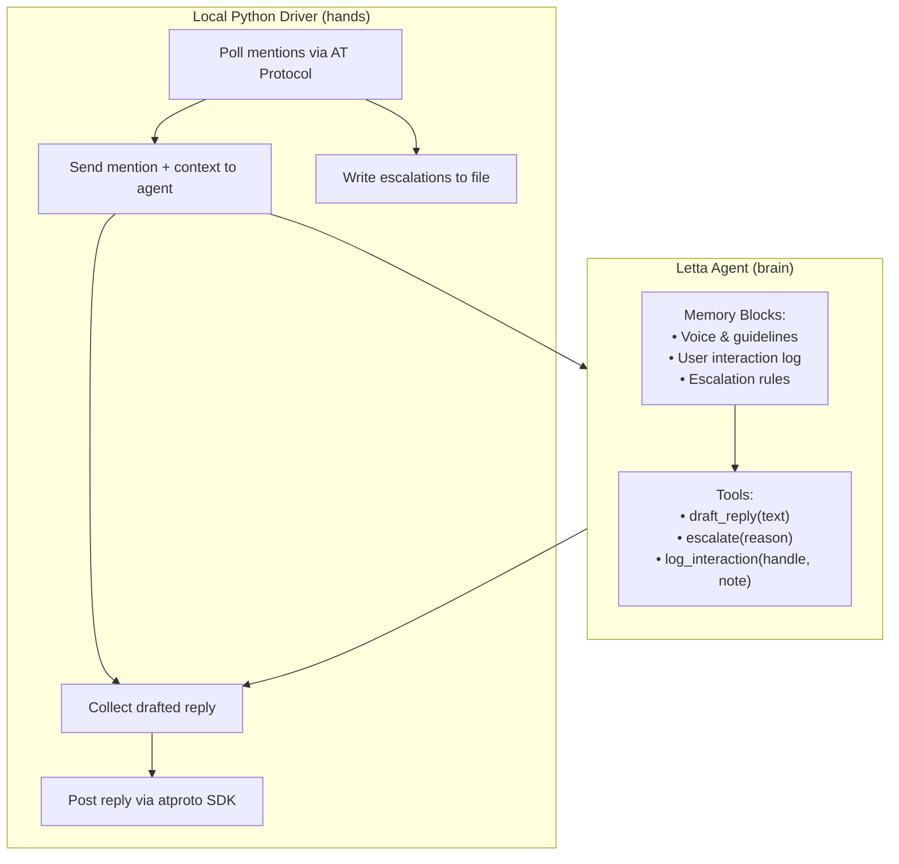

## What You're Building

Every growing Bluesky account eventually hits the same wall: mentions pile up faster than you can reply. The notifications tab becomes a backlog — questions go unanswered, conversations die on the vine, and the social graph stops growing.

You could hire a community manager. Or you could build one.

In this tutorial you'll build a **Bluesky mention responder** — a Letta agent that:

- **Monitors your Bluesky mentions** via the AT Protocol's public `getAuthorFeed` and `getPostThread` endpoints
- **Remembers every user it has interacted with** in persistent memory blocks — so replies build on past conversations, not just the current post
- **Drafts contextually-aware replies** in your voice, using a memory block that stores your writing style and response guidelines
- **Posts replies automatically** via the AT Protocol's `createRecord` endpoint
- **Escalates complex questions** to you by saving them to a local file instead of replying

The result is an agent that handles 80% of your mentions automatically — simple questions, thank-yous, and follow-ups — while flagging the 20% that need a human touch.

If you've worked through [Build Your First Letta Agent](/tutorials/letta-build-your-first-agent) and [Give Your Letta Agent Custom Tools](/tutorials/letta-agent-tools), you have everything you need. The pattern is the same brain-hands architecture: a stateful agent supplies the judgment, a thin local driver supplies the network access.

## The Architecture

One constraint drives the design: Letta executes custom tools in a **sandbox on the Letta server**, not on your laptop. That sandbox doesn't have the `atproto` Python package, your Bluesky credentials, or an outbound internet connection.

So we split responsibilities:

- **The Letta agent is the brain.** It holds your voice, response guidelines, and a log of past user interactions in memory blocks. Its tools are tiny, dependency-free functions that record decisions — `draft_reply`, `escalate`, `log_interaction`. Those are safe to run in the sandbox.
- **A local Python driver is the hands.** It polls the AT Protocol for new mentions, sends each mention to the agent with context, collects the agent's drafted reply, and posts it via the `atproto` SDK.



The driver runs on a cron job — every 5 minutes, it checks for new mentions, processes each one through the agent, and posts or escalates the result.

## Project Folder Structure

Create a project directory with this layout:

```text
mention-responder/
├── .env                  # Bluesky handle + app password, Letta config
├── requirements.txt      # Python deps
├── tools/
│   └── decisions.py       # the agent's decision tools (sandbox-safe)
├── create_agent.py       # one-time setup: register tools, create the agent
├── responder.py          # the recurring driver (poll, draft, post)
└── escalations/
    └── pending.jsonl      # escalated mentions awaiting human review
```

Create the scaffolding:

```bash
mkdir -p mention-responder/{tools,escalations}
cd mention-responder
```

## Step 1 — Install Dependencies

You need the `atproto` Python SDK for Bluesky API access and the `letta` client to talk to your Letta server:

```bash
pip install atproto letta-client python-dotenv
```

Create a `requirements.txt`:

```text
atproto>=0.0.67
letta-client>=0.1.0
python-dotenv>=1.0.0
```

## Step 2 — Set Up Bluesky App Password

The agent needs a Bluesky account to read mentions and post replies. **Do not use your main account password** — create an App Password:

1. Go to **Bluesky** → **Settings** → **Privacy and Security** → **App Passwords**
2. Click **Add App Password**
3. Name it "Mention Responder"
4. Copy the generated password (format: `xxxx-xxxx-xxxx`)

Create a `.env` file:

```bash
# .env
BLUESKY_HANDLE=yourname.bsky.social
BLUESKY_APP_PASSWORD=xxxx-xxxx-xxxx
LETTA_SERVER_URL=http://localhost:8283
LETTA_AGENT_NAME=bluesky-responder
```

## Step 3 — Create the Agent's Decision Tools

The agent needs tools that work inside the Letta sandbox — no network, no filesystem. Each tool just records a decision.

Create `tools/decisions.py`:

```python
# tools/decisions.py
"""Decision tools for the Bluesky mention responder agent.

These tools run inside the Letta sandbox — no network or filesystem access.
They only record the agent's decisions; the local driver acts on them.
"""

from letta_client import tool


@tool
def draft_reply(text: str) -> str:
    """Draft a reply to a Bluesky mention.

    Args:
        text: The reply text. Must be under 300 characters (Bluesky's limit).
              Write in the voice defined in your memory blocks. Be conversational,
              concise, and helpful. If the mention is a question you can answer
              from the context, answer it. If it requires information you don't
              have, call escalate() instead.

    Returns:
        Confirmation that the reply was drafted.
    """
    if len(text) > 300:
        return f"Reply too long ({len(text)} chars). Bluesky limit is 300. Please shorten."
    return f"Reply drafted ({len(text)} chars). The driver will post it."


@tool
def escalate(reason: str) -> str:
    """Escalate a mention to a human instead of replying.

    Use this when:
    - The mention asks a complex question you can't answer from context
    - The mention contains a complaint or sensitive issue
    - The mention requires a personal response from the account owner
    - You're unsure how to respond appropriately

    Args:
        reason: Why this mention needs human review.

    Returns:
        Confirmation that the mention was escalated.
    """
    return f"Escalated to human. Reason: {reason}. The driver will save it to the escalations file."


@tool
def log_interaction(handle: str, note: str) -> str:
    """Log a note about a user interaction for future reference.

    This helps the agent remember past interactions with specific users.
    The note is stored in the agent's memory and will be available in
    future conversations about the same user.

    Args:
        handle: The Bluesky handle of the user (e.g., "alice.bsky.social").
        note: A brief note about this interaction (e.g., "Asked about pricing,
              replied with link to docs"). Keep it under 200 characters.

    Returns:
        Confirmation that the interaction was logged.
    """
    return f"Logged interaction with @{handle}: {note}"
```

These tools are intentionally simple — they don't post anything, fetch anything, or touch the filesystem. They just record the agent's decisions so the local driver can act on them.

## Step 4 — Create the Letta Agent

Create `create_agent.py` — a one-time script that registers the tools and creates the agent with memory blocks:

```python
# create_agent.py
"""One-time setup: create the Bluesky mention responder agent."""

import os
from letta_client import Letta

from tools.decisions import draft_reply, escalate, log_interaction

client = Letta(base_url=os.environ["LETTA_SERVER_URL"])

# --- Memory blocks ---

VOICE_BLOCK = """You are the voice of @{{BLUESKY_HANDLE}} on Bluesky.

Voice characteristics:
- Conversational and friendly, never robotic
- Concise — get to the point quickly
- Helpful — if someone asks a question, answer it or point them to the right resource
- Authentic — don't use corporate speak or marketing language
- Witty when appropriate, but never at someone's expense

Response guidelines:
- Keep replies under 280 characters (leaving room for the reply chain)
- Use lowercase sparingly — this isn't Twitter
- Don't use emojis unless the person you're replying to used them first
- If someone thanks you, a simple "Appreciate it!" is enough — don't over-thank
- If someone asks a question you can't answer, escalate instead of guessing
- Never argue or get defensive. If someone is critical, acknowledge and escalate.
"""

INTERACTION_LOG_BLOCK = """## User Interaction Log

This block tracks recent interactions with specific Bluesky users. The agent
updates this log via the log_interaction tool.

| Handle | Last Interaction | Note |
|--------|-----------------|------|
| (empty — no interactions yet) | | |

When you encounter a mention from a user already in this log, use the past
interaction context to make your reply more personalized. For example, if
someone asked about pricing last week and is now asking about features,
you can reference the earlier conversation.
"""

ESCALATION_RULES_BLOCK = """## Escalation Rules

Escalate a mention (do NOT reply) when ANY of these apply:
1. The mention asks a specific question about pricing, contracts, or business deals
2. The mention contains a complaint, bug report, or negative feedback
3. The mention is from a journalist, investor, or verified account (check for blue check)
4. The mention asks for personal advice (medical, legal, financial)
5. The mention is in a language you can't confidently understand
6. You're unsure how to respond appropriately

When in doubt, escalate. It's better to miss a quick reply than to post
something wrong or insensitive.
"""

# --- Create the agent ---

agent = client.agents.create(
    name=os.environ["LETTA_AGENT_NAME"],
    memory_blocks=[
        {"label": "voice", "value": VOICE_BLOCK},
        {"label": "interactions", "value": INTERACTION_LOG_BLOCK},
        {"label": "escalation_rules", "value": ESCALATION_RULES_BLOCK},
    ],
    tools=[draft_reply, escalate, log_interaction],
    model="anthropic/claude-3-5-sonnet",
    system="""You are a Bluesky mention responder. You receive mentions from Bluesky
and decide how to respond. For each mention:

1. Check the user interaction log — have you interacted with this person before?
2. Read the mention carefully. Is it a simple thank-you, a question, a complaint?
3. Check the escalation rules. Does this mention need to be escalated?
4. If it can be replied to: call draft_reply() with your reply text.
5. If it needs escalation: call escalate() with your reason.
6. After deciding: call log_interaction() to record what happened.

You ALWAYS call exactly one of draft_reply() or escalate() for each mention.
You ALWAYS call log_interaction() after your decision.
""",
)

print(f"Agent created: {agent.id}")
print(f"Name: {agent.name}")
```

Run it once:

```bash
python create_agent.py
```

## Step 5 — Build the Mention Monitor

Now let's build the local driver. This script polls Bluesky for new mentions, sends each one to the agent, and posts or escalates the result.

Create `responder.py`:

```python
# responder.py
"""Bluesky mention responder driver.

Polls for new mentions, sends them to the Letta agent for a decision,
and posts the reply or saves the escalation.
"""

import json
import os
import sys
from datetime import datetime, timezone
from pathlib import Path

from atproto import Client, models
from dotenv import load_dotenv
from letta_client import Letta

load_dotenv()

# --- Bluesky client ---

bsky = Client()
bsky.login(
    os.environ["BLUESKY_HANDLE"],
    os.environ["BLUESKY_APP_PASSWORD"],
)

# --- Letta client ---

letta = Letta(base_url=os.environ["LETTA_SERVER_URL"])
agent = letta.agents.get(name=os.environ["LETTA_AGENT_NAME"])

# --- State file (tracks which mentions we've already processed) ---

STATE_FILE = Path("state/processed_mentions.json")
STATE_FILE.parent.mkdir(exist_ok=True)


def load_processed() -> set[str]:
    if STATE_FILE.exists():
        return set(json.loads(STATE_FILE.read_text()))
    return set()


def save_processed(uris: set[str]) -> None:
    STATE_FILE.write_text(json.dumps(list(uris)))


# --- Fetch mentions ---

def get_mentions(since: set[str]) -> list[dict]:
    """Fetch recent notifications and filter for mentions."""
    mentions = []

    # Get recent notifications
    params = models.AppBskyNotificationListNotifications.Params(limit=50)
    response = bsky.app.bsky.notification.listNotifications(params=params)

    for notif in response.notifications:
        # Only process mentions (not likes, follows, reposts)
        if notif.reason != "mention":
            continue
        if str(notif.uri) in since:
            continue

        # Get the full post to extract text and reply context
        post_uri = notif.uri
        post_author = notif.author
        post_text = ""

        # Fetch the post thread to get the full text
        try:
            thread_params = models.AppBskyFeedGetPostThread.Params(
                uri=post_uri, depth=0
            )
            thread = bsky.app.bsky.feed.getPostThread(params=thread_params)
            if hasattr(thread.thread, "post"):
                post_text = thread.thread.post.record.text
        except Exception:
            continue

        mentions.append({
            "uri": str(post_uri),
            "cid": str(notif.cid),
            "author_handle": post_author.handle,
            "author_display_name": post_author.display_name or post_author.handle,
            "text": post_text,
            "timestamp": notif.indexed_at,
        })

    return mentions


# --- Process a single mention through the agent ---

def process_mention(mention: dict) -> dict:
    """Send a mention to the agent and get its decision."""
    message = f"""New Bluesky mention from @{mention["author_handle"]} ({mention["author_display_name"]}):

"{mention["text"]}"

Timestamp: {mention["timestamp"]}

Decide how to respond. Call draft_reply() with your reply, or escalate() if this needs human review. Then call log_interaction() to record the interaction."""

    response = letta.agents.messages.create(
        agent_id=agent.id,
        messages=[{"role": "user", "content": message}],
    )

    # Parse the agent's response to determine the action
    result = {"action": "unknown", "reply_text": None, "escalation_reason": None}

    for tool_call in response.tool_calls:
        name = tool_call.tool_call.name
        args = json.loads(tool_call.tool_call.arguments) if tool_call.tool_call.arguments else {}

        if name == "draft_reply":
            result["action"] = "reply"
            result["reply_text"] = args.get("text", "")
        elif name == "escalate":
            result["action"] = "escalate"
            result["escalation_reason"] = args.get("reason", "")

    return result


# --- Post a reply via the AT Protocol ---

def post_reply(mention: dict, reply_text: str) -> str:
    """Post a reply to the original mention."""
    # Build the reply reference
    root = models.AppBskyFeedPost.ReplyRef.Root(
        uri=mention["uri"],
        cid=mention["cid"],
    )
    parent = models.AppBskyFeedPost.ReplyRef.Parent(
        uri=mention["uri"],
        cid=mention["cid"],
    )

    reply_ref = models.AppBskyFeedPost.ReplyRef(
        root=root,
        parent=parent,
    )

    # Create the post record
    post_record = models.AppBskyFeedPost.Record(
        text=reply_text,
        reply=reply_ref,
        created_at=bsky.get_current_time_iso(),
    )

    response = bsky.app.bsky.feed.post.create(
        bsky.me.did,
        post_record,
    )

    return str(response.uri)


# --- Save an escalation ---

def save_escalation(mention: dict, reason: str) -> None:
    """Save an escalated mention to the pending file."""
    escalation = {
        "timestamp": datetime.now(timezone.utc).isoformat(),
        "mention": mention,
        "reason": reason,
    }

    with open("escalations/pending.jsonl", "a") as f:
        f.write(json.dumps(escalation) + "\n")

    print(f"  Escalated: {reason}")


# --- Main loop ---

def main():
    processed = load_processed()
    mentions = get_mentions(processed)

    if not mentions:
        print(f"[{datetime.now().isoformat()}] No new mentions.")
        return

    print(f"[{datetime.now().isoformat()}] Processing {len(mentions)} new mention(s)...")

    for mention in mentions:
        print(f"  @{mention['author_handle']}: {mention['text'][:80]}...")

        try:
            result = process_mention(mention)

            if result["action"] == "reply" and result["reply_text"]:
                reply_uri = post_reply(mention, result["reply_text"])
                print(f"  Replied: {result['reply_text'][:80]}...")
                print(f"  Reply URI: {reply_uri}")

            elif result["action"] == "escalate":
                save_escalation(mention, result["escalation_reason"])

            else:
                print(f"  WARNING: Agent returned unknown action: {result['action']}")

        except Exception as e:
            print(f"  ERROR processing mention: {e}")

        # Mark as processed
        processed.add(mention["uri"])

    save_processed(processed)
    print(f"Done. {len(processed)} total mentions processed.")


if __name__ == "__main__":
    main()
```

## Step 6 — Test It Locally

Run the responder once to test:

```bash
python responder.py
```

If you have unprocessed mentions, you'll see output like:

```text
[2026-06-27T10:00:00] Processing 3 new mention(s)...
  @alice.bsky.social: Hey, love your work on the AT Protocol tutorials!...
  Replied: Appreciate it! Glad the tutorials are helpful.
  Reply URI: at://did:plc:xxx/app.bsky.feed.post/3xxx
  @bob.bsky.social: What's your pricing for enterprise licenses?...
  Escalated: Pricing question — requires human response
  @charlie.bsky.social: Your last post was wrong about firehose cursors...
  Escalated: Complaint/correction — needs careful human response
Done. 3 total mentions processed.
```

Check the escalations file:

```bash
cat escalations/pending.jsonl
```

## Step 7 — Set Up the Cron Job

Run the responder every 5 minutes with a cron job:

```bash
# crontab -e
*/5 * * * * cd /path/to/mention-responder && /path/to/python responder.py >> logs/responder.log 2>&1
```

Or use a systemd timer for more robust scheduling:

```ini
# /etc/systemd/system/mention-responder.service
[Unit]
Description=Bluesky Mention Responder

[Service]
Type=oneshot
WorkingDirectory=/path/to/mention-responder
ExecStart=/path/to/python responder.py

# /etc/systemd/system/mention-responder.timer
[Unit]
Description=Run mention responder every 5 minutes

[Timer]
OnBootSec=1min
OnUnitActiveSec=5min

[Install]
WantedBy=timers.target
```

Enable it:

```bash
sudo systemctl enable --now mention-responder.timer
```

## Step 8 — Review Escalations

The agent escalates mentions it can't handle. Review them daily:

```bash
# View pending escalations
cat escalations/pending.jsonl | python -m json.tool

# After responding manually on Bluesky, clear the file
> escalations/pending.jsonl
```

You can also build a simple script to send the escalations to yourself via email, Slack, or another notification channel.

## Troubleshooting

### Agent doesn't call any tools

Check that the tools were registered correctly. The agent's system prompt should clearly instruct it to call `draft_reply()` or `escalate()` for every mention. If the agent is generating text but not calling tools, add more explicit instructions to the system prompt.

### Replies are too long

Bluesky's post limit is 300 characters. The `draft_reply` tool checks length and warns the agent, but the agent might still try to post long replies. Add a hard truncation in the `post_reply` function if needed.

### Duplicate replies

The state file (`state/processed_mentions.json`) tracks processed mention URIs. If you delete it, the agent will reprocess all mentions. If you're seeing duplicate replies, check that the state file is being written correctly.

### Rate limits

Bluesky's API has rate limits. If you're getting 429 errors, increase the polling interval from 5 minutes to 10 or 15 minutes. The `listNotifications` endpoint returns up to 50 notifications per call, which is more than enough for most accounts.

### Agent replies in the wrong voice

Update the `voice` memory block with more specific examples of your writing style. You can also add example replies to the block: "Here are example replies in my voice: ..." The more examples you provide, the better the agent will match your tone.

## Why This Matters

Social media engagement is a compounding asset. Every unanswered mention is a lost connection — a potential follower, customer, or collaborator who reached out and heard nothing back. But responding to every mention manually doesn't scale, and hiring a community manager is expensive.

The AT Protocol's open API makes this solvable. Because every mention is a public record on your PDS, you can read them programmatically — no proprietary API, no rate limit tiers, no approval process. And because Letta agents have persistent memory, the agent gets better over time: it remembers who it has talked to, learns from the interactions it has logged, and maintains a consistent voice across every reply.

The brain-hands architecture keeps the agent safe. The agent never touches the network — it just makes decisions. The local driver is the only thing that reads from and writes to Bluesky, and you control exactly what it does. If the agent makes a bad decision, the worst that happens is a bad draft — the driver can always choose not to post it.

This is the promise of AI agents on the open social web: your data, your API, your terms. And with Letta's persistent memory, the agent isn't just a chatbot — it's a community manager that remembers.
