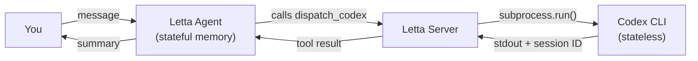
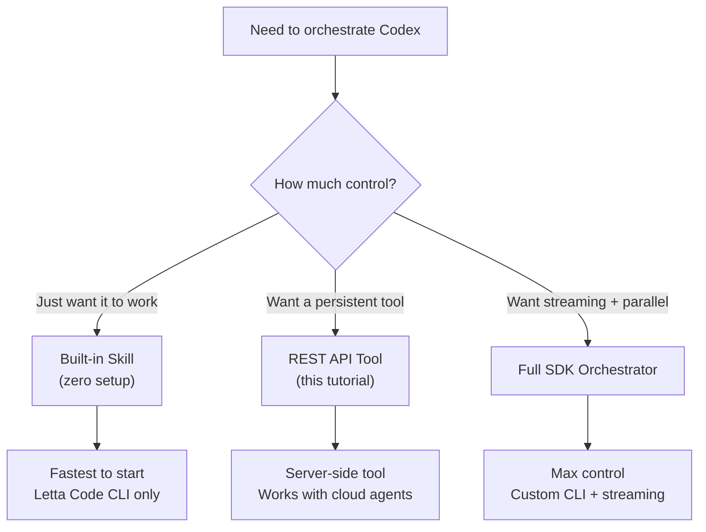

> **This is one of three tutorials on orchestrating Codex with Letta.** This guide covers the REST API approach — registering a server-side Python tool that dispatches to Codex CLI. For a quicker path, see [Dispatch Codex Agents with the Letta Code Skill](/tutorials/letta-dispatch-codex-skill) (zero setup). For maximum control, see [Orchestrate Codex Agents with the Letta Agent SDK](/tutorials/letta-orchestrate-codex) (full TypeScript orchestrator).

## The Middle Ground

The [built-in skill approach](/tutorials/letta-dispatch-codex-skill) is zero setup but only works inside Letta Code CLI. The [full SDK approach](/tutorials/letta-orchestrate-codex) gives you streaming and parallel dispatch but requires a TypeScript project. This tutorial sits in between: you register a Python tool on a Letta agent via the REST API, and the agent can call it whenever it needs to dispatch to Codex.

The tool runs server-side on your Letta instance. The agent decides when to call it based on its persona and memory. You don't write any streaming code, session management, or CLI loops — the Letta server handles all of that.

## Prerequisites

- **Python 3.11+** installed
- **Codex CLI** installed and authenticated (`npm i -g @openai/codex` then `codex login`)
- A **Letta server** running — either [Letta Cloud](https://platform.letta.com) or a [local Letta server](https://docs.letta.com/quickstart/local-dev)
- The `letta-client` Python package: `pip install letta-client`

## Step 1: Install the Python Client

```bash
pip install letta-client
```

If you're using a local Letta server, start it first:

```bash
letta server
```

The server runs on `http://localhost:8283` by default.

## Step 2: Define the Codex Dispatch Tool

Create a file named `codex_tool.py`:

```python3
# codex_tool.py
import subprocess
import json


def dispatch_codex(task: str, cwd: str = ".", sandbox: str = "read-only") -> str:
    """
    Dispatch a task to a stateless Codex CLI agent.

    Codex runs in an isolated context with no memory of past interactions.
    Provide all necessary context in the task prompt: file paths,
    architecture notes, conventions, and what you've already tried.

    Args:
        task: The full task prompt for Codex. Be specific — include
            file paths, architecture context, and constraints.
        cwd: Working directory for the Codex agent. Defaults to current directory.
        sandbox: Sandbox mode — "read-only" for investigation, "workspace-write" for edits.

    Returns:
        The Codex output and session ID for potential resumption.
    """
    result = subprocess.run(
        ["codex", "exec", task, "--sandbox", sandbox, "-C", cwd],
        capture_output=True,
        text=True,
        timeout=600,  # 10 minute timeout
    )

    # Extract session ID from Codex stderr output
    session_id = None
    for line in result.stderr.split("\n"):
        if line.startswith("session id:"):
            session_id = line.split(":", 1)[1].strip()
            break

    response = {
        "output": result.stdout,
        "session_id": session_id,
        "exit_code": result.returncode,
    }

    if result.returncode != 0:
        response["error"] = result.stderr

    return json.dumps(response, indent=2)
```

This function becomes a Letta tool automatically. The docstring follows Google style — Letta parses it to generate the OpenAI tool schema that the agent sees. The function name `dispatch_codex` becomes the tool name.

## Step 3: Register the Tool on Your Letta Server

Create a file named `register_tool.py`:

```python3
# register_tool.py
from letta_client import Letta
import os

# Connect to your Letta server
client = Letta(
    base_url=os.getenv("LETTA_BASE_URL", "http://localhost:8283"),
    token=os.getenv("LETTA_API_KEY"),  # omit for local server
)

# Register the tool from the function file
with open("codex_tool.py", "r") as f:
    source_code = f.read()

tool = client.tools.upsert_from_function(
    source_code=source_code,
    name="dispatch_codex",
    description="Dispatch a task to a stateless Codex CLI agent. Codex runs in an isolated context with no memory — provide all necessary context in the task prompt.",
)

print(f"Tool registered: {tool.id}")
print(f"Tool name: {tool.name}")
```

Run it:

```bash
python3 register_tool.py
```

```text
Tool registered: tool-abc123...
Tool name: dispatch_codex
```

The tool now lives on your Letta server. Any agent you attach it to can call it.

## Step 4: Create the Orchestrator Agent

Now create an agent that uses the tool. The agent's persona tells it when to dispatch to Codex and when to answer directly:

```python3
# create_agent.py
from letta_client import Letta
import os

client = Letta(
    base_url=os.getenv("LETTA_BASE_URL", "http://localhost:8283"),
    token=os.getenv("LETTA_API_KEY"),
)

# Find the tool we registered
tools = client.tools.list()
codex_tool = next(t for t in tools if t.name == "dispatch_codex")

agent = client.agents.create(
    name="codex-orchestrator",
    description="Orchestrates Codex CLI agents for code investigation and debugging",
    memory_blocks=[
        {
            "label": "persona",
            "value": """You are an engineering orchestrator. You have persistent memory of the codebase, past decisions, and past Codex dispatches.

Your job is to decide when to answer directly and when to dispatch work to Codex CLI agents via the dispatch_codex tool.

Dispatch to Codex when:
- The task requires deep code investigation across many files
- You need a second opinion on a plan or approach
- The user asks for a hard debugging session
- You want parallel research on multiple hypotheses

Answer directly when:
- You already know the answer from memory
- The task is a quick lookup or simple explanation
- The user is asking a conceptual question

When you dispatch to Codex, you MUST provide:
1. A specific, actionable task description
2. Relevant file paths and architecture context from your memory
3. Coding conventions and constraints you've learned
4. What you've already tried (if debugging)

After Codex returns, summarize the result for the user and note any new learnings in your dispatch_history memory block.""",
        },
        {
            "label": "codebase_context",
            "value": "No project context learned yet.",
        },
        {
            "label": "dispatch_history",
            "value": "No Codex dispatches yet.",
        },
    ],
    tool_ids=[codex_tool.id],
)

print(f"Agent created: {agent.id}")
print(f"Agent name: {agent.name}")
```

Run it:

```bash
python3 create_agent.py
```

```text
Agent created: agent-xyz789...
Agent name: codex-orchestrator
```

Save the agent ID — you'll need it for sending messages.

## Step 5: Send a Message and Watch It Dispatch

Now talk to your agent. When it decides to dispatch to Codex, the Letta server executes the tool server-side and returns the result:

```python3
# chat.py
from letta_client import Letta
import os

client = Letta(
    base_url=os.getenv("LETTA_BASE_URL", "http://localhost:8283"),
    token=os.getenv("LETTA_API_KEY"),
)

agent_id = os.getenv("AGENT_ID", "agent-xyz789...")

response = client.agents.messages.create(
    agent_id=agent_id,
    messages=[
        {
            "role": "user",
            "content": "What does the auth module in this project do? If you're not sure, dispatch to Codex to investigate.",
        }
    ],
)

for message in response.messages:
    print(f"[{message.message_type}] {message.content}")
```

Run it:

```bash
python3 chat.py
```

The agent will either answer from memory or call `dispatch_codex` with a detailed prompt. The tool executes on the server, Codex runs, and the result flows back to the agent — which then summarizes it for you.



## Step 6: Session Resumption via the Tool

The tool captures the Codex session ID in its return value. When the agent needs to resume a Codex session for a follow-up, it calls `dispatch_codex` again with the session ID embedded in the task prompt.

To add explicit session resumption support, update the tool to accept an optional session ID:

```python3
# codex_tool.py (updated)
import subprocess
import json


def dispatch_codex(
    task: str,
    cwd: str = ".",
    sandbox: str = "read-only",
    session_id: str = "",
) -> str:
    """
    Dispatch a task to a stateless Codex CLI agent.

    Codex runs in an isolated context with no memory of past interactions.
    Provide all necessary context in the task prompt: file paths,
    architecture notes, conventions, and what you've already tried.

    Args:
        task: The full task prompt for Codex. Be specific — include
            file paths, architecture context, and constraints.
        cwd: Working directory for the Codex agent. Defaults to current directory.
        sandbox: Sandbox mode — "read-only" for investigation, "workspace-write" for edits.
        session_id: Optional Codex session ID to resume. Use this when you need
            to ask a follow-up question in the same Codex context.

    Returns:
        The Codex output and session ID for potential resumption.
    """
    args = ["codex", "exec"]

    if session_id:
        args.extend(["resume", session_id])

    args.extend([task, "--sandbox", sandbox, "-C", cwd])

    result = subprocess.run(
        args,
        capture_output=True,
        text=True,
        timeout=600,
    )

    # Extract session ID from Codex stderr output
    new_session_id = session_id
    for line in result.stderr.split("\n"):
        if line.startswith("session id:"):
            new_session_id = line.split(":", 1)[1].strip()
            break

    response = {
        "output": result.stdout,
        "session_id": new_session_id,
        "exit_code": result.returncode,
    }

    if result.returncode != 0:
        response["error"] = result.stderr

    return json.dumps(response, indent=2)
```

Re-register the tool with `client.tools.upsert_from_function(...)` to update it. The agent will learn to pass `session_id` when resuming a previous Codex investigation.

## Step 7: Add Memory for Context

The agent's memory blocks evolve over time. After several dispatches, the `codebase_context` block might contain:

```text
Project: my-saas-app
Architecture: Next.js App Router + Supabase + Drizzle ORM
Key files:
  - src/app/api/messages/route.ts — POST handler for messages
  - src/lib/auth/session.ts — session validation
Conventions:
  - Server Components by default
  - Named exports, no default exports except pages
Past investigations:
  - Auth race condition found in session.ts:47, fixed with mutex
```

The `dispatch_history` block tracks what Codex has been asked:

```text
1. [2026-08-22] Investigated auth flow → found race condition in session.ts
2. [2026-08-22] Resumed session to fix race → added mutex to login handler
```

This means the agent answers most questions directly from memory. It only dispatches to Codex for genuinely novel problems.

## How This Compares to the Other Approaches



| Aspect | Built-in Skill | This Tutorial | Full SDK |
|---|---|---|---|
| Setup time | None | ~10 minutes | ~1 hour |
| Language | None (skill handles it) | Python | TypeScript |
| Where it runs | Letta Code CLI | Letta server (local or cloud) | Your machine |
| Streaming | No | No | Yes |
| Parallel dispatch | Via multiple Bash calls | Via multiple tool calls | Built-in |
| Session resumption | Agent handles it | Tool parameter | Tool parameter |
| Custom UI | No | No | Yes |

## Codex CLI Quick Reference

The tool uses these Codex CLI flags:

| Flag | Purpose |
|------|---------|
| `exec` | Non-interactive mode — runs the task and exits |
| `--sandbox read-only` | Codex can read files but not modify them (default) |
| `--sandbox workspace-write` | Codex can read and write files in the workspace |
| `-C DIR` | Set the working directory for the Codex agent |
| `resume SESSION_ID` | Resume a previous session by ID |
| `resume --last` | Resume the most recent session |

For the full reference, see the [Codex CLI documentation](https://developers.openai.com/codex/cli/reference).

## Error Handling

The tool handles several failure modes:

- **Timeout**: Codex runs longer than 10 minutes. The subprocess raises `subprocess.TimeoutExpired`. The tool returns an error and the agent can retry with a more focused prompt.
- **Non-zero exit**: Codex encountered an internal error. The stderr is included in the response for the agent to diagnose.
- **Command not found**: Codex CLI is not installed. The subprocess raises `FileNotFoundError`. The tool returns a clear error message.

The Letta agent handles these gracefully — it reads the error, explains what happened to the user, and suggests next steps.

## Key Takeaways

- **Server-side tool, no client code.** The tool runs on the Letta server. You register it once and any agent can use it.
- **Python with a docstring is all you need.** The Google-style docstring becomes the tool schema automatically — no JSON schema to write.
- **The agent decides when to dispatch.** Its persona instructions guide the decision. You just send messages.
- **Session resumption via tool parameter.** Pass the session ID back to resume a Codex context. The agent learns to do this from its persona.
- **Memory compounds.** Each dispatch teaches the agent something new. Eventually it answers most questions directly.

## What's Next

- Add a second tool for [Claude Code](https://docs.anthropic.com/en/docs/claude-code) and let the agent choose which subagent to use
- Use [Letta's scheduled tasks](https://docs.letta.com/advanced/scheduled-tasks) to run Codex investigations on a schedule
- Move to the [full SDK approach](/tutorials/letta-orchestrate-codex) when you need streaming output or a custom CLI
- Explore [Letta's MCP support](https://docs.letta.com/guides/tools/mcp) to give the agent access to external tools alongside Codex
