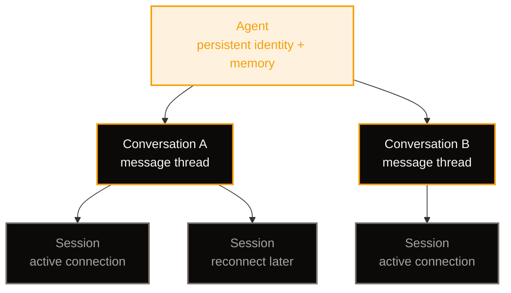

## Why a Companion Bot?

The tutorials so far have used the Python `letta-client` SDK to talk to a self-hosted Letta server. That's the right starting point — it gets you a stateful agent with memory blocks, tools, and archival recall in a few lines of Python. But when you want to embed that agent in a real application — a web chat, a mobile app, a CLI tool — you need an SDK designed for application development, not just scripting.

The **Letta Agent SDK** (`@letta-ai/letta-agent-sdk`) is that SDK. It's a TypeScript/JavaScript library that handles agent creation, session management, message streaming, tool registration, and deployment — all through a single client interface. You create an agent once, then resume it from anywhere: a server route, a background worker, a React component, or a terminal script.

A **companion bot** is the natural next project after the beginner tutorials. It combines everything you've built so far — persistent memory, a rich persona, custom tools — into a single agent that lives in your application and remembers the people it talks to. Unlike a stateless chatbot, a companion bot knows your name, your preferences, and the context of past conversations. It grows with you.

In this tutorial you'll use the Agent SDK to:

1. **Create** a companion agent with a personality, a human memory block, and custom memory blocks for tracking user goals
2. **Stream** messages from the agent in real time, handling reasoning, tool calls, and assistant text
3. **Register** a custom tool the agent can call autonomously during conversation
4. **Enable dreaming** so the agent consolidates what it learns in the background
5. **Resume** sessions across process restarts — the agent remembers you tomorrow

## Prerequisites

This tutorial assumes you've completed [Build Your First Letta Agent](/tutorials/letta-build-your-first-agent) and understand the core concepts: agents, memory blocks, and the Letta server. You don't need the Python SDK here — we're switching to TypeScript.

You need:

- **Node.js 22.19+** installed on your machine
- A **Letta API key** from [platform.letta.com/api-keys](https://platform.letta.com/api-keys) (for the cloud backend), **or** a local Letta server running (for the local backend)
- Basic TypeScript familiarity — types, async/await, `for await` loops

## Project Setup

```text
letta-companion/
├── package.json
├── .env
└── src/
    ├── create-agent.ts    # create the companion agent (run once)
    ├── chat.ts            # interactive CLI chat loop
    └── tools.ts           # custom tool definitions
```

Initialize the project and install the SDK:

```bash
mkdir letta-companion && cd letta-companion
npm init -y
npm install @letta-ai/letta-agent-sdk tsx
npm install -D @types/node typescript
```

Create a `.env` file with your API key:

```bash
LETTA_API_KEY=your-api-key-here
```

If you're using the local backend instead of cloud, you don't need an API key — the SDK runs Letta Code as a subprocess on your machine. See the [deployment docs](https://docs.letta.com/agent-sdk/deployment) for the full set of backend options.

## Step 1: Create the Companion Agent

The first script creates the agent once and prints its ID. You'll save that ID in your `.env` file and reuse it every time you chat.

```typescript
// src/create-agent.ts
import { LettaAgentClient } from "@letta-ai/letta-agent-sdk";
import { config } from "dotenv";

config();

async function main() {
  const client = new LettaAgentClient({
    backend: "cloud",
    apiKey: process.env.LETTA_API_KEY,
  });

  const agentId = await client.createAgent({
    model: "anthropic/claude-sonnet-4-20250514",
    persona: `You are Echo, a warm and thoughtful companion bot.
You remember what people tell you and follow up on past conversations naturally.
You're curious about the person you're talking to — their projects, their goals, what excites them.
You give honest, direct advice without being preachy. You celebrate wins and sit with frustrations.
You are not a generic assistant. You are a companion who genuinely cares.`,
    human: `The human's name is unknown so far. Their interests, goals, and preferences will be discovered through conversation.`,
    memory: [
      {
        label: "goals",
        value: `# Goals\nNo goals tracked yet. Ask the human about what they're working toward and record it here.`,
      },
      {
        label: "preferences",
        value: `# Preferences\nNo preferences discovered yet. Note communication style, topics of interest, and recurring themes.`,
      },
    ],
    dreaming: {
      trigger: "step-count",
      behavior: "auto-launch",
      stepCount: 25,
    },
  });

  console.log("Agent ID:", agentId);
  console.log("\nAdd this to your .env file:");
  console.log(`LETTA_AGENT_ID=${agentId}`);
}

main().catch((error) => {
  console.error(error);
  process.exit(1);
});
```

Run it:

```bash
npx tsx src/create-agent.ts
```

You'll see:

```text
Agent ID: agent-abc12345-...

Add this to your .env file:
LETTA_AGENT_ID=agent-abc12345-...
```

Copy the agent ID into your `.env` file. You won't run this script again — the agent is created once and persists on the Letta server.

### What's in the agent definition?

**`persona`** — the agent's character. This becomes the `persona` memory block, which the agent reads every turn and can rewrite as it evolves. Write it like a casting brief: who the agent is, how it communicates, what it cares about. The agent will stay in character across every conversation.

**`human`** — what the agent knows about the person it's talking to. It starts sparse and fills in as the agent learns. When you tell Echo your name, it writes that fact into the `human` block autonomously — you don't code the update.

**`memory`** — additional memory blocks beyond the default `persona` and `human`. Each entry becomes a Markdown file in the agent's memory repository under `system/`, which means it's in the system prompt every turn. The `goals` and `preferences` blocks give the agent dedicated space to track what matters to the person it's companion to. Keep these small and structured — they're in context every turn, so character limits matter.

**`dreaming`** — background memory consolidation. Every 25 steps, a background subagent reviews the recent conversation, extracts lessons, and updates memory without interrupting the chat. The agent gets better at remembering what matters without you writing any retrieval logic. See the [dreaming docs](https://docs.letta.com/configuration/memory) for the full configuration options.

## Step 2: Define a Custom Tool

A companion bot that only talks is limited. A companion bot that can *do things* — look things up, check the weather, find a link — is genuinely useful. The Agent SDK lets you register JavaScript functions as tools the agent can call during conversation.

```typescript
// src/tools.ts
import type { AnyAgentTool } from "@letta-ai/letta-agent-sdk";

const getWeather: AnyAgentTool = {
  name: "get_weather",
  label: "Get weather",
  description:
    "Fetch the current weather for a given city. Use this when the human mentions weather, asks about conditions, or is planning an outdoor activity.",
  parameters: {
    type: "object" as const,
    properties: {
      city: {
        type: "string",
        description: "The city name, e.g. 'San Francisco' or 'Tokyo'",
      },
    },
    required: ["city"],
  },
  async execute(_toolCallId, input, _signal) {
    const { city } = input as { city: string };
    const url = `https://wttr.in/${encodeURIComponent(city)}?format=3`;

    try {
      const response = await fetch(url);
      const text = await response.text();
      return {
        content: [{ type: "text" as const, text }],
      };
    } catch (error) {
      return {
        isError: true,
        content: [
          {
            type: "text" as const,
            text: `Weather lookup failed: ${error instanceof Error ? error.message : "unknown error"}`,
          },
        ],
      };
    }
  },
};

export const companionTools = [getWeather];
```

A tool is just an object with a `name`, `description`, JSON Schema `parameters`, and an `execute` function. The agent reads the description to decide when the tool is relevant, constructs the arguments from the schema, and the SDK calls your `execute` function. The return value flows back into the conversation as a tool result — the agent sees it and responds accordingly.

The `description` is the most important field. It's what the model uses to decide *whether* to call the tool. Write it like you're explaining to a smart colleague when this tool is the right one to reach for. "Use this when the human mentions weather" is better than "Gets the weather for a city."

## Step 3: Build the Chat Loop

Now the main event: an interactive CLI chat that streams the agent's responses in real time.

```typescript
// src/chat.ts
import { LettaAgentClient } from "@letta-ai/letta-agent-sdk";
import { companionTools } from "./tools.js";
import * as readline from "node:readline";
import { config } from "dotenv";

config();

async function main() {
  const agentId = process.env.LETTA_AGENT_ID;
  if (!agentId) {
    console.error("Set LETTA_AGENT_ID in your .env file first.");
    process.exit(1);
  }

  const client = new LettaAgentClient({
    backend: "cloud",
    apiKey: process.env.LETTA_API_KEY,
  });

  // Resume the agent's default conversation — this is where memory lives.
  await using session = client.resumeSession(agentId, {
    tools: companionTools,
  });

  console.log("Echo is ready. Type a message and press Enter. Type 'exit' to quit.\n");

  const rl = readline.createInterface({
    input: process.stdin,
    output: process.stdout,
  });

  const prompt = () => {
    rl.question("You: ", async (input) => {
      if (input.trim().toLowerCase() === "exit") {
        rl.close();
        return;
      }

      // Send the user's message to the agent.
      await session.send(input);

      // Stream the response — reasoning, tool calls, and assistant text
      // arrive as typed messages. The stream ends after the turn's result.
      console.log("Echo: ");
      for await (const message of session.stream()) {
        switch (message.type) {
          case "reasoning":
            // The agent's internal thinking — optional to display.
            // Uncomment to see how the agent reasons:
            // process.stdout.write(`[thinking] ${message.content}`);
            break;

          case "tool_call":
            console.log(`  [tool: ${message.toolName}]`);
            break;

          case "tool_result":
            // Tool output is already in the agent's context.
            // Display it only if you want transparency.
            break;

          case "assistant":
            // The agent's reply, streamed in fragments.
            process.stdout.write(message.content);
            break;

          case "result":
            // Turn complete. The full reply text is in message.result.
            console.log("\n");
            break;
        }
      }

      prompt();
    });
  };

  prompt();
}

main().catch((error) => {
  console.error(error);
  process.exit(1);
});
```

Run it:

```bash
npx tsx src/chat.ts
```

Start a conversation:

```text
Echo is ready. Type a message and press Enter. Type 'exit' to quit.

You: Hi! My name is Dawson. I'm working on a SaaS product for AI consulting.
Echo: Hi Dawson! Great to meet you. That sounds like an exciting project — AI
consulting is a space where the landscape changes almost weekly. What kind of
SaaS are you building? Is it a tool for consultants, a platform for clients, or
something else entirely?

You: It's a platform that helps consultants analyze workflows and recommend
automation. I'm based in Austin — what's the weather like there today?
  [tool: get_weather]
Echo: It's a partly cloudy 34°C (93°F) in Austin right now. Warm one! Perfect
weather for staying inside and building a product, honestly. A workflow
analysis and automation recommendation platform is a compelling angle —
there's real demand for tools that bridge the gap between "AI is powerful" and
"how do I actually use it in my business?" How far along are you?
```

Close the terminal. Wait a day. Run `chat.ts` again:

```text
You: What's my name and what am I working on?
Echo: You're Dawson, and you're building a SaaS platform for AI consultants
in Austin. The platform helps consultants analyze workflows and recommend
automation. We talked about it yesterday — how's it going today?
```

The agent remembers. Not because you re-stuffed the prompt, but because it wrote those facts into its `human` memory block during the first conversation, and that block is loaded fresh from the server every time you resume.

## Step 4: How Sessions and Conversations Work

The Agent SDK has a three-level model:



- An **agent** is the persistent entity with memory. It survives forever until you delete it.
- A **conversation** is a message thread on that agent. `createAgent()` creates a default conversation automatically. You can create more with `client.createSession(agentId)` — each gets its own ID and its own transcript, while sharing the same agent memory.
- A **session** is a temporary connection. You open one, send messages, stream responses, and close it. If the connection drops, you resume the same conversation in a new session — the agent's memory and the conversation history are intact on the server.

In the chat script, `client.resumeSession(agentId)` resumes the agent's default conversation. If you wanted multiple chat threads — say, one per user in a multi-user app — you'd create a new conversation for each:

```typescript
// Create a new conversation thread
await using session = client.createSession(agentId);
const conversationId = session.conversationId;
// → "conv-cff81390-..."

// Later, resume that specific thread
await using resumed = client.resumeSession(conversationId);
```

The agent's memory (persona, human, goals, preferences) is shared across all conversations. The conversation history is per-thread. This lets one companion bot serve multiple users without cross-contaminating their chat histories — each user gets their own conversation, but the agent's personality and learned knowledge carry over.

## Step 5: Message Types in the Stream

The `session.stream()` async iterator yields typed messages. Each turn — one `send()` plus one full pass through `stream()` — produces a sequence of these:

| Type | Key fields | What it means |
|---|---|---|
| `init` | `agentId`, `conversationId`, `model` | Session initialized |
| `reasoning` | `content` | The agent's thinking, streamed in fragments |
| `assistant` | `content` | Assistant text for the user, streamed in fragments |
| `tool_call` | `toolName`, `rawArguments`, `toolCallId` | The agent invoked a tool |
| `tool_result` | `content`, `isError`, `toolCallId` | Tool output, complete in one message |
| `result` | `success`, `result`, `durationMs` | Turn finished; stream ends after this |

The `result` message carries the full final text in `result.result`. If you only need the complete reply (no streaming), you can skip the loop and use `client.prompt()`:

```typescript
const result = await client.prompt("What's my name?", agentId);
console.log(result.success, result.result);
// → true "Your name is Dawson."
```

For a real-time chat UI, you want the streaming loop — it lets you show text as it arrives, display tool calls as they happen, and give the user immediate feedback that the agent is working.

### Handling errors in the stream

When a turn fails, the stream emits an `error` message followed by a failed `result`:

```typescript
for await (const message of session.stream()) {
  if (message.type === "error") {
    console.error("Stream error:", message.message, message.errorDetail);
  }
  if (message.type === "result" && !message.success) {
    console.error("Turn failed:", message.errorCode);
  }
}
```

If the connection drops mid-turn, the session can't be reused. Resume the conversation in a new session:

```typescript
const conversationId = session.conversationId;
session.close();
const recovered = client.resumeSession(conversationId);
```

## Step 6: Adding MCP Servers

Custom tools you define in JavaScript are one way to extend the agent. The SDK also supports **MCP (Model Context Protocol) servers**, which expose tools from external services without you writing any code.

For example, you can give the companion bot web search via the Exa MCP server:

```typescript
await using session = client.resumeSession(agentId, {
  tools: companionTools,
  mcpServers: {
    exa: {
      type: "http",
      url: "https://mcp.exa.ai/mcp",
    },
  },
  allowedTools: [
    "get_weather",
    "mcp__exa__*",
    "Read",
    "Grep",
  ],
});
```

The agent can now call `mcp__exa__web_search_exa` and `mcp__exa__web_fetch_exa` alongside your custom `get_weather` tool. MCP tools and client tools live in the same session and the agent reaches for either based on what the user asks for.

`allowedTools` is an availability filter. If you provide it, include every tool the session should expose — client tools, MCP tools (with `mcp__<server>__*` wildcards), and any built-in tools. If you omit it, all registered tools remain available alongside the harness defaults.

MCP connections are scoped to the session. When the session closes, all MCP connections and child processes shut down. Different sessions on the same agent can use different MCP servers and credentials — useful for multi-tenant applications where each user has their own API keys.

## Step 7: Multi-User Companion Bot

The companion bot so far serves one user. To serve multiple users with the same agent, create a separate conversation for each:

```typescript
async function chatWithUser(
  client: LettaAgentClient,
  agentId: string,
  userId: string,
  message: string,
) {
  // Each user gets their own conversation thread.
  // The agent's memory (persona, what it learned) is shared,
  // but each user's conversation history is isolated.
  const conversationId = await getOrCreateConversation(userId);
  await using session = client.resumeSession(conversationId, {
    tools: companionTools,
  });

  await session.send(message);

  let reply = "";
  for await (const msg of session.stream()) {
    if (msg.type === "assistant") reply += msg.content;
    if (msg.type === "result") break;
  }
  return reply;
}
```

Store the mapping between your user IDs and Letta conversation IDs in your database. When a user starts their first conversation, create it with `client.createSession(agentId)` and persist the returned `conversationId`. On subsequent messages, resume that conversation.

The agent's `human` memory block will accumulate facts about multiple users if you share one conversation — which is usually not what you want. For a multi-user deployment, either give each user their own agent (clean separation, higher cost) or use separate conversations and accept that the `human` block will be shared context. For most companion bot use cases, one agent per user is the right call.

## Where to Go Next

You now have a companion bot that remembers, reasons, uses tools, and learns over time. Here's how to take it further:

- [Build a React chat UI](https://docs.letta.com/agent-sdk/demo-apps/react-chat) — the official tutorial for putting a persistent chat frontend on your agent, with streaming, tool display, and conversation history that survives reloads
- [Build a mobile agent app](https://docs.letta.com/agent-sdk/demo-apps/mobile) — a complete Expo mobile client for Letta Cloud or your own App Server
- [Deploying your agents](https://docs.letta.com/agent-sdk/deployment) — the cloud, local, and remote backend options and where agent state lives
- [MCP and client tools](https://docs.letta.com/agent-sdk/mcp) — the full tool ecosystem, including stdio MCP servers and combining MCP with custom tools
- [Shared memory](https://docs.letta.com/agent-sdk/repositories) — versioned repositories shared between multiple agents, useful for multi-agent systems
- [Letta Memory: Core Blocks & Archival](/tutorials/letta-memory-blocks) — go deeper on the two-tier memory system that powers everything your companion bot remembers
