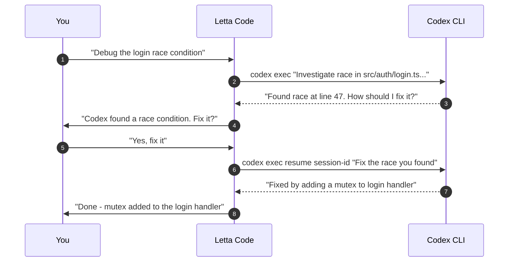
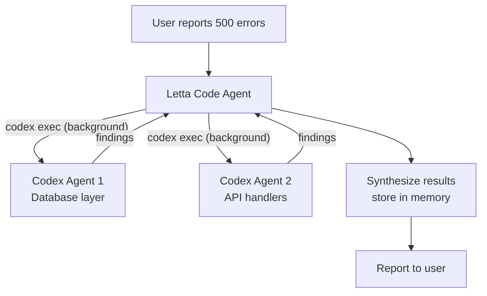

> **This is one of three tutorials on orchestrating Codex with Letta.** This guide covers the zero-setup approach — using the built-in `dispatching-coding-agents` skill in Letta Code CLI. For more control, see [Orchestrate Codex Agents with the Letta Agent SDK](/tutorials/letta-orchestrate-codex) (full TypeScript orchestrator) or [Add a Codex Tool to a Letta Agent via API](/tutorials/letta-codex-tool-api) (Python REST API tool).

## The Fastest Path to Codex Orchestration

You already have Letta Code running. You already have Codex CLI installed. There's nothing to build — the `dispatching-coding-agents` skill is built into Letta Code and knows how to shell out to `codex exec` via Bash. Your Letta Code agent already has persistent memory of your codebase, your preferences, and past decisions.

The skill works because your Letta Code agent is already the stateful orchestrator. It just needed to learn that it can dispatch Codex as a stateless subagent when a task warrants it.

## Prerequisites

- **Letta Code** installed and running (`npm i -g @letta-ai/letta-code`)
- **Codex CLI** installed and authenticated (`npm i -g @openai/codex` then `codex login`)
- An existing Letta Code agent with some memory of your project (run `letta-code` in your repo at least once before)

That's it. No project to create, no `.env` to configure, no TypeScript to write.

## Step 1: Verify the Skill Is Available

The `dispatching-coding-agents` skill ships with Letta Code. Verify it's present:

```bash
ls ~/.letta/skills/dispatching-coding-agents/SKILL.md
```

If the file exists, your agent already has access to the skill. The skill teaches your agent:

- When to dispatch to Codex (and when not to)
- How to craft a context-rich prompt for a stateless subagent
- How to resume Codex sessions for follow-up questions
- Which model to use for which task type

You don't need to read the skill yourself — your Letta Code agent loads it automatically when a dispatch situation arises.

## Step 2: Dispatch Your First Codex Task

Open Letta Code in your repository and ask it to dispatch Codex:

```text
Dispatch Codex to trace the request flow from the /api/messages endpoint
through to the LLM call. I want to understand every function in the path.
```

Your Letta Code agent will:

1. **Check its memory** — it may already know the answer from past sessions
2. **Craft a context-rich prompt** — including file paths, architecture notes, and conventions it has learned
3. **Run `codex exec` via Bash** — with `run_in_background: true` so it can keep working
4. **Capture the result** — then synthesize and explain it back to you

You'll see something like:

```text
[dispatching to Codex via Bash]

[result: Traced the request flow through 7 functions:
  1. POST /api/messages → src/routes/messages.ts:23
  2. MessageRouter.handle() → src/router.ts:45
  3. ...]

Letta: I dispatched Codex to trace the request flow. Here's what it found...
```

The key insight: you didn't have to write any code. Your agent already knew how to dispatch because the skill taught it.

## Step 3: Resume a Codex Session

Sometimes Codex finds an issue but needs direction on how to fix it. Your Letta Code agent can resume the same Codex session to continue the conversation:

```text
Codex found a race condition in the auth flow. Have it fix the race
it found — tell it to add a mutex to the login handler.
```

Your agent will use `codex exec resume <session-id>` to continue in the same Codex context. The session ID was captured from the first dispatch's output.



The agent handles session tracking automatically. It stores the session ID in its context and knows when to resume vs. start fresh.

## Step 4: Parallel Research

For hard problems, you want multiple perspectives. Ask your Letta Code agent to dispatch multiple Codex agents simultaneously:

```text
I'm getting intermittent 500 errors. Dispatch Codex to investigate the
database layer and the API handlers in parallel.
```

Your agent will make multiple `Bash` tool calls in a single message — each with `run_in_background: true` — then synthesize the results when both complete:



Both Codex agents run simultaneously. Your agent continues working while they execute, then collects results when ready.

## Step 5: Plan Critique — Second Opinions

One of the most valuable patterns is using Codex as a context-isolated reviewer. Your Letta Code agent writes a plan to a file, then dispatches Codex to critique it:

```text
I'm planning to migrate from REST to GraphQL. Draft a plan, then
dispatch Codex to critique it.
```

Your agent will:

1. Draft the migration plan itself
2. Write it to a file (e.g., `/tmp/migration-plan.md`)
3. Dispatch Codex with: `codex exec "Read /tmp/migration-plan.md and critique it. What am I missing? What could go wrong?"`
4. Synthesize Codex's feedback into a final recommendation

Because Codex starts with a clean slate, it's less anchored by the same assumptions as your Letta Code agent. This makes it an excellent second opinion.

## Step 6: Choose the Right Agent for the Task

The skill teaches your agent which subagent to use based on the task:

| Task Type | Agent | Why |
|---|---|---|
| Hard debugging | Codex (default model) | Strong at tracing complex code paths |
| Docs, refactors, vague instructions | Claude Code (`opus`) | Excellent writer, handles ambiguity well |
| Quick lookup, simple edits | Letta Code itself | Faster than briefing a subagent |
| Parallel research | Multiple Codex agents | Isolated contexts, no cross-contamination |
| Plan critique | Codex or Claude Code | Fresh perspective, no anchoring |

Your agent learns over time which agent works best for which tasks in your codebase. You can also steer it explicitly: "Use Claude Code for this one — it's a refactor, not a bug hunt."

## How Memory Makes It Better Over Time

The first time you ask your agent to dispatch Codex, it spends time briefing Codex on your project structure. By the fifth dispatch, your agent's memory blocks contain:

```text
Project: my-saas-app
Architecture: Next.js App Router + Supabase + Drizzle ORM
Key files:
  - src/app/api/messages/route.ts — POST handler for messages
  - src/lib/auth/session.ts — session validation
  - src/db/schema.ts — Drizzle schema definitions
Conventions:
  - Server Components by default, "use client" only for interactivity
  - Named exports, no default exports except pages
  - Tailwind only, no inline styles
Past investigations:
  - Auth race condition found in session.ts:47, fixed with mutex
  - 500 errors traced to missing connection pool timeout in drizzle config
```

This means the agent's prompts to Codex get richer and more precise over time. Codex gets better context, produces better results, and your agent synthesizes faster because it recognizes patterns from past dispatches.

## Codex CLI Quick Reference

Your Letta Code agent uses these flags when dispatching Codex:

| Flag | Purpose |
|------|---------|
| `exec` | Non-interactive mode — runs the task and exits |
| `--sandbox read-only` | Codex can read files but not modify them (default) |
| `--sandbox workspace-write` | Codex can read and write files in the workspace |
| `-C DIR` | Set the working directory for the Codex agent |
| `resume SESSION_ID` | Resume a previous session by ID |
| `resume --last` | Resume the most recent session |

For the full reference, see the [Codex CLI documentation](https://developers.openai.com/codex/cli/reference).

## When to Use This vs. the Other Approaches

| Approach | Setup | Best for |
|---|---|---|
| **This tutorial** (built-in skill) | None | Ad-hoc dispatch, quick tasks, trying it out |
| [REST API tool](/tutorials/letta-codex-tool-api) | ~10 lines of Python | Cloud agents, automation, persistent tool |
| [Full SDK orchestrator](/tutorials/letta-orchestrate-codex) | Full TypeScript project | Custom streaming UI, production systems |

Use this approach when you want results now. Move to the REST API approach when you need a persistent tool on a cloud agent. Move to the full SDK approach when you want a custom CLI with streaming output and parallel dispatch logic.

## Key Takeaways

- **Zero setup.** The `dispatching-coding-agents` skill is built into Letta Code. If you have Letta Code and Codex CLI, you're ready.
- **Your agent is already the orchestrator.** It has memory, knows your codebase, and the skill teaches it when and how to dispatch.
- **Session resumption works out of the box.** The agent captures session IDs and resumes when you ask follow-up questions.
- **Parallel dispatch is just multiple Bash calls.** The agent runs them in the background and synthesizes results.
- **Memory compounds.** Each dispatch teaches your agent something new, making future prompts to Codex richer and more precise.

## What's Next

- Try dispatching [Claude Code](https://docs.anthropic.com/en/docs/claude-code) alongside Codex and compare results on the same task
- Use plan critique regularly — write a plan, dispatch Codex to find holes, iterate
- When you need a persistent Codex tool on a cloud agent, follow the [REST API tutorial](/tutorials/letta-codex-tool-api)
- For a full streaming CLI with custom dispatch logic, follow the [Agent SDK tutorial](/tutorials/letta-orchestrate-codex)
