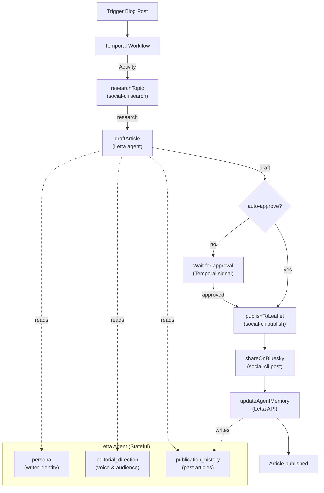

## What You're Building

Blogs die when the publishing cadence breaks. A busy week becomes a silent month, and the audience drifts away. The ideas were there — the pipeline wasn't.

You could fix this with a cron job and a script. But cron jobs don't survive crashes. If the script dies mid-publish — LLM API times out, network hiccups, the machine goes to sleep — you get a half-published article or, worse, nothing at all. No retry. No recovery. No memory of what was already done.

In this tutorial you'll build a **durable autonomous blog publisher** that fixes all of that. Three technologies, each doing what it does best:

- **[Letta](https://letta.com)** provides a stateful agent with persistent memory blocks. The agent holds your blog's editorial direction, writing style, and publication history. It remembers every article it has written, so it never repeats itself and always stays on voice. It's not a stateless LLM call — it's a writer that knows your blog.
- **[social-cli](https://github.com/letta-ai/social-cli)** is Letta's unified CLI for the social web. You'll use it to **research** topics by searching Bluesky for relevant posts, **publish** finished articles to [Leaflet.pub](https://leaflet.pub), and **promote** them by posting summaries to Bluesky — all from a single tool.
- **[Temporal](https://temporal.io)** provides durable execution. The publish pipeline is a long-running, crash-proof workflow. If the worker dies, Temporal replays the workflow from its last checkpoint when the worker restarts. No lost drafts. No duplicate publishes. No half-posted articles.
- **TypeScript** ties it all together with end-to-end type safety.

Here's what the agent does on each run:

1. **Researches** the topic by searching Bluesky for relevant posts using `social-cli search` — finding real conversations, questions, and discussions to ground the article in current activity.
2. **Drafts** a full-length article by sending the research to the Letta agent, which writes in your blog's voice using its memory of editorial direction and past publications.
3. **Pauses for approval** — if the article covers a sensitive or controversial topic, the workflow waits for a human approval signal before publishing.
4. **Publishes** the article to Leaflet.pub using `social-cli publish`.
5. **Promotes** the article by posting a summary to Bluesky using `social-cli post`.
6. **Updates** the Letta agent's memory so it knows what it has published and can avoid repeating topics.

If the worker crashes at any point — during the research, during the draft, while waiting for approval, during the publish — Temporal replays the workflow from its last checkpoint when the worker restarts. No lost work. No duplicate posts.

If you've worked through [Build an Autonomous Leaflet Blog Manager with Letta](/tutorials/letta-leaflet-blog-manager), you've seen this use case before — but in Python, with LangGraph, and with cron for scheduling. This tutorial adds the missing piece: **durable execution** so the pipeline survives crashes, retries failed API calls, and can pause for human approval — all without losing state. It also uses **social-cli for research** (searching Bluesky for real conversations) instead of web search, and **Temporal Schedules** instead of cron.

## The Architecture

The key insight is that these technologies layer cleanly:

- **Temporal** is the durability layer. It wraps the entire pipeline in a workflow that survives crashes, retries failed activities, and can pause for signals.
- **Letta** is the intelligence layer. It provides a stateful agent with persistent memory that writes the articles and maintains editorial consistency.
- **social-cli** is the data layer. It searches Bluesky for research material, publishes to Leaflet, and promotes on Bluesky — all through one CLI tool.



The Temporal workflow calls five activities:
1. **`researchTopic`** — searches Bluesky for posts about the topic using `social-cli search`
2. **`draftArticle`** — sends the research to the Letta agent, which writes a full article
3. **`publishToLeaflet`** — publishes the article to Leaflet using `social-cli publish`
4. **`shareOnBluesky`** — posts a summary to Bluesky using `social-cli post`
5. **`updateAgentMemory`** — tells the Letta agent to update its publication history

If the article covers a sensitive topic, the workflow pauses and waits for an approval signal before publishing. This means even the human-in-the-loop step is durable — if the workflow is interrupted while waiting for approval, it resumes waiting when the worker restarts.

## Project Setup

Create a new directory and initialize the project:

```bash
mkdir blog-publisher && cd blog-publisher
npm init -y
```

Install the dependencies:

```bash
npm install @temporalio/client @temporalio/worker @temporalio/workflow @temporalio/activity \
  @letta-ai/letta-client \
  yaml dotenv uuid
```

Install dev dependencies:

```bash
npm install -D tsx typescript @types/node @types/uuid
```

Create a `tsconfig.json`:

```json
{
  "compilerOptions": {
    "target": "ES2022",
    "module": "CommonJS",
    "moduleResolution": "node",
    "esModuleInterop": true,
    "strict": true,
    "outDir": "./dist",
    "rootDir": "./src",
    "skipLibCheck": true,
    "resolveJsonModule": true
  },
  "include": ["src/**/*"]
}
```

Add scripts to `package.json`:

```json
{
  "scripts": {
    "create-agent": "tsx src/create-agent.ts",
    "worker": "tsx src/worker.ts",
    "publish-post": "tsx src/trigger-post.ts",
    "approve-post": "tsx src/approve-post.ts"
  }
}
```

Your project structure:

```text
blog-publisher/
├── package.json
├── tsconfig.json
├── .env                 # Bluesky + Letta + Leaflet credentials
├── config.yaml          # social-cli account configuration
├── state/               # social-cli runtime state
├── content/             # Archive of published articles
│   └── posts/
└── src/
    ├── types.ts          # Shared TypeScript interfaces
    ├── create-agent.ts   # One-time script: create the Letta agent
    ├── activities.ts     # Temporal activities (social-cli + Letta)
    ├── workflows.ts      # Temporal workflow
    ├── worker.ts         # Temporal worker
    ├── trigger-post.ts   # Start a blog post from the CLI
    └── approve-post.ts   # Approve a post before publishing
```

## Step 1 — Install and Configure social-cli

`social-cli` is a Node tool built by Letta for connecting AI agents to the social web. You'll use it to search Bluesky, publish to Leaflet, and post to Bluesky — all from one CLI.

Clone, build, and link it:

```bash
git clone https://github.com/letta-ai/social-cli.git ~/social-cli
cd ~/social-cli
pnpm install
pnpm build
pnpm link --global      # exposes `social-cli` on your PATH
```

Confirm it's reachable:

```bash
social-cli --help
```

Then head back to your project directory:

```bash
cd ~/blog-publisher
```

## Step 2 — Set Up Bluesky and Leaflet

Leaflet is built on the AT Protocol, so it uses your **Bluesky identity** — no separate account needed.

1. Create a **Bluesky app password**: Go to [bsky.app](https://bsky.app) → **Settings → Privacy and Security → App Passwords** → **Add App Password**. Name it `blog-publisher`. Copy the generated code (`xxxx-xxxx-xxxx-xxxx`).

2. Create a **Leaflet publication**: Go to [leaflet.pub](https://leaflet.pub) and sign in with your Bluesky handle. Create a new publication. Open its settings and copy the **AT-URI**, which looks like:

   ```text
   at://did:plc:abcd1234.../site.standard.publication/xyz789
   ```

## Step 3 — Configure Credentials

Create a `config.yaml` for social-cli:

```yaml
accounts:
  bsky:
    handle: your-handle.bsky.social
    credentials: .env
state:
  stateDir: ./state
```

Create a `.env` file with your real values:

```text
# Bluesky (AT Protocol)
ATPROTO_HANDLE=your-handle.bsky.social
ATPROTO_APP_PASSWORD=xxxx-xxxx-xxxx-xxxx
ATPROTO_PDS=https://bsky.social

# Leaflet long-form publishing
LEAFLET_PUBLICATION_URI=at://did:plc:abcd1234.../site.standard.publication/xyz789

# Letta
LETTA_API_KEY=your-letta-api-key
BLOG_AGENT_ID=agent-xxxxxxxx-xxxx-xxxx-xxxx-xxxxxxxxxxxx

# Blog subjects (comma-separated) — the agent proposes topics within these
BLOG_SUBJECTS=AI agents, workflow automation, machine learning
```

Add `.env` to `.gitignore`:

```bash
echo ".env" >> .gitignore
```

Smoke-test social-cli:

```bash
social-cli whoami                     # should print your handle + DID
social-cli publish --title "Dry run" --content "# Testing" --dry-run
```

If `whoami` prints your handle and the dry run reports the record it *would* create, your credentials and Leaflet publication are wired correctly.

## Step 4 — Start the Temporal Dev Server

Install the Temporal CLI:

```bash
# macOS
brew install temporal

# Linux
brew install temporal
# or download from https://temporal.download/cli/archive/latest
```

Start the development server:

```bash
temporal server start-dev
```

This starts a single-process Temporal server on `localhost:7233` with a web UI at `http://localhost:8233`. Keep it running — it's the durable execution backend for your workflows.

Open `http://localhost:8233` in your browser. You should see the Temporal Web UI with no workflows yet. You'll come back here to watch your blog publishing workflows execute.

## Step 5 — Create the Letta Agent

The Letta agent is the brain of the blog publisher. It holds your blog's editorial direction in memory, remembers past articles, and maintains a consistent writing voice. Unlike a stateless LLM call, the agent accumulates context over time — it gets better the more it writes.

Create `src/create-agent.ts`:

```typescript
import Letta from "@letta-ai/letta-client";
import * as dotenv from "dotenv";

dotenv.config();

async function main() {
  const client = new Letta({
    apiKey: process.env.LETTA_API_KEY!,
  });

  const subjects = process.env.BLOG_SUBJECTS ?? "AI agents, workflow automation";

  const agent = await client.agents.create({
    name: "blog-publisher",
    model: "openai/gpt-4.1",
    memory_blocks: [
      {
        label: "persona",
        value: `You are the editorial manager for a Leaflet.pub blog. You research topics, write full-length articles in Markdown, and respond with structured JSON so the pipeline can act on your decisions.

When asked to write an article, you output a JSON object with:
- "title": the article title
- "slug": a URL-friendly slug (lowercase, hyphens, max 60 chars)
- "description": 1-2 sentence excerpt
- "tags": array of 3-5 tags
- "body_markdown": the full article in Markdown (800-1500 words)

When asked to update your memory, you use your core_memory_append tool to add the entry to your publication_history block.

Never claim to have published something yourself — you record decisions and the pipeline executes them.`,
      },
      {
        label: "editorial_direction",
        value: `Blog subjects: ${subjects}
Target audience: developers and technical leaders evaluating agentic AI for real business workflows.
Writing style: practical, expert but approachable, no hype. Articles should teach one concrete idea thoroughly — not survey a landscape. Use code examples where they clarify. Avoid clickbait titles. Prefer specificity over breadth.`,
      },
      {
        label: "publication_history",
        value: `This block accumulates entries from past articles. The pipeline asks the agent to update this block after each article is published.

No articles published yet.`,
      },
    ],
  });

  console.log("Agent created with ID:", agent.id);
  console.log("\nAdd this to your .env:");
  console.log(`BLOG_AGENT_ID=${agent.id}`);
}

main().catch(console.error);
```

Run it:

```bash
npm run create-agent
```

Copy the printed agent ID into your `.env` file:

```text
BLOG_AGENT_ID=agent-xxxxxxxx-xxxx-xxxx-xxxx-xxxxxxxxxxxx
```

The agent now has three memory blocks:
- **`persona`** — its identity as a blog writer and the JSON output format
- **`editorial_direction`** — your blog's subjects, target audience, and writing style (edit this to match your blog)
- **`publication_history`** — accumulates entries from past articles so the agent can avoid repeating topics

You can edit these blocks anytime in the [Letta UI](https://app.letta.com) — change the subjects, update the writing style, or clear the history. The changes apply to every future article without touching the workflow code.

## Step 6 — Define Shared Types

Create `src/types.ts` with the interfaces shared across the pipeline:

```typescript
export interface ResearchResult {
  query: string;
  postCount: number;
  posts: {
    author: string;
    text: string;
    createdAt: string;
  }[];
}

export interface DraftResult {
  title: string;
  slug: string;
  description: string;
  tags: string[];
  bodyMarkdown: string;
}

export interface PublishResult {
  title: string;
  slug: string;
  leafletUri: string;
  blueskyPostUri: string;
  posted: boolean;
  reason?: string;
}
```

These types flow through the entire pipeline: activities produce `ResearchResult` and `DraftResult`, the workflow combines them into a `PublishResult`, and the trigger script prints it.

## Step 7 — Write Temporal Activities

Activities are the units of work that Temporal retries on failure. They're regular async functions that can do I/O — CLI calls, API requests, file writes. The workflow calls them and Temporal handles retries, timeouts, and durability.

In this tutorial, activities wrap `social-cli` commands (research, publish, promote) and Letta API calls (draft, update memory). Each activity is a thin wrapper around an external tool.

Create `src/activities.ts`:

```typescript
import { exec } from "child_process";
import { promisify } from "util";
import * as fs from "fs";
import * as path from "path";
import Letta from "@letta-ai/letta-client";
import { parse as parseYaml } from "yaml";
import * as dotenv from "dotenv";
import type { ResearchResult, DraftResult } from "./types";

dotenv.config();

const execAsync = promisify(exec);
const lettaClient = new Letta({ apiKey: process.env.LETTA_API_KEY! });
const agentId = process.env.BLOG_AGENT_ID!;
const publicationUri = process.env.LEAFLET_PUBLICATION_URI!;
const postsDir = path.join(process.cwd(), "content", "posts");

// --- Helper: run social-cli ---

async function runSocialCli(args: string): Promise<string> {
  try {
    const { stdout } = await execAsync(`social-cli ${args}`, {
      timeout: 60000,
      cwd: process.cwd(),
    });
    return stdout;
  } catch (err: any) {
    throw new Error(
      `social-cli ${args} failed: ${err.stderr || err.message}`
    );
  }
}

// --- Activities ---

/** Search Bluesky for posts about a topic using social-cli. */
export async function researchTopic(
  topic: string,
  subject: string
): Promise<ResearchResult> {
  const query = `${topic} ${subject}`;
  const output = await runSocialCli(
    `search "${query.replace(/"/g, '\\"')}" -p bsky -n 20`
  );

  let posts: any[] = [];
  try {
    const parsed = parseYaml(output);
    posts = Array.isArray(parsed) ? parsed : [];
  } catch {
    posts = [];
  }

  return {
    query,
    postCount: posts.length,
    posts: posts.map((p) => ({
      author: p.author?.handle ?? "unknown",
      text: p.text ?? "",
      createdAt: p.createdAt ?? "",
    })),
  };
}

/** Ask the Letta agent to draft a full article based on research. */
export async function draftArticle(
  topic: string,
  subject: string,
  research: ResearchResult
): Promise<DraftResult> {
  const researchText = research.posts
    .map((p) => `@${p.author}: ${p.text}`)
    .join("\n");

  const prompt = `Write a full blog article for our Leaflet publication.

Title/Topic: ${topic}
Subject: ${subject}

Here is research from Bluesky posts about this topic. Use it to ground the article in real, current conversations. Cite sources by mentioning the authors.

--- Research ---
${researchText || "No Bluesky posts found. Write from your own knowledge."}
--- End Research ---

Write 800-1500 words in Markdown. Use ATX headings, paragraphs, lists, and inline code where helpful. Start with a 1-2 sentence description suitable as a blog excerpt.

Output a JSON object with:
- "title": the article title
- "slug": a URL-friendly slug (lowercase, hyphens, max 60 chars)
- "description": 1-2 sentence excerpt
- "tags": array of 3-5 tags
- "body_markdown": the full article in Markdown`;

  const response = await lettaClient.agents.messages.create(agentId, {
    input: prompt,
  });

  const assistantMsg = response.messages
    .filter((m: any) => m.role === "assistant")
    .pop();

  const content = assistantMsg?.content ?? "";

  // Parse JSON from the response (handle ```json fences or raw JSON)
  try {
    const jsonMatch = content.match(/```json\s*(.*?)\s*```/s);
    const jsonStr = jsonMatch ? jsonMatch[1] : content;
    const parsed = JSON.parse(jsonStr);
    return {
      title: parsed.title ?? topic,
      slug: parsed.slug ?? slugify(topic),
      description: parsed.description ?? "",
      tags: parsed.tags ?? [subject],
      bodyMarkdown: parsed.body_markdown ?? parsed.bodyMarkdown ?? content,
    };
  } catch {
    return {
      title: topic,
      slug: slugify(topic),
      description: content.slice(0, 200),
      tags: [subject],
      bodyMarkdown: content,
    };
  }
}

/** Publish a draft article to Leaflet using social-cli. */
export async function publishToLeaflet(
  draft: DraftResult
): Promise<string> {
  // Ensure the posts directory exists
  fs.mkdirSync(postsDir, { recursive: true });

  // Write the draft to a file with Leaflet frontmatter
  const filePath = path.join(postsDir, `${draft.slug}.md`);
  const frontmatter = `---
title: ${draft.title}
description: ${draft.description}
tags: ${draft.tags.join(", ")}
slug: ${draft.slug}
---

${draft.bodyMarkdown}
`;
  fs.writeFileSync(filePath, frontmatter);

  // Publish with social-cli
  const output = await runSocialCli(
    `publish --file "${filePath}" --publication "${publicationUri}"`
  );

  // Extract the AT-URI from the output
  const uriMatch = output.match(/(at:\/\/[^\s]+)/);
  return uriMatch ? uriMatch[1] : "";
}

/** Share a summary of the article on Bluesky using social-cli. */
export async function shareOnBluesky(
  title: string,
  slug: string,
  leafletUri: string
): Promise<string> {
  const text = `New post: ${title}\n\n${leafletUri}`;
  const output = await runSocialCli(
    `post "${text.replace(/"/g, '\\"')}" -p bsky`
  );

  // Extract the post URI from the output
  const uriMatch = output.match(/(at:\/\/[^\s]+)/);
  return uriMatch ? uriMatch[1] : "";
}

/** Ask the Letta agent to update its publication history. */
export async function updateAgentMemory(
  title: string,
  subject: string,
  leafletUri: string
): Promise<void> {
  await lettaClient.agents.messages.create(agentId, {
    input:
      `Update your publication_history memory block with this new entry:\n\n` +
      `Title: ${title}\nSubject: ${subject}\n` +
      `Leaflet URI: ${leafletUri}\n` +
      `Published: ${new Date().toISOString()}`,
  });
}

// --- Utility ---

function slugify(text: string): string {
  return text
    .toLowerCase()
    .replace(/[^a-z0-9]+/g, "-")
    .replace(/^-+|-+$/g, "")
    .slice(0, 60);
}
```

Five activities, each a thin wrapper:

- **`researchTopic`** — runs `social-cli search` to find Bluesky posts about the topic
- **`draftArticle`** — sends the research to the Letta agent, which writes a full article in Markdown
- **`publishToLeaflet`** — writes the draft to a file with Leaflet frontmatter, then runs `social-cli publish`
- **`shareOnBluesky`** — runs `social-cli post` to share a summary on Bluesky
- **`updateAgentMemory`** — sends a message to the Letta agent asking it to update its `publication_history` block

The `runSocialCli` helper uses `child_process.exec` with a 60-second timeout. If social-cli fails (network error, auth error, rate limit), the activity throws an error and Temporal retries it automatically.

The `draftArticle` activity asks the agent to output JSON with `title`, `slug`, `description`, `tags`, and `body_markdown`. The agent's `persona` memory block already knows this format — the prompt reinforces it. The activity parses the JSON from the response, handling both raw JSON and ```` ```json ```` fenced blocks.

The `publishToLeaflet` activity writes the draft to a Markdown file with Leaflet frontmatter (`title`, `description`, `tags`, `slug`), then runs `social-cli publish --file` to publish it. The slug becomes the canonical URL path on Leaflet.

## Step 8 — Write the Temporal Workflow

The workflow is the durable orchestration. It calls activities in order, handles the human-in-the-loop approval for sensitive topics, and exposes a query for checking status.

Create `src/workflows.ts`:

```typescript
import {
  proxyActivities,
  defineSignal,
  defineQuery,
  setHandler,
  condition,
} from "@temporalio/workflow";
import type * as activities from "./activities";
import type { ResearchResult, DraftResult, PublishResult } from "./types";

// Proxy activities with a retry policy
const {
  researchTopic,
  draftArticle,
  publishToLeaflet,
  shareOnBluesky,
  updateAgentMemory,
} = proxyActivities<typeof activities>({
  startToCloseTimeout: "5 minutes",
  retry: {
    initialInterval: "1s",
    backoffCoefficient: 2,
    maximumInterval: "1m",
    maximumAttempts: 3,
  },
});

// Signal for human approval
const approveSignal = defineSignal<[boolean]>("approve");
// Query for checking workflow status
const statusQuery = defineQuery<string>("status");

export async function blogPublishWorkflow(
  topic: string,
  subject: string,
  autoApprove: boolean = false
): Promise<PublishResult> {
  let status = "researching";
  let approved = false;

  // Register handlers
  setHandler(statusQuery, () => status);
  setHandler(approveSignal, (value: boolean) => {
    approved = value;
  });

  // 1. Research the topic on Bluesky
  status = "researching";
  const research: ResearchResult = await researchTopic(topic, subject);

  // 2. Draft the article using the Letta agent
  status = "drafting";
  const draft: DraftResult = await draftArticle(topic, subject, research);

  // 3. Check if the article needs human approval
  const isSensitive =
    /breaking|urgent|controversy|crisis|security|outage/i.test(
      draft.title + " " + draft.description
    );

  if (isSensitive && !autoApprove) {
    status = "awaiting_approval";
    // Wait up to 24 hours for an approval signal
    const gotApproval = await condition(() => approved, "24 hours");
    if (!gotApproval) {
      return {
        title: draft.title,
        slug: draft.slug,
        leafletUri: "",
        blueskyPostUri: "",
        posted: false,
        reason: "auto-rejected (timeout)",
      };
    }
  }

  // 4. Publish the article to Leaflet
  status = "publishing";
  const leafletUri = await publishToLeaflet(draft);

  // 5. Share the article on Bluesky
  status = "promoting";
  const blueskyPostUri = await shareOnBluesky(
    draft.title,
    draft.slug,
    leafletUri
  );

  // 6. Update the Letta agent's memory
  status = "updating_memory";
  await updateAgentMemory(draft.title, subject, leafletUri);

  status = "completed";
  return {
    title: draft.title,
    slug: draft.slug,
    leafletUri,
    blueskyPostUri,
    posted: true,
  };
}
```

The workflow is the heart of the system. Here's what makes it durable:

1. **Activities are retried automatically.** If `researchTopic` fails because social-cli can't reach Bluesky, Temporal retries it with exponential backoff (1s → 2s → 4s, up to 3 attempts). You don't write retry logic — Temporal handles it.

2. **The workflow survives crashes.** If the worker process is killed while `draftArticle` is executing, the workflow is paused. When the worker restarts, Temporal replays the workflow from its last checkpoint. Completed activities (like `researchTopic`) are not re-executed — their results are cached in the workflow history. Only the in-progress activity is retried.

3. **The approval wait is durable.** The `condition(() => approved, "24 hours")` call is a Temporal timer. If the worker crashes while waiting for approval, the workflow resumes waiting when the worker restarts. The 24-hour timeout keeps counting — it's stored in the Temporal server, not in the worker's memory.

4. **The status query is read-only.** You can query the workflow's status at any time using `statusQuery` without affecting the workflow's state.

The `autoApprove` parameter lets you skip the approval step for non-sensitive content. When scheduling recurring posts (Step 11), you can set `autoApprove` to `true` for fully autonomous operation, or leave it `false` to review each article before publishing.

## Step 9 — Run the Worker

The worker is the process that executes workflows and activities. It polls the Temporal server for tasks and runs them.

Create `src/worker.ts`:

```typescript
import { Worker } from "@temporalio/worker";
import * as activities from "./activities";

async function run() {
  const worker = await Worker.create({
    workflowsPath: require.resolve("./workflows"),
    activities,
    taskQueue: "blog-publish-queue",
  });

  console.log("Worker started on queue: blog-publish-queue");
  console.log("Listening for blog publishing workflows...");
  await worker.run();
}

run().catch(console.error);
```

Start the worker in a terminal:

```bash
npm run worker
```

The worker is now polling the `blog-publish-queue` task queue on the Temporal server. It will pick up workflows as they're started.

## Step 10 — Trigger a Blog Post

Create `src/trigger-post.ts` to start a blog post from the CLI:

```typescript
import { Client } from "@temporalio/client";
import { v4 as uuid } from "uuid";
import * as dotenv from "dotenv";
import { blogPublishWorkflow } from "./workflows";

dotenv.config();

async function run() {
  const topic = process.argv[2] || "How Memory Works in Stateful AI Agents";
  const subject = process.argv[3] || "AI agents";
  const autoApprove = process.argv[4] === "--auto";

  const client = new Client();
  const workflowId = `blog-${uuid().slice(0, 8)}`;

  console.log(`Starting blog post workflow`);
  console.log(`  Topic: "${topic}"`);
  console.log(`  Subject: "${subject}"`);
  console.log(`  Auto-approve: ${autoApprove}`);
  console.log(`  Workflow ID: ${workflowId}`);

  const result = await client.workflow.execute(blogPublishWorkflow, {
    workflowId,
    taskQueue: "blog-publish-queue",
    args: [topic, subject, autoApprove],
  });

  console.log("\nPublish result:");
  console.log(JSON.stringify(result, null, 2));
}

run().catch(console.error);
```

Trigger a blog post:

```bash
npm run publish-post -- "How Memory Works in Stateful AI Agents" "AI agents"
```

This will:
1. Search Bluesky for posts about "How Memory Works in Stateful AI Agents" and "AI agents"
2. Send the research to the Letta agent, which writes a full article
3. If the article is sensitive, pause and wait for approval (Step 10)
4. Publish the article to Leaflet
5. Share a summary on Bluesky
6. Update the agent's memory

If the article is not sensitive, the workflow runs straight through. You'll see the result in the terminal, on your Leaflet publication, and on your Bluesky feed.

If the article is sensitive, the workflow pauses at the approval step. The script will hang waiting for the workflow to complete. You'll need to approve or reject the post in another terminal (Step 10).

Watch the workflow execute in the Temporal Web UI at `http://localhost:8233`. You'll see each activity call (research, draft, publish, promote, update memory) with its inputs and outputs — all in real time.

## Step 11 — Approve Before Publishing

When the workflow detects a sensitive article, it pauses and waits for an approval signal. Create `src/approve-post.ts` to send that signal:

```typescript
import { Client } from "@temporalio/client";
import * as dotenv from "dotenv";

dotenv.config();

async function run() {
  const workflowId = process.argv[2];
  const decision = process.argv[3] || "approve";

  if (!workflowId) {
    console.error(
      "Usage: npm run approve-post -- <workflow-id> [approve|reject]"
    );
    process.exit(1);
  }

  const client = new Client();
  const handle = client.workflow.getHandle(workflowId);

  await handle.signal("approve", decision === "approve");

  console.log(`Signal sent: ${decision}`);
}

run().catch(console.error);
```

In a separate terminal, approve the post:

```bash
npm run approve-post -- blog-abcd1234
```

Or reject it:

```bash
npm run approve-post -- blog-abcd1234 reject
```

Replace `blog-abcd1234` with the workflow ID printed by the trigger script. The workflow will resume immediately — if approved, it publishes the article and shares it on Bluesky; if rejected, it returns the result without publishing.

You can check the workflow's status at any time using the Temporal CLI:

```bash
temporal workflow query --workflow-id blog-abcd1234 --name status
```

This returns the current status: `researching`, `drafting`, `awaiting_approval`, `publishing`, `promoting`, `updating_memory`, or `completed`.

## Step 12 — Schedule Recurring Posts

Running posts manually is fine for testing, but the real power is publishing on a schedule. Temporal supports this natively with Schedules — you don't need cron or external schedulers.

Create a schedule that publishes a post every Monday at 9 AM:

```bash
temporal schedule create \
  --schedule-id "blog-weekly-monday" \
  --task-queue "blog-publish-queue" \
  --workflow-type "blogPublishWorkflow" \
  --input '{"topic":"The State of AI Agents","subject":"AI agents","autoApprove":false}' \
  --calendar "0 9 * * 1"
```

This creates a Temporal Schedule that starts a new `blogPublishWorkflow` execution every Monday at 9 AM. The schedule is stored in the Temporal server — it survives crashes, restarts, and deployments.

For fully autonomous operation (no human approval), set `autoApprove` to `true`:

```bash
temporal schedule create \
  --schedule-id "blog-auto-tuesday" \
  --task-queue "blog-publish-queue" \
  --workflow-type "blogPublishWorkflow" \
  --input '{"topic":"Workflow Automation Patterns","subject":"workflow automation","autoApprove":true}' \
  --calendar "0 9 * * 2"
```

You can create multiple schedules for different topics and days:

```bash
# Monday: AI agents (with approval)
temporal schedule create \
  --schedule-id "blog-monday-ai" \
  --task-queue "blog-publish-queue" \
  --workflow-type "blogPublishWorkflow" \
  --input '{"topic":"AI Agents Weekly","subject":"AI agents","autoApprove":false}' \
  --calendar "0 9 * * 1"

# Thursday: Workflow automation (auto-publish)
temporal schedule create \
  --schedule-id "blog-thursday-automation" \
  --task-queue "blog-publish-queue" \
  --workflow-type "blogPublishWorkflow" \
  --input '{"topic":"Automation Patterns","subject":"workflow automation","autoApprove":true}' \
  --calendar "0 9 * * 4"
```

Manage your schedules:

```bash
# List all schedules
temporal schedule list --output json

# Pause a schedule
temporal schedule pause --schedule-id blog-monday-ai

# Resume a schedule
temporal schedule unpause --schedule-id blog-monday-ai

# Delete a schedule
temporal schedule delete --schedule-id blog-monday-ai
```

Each schedule starts an independent workflow with its own topic, subject, and approval setting. The Letta agent's memory is shared across all workflows — it remembers every article it has written, regardless of which schedule started it.

## Step 13 — Watch It Survive a Crash

This is where the tutorial earns its name. Let's prove the workflow is crash-proof.

1. Start a blog post:

```bash
npm run publish-post -- "How Memory Works in Stateful AI Agents" "AI agents"
```

2. While the workflow is running (watch the Temporal Web UI for the status), **kill the worker** (Ctrl+C in the worker terminal).

3. The trigger script will hang — the workflow is paused because there's no worker to execute it.

4. Check the Temporal Web UI at `http://localhost:8233`. The workflow is still there, in `RUNNING` state. Its completed activities (like `researchTopic`) are stored in the history. The `draftArticle` call — if it was in progress — is recorded as a pending activity.

5. **Restart the worker**:

```bash
npm run worker
```

6. The worker picks up the workflow from where it left off. Completed activities are not re-executed — their results are replayed from history. Only the in-progress activity is retried.

7. The workflow completes and the article is published to Leaflet and shared on Bluesky.

This is the power of durable execution. The workflow is not tied to a specific worker process. It's stored in the Temporal server's history and can be replayed by any worker. If your laptop dies, the AWS instance gets terminated, the Kubernetes pod gets evicted — the workflow survives. Start a new worker and it picks up where the old one left off.

The Letta agent's memory is also preserved across crashes. The `updateAgentMemory` activity runs after the article is published, so if the crash happened before that, the agent's memory is simply not updated — which is correct, because the article wasn't published yet.

## Troubleshooting

**`social-cli: command not found`.** Make sure you ran `pnpm link --global` in the social-cli directory. Verify with `which social-cli`. If the command is not on your PATH, add the global `pnpm` bin directory to your PATH, or use the full path to the `social-cli` binary.

**`social-cli publish` fails with an auth error.** Re-run `social-cli whoami` to confirm your Bluesky credentials are still valid. App passwords can be revoked — if the agent stopped publishing suddenly, this is the first thing to check. Also verify that `LEAFLET_PUBLICATION_URI` in your `.env` matches the AT-URI from your Leaflet publication settings.

**`social-cli search` returns no results.** The search query might be too specific. Try a broader query, or search for just the subject (e.g., "AI agents" instead of "How Memory Works in Stateful AI Agents AI agents"). Bluesky's search is full-text, so common words work better than rare phrases.

**The Letta agent returns empty or malformed JSON.** The agent's `persona` memory block instructs it to output JSON. If the agent doesn't output valid JSON, the `draftArticle` activity catches the parse error and uses the raw text as the article body. Check the agent's messages in the [Letta UI](https://app.letta.com) to see what it's actually returning. You may need to adjust the prompt or the persona block.

**`ApplicationFailure: Workflow timed out`.** The workflow has a 24-hour timeout on the approval step. If no approval signal is sent within 24 hours, the workflow auto-rejects. Adjust the timeout in `workflows.ts` if you need more or less time.

**The agent proposes the same topics repeatedly.** The `publication_history` memory block accumulates entries from past articles. If the agent is repeating topics, check that `updateAgentMemory` is running successfully after each publish. The agent needs the history in its context to know what it has already written about.

**`All @temporalio/* packages must have the same version`.** The Temporal TypeScript SDK requires all `@temporalio/*` packages to have the same version number. Check with `npm ls @temporalio` and pin them to the same version if they drift.

## Where to Go Next

You have a durable autonomous blog publisher, but there's plenty of room to grow it:

- **Add a topic proposal step.** Before researching, ask the Letta agent to propose a topic based on its editorial direction and publication history. The agent can suggest topics it hasn't covered yet, and the workflow can research and publish the best one. This makes the blog fully autonomous — you set the schedule, the agent picks the topics.
- **Add a human-in-the-loop review step.** Before publishing, use Temporal's `condition` to pause the workflow and send the draft to yourself on [Telegram](/tutorials/letta-telegram-bot) for review. Only resume after your approval — the safest way to run this against a real publication.
- **Add images.** After drafting an article, use an image generation API to create a cover image. social-cli supports media attachments on posts — use `-m` to attach an image to the Bluesky promotion post.
- **Track engagement.** After publishing, use `social-cli search` to find mentions of your article on Bluesky. Feed that data back to the Letta agent so it can learn which topics resonate and adjust its future proposals.
- **Expand to multiple publications.** Create multiple agents with different editorial directions and point each one at a different Leaflet publication URI. The workflow and activity structure stay the same — only the agent and the publication URI change.
- **Add web research.** In addition to searching Bluesky, use a web search API (like Tavily or SerpAPI) to find articles, blog posts, and documentation about the topic. Combine social research (Bluesky posts) with web research (articles) for richer, more grounded articles.
- **Deploy to production.** Replace the Temporal dev server with a self-hosted Temporal cluster or [Temporal Cloud](https://temporal.io/cloud). Use `workflowBundle` instead of `workflowsPath` for the worker. Run multiple workers across multiple machines for redundancy. The workflow code doesn't change — only the infrastructure.

The pattern underneath all of this is the one worth keeping: **Temporal** ensures the pipeline survives failures, **Letta** provides the stateful intelligence that makes the articles consistent and improving, and **social-cli** provides the unified interface to the social web — research, publish, and promote, all through one tool. Swap the blog publishing use case for any content pipeline — newsletters, social media campaigns, research briefings — and the architecture holds. The durability, intelligence, and data layers are independent, composable, and each one is the best at what it does.
