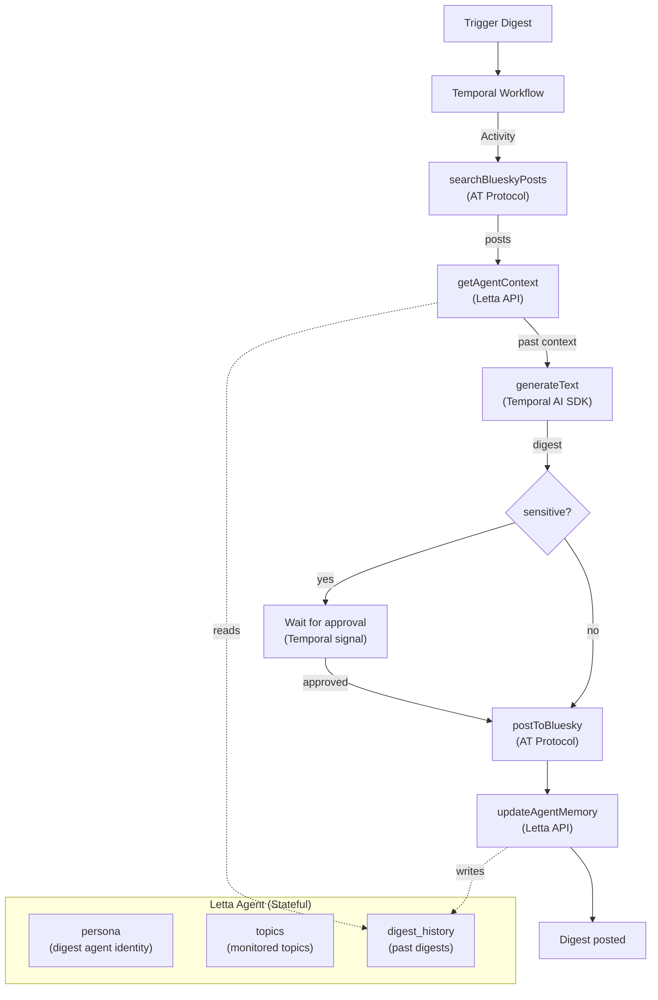

## What You're Building

Every day, thousands of conversations happen on Bluesky about topics you care about — AI agents, TypeScript, the AT Protocol, your company, your competitors. You can't read them all. But you can build something that does.

The problem with most "AI social media monitor" tutorials is that they're fragile. The script crashes on a rate limit, the LLM API times out, the network hiccups, and the digest is gone. You restart, but the state is lost — the agent doesn't remember what it already analyzed, so you get duplicate digests or missed windows.

In this tutorial you'll build a **durable AI Bluesky digest agent** that fixes all of that. Four technologies, each doing what it does best:

- **[Temporal AI SDK](https://docs.temporal.io/develop/typescript/integrations/ai-sdk)** (`@temporalio/ai-sdk`) wraps Vercel's AI SDK so that `generateText()` calls inside your workflow are automatically durable — retried on failure, replayed after crashes, and visible in the Temporal Web UI. You write AI SDK code directly in your workflow; the plugin handles wrapping each LLM call in a Temporal Activity behind the scenes.
- **[Letta](https://letta.com)** provides a stateful agent with persistent memory blocks. The agent remembers past digests, tracks which topics it has already covered, and provides context that makes each new digest better than the last. It's not a stateless API call — it's a digest writer that learns your beat.
- **[AT Protocol](https://atproto.com)** (`@atproto/api`) is the protocol behind Bluesky. You'll use it to search for posts about any topic and post digests back to Bluesky — all from TypeScript.
- **TypeScript** ties it all together with end-to-end type safety.

Here's what the agent does on each run:

1. **Searches Bluesky** for posts about a topic (e.g., "AI agents") from the last N hours using the AT Protocol's `searchPosts` endpoint.
2. **Reads context** from the Letta agent's memory — what digests have been written before, what topics are stale, what insights are worth following up on.
3. **Analyzes the posts** using `generateText()` from the Vercel AI SDK, called directly in the workflow. The Temporal AI SDK plugin automatically wraps this LLM call in a durable Activity.
4. **Checks for sensitivity** — if the digest mentions breaking news, controversy, or crisis, the workflow pauses and waits for human approval via a Temporal signal.
5. **Posts the digest** to Bluesky as a public post.
6. **Updates the Letta agent's memory** so the next digest has context.

If the worker crashes at any point — during the search, during the LLM call, while waiting for approval — Temporal replays the workflow from its last checkpoint when the worker restarts. No lost work. No duplicate posts. No missing digests.

If you've worked through [Build Your First Letta Agent](/tutorials/letta-build-your-first-agent) and [Build a Crash-Proof AI Code Reviewer with Temporal, Letta, and LangGraph](/tutorials/letta-durable-code-review), you know how Letta and Temporal work individually. This tutorial adds the **Temporal AI SDK** — a plugin that lets you write AI SDK code directly in workflows with zero boilerplate for durability — and the **AT Protocol** for searching and posting to Bluesky from TypeScript.

## The Architecture

The key insight is that these technologies layer cleanly:

- **Temporal AI SDK** is the AI+durability layer. You write `generateText()` in your workflow; the plugin wraps it in an Activity automatically. The LLM call is retried on failure, replayed after crashes, and visible in the Temporal Web UI.
- **Letta** is the memory layer. The agent stores past digests in memory blocks and provides context for each new run. The workflow reads from and writes to the agent via activities.
- **AT Protocol** is the data layer. Activities search for posts and post digests to Bluesky.



The workflow calls four activities (search, read memory, post, update memory) and one AI SDK call (`generateText`). The AI SDK call looks like regular Vercel AI SDK code, but the Temporal AI SDK plugin intercepts it and wraps it in a Temporal Activity behind the scenes. This means:

- If the LLM API rate-limits, Temporal retries the call with exponential backoff.
- If the worker crashes during the LLM call, the call is replayed when the worker restarts.
- The LLM call appears in the Temporal Web UI as an activity with its inputs, outputs, and duration.

You don't write any Activity code for the LLM call. The plugin handles it.

## Project Setup

Create a new directory and initialize the project:

```bash
mkdir bluesky-digest-agent && cd bluesky-digest-agent
npm init -y
```

Install the dependencies:

```bash
npm install @temporalio/client @temporalio/worker @temporalio/workflow @temporalio/activity \
  @temporalio/ai-sdk \
  @ai-sdk/openai ai \
  @letta-ai/letta-client \
  @atproto/api \
  dotenv uuid
```

Install dev dependencies:

```bash
npm install -D tsx typescript @types/node @types/uuid
```

Create a `tsconfig.json`:

```json
{
  "compilerOptions": {
    "target": "ES2022",
    "module": "CommonJS",
    "moduleResolution": "node",
    "esModuleInterop": true,
    "strict": true,
    "outDir": "./dist",
    "rootDir": "./src",
    "skipLibCheck": true,
    "resolveJsonModule": true
  },
  "include": ["src/**/*"]
}
```

Add scripts to `package.json`:

```json
{
  "scripts": {
    "create-agent": "tsx src/create-agent.ts",
    "worker": "tsx src/worker.ts",
    "digest": "tsx src/trigger-digest.ts",
    "approve": "tsx src/approve-digest.ts"
  }
}
```

Create a `.env` file:

```text
# Letta
LETTA_API_KEY=your-letta-api-key
DIGEST_AGENT_ID=agent-xxxxxxxx-xxxx-xxxx-xxxx-xxxxxxxxxxxx

# Bluesky
BLUESKY_HANDLE=your-handle.bsky.social
BLUESKY_APP_PASSWORD=your-app-password

# OpenAI (used by the Temporal AI SDK via Vercel AI SDK)
OPENAI_API_KEY=your-openai-api-key
```

You'll fill in the `DIGEST_AGENT_ID` after creating the agent in Step 2. For Bluesky, create an [app password](https://bsky.app/settings/app-passwords) (not your main password). The `OPENAI_API_KEY` is used by the Vercel AI SDK's OpenAI provider, which the Temporal AI SDK plugin calls behind the scenes.

Your project structure:

```text
bluesky-digest-agent/
├── package.json
├── tsconfig.json
├── .env
└── src/
    ├── types.ts             # Shared TypeScript interfaces
    ├── create-agent.ts      # One-time script: create the Letta agent
    ├── activities.ts        # Temporal activities (AT Protocol + Letta)
    ├── workflows.ts         # Temporal workflow (uses Temporal AI SDK)
    ├── worker.ts            # Temporal worker (configured with AiSdkPlugin)
    ├── trigger-digest.ts    # Start a digest from the CLI
    └── approve-digest.ts    # Approve a sensitive digest from the CLI
```

## Step 1 — Start the Temporal Dev Server

Install the Temporal CLI:

```bash
# macOS
brew install temporal

# Linux
brew install temporal
# or download from https://temporal.download/cli/archive/latest
```

Start the development server:

```bash
temporal server start-dev
```

This starts a single-process Temporal server on `localhost:7233` with a web UI at `http://localhost:8233`. Keep it running — it's the durable execution backend for your workflows.

Open `http://localhost:8233` in your browser. You should see the Temporal Web UI with no workflows yet. You'll come back here to watch your digest workflows execute, see the AI SDK activity calls, and inspect their inputs and outputs.

## Step 2 — Create the Letta Agent

The Letta agent is the memory layer. It holds past digests in a memory block, knows which topics it's monitoring, and provides context that makes each new digest better. Unlike a stateless LLM call, the agent accumulates context over time — it gets better the more it runs.

Create `src/create-agent.ts`:

```typescript
import Letta from "@letta-ai/letta-client";
import * as dotenv from "dotenv";

dotenv.config();

async function main() {
  const client = new Letta({
    apiKey: process.env.LETTA_API_KEY!,
  });

  const agent = await client.agents.create({
    name: "bluesky-digest",
    model: "openai/gpt-4.1",
    memory_blocks: [
      {
        label: "persona",
        value: `You are a Bluesky digest agent. You monitor conversations on Bluesky and help generate concise, informative digests about specific topics.

When asked for context from past digests, you summarize what you've covered recently and highlight any topics that are stale or worth following up on.

When asked to update your memory, you use your core_memory_append tool to add the new digest entry to your digest_history block.`,
      },
      {
        label: "topics",
        value: `Topics to monitor:
- AI agents
- Temporal
- Letta
- AT Protocol
- TypeScript

Edit this block to change the monitored topics.`,
      },
      {
        label: "digest_history",
        value: `This block accumulates entries from past digests. The pipeline asks the agent to update this block after each digest is posted.

No digests yet.`,
      },
    ],
  });

  console.log("Agent created with ID:", agent.id);
  console.log("\nAdd this to your .env:");
  console.log(`DIGEST_AGENT_ID=${agent.id}`);
}

main().catch(console.error);
```

Run it:

```bash
npm run create-agent
```

Copy the printed agent ID into your `.env` file:

```text
DIGEST_AGENT_ID=agent-xxxxxxxx-xxxx-xxxx-xxxx-xxxxxxxxxxxx
```

The agent now has three memory blocks:
- **`persona`** — its identity as a Bluesky digest agent and instructions for providing context and updating memory
- **`topics`** — the list of topics to monitor (edit this in the [Letta UI](https://app.letta.com) to match your interests)
- **`digest_history`** — accumulates entries from past digests so the agent can provide context for the next run

You can edit these blocks anytime in the Letta UI — change the topics, update the persona, or clear the history. The changes apply to every future digest without touching the workflow code.

## Step 3 — Define Shared Types

Create `src/types.ts` with the interfaces shared across the pipeline:

```typescript
export interface BlueskyPost {
  uri: string;
  cid: string;
  author: string;
  text: string;
  createdAt: string;
  likeCount: number;
  repostCount: number;
}

export interface DigestResult {
  topic: string;
  postCount: number;
  summary: string;
  keyInsights: string[];
  digest: string;
  posted: boolean;
  reason?: string;
}
```

These types flow through the entire pipeline: activities produce `BlueskyPost[]`, the workflow produces a `DigestResult`, and the trigger script prints it.

## Step 4 — Write Temporal Activities

Activities are the units of work that Temporal retries on failure. They're regular async functions that can do I/O — API calls, network requests, database reads. The workflow calls them and Temporal handles retries, timeouts, and durability.

In this tutorial, activities handle everything *except* the LLM call — the LLM call is handled by the Temporal AI SDK plugin directly in the workflow (Step 5). Activities handle the AT Protocol (searching and posting to Bluesky) and the Letta API (reading and writing agent memory).

Create `src/activities.ts`:

```typescript
import { AtpAgent } from "@atproto/api";
import Letta from "@letta-ai/letta-client";
import * as dotenv from "dotenv";
import type { BlueskyPost } from "./types";

dotenv.config();

// --- AT Protocol Client (lazy initialization) ---

let bskyAgent: AtpAgent | null = null;

async function getBskyAgent(): Promise<AtpAgent> {
  if (!bskyAgent) {
    bskyAgent = new AtpAgent({ service: "https://bsky.social" });
    await bskyAgent.login({
      identifier: process.env.BLUESKY_HANDLE!,
      password: process.env.BLUESKY_APP_PASSWORD!,
    });
  }
  return bskyAgent;
}

// --- Letta Client ---

const lettaClient = new Letta({ apiKey: process.env.LETTA_API_KEY! });
const agentId = process.env.DIGEST_AGENT_ID!;

// --- Activities ---

/** Search Bluesky for posts about a topic since a given timestamp. */
export async function searchBlueskyPosts(
  topic: string,
  since: string
): Promise<BlueskyPost[]> {
  const bsky = await getBskyAgent();
  const response = await bsky.app.bsky.feed.searchPosts({
    q: topic,
    sort: "latest",
    since,
    limit: 100,
  });

  return response.data.posts.map((p: any) => ({
    uri: p.uri,
    cid: p.cid,
    author: p.author?.handle ?? "unknown",
    text: p.record?.text ?? "",
    createdAt: p.record?.createdAt ?? "",
    likeCount: p.likeCount ?? 0,
    repostCount: p.repostCount ?? 0,
  }));
}

/** Ask the Letta agent for context from past digests. */
export async function getAgentContext(): Promise<string> {
  const response = await lettaClient.agents.messages.create(agentId, {
    input:
      "Provide a brief summary of the key topics and insights from your past digests. " +
      "If this is your first digest, say 'No past context.'",
  });

  const assistantMsg = response.messages
    .filter((m: any) => m.role === "assistant")
    .pop();

  return assistantMsg?.content ?? "No past context.";
}

/** Ask the Letta agent to update its memory with a new digest entry. */
export async function updateAgentMemory(
  digest: string,
  topic: string,
  postCount: number
): Promise<void> {
  await lettaClient.agents.messages.create(agentId, {
    input:
      `Update your digest_history memory block with this new entry:\n\n` +
      `Topic: ${topic}\nPosts analyzed: ${postCount}\n` +
      `Digest: ${digest}\nTimestamp: ${new Date().toISOString()}`,
  });
}

/** Post a digest to Bluesky. */
export async function postToBluesky(text: string): Promise<void> {
  const bsky = await getBskyAgent();
  await bsky.post({ text, createdAt: new Date().toISOString() });
}
```

Four activities, each a thin wrapper around an external API:

- **`searchBlueskyPosts`** — calls the AT Protocol's `searchPosts` endpoint to find posts about a topic
- **`getAgentContext`** — sends a message to the Letta agent asking it to summarize its past digests
- **`updateAgentMemory`** — sends a message to the Letta agent asking it to update its memory
- **`postToBluesky`** — posts the digest to Bluesky via the AT Protocol

The AT Protocol client uses lazy initialization — the `getBskyAgent()` function logs in on first use and reuses the session for subsequent calls. This avoids logging in on every activity invocation.

The Letta activities use the agent's message API rather than directly manipulating memory blocks. The agent reads its own memory blocks when asked for context and uses its built-in `core_memory_append` tool to update its `digest_history` block. This keeps the memory management in the agent, not in the activity code.

If any activity fails — Bluesky rate-limits you, the Letta API is down, the network hiccups — Temporal retries it automatically. The retry policy is configured in the workflow (Step 5).

## Step 5 — Write the Temporal Workflow

The workflow is the durable orchestration. It calls activities in order, uses the Temporal AI SDK for the LLM call, handles human-in-the-loop approval for sensitive digests, and exposes a query for checking status.

This is where the Temporal AI SDK shines. Instead of writing a separate activity for the LLM call, you call `generateText()` directly in the workflow. The plugin intercepts the call and wraps it in a Temporal Activity behind the scenes — with retries, timeouts, and durability. You write AI SDK code; Temporal handles the rest.

Create `src/workflows.ts`:

```typescript
import {
  proxyActivities,
  defineSignal,
  defineQuery,
  setHandler,
  condition,
} from "@temporalio/workflow";
import { generateText } from "ai";
import { temporalProvider } from "@temporalio/ai-sdk";
import type * as activities from "./activities";
import type { DigestResult } from "./types";

// Proxy activities with a retry policy
const {
  searchBlueskyPosts,
  getAgentContext,
  updateAgentMemory,
  postToBluesky,
} = proxyActivities<typeof activities>({
  startToCloseTimeout: "5 minutes",
  retry: {
    initialInterval: "1s",
    backoffCoefficient: 2,
    maximumInterval: "1m",
    maximumAttempts: 3,
  },
});

// Signal for human approval
const approveSignal = defineSignal<[boolean]>("approve");
// Query for checking workflow status
const statusQuery = defineQuery<string>("status");

export async function digestWorkflow(
  topic: string,
  hoursBack: number = 12
): Promise<DigestResult> {
  let status = "searching";
  let approved = false;

  // Register handlers
  setHandler(statusQuery, () => status);
  setHandler(approveSignal, (value: boolean) => {
    approved = value;
  });

  // 1. Search Bluesky for posts
  status = "searching";
  const since = new Date(
    Date.now() - hoursBack * 60 * 60 * 1000
  ).toISOString();
  const posts = await searchBlueskyPosts(topic, since);

  if (posts.length === 0) {
    return {
      topic,
      postCount: 0,
      summary: "No posts found",
      keyInsights: [],
      digest: `No posts about "${topic}" in the last ${hoursBack} hours.`,
      posted: false,
      reason: "no posts",
    };
  }

  // 2. Get context from the Letta agent's memory
  status = "reading_memory";
  const pastContext = await getAgentContext();

  // 3. Analyze posts using the Temporal AI SDK
  //    generateText() is called directly in the workflow.
  //    The AiSdkPlugin (configured on the worker) automatically
  //    wraps this call in a Temporal Activity — with retries,
  //    timeouts, and durability. No Activity code needed.
  status = "analyzing";
  const postsText = posts
    .map((p) => `@${p.author}: ${p.text}`)
    .join("\n");

  const analysisResult = await generateText({
    model: temporalProvider.languageModel("gpt-4o-mini"),
    system:
      `You are a Bluesky digest agent. Analyze the following posts about ` +
      `"${topic}" and generate a digest.\n\n` +
      `Output a JSON object with:\n` +
      `- "summary": 2-3 sentence summary of the conversation\n` +
      `- "keyInsights": array of 3-5 key insights (one sentence each)\n` +
      `- "digest": a full digest post (max 300 chars) for posting to Bluesky\n\n` +
      `Past context from previous digests:\n${pastContext}`,
    prompt: postsText,
  });

  // Parse the analysis (handle both raw JSON and ```json fences)
  let analysis: {
    summary: string;
    keyInsights: string[];
    digest: string;
  };
  try {
    const jsonMatch = analysisResult.text.match(/```json\s*(.*?)\s*```/s);
    const jsonStr = jsonMatch ? jsonMatch[1] : analysisResult.text;
    analysis = JSON.parse(jsonStr);
  } catch {
    analysis = {
      summary: "Analysis completed",
      keyInsights: [],
      digest: analysisResult.text.slice(0, 300),
    };
  }

  // 4. Check if the digest is sensitive (needs human approval)
  const isSensitive = analysis.keyInsights.some((i) =>
    /breaking|urgent|controversy|crisis|outage|security/i.test(i)
  );

  if (isSensitive) {
    status = "awaiting_approval";
    // Wait up to 24 hours for an approval signal
    const gotApproval = await condition(() => approved, "24 hours");
    if (!gotApproval) {
      return {
        ...analysis,
        topic,
        postCount: posts.length,
        posted: false,
        reason: "auto-rejected (timeout)",
      };
    }
  }

  // 5. Post the digest to Bluesky
  status = "posting";
  await postToBluesky(analysis.digest);

  // 6. Update the Letta agent's memory
  status = "updating_memory";
  await updateAgentMemory(analysis.digest, topic, posts.length);

  status = "completed";
  return { ...analysis, topic, postCount: posts.length, posted: true };
}
```

The workflow is the heart of the system. Here's what makes it special:

**The `generateText()` call is durable.** It looks like regular Vercel AI SDK code — `generateText({ model, system, prompt })` — but the `temporalProvider.languageModel("gpt-4o-mini")` model is a Temporal-aware proxy. When the workflow executes, the plugin intercepts the call and runs it as a Temporal Activity. If the OpenAI API rate-limits, Temporal retries with exponential backoff. If the worker crashes during the call, the call is replayed when the worker restarts. The call appears in the Temporal Web UI as an activity with its inputs, outputs, and duration.

**The Letta agent provides memory, not intelligence.** The LLM call goes through the Temporal AI SDK (Vercel AI SDK → OpenAI), not through Letta. Letta is used as a memory store — the workflow reads context from the agent before the analysis and writes the result back after. This separation is intentional: the Temporal AI SDK handles the AI call with durability, and Letta handles the memory with persistence. Each tool does what it's best at.

**The approval wait is durable.** The `condition(() => approved, "24 hours")` call is a Temporal timer. If the worker crashes while waiting for approval, the workflow resumes waiting when the worker restarts. The 24-hour timeout keeps counting — it's stored in the Temporal server, not in the worker's memory.

**The status query is read-only.** You can query the workflow's status at any time using `statusQuery` — from the CLI, from another script, or from the Temporal Web UI. This is safe to call without affecting the workflow's state.

The `import type * as activities` pattern is critical in the Temporal TypeScript SDK — it ensures that activity implementations are not bundled into the workflow's V8 sandbox. The workflow only knows the activity *types*, not the implementations.

## Step 6 — Run the Worker

The worker is the process that executes workflows and activities. It polls the Temporal server for tasks and runs them. The key difference from a regular Temporal worker is the `AiSdkPlugin` — this plugin intercepts `generateText()` calls in the workflow and wraps them in activities.

Create `src/worker.ts`:

```typescript
import { Worker } from "@temporalio/worker";
import { AiSdkPlugin } from "@temporalio/ai-sdk";
import { openai } from "@ai-sdk/openai";
import * as activities from "./activities";

async function run() {
  const worker = await Worker.create({
    workflowsPath: require.resolve("./workflows"),
    activities,
    taskQueue: "bluesky-digest-queue",
    plugins: [
      // The AiSdkPlugin wraps AI SDK calls (like generateText) in
      // Temporal Activities automatically. The modelProvider specifies
      // which AI provider to use — OpenAI in this case.
      new AiSdkPlugin({
        modelProvider: openai,
      }),
    ],
  });

  console.log("Worker started on queue: bluesky-digest-queue");
  console.log("Listening for digest workflows...");
  await worker.run();
}

run().catch(console.error);
```

The `AiSdkPlugin` takes a `modelProvider` — this is the Vercel AI SDK provider that will be used for LLM calls. We're using `openai` from `@ai-sdk/openai`, which reads the `OPENAI_API_KEY` environment variable. The plugin registers activities for model invocation behind the scenes, so when the workflow calls `generateText()`, the plugin routes it through a Temporal Activity that calls the OpenAI API.

Start the worker in a terminal:

```bash
npm run worker
```

The worker is now polling the `bluesky-digest-queue` task queue on the Temporal server. It will pick up workflows as they're started.

> **Note:** The `@temporalio/ai-sdk` package is marked as experimental — APIs may change between versions. The patterns in this tutorial are based on the current API, but check the [Temporal AI SDK docs](https://docs.temporal.io/develop/typescript/integrations/ai-sdk) for the latest usage.

## Step 7 — Trigger a Digest

Create `src/trigger-digest.ts` to start a digest from the CLI:

```typescript
import { Client } from "@temporalio/client";
import { v4 as uuid } from "uuid";
import * as dotenv from "dotenv";
import { digestWorkflow } from "./workflows";

dotenv.config();

async function run() {
  const topic = process.argv[2] || "AI agents";
  const hoursBack = parseInt(process.argv[3] || "12");

  const client = new Client();
  const workflowId = `digest-${uuid().slice(0, 8)}`;

  console.log(`Starting digest for topic: "${topic}" (last ${hoursBack}h)`);
  console.log(`Workflow ID: ${workflowId}`);

  const result = await client.workflow.execute(digestWorkflow, {
    workflowId,
    taskQueue: "bluesky-digest-queue",
    args: [topic, hoursBack],
  });

  console.log("\nDigest result:");
  console.log(JSON.stringify(result, null, 2));
}

run().catch(console.error);
```

Trigger a digest:

```bash
npm run digest -- "AI agents" 12
```

This searches Bluesky for posts about "AI agents" from the last 12 hours, analyzes them, and posts a digest to your Bluesky account. The script will:

1. Start a Temporal workflow
2. Wait for it to complete (or timeout)
3. Print the digest result

If the digest is not sensitive, the workflow runs straight through: search → read memory → analyze → post → update memory. You'll see the result in the terminal and on your Bluesky feed.

If the digest is sensitive (mentions breaking news, controversy, crisis), the workflow pauses at the approval step. The script will hang waiting for the workflow to complete. You'll need to approve or reject the digest in another terminal (Step 8).

Watch the workflow execute in the Temporal Web UI at `http://localhost:8233`. You'll see:
- The workflow's status (running, waiting, completed)
- Each activity call (search, read memory, post, update memory) with its inputs and outputs
- The AI SDK activity (the `generateText()` call) with its prompt, response, and duration
- The signal handler (if the workflow is waiting for approval)

This visibility is one of the key benefits of Temporal — you can see exactly what your AI pipeline did, step by step, with full audit trails.

## Step 8 — Approve Sensitive Digests

When the workflow detects a sensitive digest, it pauses and waits for an approval signal. Create `src/approve-digest.ts` to send that signal:

```typescript
import { Client } from "@temporalio/client";
import * as dotenv from "dotenv";

dotenv.config();

async function run() {
  const workflowId = process.argv[2];
  const decision = process.argv[3] || "approve";

  if (!workflowId) {
    console.error(
      "Usage: npm run approve -- <workflow-id> [approve|reject]"
    );
    process.exit(1);
  }

  const client = new Client();
  const handle = client.workflow.getHandle(workflowId);

  await handle.signal("approve", decision === "approve");

  console.log(`Signal sent: ${decision}`);
}

run().catch(console.error);
```

In a separate terminal, approve the digest:

```bash
npm run approve -- digest-abcd1234
```

Or reject it:

```bash
npm run approve -- digest-abcd1234 reject
```

Replace `digest-abcd1234` with the workflow ID printed by the trigger script. The workflow will resume immediately — if approved, it posts the digest to Bluesky and updates the agent's memory; if rejected, it returns the result without posting.

You can also check the workflow's status at any time using the Temporal CLI:

```bash
temporal workflow query --workflow-id digest-abcd1234 --name status
```

This returns the current status: `searching`, `reading_memory`, `analyzing`, `awaiting_approval`, `posting`, `updating_memory`, or `completed`.

## Step 9 — Schedule Recurring Digests

Running digests manually is fine for testing, but the real power is running them on a schedule. Temporal supports this natively with Schedules — you don't need cron or external schedulers.

Create a schedule that runs a digest every 12 hours:

```bash
temporal schedule create \
  --schedule-id "digest-ai-agents-12h" \
  --task-queue "bluesky-digest-queue" \
  --workflow-type "digestWorkflow" \
  --input '{"topic":"AI agents","hoursBack":12}' \
  --interval "12h"
```

This creates a Temporal Schedule that starts a new `digestWorkflow` execution every 12 hours. The schedule is stored in the Temporal server — it survives crashes, restarts, and deployments. You can pause, resume, and delete it from the Temporal Web UI or CLI.

List your schedules:

```bash
temporal schedule list --output json
```

Pause a schedule:

```bash
temporal schedule pause --schedule-id digest-ai-agents-12h
```

Resume a schedule:

```bash
temporal schedule unpause --schedule-id digest-ai-agents-12h
```

Delete a schedule:

```bash
temporal schedule delete --schedule-id digest-ai-agents-12h
```

You can create multiple schedules for different topics — one for "AI agents" every 12 hours, another for "Temporal" every 6 hours, another for "AT Protocol" every 24 hours. Each schedule starts an independent workflow with its own topic and time window.

## Step 10 — Watch It Survive a Crash

This is where the tutorial earns its name. Let's prove the workflow is crash-proof.

1. Start a digest:

```bash
npm run digest -- "AI agents" 12
```

2. While the digest is running (watch the Temporal Web UI for the status), **kill the worker** (Ctrl+C in the worker terminal).

3. The trigger script will hang — the workflow is paused because there's no worker to execute it.

4. Check the Temporal Web UI at `http://localhost:8233`. The workflow is still there, in `RUNNING` state. Its completed activities (like `searchBlueskyPosts`) are stored in the history. The `generateText()` call — if it was in progress — is recorded as a pending activity.

5. **Restart the worker**:

```bash
npm run worker
```

6. The worker picks up the workflow from where it left off. Completed activities are not re-executed — their results are replayed from history. Only the in-progress activity is retried.

7. The workflow completes and the digest is posted to Bluesky.

This is the power of durable execution with the Temporal AI SDK. The LLM call — the most expensive and fragile part of the pipeline — is wrapped in a Temporal Activity. If the worker crashes during the LLM call, the call is replayed when the worker restarts. No wasted API calls. No lost work. No half-posted digests.

The Letta agent's memory is also preserved across crashes. The `getAgentContext` activity ran before the crash, so the context is in the workflow history. When the workflow resumes, it doesn't need to re-read the agent's memory — the result is replayed from history. The `updateAgentMemory` activity runs after the digest is posted, so if the crash happened before that, the agent's memory is simply not updated — which is correct, because the digest wasn't posted yet.

## Troubleshooting

**`XRPCError: invalid Datetime for 'since'`.** The AT Protocol's `searchPosts` endpoint expects the `since` parameter as a full ISO 8601 timestamp (e.g., `2026-07-04T00:00:00.000Z`), not a plain date. The workflow generates the timestamp with `new Date().toISOString()`, which should be correct. If you're passing a custom `since` value, make sure it includes the full timestamp.

**`AuthenticationError` from OpenAI.** The `@ai-sdk/openai` package reads the API key from the `OPENAI_API_KEY` environment variable. Make sure it's set in the `.env` file and that the key is valid. The Temporal AI SDK plugin uses this key when it wraps the `generateText()` call in an activity.

**`RateLimitError` from Bluesky or OpenAI.** Temporal retries rate-limited activities automatically with exponential backoff. The default retry policy (configured in the workflow) retries up to 3 times with a 1-second initial interval. If you're still hitting rate limits, reduce the `limit` parameter in `searchBlueskyPosts` or increase the time between scheduled digests.

**The Letta agent returns empty context.** If this is the first digest, the agent should say "No past context." If it returns something unexpected, check the agent's messages in the [Letta UI](https://app.letta.com) to see what it's actually saying. The agent's `persona` memory block instructs it to summarize past digests — you may need to adjust the prompt.

**`All @temporalio/* packages must have the same version`.** The Temporal TypeScript SDK requires all `@temporalio/*` packages to have the same version number. The `@temporalio/ai-sdk` package depends on specific versions of `@temporalio/common`, `@temporalio/plugin`, and `@temporalio/workflow`. Check with `npm ls @temporalio` and pin them to the same version if they drift.

**The `generateText()` call doesn't appear in the Temporal Web UI.** Make sure the `AiSdkPlugin` is configured on the worker with the correct `modelProvider`. The plugin registers activities for model invocation — if the plugin isn't configured, the `generateText()` call will fail or behave unexpectedly. Also check that the `temporalProvider` is imported from `@temporalio/ai-sdk` in the workflow file.

**The `@temporalio/ai-sdk` package is experimental.** The API may change between versions. If you encounter breaking changes, check the [Temporal AI SDK docs](https://docs.temporal.io/develop/typescript/integrations/ai-sdk) and the [samples repository](https://github.com/temporalio/samples-typescript/tree/main/ai-sdk) for the latest usage patterns.

## Where to Go Next

You have a durable AI Bluesky digest agent, but there's plenty of room to grow it:

- **Add tools to the AI call.** The Temporal AI SDK supports Vercel AI SDK tools — pass a `tools` option to `generateText()` and the model can call tools that execute as activities. For example, give the model a `fetchUrl` tool that retrieves the content of a link mentioned in a post, so the digest can include context from linked articles.
- **Post digests as threads.** Bluesky supports threads (reply chains). Instead of posting a single 300-character digest, split the digest into a thread: the summary as the root post, each key insight as a reply. Use the AT Protocol's `reply` field to create the thread.
- **Add sentiment tracking.** Ask the `generateText()` call to also output a sentiment score (positive, neutral, negative) for the topic. Store the score in the Letta agent's memory. Over time, the agent can detect sentiment shifts — "sentiment about AI agents turned negative after the safety incident last week" — and include them in digests.
- **Monitor multiple topics in parallel.** Use Temporal's `executeChild` to run multiple digest workflows in parallel — one per topic. Each child workflow has its own Letta agent context, its own search, and its own digest. The parent workflow waits for all children and posts a combined digest.
- **Add MCP tools.** The Temporal AI SDK supports Model Context Protocol (MCP) servers. Connect an MCP server that provides web search, and the `generateText()` call can search the web for additional context about a topic before generating the digest. The plugin handles MCP tool calls as activities automatically.
- **Add streaming.** The Temporal AI SDK supports streaming LLM output. Instead of waiting for the full `generateText()` result, stream tokens to a UI or to a signal handler so users can watch the digest being generated in real time.
- **Deploy to production.** Replace the Temporal dev server with a self-hosted Temporal cluster or [Temporal Cloud](https://temporal.io/cloud). Use `workflowBundle` instead of `workflowsPath` for the worker. Run multiple workers across multiple machines for redundancy. The workflow code doesn't change — only the infrastructure.

The pattern underneath all of this is worth keeping: **Temporal AI SDK** makes LLM calls durable with zero boilerplate, **Letta** provides the memory that makes each digest better than the last, and **AT Protocol** provides the data source and the output channel. Swap the Bluesky digest use case for any AI pipeline that needs durable LLM calls and persistent memory — content moderation, customer support, research briefings — and the architecture holds. The durability, memory, and data layers are independent, composable, and each one is the best at what it does.
