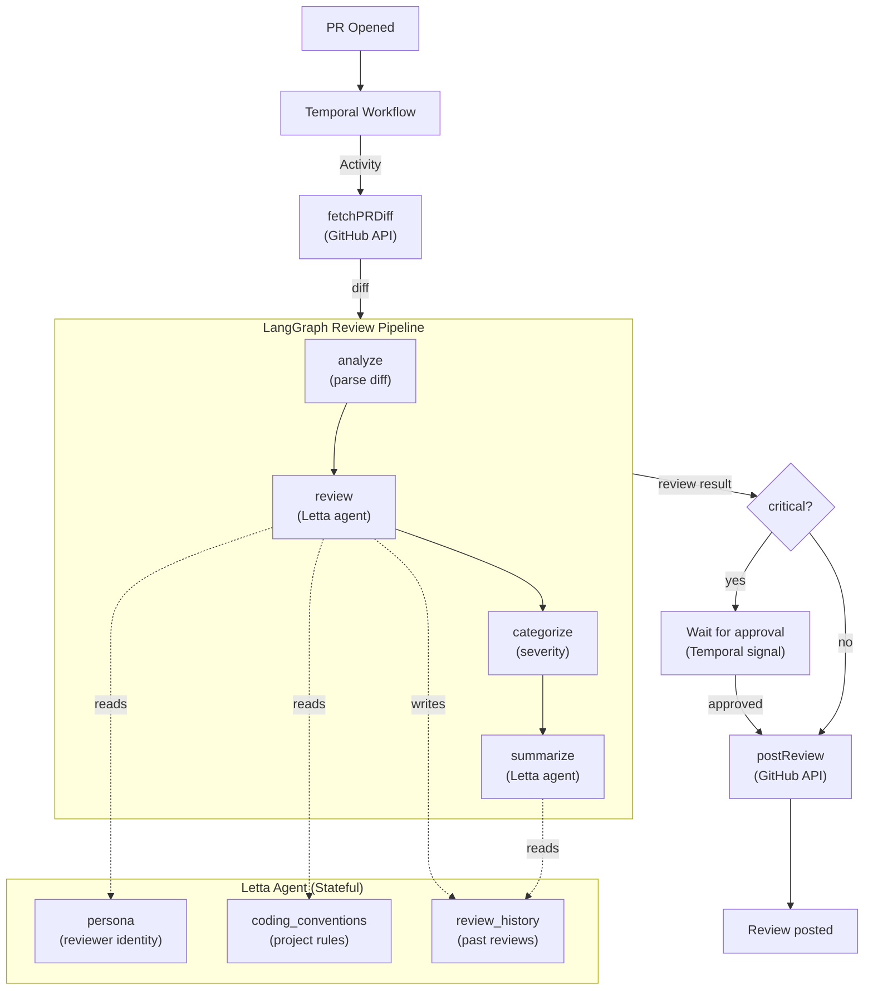

## What You're Building

AI code review is the obvious use case for LLMs — and the obvious failure mode is the pipeline dying halfway through. The GitHub webhook fires, the AI starts reviewing, the LLM API rate-limits, your laptop goes to sleep, and the review is gone. The PR sits there with no feedback. The developer waits. Eventually, someone reviews it manually.

The problem isn't the AI. It's the infrastructure around it.

In this tutorial you'll build an AI code reviewer that **survives crashes**. Three technologies, each doing what it does best:

- **[Temporal](https://temporal.io)** provides durable execution. The review workflow is a long-running, crash-proof process. If the worker dies, Temporal replays the workflow from its last checkpoint when the worker restarts. No lost work. No half-posted reviews.
- **[LangGraph](https://langchain-ai.github.io/langgraph/)** models the review pipeline as a typed state machine — analyze the diff, review with the agent, categorize by severity, generate a summary. Each node is a discrete step with typed inputs and outputs.
- **[Letta](https://letta.com)** provides the stateful AI agent. It holds your project's coding conventions in memory, remembers past reviews, and maintains a consistent reviewer voice across every PR. It's not a stateless API call — it's a reviewer that learns your codebase.
- **TypeScript** ties it all together with end-to-end type safety.

When a pull request is opened, a Temporal workflow starts. It fetches the diff, runs the LangGraph pipeline (which calls the Letta agent for the actual review), and posts the result as a GitHub review. If the review finds critical issues, the workflow pauses and waits for human approval before posting — using Temporal signals so the approval is durable too.

If you've worked through [Build Your First Letta Agent](/tutorials/letta-build-your-first-agent) and [Give Your Letta Agent Custom Tools](/tutorials/letta-agent-tools), you know how Letta agents work. If you've done [Build an Autonomous Leaflet Blog Manager with Letta](/tutorials/letta-leaflet-blog-manager), you've seen LangGraph orchestrate a pipeline. This tutorial adds the missing piece: **durable execution** so the pipeline survives crashes, retries failed API calls, and can pause for human approval — all without losing state.

## The Architecture

The key insight is that these three technologies don't overlap — they **layer**:

- **Temporal** is the durability layer. It wraps the entire pipeline in a workflow that survives crashes, retries failed activities, and can pause for signals.
- **LangGraph** is the orchestration layer. It models the review pipeline as a typed state machine with conditional routing.
- **Letta** is the intelligence layer. It provides a stateful agent with persistent memory that does the actual code review.



The Temporal workflow calls three activities:
1. **`fetchPRDiff`** — gets the diff from GitHub
2. **`runReviewPipeline`** — runs the LangGraph graph, which calls the Letta agent
3. **`postReview`** — posts the review to GitHub

If the review severity is "critical", the workflow pauses and waits for an approval signal before posting. This means even the human-in-the-loop step is durable — if the workflow is interrupted while waiting for approval, it resumes waiting when the worker restarts.

## Project Setup

Create a new directory and initialize the project:

```bash
mkdir ai-code-reviewer && cd ai-code-reviewer
npm init -y
```

Install the dependencies:

```bash
npm install @temporalio/client @temporalio/worker @temporalio/workflow @temporalio/activity \
  @langchain/langgraph @langchain/core \
  @letta-ai/letta-client \
  @octokit/rest dotenv uuid
```

Install dev dependencies:

```bash
npm install -D tsx typescript @types/node @types/uuid
```

Create a `tsconfig.json`:

```json
{
  "compilerOptions": {
    "target": "ES2022",
    "module": "CommonJS",
    "moduleResolution": "node",
    "esModuleInterop": true,
    "strict": true,
    "outDir": "./dist",
    "rootDir": "./src",
    "skipLibCheck": true,
    "resolveJsonModule": true
  },
  "include": ["src/**/*"]
}
```

Add scripts to `package.json`:

```json
{
  "scripts": {
    "create-reviewer": "tsx src/create-reviewer.ts",
    "worker": "tsx src/worker.ts",
    "review": "tsx src/trigger-review.ts",
    "approve": "tsx src/approve-review.ts"
  }
}
```

Create a `.env` file:

```text
LETTA_API_KEY=your-letta-api-key
REVIEW_AGENT_ID=agent-xxxxxxxx-xxxx-xxxx-xxxx-xxxxxxxxxxxx
GITHUB_TOKEN=your-github-personal-access-token
```

You'll fill in the `REVIEW_AGENT_ID` after creating the agent in Step 2. For the GitHub token, create a [personal access token](https://github.com/settings/tokens) with `repo` scope.

Your project structure will look like this:

```text
ai-code-reviewer/
├── package.json
├── tsconfig.json
├── .env
└── src/
    ├── types.ts             # Shared TypeScript interfaces
    ├── create-reviewer.ts   # One-time script: create the Letta agent
    ├── review-graph.ts      # LangGraph pipeline
    ├── activities.ts        # Temporal activities
    ├── workflows.ts         # Temporal workflow
    ├── worker.ts            # Temporal worker
    ├── trigger-review.ts    # Start a review from the CLI
    └── approve-review.ts    # Approve a critical review from the CLI
```

## Step 1 — Start the Temporal Dev Server

Install the Temporal CLI:

```bash
# macOS
brew install temporal

# Linux
brew install temporal
# or download from https://temporal.download/cli/archive/latest
```

Start the development server:

```bash
temporal server start-dev
```

This starts a single-process Temporal server on `localhost:7233` with a web UI at `http://localhost:8233`. Keep it running in a terminal — it's the durable execution backend for your workflows.

Open `http://localhost:8233` in your browser. You should see the Temporal Web UI with no workflows yet. You'll come back here to watch your review workflows execute.

## Step 2 — Create the Letta Agent

The Letta agent is the brain of the code reviewer. It holds your project's coding conventions in memory, remembers past reviews, and maintains a consistent reviewer voice. Unlike a stateless LLM call, the agent accumulates context over time — it gets better the more it reviews.

Create `src/create-reviewer.ts`:

```typescript
import Letta from "@letta-ai/letta-client";
import * as dotenv from "dotenv";

dotenv.config();

async function main() {
  const client = new Letta({
    apiKey: process.env.LETTA_API_KEY!,
  });

  const agent = await client.agents.create({
    name: "code-reviewer",
    model: "openai/gpt-4.1",
    memory_blocks: [
      {
        label: "persona",
        value: `You are a senior code reviewer with 15 years of experience across TypeScript, Python, Go, and Rust. You review code diffs and provide structured, actionable feedback.

When asked to review code, you output a JSON object with an "issues" array. Each issue has:
- "file": the file path
- "line": the approximate line number
- "severity": "critical", "warning", or "suggestion"
- "description": what's wrong and how to fix it

When asked to summarize, you output a plain text summary.

Always output valid JSON when asked to review. Do not include any text outside the JSON block.`,
      },
      {
        label: "coding_conventions",
        value: `Project conventions:
- TypeScript strict mode — no implicit any, no any types
- Prefer async/await over .then()/.catch()
- Error handling: throw ApplicationFailure for permanent errors
- Naming: camelCase for variables, PascalCase for types
- Functions should be pure and testable
- No unused imports or variables
- Handle edge cases explicitly`,
      },
      {
        label: "review_history",
        value: `This block accumulates notes from past reviews. The pipeline updates it after each review so the agent can learn from patterns and avoid repeating the same feedback.

No reviews yet.`,
      },
    ],
  });

  console.log("Agent created with ID:", agent.id);
  console.log("\nAdd this to your .env:");
  console.log(`REVIEW_AGENT_ID=${agent.id}`);
}

main().catch(console.error);
```

Run it:

```bash
npm run create-reviewer
```

Copy the printed agent ID into your `.env` file:

```text
REVIEW_AGENT_ID=agent-xxxxxxxx-xxxx-xxxx-xxxx-xxxxxxxxxxxx
```

The agent now has three memory blocks:
- **`persona`** — its identity as a senior code reviewer and the JSON output format
- **`coding_conventions`** — your project's coding rules (edit this to match your project)
- **`review_history`** — accumulates notes from past reviews so the agent learns over time

You can edit these blocks anytime in the [Letta UI](https://app.letta.com) — change the conventions, add project-specific rules, or update the persona. The changes apply to every future review without touching the pipeline code.

## Step 3 — Define Shared Types

Create `src/types.ts` with the interfaces shared across the pipeline:

```typescript
export interface ReviewIssue {
  file: string;
  line: number;
  severity: "critical" | "warning" | "suggestion";
  description: string;
}

export interface ReviewResult {
  issues: ReviewIssue[];
  summary: string;
  severity: "critical" | "warning" | "none";
  posted: boolean;
  reason?: string;
}
```

These types flow through the entire pipeline: the LangGraph graph produces a `ReviewResult`, the Temporal activities pass it between each other, and the workflow returns it as the final result.

## Step 4 — Build the LangGraph Review Pipeline

The LangGraph pipeline is the orchestration layer. It models the review process as a typed state machine with four nodes:

1. **`analyze`** — parses the diff to extract changed file names (pure logic, no AI)
2. **`review`** — sends the diff to the Letta agent, which reviews it using its memory of conventions and past reviews
3. **`categorize`** — determines the overall severity (pure logic, no AI)
4. **`summarize`** — asks the Letta agent to generate a human-readable summary

Create `src/review-graph.ts`:

```typescript
import { Annotation, StateGraph, END, START } from "@langchain/langgraph";
import Letta from "@letta-ai/letta-client";
import * as dotenv from "dotenv";
import type { ReviewIssue, ReviewResult } from "./types";

dotenv.config();

const lettaClient = new Letta({ apiKey: process.env.LETTA_API_KEY! });
const agentId = process.env.REVIEW_AGENT_ID!;

// --- State Definition ---

const ReviewState = Annotation.Root({
  diff: Annotation<string>(),
  files: Annotation<string[]>({
    reducer: (a, b) => [...new Set([...a, ...b])],
    default: () => [],
  }),
  issues: Annotation<ReviewIssue[]>({
    reducer: (a, b) => [...a, ...b],
    default: () => [],
  }),
  summary: Annotation<string>(),
  severity: Annotation<string>(),
});

// --- Nodes ---

/** Parse the diff to extract changed file names. */
function analyzeNode(state: typeof ReviewState.State) {
  const files: string[] = [];
  for (const line of state.diff.split("\n")) {
    if (line.startsWith("diff --git")) {
      const match = line.match(/b\/(.+)/);
      if (match) files.push(match[1]);
    }
  }
  return { files };
}

/** Send the diff to the Letta agent for code review. */
async function reviewNode(state: typeof ReviewState.State) {
  const prompt = `Review this code diff. Output a JSON object with an "issues" array. Each issue has: file, line, severity ("critical", "warning", or "suggestion"), and description. Only output the JSON.

${state.diff}`;

  const response = await lettaClient.agents.messages.create(agentId, {
    input: prompt,
  });

  // Find the last assistant message
  const assistantMsg = response.messages
    .filter((m: any) => m.role === "assistant")
    .pop();

  if (!assistantMsg) return { issues: [] };

  const content =
    typeof assistantMsg.content === "string"
      ? assistantMsg.content
      : JSON.stringify(assistantMsg.content);

  // Extract JSON from the response (handle ```json fences or raw JSON)
  try {
    const jsonMatch = content.match(/```json\s*(.*?)\s*```/s);
    const jsonStr = jsonMatch ? jsonMatch[1] : content;
    const parsed = JSON.parse(jsonStr);
    return { issues: (parsed.issues || []) as ReviewIssue[] };
  } catch {
    return { issues: [] };
  }
}

/** Determine the overall severity from the issues found. */
function categorizeNode(state: typeof ReviewState.State) {
  const hasCritical = state.issues.some((i) => i.severity === "critical");
  const hasWarning = state.issues.some((i) => i.severity === "warning");
  const severity = hasCritical ? "critical" : hasWarning ? "warning" : "none";
  return { severity };
}

/** Ask the Letta agent to generate a human-readable summary. */
async function summarizeNode(state: typeof ReviewState.State) {
  const issuesText = state.issues
    .map((i) => `- [${i.severity}] ${i.file}:${i.line} — ${i.description}`)
    .join("\n");

  const prompt = `Summarize this code review in 2-3 sentences. Do not output JSON, just the summary.

Issues found:
${issuesText || "No issues found."}`;

  const response = await lettaClient.agents.messages.create(agentId, {
    input: prompt,
  });

  const assistantMsg = response.messages
    .filter((m: any) => m.role === "assistant")
    .pop();

  const summary = assistantMsg
    ? typeof assistantMsg.content === "string"
      ? assistantMsg.content
      : JSON.stringify(assistantMsg.content)
    : "Review completed.";

  return { summary };
}

// --- Build and Compile the Graph ---

/** Run the full review pipeline on a diff and return the result. */
export async function runReviewGraph(diff: string): Promise<ReviewResult> {
  const graph = new StateGraph(ReviewState)
    .addNode("analyze", analyzeNode)
    .addNode("review", reviewNode)
    .addNode("categorize", categorizeNode)
    .addNode("summarize", summarizeNode)
    .addEdge(START, "analyze")
    .addEdge("analyze", "review")
    .addEdge("review", "categorize")
    .addEdge("categorize", "summarize")
    .addEdge("summarize", END)
    .compile();

  const result = await graph.invoke({ diff });

  return {
    issues: result.issues,
    summary: result.summary,
    severity: result.severity as ReviewResult["severity"],
    posted: false,
  };
}
```

Notice the separation of concerns:
- **`analyze`** and **`categorize`** are pure logic — no AI, no network calls, deterministic. They parse the diff and classify severity.
- **`review`** and **`summarize`** call the Letta agent. The agent uses its memory blocks (`persona`, `coding_conventions`, `review_history`) to produce context-aware reviews.

The `review` node asks the agent to output JSON with an `issues` array. The agent's `persona` memory block already knows this format — the prompt reinforces it. The node parses the JSON from the response, handling both raw JSON and ```` ```json ```` fenced blocks.

The graph is compiled once and then invoked with `{ diff }` as the initial state. The state flows through each node, accumulating `files`, `issues`, `severity`, and `summary` as it goes.

## Step 5 — Write Temporal Activities

Activities are the units of work that Temporal retries on failure. They're regular async functions that can do I/O — network calls, file reads, API requests. The workflow calls them and Temporal handles retries, timeouts, and durability.

Create `src/activities.ts`:

```typescript
import { Octokit } from "@octokit/rest";
import * as dotenv from "dotenv";
import { runReviewGraph } from "./review-graph";
import type { ReviewResult } from "./types";

dotenv.config();

const octokit = new Octokit({ auth: process.env.GITHUB_TOKEN });

/** Fetch the diff for a pull request. */
export async function fetchPRDiff(
  prNumber: number,
  repo: string
): Promise<string> {
  const [owner, name] = repo.split("/");
  const response = await octokit.pulls.get({
    owner,
    repo: name,
    pull_number: prNumber,
    headers: { Accept: "application/vnd.github.v3.diff" },
  });
  return response.data as unknown as string;
}

/** Run the LangGraph review pipeline on a diff. */
export async function runReviewPipeline(diff: string): Promise<ReviewResult> {
  return await runReviewGraph(diff);
}

/** Post a review comment on a pull request. */
export async function postReview(
  prNumber: number,
  repo: string,
  review: ReviewResult
): Promise<void> {
  const [owner, name] = repo.split("/");
  await octokit.pulls.createReview({
    owner,
    repo: name,
    pull_number: prNumber,
    body: review.summary,
    event: review.severity === "critical" ? "request_changes" : "comment",
  });
}
```

Each activity is a thin wrapper:
- **`fetchPRDiff`** calls the GitHub API to get the PR diff
- **`runReviewPipeline`** runs the LangGraph graph (which calls the Letta agent)
- **`postReview`** posts the review to GitHub

If any activity fails — GitHub rate-limits you, the Letta API is down, the network hiccups — Temporal retries it automatically. The retry policy is configured in the workflow (Step 6).

## Step 6 — Write the Temporal Workflow

The workflow is the durable orchestration. It calls activities in order, handles the human-in-the-loop approval for critical issues, and exposes a query for checking status.

Create `src/workflows.ts`:

```typescript
import {
  proxyActivities,
  defineSignal,
  defineQuery,
  setHandler,
  condition,
} from "@temporalio/workflow";
import type * as activities from "./activities";
import type { ReviewResult } from "./types";

// Proxy activities with a retry policy
const { fetchPRDiff, runReviewPipeline, postReview } = proxyActivities<
  typeof activities
>({
  startToCloseTimeout: "5 minutes",
  retry: {
    initialInterval: "1s",
    backoffCoefficient: 2,
    maximumInterval: "1m",
    maximumAttempts: 3,
  },
});

// Signal for human approval
const approveSignal = defineSignal<[boolean]>("approve");
// Query for checking workflow status
const statusQuery = defineQuery<string>("status");

export async function codeReviewWorkflow(
  prNumber: number,
  repo: string
): Promise<ReviewResult> {
  let status = "fetching";
  let approved = false;

  // Register handlers
  setHandler(statusQuery, () => status);
  setHandler(approveSignal, (value: boolean) => {
    approved = value;
  });

  // 1. Fetch the PR diff
  status = "fetching";
  const diff = await fetchPRDiff(prNumber, repo);

  // 2. Run the LangGraph review pipeline
  status = "reviewing";
  const review = await runReviewPipeline(diff);

  // 3. If critical issues, wait for human approval
  if (review.severity === "critical") {
    status = "awaiting_approval";
    // Wait up to 24 hours for an approval signal
    const gotApproval = await condition(() => approved, "24 hours");
    if (!gotApproval) {
      return { ...review, posted: false, reason: "auto-rejected (timeout)" };
    }
  }

  // 4. Post the review to GitHub
  status = "posting";
  await postReview(prNumber, repo, review);

  status = "completed";
  return { ...review, posted: true };
}
```

The workflow is the heart of the system. Here's what makes it durable:

1. **Activities are retried automatically.** If `fetchPRDiff` fails because GitHub is down, Temporal retries it with exponential backoff (1s → 2s → 4s, up to 3 attempts). You don't write retry logic — Temporal handles it.

2. **The workflow survives crashes.** If the worker process is killed while `runReviewPipeline` is executing, the workflow is paused. When the worker restarts, Temporal replays the workflow from its last checkpoint. Completed activities (like `fetchPRDiff`) are not re-executed — their results are cached in the workflow history. Only the in-progress activity is retried.

3. **The approval wait is durable.** The `condition(() => approved, "24 hours")` call is a Temporal timer. If the worker crashes while waiting for approval, the workflow resumes waiting when the worker restarts. The 24-hour timeout keeps counting — it's stored in the Temporal server, not in the worker's memory.

4. **The status query is read-only.** You can query the workflow's status at any time using `statusQuery` without affecting the workflow's state. This is safe to call from outside the workflow.

The `import type * as activities` pattern is critical in the Temporal TypeScript SDK — it ensures that activity implementations are not bundled into the workflow's V8 sandbox. The workflow only knows the activity *types*, not the implementations.

## Step 7 — Run the Worker

The worker is the process that executes workflows and activities. It polls the Temporal server for tasks and runs them.

Create `src/worker.ts`:

```typescript
import { Worker } from "@temporalio/worker";
import * as activities from "./activities";

async function run() {
  const worker = await Worker.create({
    workflowsPath: require.resolve("./workflows"),
    activities,
    taskQueue: "code-review-queue",
  });

  console.log("Worker started on queue: code-review-queue");
  console.log("Listening for review workflows...");
  await worker.run();
}

run().catch(console.error);
```

Start the worker in a terminal:

```bash
npm run worker
```

The worker is now polling the `code-review-queue` task queue on the Temporal server. It will pick up workflows as they're started.

## Step 8 — Trigger a Review

Create `src/trigger-review.ts` to start a review from the CLI:

```typescript
import { Client } from "@temporalio/client";
import { v4 as uuid } from "uuid";
import * as dotenv from "dotenv";
import { codeReviewWorkflow } from "./workflows";

dotenv.config();

async function run() {
  const prNumber = parseInt(process.argv[2]);
  const repo = process.argv[3];

  if (!prNumber || !repo) {
    console.error("Usage: npm run review -- <pr-number> <owner/repo>");
    console.error('Example: npm run review -- 42 myorg/myrepo');
    process.exit(1);
  }

  const client = new Client();
  const workflowId = `review-${prNumber}-${uuid().slice(0, 8)}`;

  console.log(`Starting review for PR #${prNumber} in ${repo}`);
  console.log(`Workflow ID: ${workflowId}`);

  const result = await client.workflow.execute(codeReviewWorkflow, {
    workflowId,
    taskQueue: "code-review-queue",
    args: [prNumber, repo],
  });

  console.log("\nReview result:");
  console.log(JSON.stringify(result, null, 2));
}

run().catch(console.error);
```

Trigger a review for a real PR:

```bash
npm run review -- 42 myorg/myrepo
```

Replace `42` with a real PR number and `myorg/myrepo` with a real repository. The script will:

1. Start a Temporal workflow
2. Wait for it to complete (or timeout)
3. Print the review result

If the review finds no critical issues, the workflow runs straight through: fetch diff → review → categorize → summarize → post review. You'll see the result in the terminal and on the GitHub PR.

If the review finds critical issues, the workflow pauses at the approval step. The script will hang waiting for the workflow to complete. You'll need to approve or reject the review in another terminal (Step 9).

You can also watch the workflow execute in the Temporal Web UI at `http://localhost:8233`. You'll see the workflow's status, its activities, and their results — all in real time.

## Step 9 — Approve Critical Reviews

When the workflow finds critical issues, it pauses and waits for an approval signal. Create `src/approve-review.ts` to send that signal:

```typescript
import { Client } from "@temporalio/client";
import * as dotenv from "dotenv";

dotenv.config();

async function run() {
  const workflowId = process.argv[2];
  const decision = process.argv[3] || "approve";

  if (!workflowId) {
    console.error("Usage: npm run approve -- <workflow-id> [approve|reject]");
    process.exit(1);
  }

  const client = new Client();
  const handle = client.workflow.getHandle(workflowId);

  await handle.signal("approve", decision === "approve");

  console.log(`Signal sent: ${decision}`);
}

run().catch(console.error);
```

In a separate terminal, approve the review:

```bash
npm run approve -- review-42-abcd1234
```

Or reject it:

```bash
npm run approve -- review-42-abcd1234 reject
```

Replace `review-42-abcd1234` with the workflow ID printed by the trigger script. The workflow will resume immediately — if approved, it posts the review to GitHub; if rejected, it returns the result without posting.

You can also check the workflow's status at any time using the Temporal CLI:

```bash
temporal workflow query --workflow-id review-42-abcd1234 --name status
```

This returns the current status: `fetching`, `reviewing`, `awaiting_approval`, `posting`, or `completed`.

## Step 10 — Watch It Survive a Crash

This is where the tutorial earns its name. Let's prove the workflow is crash-proof.

1. Start a review for a PR:

```bash
npm run review -- 42 myorg/myrepo
```

2. While the review is running, **kill the worker** (Ctrl+C in the worker terminal).

3. The trigger script will hang — the workflow is paused because there's no worker to execute it.

4. Check the Temporal Web UI at `http://localhost:8233`. The workflow is still there, in `RUNNING` state. Its completed activities are stored in the history.

5. **Restart the worker**:

```bash
npm run worker
```

6. The worker picks up the workflow from where it left off. Completed activities (like `fetchPRDiff`) are not re-executed — their results are replayed from history. Only the in-progress activity is retried.

7. The workflow completes and the review is posted to GitHub.

This is the power of durable execution. The workflow is not tied to a specific worker process. It's stored in the Temporal server's history and can be replayed by any worker. If your laptop dies, the AWS instance gets terminated, the Kubernetes pod gets evicted — the workflow survives. Start a new worker and it picks up where the old one left off.

## Troubleshooting

**`ModuleNotFoundError: No module named 'temporal'`.** The Temporal CLI is separate from the TypeScript SDK. Install the CLI with `brew install temporal` (macOS/Linux) and the SDK with `npm install @temporalio/client @temporalio/worker @temporalio/workflow @temporalio/activity`.

**`Activity execution failed: RequestError` from GitHub.** Check that your `GITHUB_TOKEN` has `repo` scope and hasn't expired. GitHub API rate limits can also cause this — the retry policy will handle transient failures, but persistent auth errors won't resolve on retry.

**The Letta agent returns empty issues.** The agent's `persona` memory block instructs it to output JSON. If the agent doesn't output valid JSON, the `reviewNode` catches the parse error and returns an empty issues array. Check the agent's messages in the [Letta UI](https://app.letta.com) to see what it's actually returning. You may need to adjust the prompt or the persona block.

**`ApplicationFailure: Workflow timed out`.** The workflow has a 24-hour timeout on the approval step. If no approval signal is sent within 24 hours, the workflow auto-rejects. Adjust the timeout in `workflows.ts` if you need more or less time.

**`All @temporalio/* packages must have the same version`.** The Temporal TypeScript SDK requires all `@temporalio/*` packages to have the same version number. Check with `npm ls @temporalio` and pin them to the same version if they drift.

**The worker can't find the workflow file.** The `workflowsPath: require.resolve("./workflows")` in `worker.ts` expects `workflows.ts` to be in the same directory. If you restructure the project, update this path. For production, use `workflowBundle` with pre-bundled code instead of `workflowsPath`.

## Where to Go Next

You have a crash-proof AI code reviewer, but there's plenty of room to grow it:

- **Add a GitHub webhook.** Instead of triggering reviews manually, set up a GitHub webhook that calls a small HTTP server which starts a Temporal workflow when a PR is opened. The webhook handler is a one-liner — all the logic lives in the workflow.
- **Update the agent's memory after each review.** After posting a review, send a follow-up message to the Letta agent asking it to note what it learned. The agent's `review_history` memory block will accumulate insights, and it'll get better at reviewing your codebase over time.
- **Add Slack notifications.** When a review is posted (or when a critical review is waiting for approval), send a message to a Slack channel. Use a Temporal activity to call the Slack API — it gets the same retry and durability guarantees as the other activities.
- **Review multiple files in parallel.** The LangGraph pipeline currently reviews the entire diff in one node. For large PRs, split the diff by file and review each file in parallel using LangGraph's `Send` API for map-reduce patterns. Each file gets its own Letta agent call, and the results are merged.
- **Add LangGraph checkpointing.** Swap the in-memory graph for a compiled graph with a checkpointer (`MemorySaver` or `SqliteSaver`). This lets you resume interrupted graph executions, replay states, and inspect the graph's execution history — useful for debugging a long-running pipeline.
- **Deploy to production.** Replace the Temporal dev server with a self-hosted Temporal cluster or [Temporal Cloud](https://temporal.io/cloud). Use `workflowBundle` instead of `workflowsPath` for the worker. Run multiple workers across multiple machines for redundancy. The workflow code doesn't change — only the infrastructure.
- **Add tests.** Use the Temporal TypeScript SDK's `TestWorkflowEnvironment` to test the workflow in isolation. Mock the activities and verify that the workflow handles critical issues, approvals, and timeouts correctly. Test that the workflow is replay-compatible so you can deploy new versions without breaking running workflows.

The pattern underneath all of this is the one worth keeping: **Temporal** ensures the pipeline survives failures, **LangGraph** models the AI workflow as a typed state machine, and **Letta** provides the stateful intelligence that makes the reviews consistent and improving. Swap the code review use case for any AI pipeline — document processing, content moderation, data enrichment — and the architecture holds. The durability, orchestration, and intelligence layers are independent, composable, and each one is the best at what it does.
