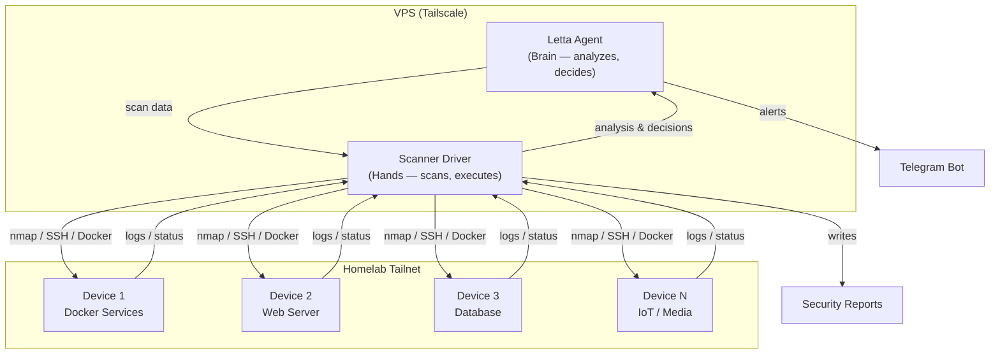

## What You're Building

A homelab is a target. Every service you expose — a media server, a database, a web dashboard, a Docker registry — is a potential entry point. The more devices you add, the more surface area there is, and the harder it becomes to audit it all manually. Port scans, SSH brute-force attempts, containers running as root, packages months behind on security patches — each one is a finding you'd catch if you had the time to check every machine every day. You don't.

In this tutorial you'll build an **autonomous security agent** that does the checking for you:

- A **Letta** agent holds your homelab's security baseline, threat history, and response rules in persistent memory.
- On a schedule, a local driver **scans every device** on your Tailscale tailnet — open ports (nmap), SSH auth logs, Docker container configurations, and available package updates.
- The driver feeds the scan data to the agent, which **analyzes** it against the baseline, **records threats**, and **decides on responses**.
- The driver **executes** the agent's decisions: block an attacking IP with UFW, restart a misbehaving service, or send a Telegram alert.
- A **security report** is generated after each scan so you can review what was found and what was done.

If you've worked through [Securely Run a Letta Server in the Cloud with Tailscale](/tutorials/letta-secure-cloud-server), you already have the infrastructure — a Letta server on a VPS, reachable over Tailscale, invisible to the public internet. This tutorial builds on that setup. The pattern is the same brain-hands architecture from [Build an Autonomous Leaflet Blog Manager with Letta](/tutorials/letta-leaflet-blog-manager) — a stateful agent supplies the judgment, a thin local driver supplies the hands — but here the output is a security scan and response instead of a blog post.

## The Architecture

The same constraint from the blog manager applies here: Letta executes custom tools in a **sandbox on the Letta server**, not on your VPS. That sandbox doesn't have `nmap`, SSH keys, or access to your homelab devices.

So we split responsibilities:

- **The Letta agent is the brain.** It holds the security baseline and threat history in memory blocks and makes analytical decisions — which findings are threats, how severe they are, and what to do about them. Its tools are tiny, dependency-free functions that just *record* a decision. Those are safe to run in the sandbox.
- **A local Python driver is the hands.** It runs nmap scans, SSHes into devices to check logs and Docker containers, sends the data to the agent, collects the agent's decisions, and executes them locally — blocking IPs, restarting services, and sending Telegram alerts.
- **A security report** (a Markdown file) is generated after each scan, archiving what was found and what was done.



The agent never touches the network or your devices. It just thinks and decides. The driver does the actual work.

## Project Folder Structure

Create a project directory on your VPS with this layout:

```text
homelab-security-agent/
├── .env                  # Letta config, SSH key path, Telegram credentials
├── requirements.txt      # Python deps for the driver
├── tools/
│   └── decisions.py      # the agent's decision tools (sandbox-safe)
├── create_agent.py       # one-time setup: register tools, create the agent
├── scanner.py            # the recurring driver (scan → analyze → respond)
├── security_tools.py     # nmap, SSH, Docker, package-update scanners
└── reports/              # generated security reports (Markdown)
```

Create the scaffolding:

```bash
mkdir -p homelab-security-agent/{tools,reports}
cd homelab-security-agent
```

## Step 1 — Prerequisites

This tutorial assumes you have:

1. **A Letta server running on a VPS behind Tailscale.** If you don't have this yet, follow [Securely Run a Letta Server in the Cloud with Tailscale](/tutorials/letta-secure-cloud-server) first. You'll need the server's Tailscale URL and password.

2. **Multiple devices on your Tailscale tailnet.** These are the machines the agent will scan — your homelab servers, Raspberry Pis, NAS boxes, media servers, whatever you run. Each one needs to be online and reachable via its Tailscale IP.

3. **SSH access to each device.** The driver SSHes into each device to check logs, Docker containers, and package updates. You need key-based SSH access (no passwords) from the VPS to every device.

4. **A Telegram bot for alerts** (optional but recommended). If you followed [Talk to Letta Agents via Telegram](/tutorials/letta-telegram-bot), you already have a bot token and chat ID. The agent will send security alerts through this bot.

5. **An OpenAI API key.** The Letta server uses this to power the agent's reasoning. It should already be configured on your Letta server from the cloud server tutorial.

## Step 2 — Install Security Tools on the VPS

The driver needs `nmap` for port scanning and `ssh` for connecting to devices. Install them on the VPS:

```bash
sudo apt-get update
sudo apt-get install -y nmap openssh-client
```

Confirm nmap is available:

```bash
nmap --version
```

Install Python and create a virtual environment for the project:

```bash
sudo apt-get install -y python3-venv
python3 -m venv .venv
source .venv/bin/activate
```

Create `requirements.txt`:

```text
letta-client
python-dotenv
requests
```

Install the dependencies:

```bash
pip install -r requirements.txt
```

## Step 3 — Configure SSH Access to Homelab Devices

The driver needs passwordless SSH access to every device on your tailnet. If you don't already have a key, generate one on the VPS:

```bash
ssh-keygen -t ed25519 -C "homelab-security" -f ~/.ssh/homelab_key
```

Copy the public key to each device on your tailnet. For each device, run:

```bash
ssh-copy-id -i ~/.ssh/homelab_key.pub root@<device-tailscale-ip>
```

Test that you can SSH into each device without a password:

```bash
ssh -i ~/.ssh/homelab_key root@<device-tailscale-ip> "hostname"
```

If that prints the device's hostname, you're connected. Repeat for every device you want the agent to scan.

Create `.env` with your configuration:

```text
# Letta server (from the secure cloud server tutorial)
LETTA_BASE_URL=https://letta.tailnet-name.ts.net
LETTA_SERVER_PASSWORD=your-letta-server-password
SECURITY_AGENT_ID=

# SSH access to homelab devices
SSH_KEY_PATH=~/.ssh/homelab_key
SSH_USER=root

# Telegram alerts (optional)
TELEGRAM_BOT_TOKEN=
TELEGRAM_CHAT_ID=
```

Add `.env` to `.gitignore`:

```bash
echo ".env" >> .gitignore
```

## Step 4 — Create the Agent's Decision Tools

The agent doesn't touch the network, run nmap, or SSH into devices. Instead it calls one of a few **decision tools** that simply *record* what it wants to do. Because these functions only return strings, they run safely in Letta's sandbox with no dependencies and no secrets.

Create `tools/decisions.py`:

```python
# tools/decisions.py
def record_threat(
    severity: str,
    description: str,
    device: str,
    threat_type: str,
) -> str:
    """Record a security threat detected during scan analysis.

    Call this for each threat you identify in the scan data. severity
    must be one of: critical, high, medium, low. description should
    explain what was detected and why it matters. device is the
    hostname or Tailscale IP of the affected device. threat_type is
    one of: open_port, brute_force, misconfiguration, outdated_software,
    unauthorized_access, anomalous_traffic, container_issue.
    Returns a confirmation string.
    """
    return f"QUEUED_THREAT: {severity}|{threat_type}|{device}|{description}"


def record_response(
    action: str,
    target: str,
    reason: str,
) -> str:
    """Record a response action to take against a threat.

    Call this when you want the driver to take action. action must be
    one of: block_ip, restart_service, alert_human, quarantine_device,
    no_action. target is the IP address, device hostname, or service
    to act on. reason explains why this action is appropriate for the
    threat. Returns a confirmation string.
    """
    return f"QUEUED_RESPONSE: {action}|{target}|{reason}"


def record_scan_summary(summary_json: str) -> str:
    """Record a summary of the security scan results.

    Call this after analyzing all scan data. Provide a JSON object
    with these fields: devices_scanned (int), threats_found (int),
    critical (int), high (int), medium (int), low (int),
    overall_status (one of: secure, warning, critical).
    Returns a confirmation string.
    """
    return f"QUEUED_SUMMARY: {summary_json}"
```

The docstrings matter: Letta turns each one into the tool's schema and uses it to decide *when* to call the tool. The allowed values for `severity`, `action`, and `threat_type` are spelled out right there so the agent doesn't invent its own.

## Step 5 — Register the Tools and Create the Agent

Now the one-time setup. This script registers the three decision tools and creates an agent whose **memory blocks** encode its security baseline, threat history, and response rules. Those blocks persist on the server, so the agent's understanding of your homelab evolves across every scan.

Create `create_agent.py`:

```python
# create_agent.py
import os

from dotenv import load_dotenv
from letta_client import Letta

import tools.decisions as decisions

load_dotenv()

client = Letta(
    base_url=os.environ.get("LETTA_BASE_URL", "http://localhost:8283"),
    token=os.environ.get("LETTA_SERVER_PASSWORD", ""),
)

# Register each decision tool. They use only the standard library,
# so no pip_requirements are needed.
tool_names = []
for fn in (
    decisions.record_threat,
    decisions.record_response,
    decisions.record_scan_summary,
):
    tool = client.tools.create_from_function(func=fn)
    tool_names.append(tool.name)
    print("Registered tool:", tool.name)

agent = client.agents.create(
    model="openai/gpt-4o-mini",
    embedding="openai/text-embedding-3-small",
    tools=tool_names,
    include_base_tools=True,
    memory_blocks=[
        {
            "label": "persona",
            "value": (
                "I am an autonomous security agent protecting a homelab "
                "network. I receive security scan data from a driver that "
                "runs nmap port scans, checks SSH auth logs, inspects Docker "
                "containers, and checks for package updates across all "
                "devices on a Tailscale tailnet. I analyze the data against "
                "my security baseline, record threats, decide on responses, "
                "and generate a scan summary. I never execute actions myself "
                "— I record decisions and the driver executes them."
            ),
            "limit": 5000,
        },
        {
            "label": "security_baseline",
            "value": (
                "No baseline established yet. The first scan will establish "
                "the baseline. After that, compare each scan against the "
                "baseline and flag any deviations: new open ports, changed "
                "services, new Docker containers, disappeared containers."
            ),
            "limit": 10000,
        },
        {
            "label": "threat_log",
            "value": (
                "No threats detected yet. As threats are found, I should "
                "track them here to avoid repeating alerts for the same "
                "issue and to identify recurring patterns."
            ),
            "limit": 10000,
        },
        {
            "label": "response_rules",
            "value": (
                "Response rules by severity:\n"
                "- Critical (active intrusion, data exfiltration): "
                "Take immediate action (block_ip, quarantine_device) "
                "and alert_human.\n"
                "- High (brute force attacks, unauthorized access): "
                "alert_human and take preventive action (block_ip).\n"
                "- Medium (outdated packages, misconfigured containers): "
                "alert_human and recommend action.\n"
                "- Low (informational, baseline changes): "
                "no_action, log and include in report.\n"
                "When in doubt, alert the human rather than taking "
                "autonomous action."
            ),
            "limit": 5000,
        },
    ],
)

print("\nAgent ID:", agent.id)
print("Add this to your .env as SECURITY_AGENT_ID")
```

Run it once:

```bash
python create_agent.py
```

Copy the printed agent ID into your `.env`:

```text
SECURITY_AGENT_ID=agent-xxxxxxxx-xxxx-xxxx-xxxx-xxxxxxxxxxxx
```

## Step 6 — Write the Security Scanners

These are the functions the driver calls to collect data from your homelab. They run on the VPS, not in the Letta sandbox — they need network access, SSH keys, and local tools like nmap.

Create `security_tools.py`:

```python
# security_tools.py
"""Security scanning functions for the homelab security agent."""

import json
import re
import subprocess
from datetime import datetime
from typing import Any


def get_tailnet_devices() -> list[dict[str, Any]]:
    """Get all devices on the Tailscale tailnet."""
    result = subprocess.run(
        ["tailscale", "status", "--json"],
        capture_output=True,
        text=True,
        timeout=15,
    )
    data = json.loads(result.stdout)
    devices = []
    for peer in data.get("Peer", {}).values():
        ips = peer.get("TailscaleIPs", [])
        devices.append(
            {
                "hostname": peer.get("HostName", "unknown"),
                "ip": ips[0] if ips else None,
                "online": peer.get("Online", False),
                "os": peer.get("OS", "unknown"),
            }
        )
    return devices


def scan_ports(ip: str) -> dict[str, Any]:
    """Scan a device for open ports using nmap."""
    result = subprocess.run(
        ["nmap", "-sV", "--top-ports", "1000", "-T4", ip],
        capture_output=True,
        text=True,
        timeout=120,
    )
    ports = []
    for line in result.stdout.splitlines():
        if re.match(r"\d+/(tcp|udp)", line):
            parts = line.split()
            ports.append(
                {
                    "port": parts[0],
                    "state": parts[1] if len(parts) > 1 else "unknown",
                    "service": parts[2] if len(parts) > 2 else "unknown",
                }
            )
    return {
        "ip": ip,
        "ports": ports,
        "scanned_at": datetime.now().isoformat(),
    }


def check_ssh_logs(
    ip: str, ssh_key: str, user: str = "root"
) -> dict[str, Any]:
    """Check SSH auth logs for failed login attempts."""
    cmd = (
        "journalctl -u ssh --since '24 hours ago' --no-pager 2>/dev/null "
        "| grep 'Failed password' | tail -50"
    )
    try:
        result = subprocess.run(
            [
                "ssh", "-i", ssh_key,
                "-o", "StrictHostKeyChecking=no",
                "-o", "ConnectTimeout=10",
                f"{user}@{ip}", cmd,
            ],
            capture_output=True,
            text=True,
            timeout=30,
        )
        failed_attempts = []
        for line in result.stdout.splitlines():
            match = re.search(r"from (\d+\.\d+\.\d+\.\d+)", line)
            if match:
                failed_attempts.append({"ip": match.group(1)})
        return {
            "ip": ip,
            "failed_attempts": failed_attempts,
            "count": len(failed_attempts),
        }
    except Exception as e:
        return {
            "ip": ip,
            "failed_attempts": [],
            "count": 0,
            "error": str(e),
        }


def check_docker_security(
    ip: str, ssh_key: str, user: str = "root"
) -> dict[str, Any]:
    """Check Docker container security on a device."""
    cmd = (
        "docker ps --format "
        "'{{.Names}}\\t{{.Image}}\\t{{.Status}}\\t{{.Ports}}'"
    )
    try:
        result = subprocess.run(
            [
                "ssh", "-i", ssh_key,
                "-o", "StrictHostKeyChecking=no",
                "-o", "ConnectTimeout=10",
                f"{user}@{ip}", cmd,
            ],
            capture_output=True,
            text=True,
            timeout=30,
        )
        containers = []
        for line in result.stdout.splitlines():
            parts = line.split("\t")
            if len(parts) >= 4:
                containers.append(
                    {
                        "name": parts[0],
                        "image": parts[1],
                        "status": parts[2],
                        "ports": parts[3],
                    }
                )
        return {
            "ip": ip,
            "containers": containers,
            "count": len(containers),
        }
    except Exception as e:
        return {"ip": ip, "containers": [], "count": 0, "error": str(e)}


def check_package_updates(
    ip: str, ssh_key: str, user: str = "root"
) -> dict[str, Any]:
    """Check for available package updates on a device."""
    cmd = "apt list --upgradable 2>/dev/null | grep -v Listing | head -50"
    try:
        result = subprocess.run(
            [
                "ssh", "-i", ssh_key,
                "-o", "StrictHostKeyChecking=no",
                "-o", "ConnectTimeout=10",
                f"{user}@{ip}", cmd,
            ],
            capture_output=True,
            text=True,
            timeout=60,
        )
        updates = []
        for line in result.stdout.splitlines():
            if "/" in line:
                parts = line.split("/")
                package = parts[0].strip()
                if package:
                    updates.append(package)
        return {"ip": ip, "updates": updates, "count": len(updates)}
    except Exception as e:
        return {"ip": ip, "updates": [], "count": 0, "error": str(e)}
```

Each function returns a dictionary with structured data. The driver will collect all of these, format them into a message, and send them to the agent for analysis.

## Step 7 — Write the Driver

The driver is the part that runs on a schedule. It does three things in sequence:

1. **Scan** — Collect security data from every device on the tailnet.
2. **Analyze** — Send the data to the Letta agent, which records threats and decides on responses.
3. **Respond** — Execute the agent's decisions locally (block IPs, restart services, send alerts).

The shared trick — the same one from the blog manager tutorial — is reading the agent's **tool calls** out of the response. When the agent calls `record_threat(...)`, Letta returns a `tool_call_message` whose `tool_call.arguments` is a JSON string with the values the agent chose. We parse that and act on it locally.

Create `scanner.py`:

```python
# scanner.py
"""Main driver: scan homelab, analyze with agent, execute responses."""

import json
import os
import subprocess
from datetime import datetime
from pathlib import Path

from dotenv import load_dotenv
from letta_client import Letta

from security_tools import (
    check_docker_security,
    check_package_updates,
    check_ssh_logs,
    get_tailnet_devices,
    scan_ports,
)

load_dotenv()

AGENT_ID = os.environ["SECURITY_AGENT_ID"]
LETTA_URL = os.environ.get("LETTA_BASE_URL", "http://localhost:8283")
LETTA_PASSWORD = os.environ.get("LETTA_SERVER_PASSWORD", "")
SSH_KEY = os.environ.get("SSH_KEY_PATH", "~/.ssh/homelab_key")
SSH_USER = os.environ.get("SSH_USER", "root")
TELEGRAM_BOT_TOKEN = os.environ.get("TELEGRAM_BOT_TOKEN", "")
TELEGRAM_CHAT_ID = os.environ.get("TELEGRAM_CHAT_ID", "")

REPORTS_DIR = Path("reports")
REPORTS_DIR.mkdir(exist_ok=True)

client = Letta(base_url=LETTA_URL, token=LETTA_PASSWORD)


# ── Scan ─────────────────────────────────────────────────────────────────

def run_scan() -> dict:
    """Run a full security scan of the homelab."""
    print(f"[{datetime.now()}] Starting security scan...")
    devices = get_tailnet_devices()
    print(f"  Found {len(devices)} devices on tailnet")

    results = {
        "scan_time": datetime.now().isoformat(),
        "device_count": len(devices),
        "devices": [],
    }

    for device in devices:
        if not device["online"]:
            print(f"  Skipping {device['hostname']} (offline)")
            continue

        ip = device["ip"]
        hostname = device["hostname"]
        print(f"  Scanning {hostname} ({ip})...")

        device_data = {
            **device,
            "ports": scan_ports(ip).get("ports", []),
            "ssh": check_ssh_logs(ip, SSH_KEY, SSH_USER),
            "docker": check_docker_security(ip, SSH_KEY, SSH_USER),
            "updates": check_package_updates(ip, SSH_KEY, SSH_USER),
        }
        results["devices"].append(device_data)

    return results


# ── Analyze ──────────────────────────────────────────────────────────────

def format_scan_report(results: dict) -> str:
    """Format scan results as a readable message for the agent."""
    lines = [
        f"Security scan completed at {results['scan_time']}.",
        f"Devices scanned: {results['device_count']}",
        "",
        "Analyze each device for security threats. Compare against "
        "the security baseline in your memory. For each threat, call "
        "record_threat. For each response, call record_response. "
        "Finally, call record_scan_summary with the overall status.",
        "",
    ]

    for device in results["devices"]:
        lines.append(
            f"--- Device: {device['hostname']} ({device['ip']}) ---"
        )
        lines.append(
            f"OS: {device['os']}, Online: {device['online']}"
        )

        # Ports
        ports = device.get("ports", [])
        lines.append(f"Open ports: {len(ports)}")
        for p in ports:
            lines.append(
                f"  {p['port']} ({p['service']}) - {p['state']}"
            )

        # SSH logs
        ssh = device.get("ssh", {})
        lines.append(
            f"Failed SSH attempts (24h): {ssh.get('count', 0)}"
        )
        for a in ssh.get("failed_attempts", [])[:5]:
            lines.append(f"  from {a['ip']}")

        # Docker
        docker = device.get("docker", {})
        lines.append(
            f"Docker containers: {docker.get('count', 0)}"
        )
        for c in docker.get("containers", []):
            lines.append(
                f"  {c['name']} ({c['image']}) - {c['status']}"
            )

        # Updates
        updates = device.get("updates", {})
        lines.append(
            f"Package updates: {updates.get('count', 0)}"
        )
        if updates.get("updates"):
            lines.append(
                f"  {', '.join(updates['updates'][:10])}"
            )

        lines.append("")

    return "\n".join(lines)


def analyze_with_agent(scan_results: dict) -> tuple[list, list, dict | None]:
    """Send scan results to the agent and extract decisions."""
    message = format_scan_report(scan_results)
    print(f"[{datetime.now()}] Sending scan data to agent for analysis...")

    response = client.agents.messages.create(
        agent_id=AGENT_ID,
        messages=[{"role": "user", "content": message}],
    )

    threats = []
    responses = []
    summary = None

    for msg in response.messages:
        if msg.message_type == "tool_call_message":
            name = msg.tool_call.name
            args = json.loads(msg.tool_call.arguments)

            if name == "record_threat":
                threats.append(args)
            elif name == "record_response":
                responses.append(args)
            elif name == "record_scan_summary":
                summary = args

    return threats, responses, summary


# ── Respond ─────────────────────────────────────────────────────────────

def send_telegram_alert(message: str) -> None:
    """Send a Telegram alert."""
    if not TELEGRAM_BOT_TOKEN or not TELEGRAM_CHAT_ID:
        print("  (Telegram not configured — skipping alert)")
        return

    import requests

    url = f"https://api.telegram.org/bot{TELEGRAM_BOT_TOKEN}/sendMessage"
    payload = {
        "chat_id": TELEGRAM_CHAT_ID,
        "text": message,
        "parse_mode": "Markdown",
    }
    try:
        requests.post(url, json=payload, timeout=10)
    except Exception as e:
        print(f"  Telegram error: {e}")


def execute_responses(responses: list) -> None:
    """Execute the response actions decided by the agent."""
    for resp in responses:
        action = resp.get("action", "")
        target = resp.get("target", "")
        reason = resp.get("reason", "")

        if action == "block_ip":
            subprocess.run(
                ["sudo", "ufw", "deny", "from", target],
                capture_output=True,
                timeout=10,
            )
            print(f"  Blocked IP: {target} ({reason})")

        elif action == "alert_human":
            alert_msg = (
                f"*Security Alert*\n\n"
                f"Target: {target}\n"
                f"Reason: {reason}"
            )
            send_telegram_alert(alert_msg)
            print(f"  Sent alert: {reason}")

        elif action == "restart_service":
            parts = target.split(":")
            if len(parts) == 2:
                device_ip, service = parts
                subprocess.run(
                    [
                        "ssh", "-i", SSH_KEY,
                        "-o", "StrictHostKeyChecking=no",
                        f"{SSH_USER}@{device_ip}",
                        f"systemctl restart {service}",
                    ],
                    capture_output=True,
                    timeout=30,
                )
                print(f"  Restarted {service} on {device_ip}")
            else:
                print(f"  Invalid restart target: {target}")

        elif action == "quarantine_device":
            print(
                f"  Quarantine requested for {target} "
                f"(requires manual Tailscale ACL update)"
            )
            send_telegram_alert(
                f"*Quarantine Required*\n\n"
                f"Device: {target}\n"
                f"Reason: {reason}\n"
                f"Action: Update Tailscale ACLs to isolate this device."
            )

        elif action == "no_action":
            print(f"  No action: {reason}")


# ── Report ──────────────────────────────────────────────────────────────

def generate_report(
    scan_results: dict,
    threats: list,
    responses: list,
    summary: dict | None,
) -> str:
    """Generate a Markdown security report."""
    timestamp = datetime.now().strftime("%Y-%m-%d_%H-%M")
    filename = f"security-report-{timestamp}.md"
    filepath = REPORTS_DIR / filename

    lines = [
        f"# Security Report — "
        f"{datetime.now().strftime('%Y-%m-%d %H:%M')}",
        "",
        "## Summary",
        "",
    ]

    if summary:
        lines.append(
            f"- Overall status: "
            f"{summary.get('overall_status', 'unknown')}"
        )
        lines.append(
            f"- Devices scanned: "
            f"{summary.get('devices_scanned', 0)}"
        )
        lines.append(
            f"- Threats found: "
            f"{summary.get('threats_found', 0)}"
        )
        lines.append(
            f"- Critical: {summary.get('critical', 0)}"
        )
        lines.append(
            f"- High: {summary.get('high', 0)}"
        )
        lines.append(
            f"- Medium: {summary.get('medium', 0)}"
        )
        lines.append(
            f"- Low: {summary.get('low', 0)}"
        )
    else:
        lines.append("- No summary provided by agent.")

    lines.extend(["", "## Device Status", ""])

    for device in scan_results.get("devices", []):
        lines.append(
            f"### {device.get('hostname', 'unknown')} "
            f"({device.get('ip', 'N/A')})"
        )
        lines.append(f"- Online: {device.get('online', False)}")
        lines.append(f"- OS: {device.get('os', 'unknown')}")
        lines.append(
            f"- Open ports: "
            f"{len(device.get('ports', []))}"
        )
        lines.append(
            f"- Failed SSH attempts: "
            f"{device.get('ssh', {}).get('count', 0)}"
        )
        lines.append(
            f"- Docker containers: "
            f"{device.get('docker', {}).get('count', 0)}"
        )
        lines.append(
            f"- Package updates: "
            f"{device.get('updates', {}).get('count', 0)}"
        )
        lines.append("")

    if threats:
        lines.extend(["## Threats", ""])
        for t in threats:
            sev = t.get("severity", "unknown").upper()
            lines.append(
                f"### [{sev}] {t.get('description', 'N/A')}"
            )
            lines.append(
                f"- Device: {t.get('device', 'N/A')}"
            )
            lines.append(
                f"- Type: {t.get('threat_type', 'N/A')}"
            )
            lines.append("")

    if responses:
        lines.extend(["## Actions Taken", ""])
        for r in responses:
            lines.append(
                f"- **{r.get('action', 'unknown')}** → "
                f"{r.get('target', 'N/A')}: "
                f"{r.get('reason', 'N/A')}"
            )
        lines.append("")

    filepath.write_text("\n".join(lines))
    return str(filepath)


# ── Main ────────────────────────────────────────────────────────────────

def main() -> None:
    """Run the full scan → analyze → respond cycle."""
    # 1. Scan
    scan_results = run_scan()

    if not scan_results["devices"]:
        print("No online devices found. Exiting.")
        return

    # 2. Analyze
    threats, responses, summary = analyze_with_agent(scan_results)

    print(f"\n[{datetime.now()}] Analysis complete:")
    print(f"  Threats found: {len(threats)}")
    print(f"  Responses: {len(responses)}")

    # 3. Respond
    if responses:
        print(f"\n[{datetime.now()}] Executing responses...")
        execute_responses(responses)

    # 4. Report
    report_path = generate_report(
        scan_results, threats, responses, summary
    )
    print(f"\n[{datetime.now()}] Report saved: {report_path}")
    print(f"[{datetime.now()}] Done.")


if __name__ == "__main__":
    main()
```

## Step 8 — Run Your First Scan

Run the driver manually to see it work end-to-end:

```bash
python scanner.py
```

You should see output like:

```text
[2026-06-30 12:00:01] Starting security scan...
  Found 5 devices on tailnet
  Scanning nas (100.64.0.2)...
  Scanning docker-host (100.64.0.3)...
  Scanning pi-hole (100.64.0.4)...
  Scanning media-server (100.64.0.5)...
[2026-06-30 12:02:15] Sending scan data to agent for analysis...
[2026-06-30 12:02:30] Analysis complete:
  Threats found: 3
  Responses: 2
[2026-06-30 12:02:30] Executing responses...
  Blocked IP: 203.0.113.50 (Repeated SSH brute force on docker-host)
  Sent alert: 12 packages need security updates on pi-hole
[2026-06-30 12:02:31] Report saved: reports/security-report-2026-06-30_12-02.md
[2026-06-30 12:02:31] Done.
```

Check the generated report:

```bash
cat reports/security-report-2026-06-30_12-02.md
```

The first scan establishes the baseline. The agent stores it in its `security_baseline` memory block. On subsequent scans, the agent compares the current state against the baseline and flags deviations — a new port that wasn't open before, a container that disappeared, a service that changed.

## Step 9 — Set Up Telegram Alerts

If you configured a Telegram bot in your `.env`, the agent will send alerts through the driver automatically when it decides `alert_human` or `quarantine_device` is the right response.

To set up a Telegram bot:

1. Open Telegram and message [@BotFather](https://t.me/BotFather).
2. Send `/newbot` and follow the prompts to create a bot.
3. Copy the bot token into your `.env` as `TELEGRAM_BOT_TOKEN`.
4. Send a message to your new bot, then visit `https://api.telegram.org/bot<TOKEN>/getUpdates` to find your chat ID.
5. Copy the chat ID into your `.env` as `TELEGRAM_CHAT_ID`.

Test the alert path:

```bash
python -c "from scanner import send_telegram_alert; send_telegram_alert('Test alert from homelab security agent')"
```

If you receive the message in Telegram, alerts are working.

## Step 10 — Automate with Cron

Run the scanner on a schedule. Every 6 hours is a good starting point — frequent enough to catch threats quickly, infrequent enough to avoid hammering your devices with nmap scans.

Open the crontab editor:

```bash
crontab -e
```

Add this line (adjust the paths to match your setup):

```text
0 */6 * * * cd /home/letta/homelab-security-agent && /home/letta/homelab-security-agent/.venv/bin/python scanner.py >> /home/letta/homelab-security-agent/scan.log 2>&1
```

This runs the scanner every 6 hours, logs output to `scan.log`, and generates a fresh report each time. The agent's memory persists across runs, so each scan builds on the previous one — the baseline gets refined, the threat log accumulates, and the agent gets better at distinguishing real threats from noise.

## Troubleshooting

### nmap scans are slow

The `--top-ports 1000` flag scans the 1000 most common ports. If you have many devices, this can take a few minutes per device. To speed things up, reduce to the top 100 ports:

```python
# In security_tools.py, change:
["nmap", "-sV", "--top-ports", "1000", "-T4", ip]
# to:
["nmap", "-sV", "--top-ports", "100", "-T4", ip]
```

Or scan only specific ports that matter to you:

```python
["nmap", "-p", "22,80,443,8080,8283,5432,3306", "-T4", ip]
```

### SSH connections time out

Some devices may not accept SSH connections from the VPS. Check that:

1. The device's Tailscale IP is reachable: `ping <device-ip>`
2. SSH is running on the device: `ssh -i ~/.ssh/homelab_key root@<device-ip> "hostname"`
3. The SSH key is authorized on the device: the VPS public key should be in the device's `~/.ssh/authorized_keys`

The driver handles timeouts gracefully — a device that times out will show up in the scan with an error field, and the agent will note it in the report.

### The agent doesn't call the right tools

If the agent's responses seem off — it doesn't call `record_threat` when it should, or it calls `record_response` with invalid actions — check the tool docstrings. The agent uses the docstrings as its schema. Make sure the allowed values for `severity`, `action`, and `threat_type` are clearly listed.

You can also check the agent's memory blocks to see if the baseline and response rules are being maintained:

```python
from letta_client import Letta
import os
from dotenv import load_dotenv

load_dotenv()
client = Letta(base_url=os.environ["LETTA_BASE_URL"], token=os.environ["LETTA_SERVER_PASSWORD"])
agent = client.agents.get(agent_id=os.environ["SECURITY_AGENT_ID"])
for block in agent.memory_blocks:
    print(f"--- {block.label} ---")
    print(block.value[:500])
    print()
```

### Docker checks fail on devices without Docker

Not every device on your tailnet runs Docker. The `check_docker_security` function handles this gracefully — if Docker isn't installed, the SSH command will fail and the function returns an empty container list with an error field. The agent will note that Docker is not available on that device, which is expected.

### Tailscale status returns no devices

If `get_tailnet_devices()` returns an empty list, check that:

1. Tailscale is running on the VPS: `tailscale status`
2. The VPS is connected to your tailnet: `tailscale status` should list your devices
3. Other devices are online: offline devices are skipped by the scanner

### Reports directory fills up

Each scan generates a new Markdown report. Over time, these accumulate. Add a cleanup line to your crontab to delete reports older than 30 days:

```text
0 4 * * * find /home/letta/homelab-security-agent/reports -name "*.md" -mtime +30 -delete
```

## Why This Matters

A homelab is a learning environment, but it's also a real network with real services and real attack surface. The moment you expose a service — even on a private tailnet — you take on the responsibility of monitoring it. Port scans, brute-force attempts, and misconfigurations don't stop just because your network is private.

The agent you built here doesn't replace a full SIEM or a dedicated security team. What it does is something more practical: it gives a single operator — you — the ability to audit an entire homelab every few hours without lifting a finger. The agent remembers what your network looked like yesterday. It notices when something changes. It decides whether that change is a threat, and it acts on that decision — blocking an attacking IP, alerting you on Telegram, or just logging the finding for the next report.

The brain-hands pattern is what makes this work. The agent (brain) holds the context — the baseline, the threat history, the response rules — and makes judgments that a simple script can't. The driver (hands) does the work that a sandboxed LLM can't — running nmap, SSHing into devices, blocking IPs with UFW. Together they form a loop: scan, analyze, respond, repeat. Each iteration makes the agent smarter about your specific network.

If you want to go further:

- **Add custom scanners** for services you run — check TLS certificate expiry on your web servers, verify database backup timestamps, monitor log files for specific error patterns. Each scanner is just another function in `security_tools.py` that returns a dictionary.
- **Expand the response actions** — the `execute_responses` function can call any tool you have on your VPS. Add Tailscale ACL updates for real quarantine, integrate with UFW for more granular firewall rules, or trigger Ansible playbooks to remediate issues across multiple devices.
- **Feed the agent external threat intelligence** — before each scan, fetch recent CVEs for the software versions detected on your devices and include them in the scan data. The agent can correlate the CVEs with your actual exposure and prioritize accordingly.
- **Add a dashboard** — the reports are Markdown files, but you could parse them into a static site (or a Leaflet publication) to browse your security history over time.
