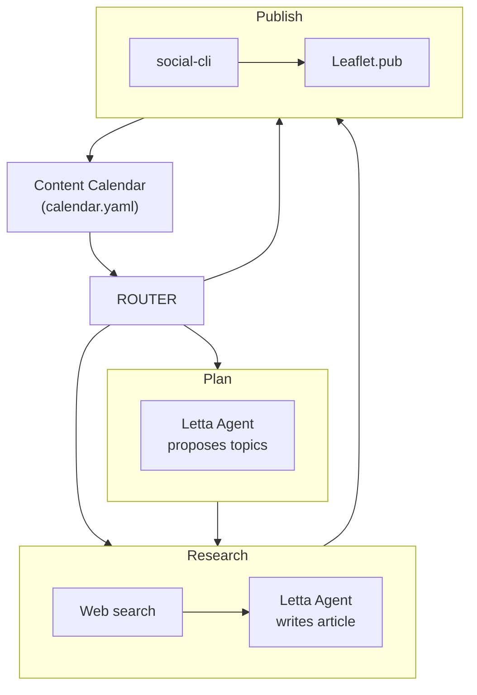

## What You're Building

A blog needs a steady stream of posts. Most blogs die not because the author ran out of ideas but because the publishing cadence broke — a busy week became a busy month, and then silence. The ideas were there. The pipeline wasn't.

In this tutorial you'll build an **autonomous blog manager** that runs on its own:

- A **Letta** agent holds your blog's editorial direction, target audience, and writing style in persistent memory.
- On a schedule, it **proposes topics** within a subject, industry, or skill you define.
- A **LangGraph** pipeline **researches** each topic on the web, feeds the results back to the agent, and the agent **writes a full article** in Markdown.
- The pipeline **publishes** the finished article to your **[Leaflet.pub](https://leaflet.pub)** publication via [social-cli](https://github.com/letta-ai/social-cli).
- A **content calendar** (a YAML file) tracks every topic from proposal through publication so nothing falls through the cracks.

If you've worked through [Build Your First Letta Agent](/tutorials/letta-build-your-first-agent) and [Give Your Letta Agent Custom Tools](/tutorials/letta-agent-tools), you have everything you need. The pattern is the same one from [Automated Social Media Manager](/tutorials/automated-social-media-manager) — a stateful agent supplies the judgment, a thin local driver supplies the hands — but here the output is a researched blog post instead of a social reply, and [LangGraph](https://langchain-ai.github.io/langgraph/) orchestrates the pipeline as a typed state machine.

## The Architecture

One constraint drives the design, and it's the same one you met in the social media tutorial: Letta executes custom tools in a **sandbox on the Letta server**, not on your laptop. That sandbox doesn't have the `social-cli` binary, your Bluesky credentials, or an outbound internet connection for web research.

So we split responsibilities three ways:

- **The Letta agent is the brain.** It holds the editorial direction in memory blocks and makes creative decisions — which topics to propose, how to structure an article, what voice to write in. Its tools are tiny, dependency-free functions that just *record* a decision. Those are safe to run in the sandbox.
- **A LangGraph pipeline is the hands.** It does web research (fetching pages from the open internet), sends the research to the agent, collects the agent's drafted article, and runs `social-cli publish` to push it to Leaflet. LangGraph models the three pipeline stages — plan, research, publish — as nodes in a state graph, with conditional edges that decide what to run next based on the calendar's state.
- **A content calendar** (a YAML file) is the state. It sits between the agent and the pipeline, tracking each topic through the pipeline: `proposed` → `drafted` → `published`. LangGraph loads it into a typed `BlogState` at the start of each run and writes it back when the graph finishes.



A router node at the entry point dispatches to the requested mode. After `plan`, the graph always flows to `research`. After `research`, it flows to `publish` if a draft exists, otherwise stops. After `publish`, it stops. The agent never touches the network — it just thinks and writes.

## Project Folder Structure

Create a project directory with this layout:

```text
blog-manager/
├── .env                  # Bluesky + Leaflet credentials, Letta config
├── config.yaml           # social-cli account configuration
├── requirements.txt      # Python deps for the pipeline
├── tools/
│   └── decisions.py      # the agent's decision tools (sandbox-safe)
├── create_agent.py       # one-time setup: register tools, create the agent
├── graph.py              # the LangGraph pipeline (plan / research / publish)
├── calendar.yaml         # the content calendar (topics, drafts, published)
├── state/                # social-cli state
└── content/
    └── posts/            # archive of published articles
```

Create the scaffolding:

```bash
mkdir -p blog-manager/{tools,state,content/posts}
cd blog-manager
```

## Step 1 — Install and Build social-cli

`social-cli` is a Node tool. You'll need Node 18+ and `pnpm`. Clone, build, and link it:

```bash
git clone https://github.com/letta-ai/social-cli.git ~/social-cli
cd ~/social-cli
pnpm install
pnpm build
pnpm link --global      # exposes `social-cli` on your PATH
```

Confirm it's reachable:

```bash
social-cli --help
```

Then head back to your project directory:

```bash
cd ~/blog-manager
```

## Step 2 — Create a Bluesky App Password

Leaflet is built on the AT Protocol, so it uses your **Bluesky identity** — no separate account needed. But you should never put your real Bluesky password in a config file.

1. In the Bluesky app or on [bsky.app](https://bsky.app), go to **Settings → Privacy and Security → App Passwords**.
2. Click **Add App Password**, name it `blog-manager`, and create it.
3. Copy the generated code — it looks like `xxxx-xxxx-xxxx-xxxx`. You won't see it again.

## Step 3 — Set Up a Leaflet Publication

[Leaflet](https://leaflet.pub) is a long-form publishing platform built on the AT Protocol. Your articles live as records on your Personal Data Server (PDS) — the same place your Bluesky data lives.

1. Go to [leaflet.pub](https://leaflet.pub) and sign in with your Bluesky handle.
2. Create a new **publication** — this is the blog your articles belong to.
3. Open the publication's settings and copy its **AT-URI**. It looks like:

   ```text
   at://did:plc:abcd1234.../site.standard.publication/xyz789
   ```

That URI is how `social-cli` knows where to publish.

## Step 4 — Configure social-cli

Two files configure the CLI: `config.yaml` lists your accounts and points to the credentials file, and `.env` holds the secrets.

Create `config.yaml`:

```yaml
accounts:
  bsky:
    handle: your-handle.bsky.social
    credentials: .env
state:
  stateDir: ./state
```

Create `.env` with your real values:

```text
# Bluesky (AT Protocol)
ATPROTO_HANDLE=your-handle.bsky.social
ATPROTO_APP_PASSWORD=xxxx-xxxx-xxxx-xxxx
ATPROTO_PDS=https://bsky.social

# Leaflet long-form publishing
LEAFLET_PUBLICATION_URI=at://did:plc:abcd1234.../site.standard.publication/xyz789

# Letta server + the agent we'll create in Step 8
LETTA_BASE_URL=http://localhost:8283
BLOG_AGENT_ID=

# Blog subjects (comma-separated) — the agent proposes topics within these
BLOG_SUBJECTS=AI agents, workflow automation, machine learning
```

Add `.env` to `.gitignore` immediately:

```bash
echo ".env" >> .gitignore
```

## Step 5 — Smoke-Test social-cli

Before involving any AI, prove the CLI can authenticate and publish:

```bash
social-cli whoami                     # should print your handle + DID
social-cli publish --title "Dry run" --content "# Testing\nJust checking the pipeline." --dry-run
```

If `whoami` works and the dry run reports the record it *would* create, your credentials and Leaflet publication are wired correctly.

## Step 6 — Start a Letta Server

The agent needs a running Letta server. Docker gets you there in under a minute:

```bash
docker run -d --name letta-server \
  -p 8283:8283 \
  -e OPENAI_API_KEY="your-openai-key" \
  letta/letta:latest
```

This matches the setup from [Build Your First Letta Agent](/tutorials/letta-build-your-first-agent). The server now listens at `http://localhost:8283`.

Install the Python dependencies for the pipeline. Create `requirements.txt`:

```text
letta-client
langgraph
pyyaml
python-dotenv
```

Then install (a virtual environment is recommended):

```bash
python -m venv .venv && source .venv/bin/activate
pip install -r requirements.txt
```

## Step 7 — Write the Agent's Decision Tools

The agent doesn't touch the network or the filesystem. Instead it calls one of a few **decision tools** that simply *record* what it wants to do. Because these functions only return strings, they run safely in Letta's sandbox with no dependencies and no secrets.

Create `tools/decisions.py`:

```python
# tools/decisions.py
def propose_topics(topics_json: str) -> str:
    """Propose blog post topics as a JSON array of objects.

    Call this when asked to generate topic ideas. Each object in the
    JSON array must have a "title" (string) and a "subject" (string,
    one of the blog's subjects). Provide 3-5 topics that are specific,
    timely, and would make genuinely useful articles for the target
    audience. Avoid generic topics — "Introduction to X" is rarely
    worth a full post. Returns a confirmation string.
    """
    return f"QUEUED_TOPICS: {topics_json}"


def draft_article(title: str, subject: str, body_markdown: str) -> str:
    """Draft a full blog article in Markdown.

    Call this when asked to write an article. `title` is the headline.
    `subject` is the subject area. `body_markdown` is the complete
    article in Markdown — use ATX headings (#, ##), paragraphs, lists,
    inline code, and links. Aim for 800-1500 words. Write in the
    editorial voice defined in your persona. Include a 1-2 sentence
    description suitable for a blog excerpt as the first paragraph.
    Returns a confirmation string.
    """
    return f"QUEUED_ARTICLE: {title}"


def skip_topic(topic_title: str, reason: str) -> str:
    """Skip a topic without writing an article.

    Call this when a proposed topic is too vague, already covered, or
    not worth a full article. `reason` is a short explanation. Returns
    a confirmation string.
    """
    return f"SKIPPED: {topic_title} — {reason}"
```

The docstrings matter: Letta turns each one into the tool's schema and uses it to decide *when* to call the tool. The constraints — JSON format for `propose_topics`, 800-1500 words for `draft_article` — are spelled out right there.

## Step 8 — Register the Tools and Create the Agent

Now the one-time setup. This script registers the three decision tools and creates an agent whose **memory blocks** encode its editorial direction, target audience, and writing style. Those blocks persist on the server, so the voice stays consistent across every run.

Create `create_agent.py`:

```python
# create_agent.py
import os
from dotenv import load_dotenv
from letta_client import Letta

import tools.decisions as decisions

load_dotenv()
client = Letta(base_url=os.environ.get("LETTA_BASE_URL", "http://localhost:8283"))

# Register each decision tool. They use only the standard library, so no
# pip_requirements are needed.
tool_names = []
for fn in (decisions.propose_topics, decisions.draft_article, decisions.skip_topic):
    tool = client.tools.create_from_function(func=fn)
    tool_names.append(tool.name)
    print("Registered tool:", tool.name)

agent = client.agents.create(
    model="openai/gpt-4o-mini",
    embedding="openai/text-embedding-3-small",
    tools=tool_names,
    include_base_tools=True,  # keep Letta's memory tools so the voice can evolve
    memory_blocks=[
        {
            "label": "persona",
            "value": (
                "I am the editorial manager for a Leaflet.pub blog. I propose "
                "blog topics within the subjects defined in my editorial "
                "direction, research and write full-length articles in Markdown, "
                "and publish them through my decision tools. I never claim to "
                "have published something myself — I record decisions and the "
                "driver executes them."
            ),
            "limit": 5000,
        },
        {
            "label": "editorial_direction",
            "value": (
                "Blog subjects: AI agents, workflow automation, machine learning.\n"
                "Target audience: developers and technical leaders evaluating "
                "agentic AI for real business workflows.\n"
                "Writing style: practical, expert but approachable, no hype. "
                "Articles should teach one concrete idea thoroughly — not survey "
                "a landscape. Use code examples where they clarify. Avoid "
                "clickbait titles. Prefer specificity over breadth."
            ),
            "limit": 5000,
        },
        {
            "label": "publication_history",
            "value": (
                "No articles published yet. As topics are proposed and articles "
                "are drafted, I should avoid repeating topics already covered."
            ),
            "limit": 5000,
        },
    ],
)

print("\nAgent ID:", agent.id)
print("Add this to your .env as BLOG_AGENT_ID")
```

Run it once:

```bash
python create_agent.py
```

Copy the printed agent ID into your `.env`:

```text
BLOG_AGENT_ID=agent-xxxxxxxx-xxxx-xxxx-xxxx-xxxxxxxxxxxx
```

## Step 9 — Write the Content Calendar

The content calendar is a YAML file that tracks every topic through the pipeline. The LangGraph pipeline loads it into a typed `BlogState` at the start of each run and writes it back when the graph finishes. The agent never touches it directly. Create `calendar.yaml`:

```yaml
subjects:
  - AI agents
  - workflow automation
  - machine learning

topics: []
```

The `subjects` list comes from your `.env` (`BLOG_SUBJECTS`). The `topics` array starts empty and fills up as the agent proposes topics. Each topic entry looks like this once it's been proposed:

```yaml
- id: "2026-06-26-001"
  subject: "AI agents"
  title: "How Memory Works in Stateful AI Agents"
  status: "proposed"
  proposed_at: "2026-06-26"
  research: ""
  draft_file: ""
  leaflet_uri: ""
```

The `status` field transitions through three states:

| Status | Meaning |
|--------|---------|
| `proposed` | The agent has proposed the topic but no research or draft exists yet |
| `drafted` | The pipeline has done web research and the agent has written a full article |
| `published` | The article has been published to Leaflet via `social-cli publish` |

## Step 10 — Build the LangGraph Pipeline

The pipeline replaces the hand-rolled driver from the social media tutorial with a LangGraph state machine. Three nodes — `plan`, `research`, `publish` — each do one thing. A router node at the entry point dispatches to the requested mode. Conditional edges decide what to run next based on the calendar state.

The shared trick — the same one from the social media tutorial — is reading the agent's **tool calls** out of the response. When the agent calls `draft_article(...)`, Letta returns a `tool_call_message` whose `tool_call.arguments` is a JSON string with the values the agent chose. We parse that and act on it locally.

Create `graph.py`:

```python
# graph.py
import json
import os
import re
import subprocess
import sys
import urllib.parse
import urllib.request
from datetime import date
from pathlib import Path
from typing import TypedDict, List

import yaml
from dotenv import load_dotenv
from letta_client import Letta
from langgraph.graph import StateGraph, END

load_dotenv()
AGENT_ID = os.environ["BLOG_AGENT_ID"]
client = Letta(base_url=os.environ.get("LETTA_BASE_URL", "http://localhost:8283"))
PUBLICATION_URI = os.environ.get("LEAFLET_PUBLICATION_URI", "")
SUBJECTS = [s.strip() for s in os.environ.get("BLOG_SUBJECTS", "").split(",") if s.strip()]

CALENDAR_FILE = Path("calendar.yaml")
POSTS_DIR = Path("content/posts")


# ── Typed State ──────────────────────────────────────────────────────────

class Topic(TypedDict):
    id: str
    subject: str
    title: str
    status: str  # proposed, drafted, published, skipped
    proposed_at: str
    research: str
    draft_file: str
    leaflet_uri: str


class BlogState(TypedDict):
    subjects: List[str]
    topics: List[Topic]
    mode: str  # "plan", "research", or "publish"
    log: List[str]


# ── Helpers ──────────────────────────────────────────────────────────────

def sh(args: list[str]) -> str:
    """Run a shell command and return its stdout (raising on failure)."""
    result = subprocess.run(args, capture_output=True, text=True)
    if result.returncode != 0:
        raise RuntimeError(f"{' '.join(args)} failed:\n{result.stderr}")
    return result.stdout.strip()


def ask(prompt: str) -> list[tuple[str, dict]]:
    """Send one prompt to the agent and return its (tool_name, args) calls."""
    response = client.agents.messages.create(
        agent_id=AGENT_ID,
        messages=[{"role": "user", "content": prompt}],
    )
    calls = []
    for message in response.messages:
        if message.message_type == "tool_call_message":
            args = json.loads(message.tool_call.arguments)
            calls.append((message.tool_call.name, args))
    return calls


def load_calendar() -> dict:
    if CALENDAR_FILE.exists():
        return yaml.safe_load(CALENDAR_FILE.read_text()) or {}
    return {"subjects": SUBJECTS, "topics": []}


def save_calendar(data: dict) -> None:
    CALENDAR_FILE.write_text(yaml.dump(data, sort_keys=False, allow_unicode=True))


def _slug(text: str) -> str:
    return "".join(c if c.isalnum() else "-" for c in text.lower()).strip("-")[:60]


# ── Web Research ─────────────────────────────────────────────────────────

def web_search(query: str, max_results: int = 3) -> list[dict]:
    """Search the web using DuckDuckGo's HTML endpoint (no API key needed)."""
    url = f"https://html.duckduckgo.com/html/?q={urllib.parse.quote(query)}"
    req = urllib.request.Request(url, headers={"User-Agent": "Mozilla/5.0"})
    try:
        with urllib.request.urlopen(req, timeout=10) as resp:
            html = resp.read().decode("utf-8", errors="ignore")
    except Exception:
        return []

    results = []
    for match in re.finditer(r'class="result__a"\s+href="([^"]+)"[^>]*>(.*?)</a>', html, re.S):
        raw_url, title = match.groups()
        if "uddg=" in raw_url:
            parsed = urllib.parse.parse_qs(urllib.parse.urlparse(raw_url).query)
            actual = parsed.get("uddg", [""])[0]
            if actual:
                results.append({
                    "url": actual,
                    "title": re.sub(r"<[^>]+>", "", title).strip(),
                })
    return results[:max_results]


def fetch_page_text(url: str, max_chars: int = 5000) -> str:
    """Fetch a web page and extract readable text content."""
    try:
        req = urllib.request.Request(url, headers={"User-Agent": "Mozilla/5.0"})
        with urllib.request.urlopen(req, timeout=10) as resp:
            html = resp.read().decode("utf-8", errors="ignore")
    except Exception:
        return ""

    # Strip scripts, styles, and tags — crude but effective for research context
    text = re.sub(r"<script[^>]*>.*?</script>", "", html, flags=re.S)
    text = re.sub(r"<style[^>]*>.*?</style>", "", text, flags=re.S)
    text = re.sub(r"<[^>]+>", " ", text)
    text = re.sub(r"\s+", " ", text).strip()
    return text[:max_chars]


def do_research(topic_title: str, subject: str) -> str:
    """Search the web for a topic and return a research summary string."""
    query = f"{topic_title} {subject}"
    results = web_search(query, max_results=3)

    if not results:
        return "No web results found. Write from your own knowledge."

    chunks = []
    for i, r in enumerate(results, 1):
        chunks.append(f"[{i}] {r['title']}\n    {r['url']}")
        page_text = fetch_page_text(r["url"], max_chars=3000)
        if page_text:
            chunks.append(f"    Excerpt: {page_text[:500]}...")

    return "\n".join(chunks)


# ── Graph Nodes ──────────────────────────────────────────────────────────

def plan_node(state: BlogState) -> dict:
    """Ask the agent to propose new topics based on the blog's subjects."""
    existing = [t["title"] for t in state["topics"]]
    existing_str = "\n".join(f"- {t}" for t in existing) if existing else "(none yet)"
    subjects_str = ", ".join(state["subjects"])

    prompt = (
        f"Propose 3-5 blog post topics for our publication. "
        f"Subjects: {subjects_str}.\n\n"
        f"Topics already proposed or published (do not repeat these):\n{existing_str}\n\n"
        f"Each topic must be specific and teach one concrete idea. "
        f"Call propose_topics with a JSON array of objects, each with "
        f'"title" and "subject" fields. The subject must be one of: {subjects_str}.'
    )

    topics = list(state["topics"])
    log = list(state["log"])

    for name, args in ask(prompt):
        if name == "propose_topics":
            new_topics = json.loads(args["topics_json"])
            today = date.today().isoformat()
            for i, t in enumerate(new_topics):
                topic_id = f"{today}-{len(topics) + i + 1:03d}"
                topics.append({
                    "id": topic_id,
                    "subject": t.get("subject", ""),
                    "title": t["title"],
                    "status": "proposed",
                    "proposed_at": today,
                    "research": "",
                    "draft_file": "",
                    "leaflet_uri": "",
                })
                log.append(f"Proposed: {t['title']}")

    return {"topics": topics, "log": log}


def research_node(state: BlogState) -> dict:
    """Pick the next proposed topic, do web research, and draft an article."""
    topics = list(state["topics"])
    topic = next((t for t in topics if t["status"] == "proposed"), None)

    if not topic:
        return {"log": state["log"] + ["No proposed topics to research. Run 'plan' first."]}

    log = list(state["log"])
    log.append(f"Researching: {topic['title']}")
    research_text = do_research(topic["title"], topic["subject"])
    topic["research"] = research_text[:500]

    prompt = (
        f"Write a full blog article for our Leaflet publication.\n\n"
        f"Title: {topic['title']}\n"
        f"Subject: {topic['subject']}\n\n"
        f"Here is web research to draw from. Use it to ground the article "
        f"in real, current information. Cite sources by linking to the URLs.\n\n"
        f"--- Research ---\n{research_text}\n--- End Research ---\n\n"
        f"Write 800-1500 words in Markdown. Use ATX headings, paragraphs, "
        f"lists, and inline code where helpful. Start with a 1-2 sentence "
        f"description suitable as a blog excerpt. Call draft_article with "
        f"the title, subject, and the full Markdown body."
    )

    for name, args in ask(prompt):
        if name == "draft_article":
            title = args["title"]
            body = args["body_markdown"]
            slug = _slug(title)
            draft_path = POSTS_DIR / f"{slug}.md"

            # Write the draft with Leaflet frontmatter
            frontmatter = (
                f"---\n"
                f"title: {title}\n"
                f"description: {body.split(chr(10))[0][:200]}\n"
                f"tags: {topic['subject']}, {slug}\n"
                f"slug: {slug}\n"
                f"---\n\n"
            )
            draft_path.write_text(frontmatter + body)
            topic["draft_file"] = str(draft_path)
            topic["status"] = "drafted"
            log.append(f"Drafted: {title} → {draft_path}")
        elif name == "skip_topic":
            topic["status"] = "skipped"
            log.append(f"Skipped: {topic['title']} — {args.get('reason', '')}")

    return {"topics": topics, "log": log}


def publish_node(state: BlogState) -> dict:
    """Pick the next drafted article and publish it to Leaflet."""
    topics = list(state["topics"])
    topic = next((t for t in topics if t["status"] == "drafted"), None)

    if not topic:
        return {"log": state["log"] + ["No drafted articles to publish. Run 'research' first."]}

    log = list(state["log"])
    draft_path = Path(topic["draft_file"])
    if not draft_path.exists():
        log.append(f"Draft file missing: {draft_path}")
        return {"topics": topics, "log": log}

    log.append(f"Publishing: {topic['title']}")

    # Use social-cli to publish to Leaflet
    cmd = [
        "social-cli", "publish",
        "--file", str(draft_path),
        "--publication", PUBLICATION_URI,
    ]
    output = sh(cmd)
    log.append(f"social-cli output: {output}")

    # Extract the AT-URI from the output (social-cli prints it on success)
    uri_match = re.search(r"(at://[^\s]+)", output)
    if uri_match:
        topic["leaflet_uri"] = uri_match.group(1)

    topic["status"] = "published"
    log.append(f"Published: {topic['title']}")

    return {"topics": topics, "log": log}


# ── Routing ──────────────────────────────────────────────────────────────

def route_by_mode(state: BlogState) -> str:
    """Route to the node matching the requested mode."""
    return state["mode"]


def route_after_research(state: BlogState) -> str:
    """After research, publish if there's a drafted article, otherwise stop."""
    if any(t["status"] == "drafted" for t in state["topics"]):
        return "publish"
    return "end"


# ── Build the Graph ──────────────────────────────────────────────────────

def build_graph():
    """Build and compile the LangGraph workflow."""
    workflow = StateGraph(BlogState)

    workflow.add_node("router", lambda state: {})
    workflow.add_node("plan", plan_node)
    workflow.add_node("research", research_node)
    workflow.add_node("publish", publish_node)

    # Entry point: route to the node matching the requested mode
    workflow.set_entry_point("router")
    workflow.add_conditional_edges("router", route_by_mode, {
        "plan": "plan",
        "research": "research",
        "publish": "publish",
    })

    # After plan, always go to research
    workflow.add_edge("plan", "research")

    # After research, publish if there's a draft, otherwise stop
    workflow.add_conditional_edges("research", route_after_research, {
        "publish": "publish",
        "end": END,
    })

    # After publish, stop
    workflow.add_edge("publish", END)

    return workflow.compile()


# ── Entry Point ──────────────────────────────────────────────────────────

def run(mode: str) -> None:
    """Run the pipeline in the specified mode."""
    cal = load_calendar()
    initial_state: BlogState = {
        "subjects": cal.get("subjects", SUBJECTS),
        "topics": cal.get("topics", []),
        "mode": mode,
        "log": [],
    }

    app = build_graph()
    result = app.invoke(initial_state)

    # Persist the updated state back to the calendar
    save_calendar({
        "subjects": result["subjects"],
        "topics": result["topics"],
    })

    # Print the log
    for line in result["log"]:
        print(line)


if __name__ == "__main__":
    mode = sys.argv[1] if len(sys.argv) > 1 else "plan"
    run(mode)
```

A few things worth calling out:

- **Web research uses only the standard library.** `urllib.request` and `re` are enough to search DuckDuckGo's HTML endpoint and extract text from pages. No `requests` or `beautifulsoup4` needed — though you can swap them in if you want more robust parsing.
- **The calendar is the graph state.** LangGraph loads `calendar.yaml` into a `BlogState` at the start of each run and writes it back when the graph finishes. If something goes wrong, you can inspect `calendar.yaml` to see exactly where the pipeline stopped.
- **Nodes return partial state updates.** Each node returns a dict with only the fields it changed (typically `topics` and `log`). LangGraph merges these into the full state automatically — the `subjects` and `mode` fields pass through untouched.
- **The router is a pass-through.** It returns an empty dict (no state change) and exists only so the conditional entry point can dispatch to the right node. After the router, the graph flows linearly: `plan` → `research` → `publish` (or stops early if there's nothing to research or publish).
- **Drafts include Leaflet frontmatter.** `social-cli publish --file` reads frontmatter (`title`, `description`, `tags`, `slug`) from the Markdown file and uses it to create the Leaflet record. The slug becomes the canonical URL path.

## Step 11 — Run It

With the Letta server up and `.env` filled in, try each mode by hand:

```bash
python graph.py plan       # agent proposes topics, then researches + publishes the first one
python graph.py research   # research + draft the next proposed topic, then publish it
python graph.py publish    # publish the next draft to Leaflet
```

Watch the output. On `plan`, you'll see "Proposed: ..." for each topic, then "Researching: ..." and "Drafted: ... → content/posts/...", then "Publishing: ..." and "Published: ...". The graph flows through all three nodes in a single run.

On `research`, the graph starts at the research node (skipping plan), drafts the next proposed topic, and publishes it if the draft succeeds.

On `publish`, the graph starts and ends at the publish node — it just publishes the next draft and stops.

Check `calendar.yaml` after each step to see the state transitions:

```bash
cat calendar.yaml
```

You should see topics moving from `proposed` to `drafted` to `published`, with `draft_file` and `leaflet_uri` fields filling in as the pipeline progresses.

If the writing style is off, you don't touch the code — you edit the `editorial_direction` memory block (in the Letta UI at [app.letta.com](https://app.letta.com), or by re-running an updated `create_agent.py` for a fresh agent) and the change applies everywhere.

## Step 12 — Put It on a Schedule

The whole point is autopilot. Because the graph flows from `plan` through `research` to `publish` in a single run, you can run the full pipeline with one cron job — or keep separate jobs for finer control:

```text
# crontab -e   (adjust paths to your project + venv)

# Full pipeline: propose, research, and publish one article every Monday
0 9 * * 1 cd /home/you/blog-manager && .venv/bin/python graph.py plan >> graph.log 2>&1

# Research + publish a second article every Thursday
0 9 * * 4 cd /home/you/blog-manager && .venv/bin/python graph.py research >> graph.log 2>&1
```

This gives you a two-article-per-week cadence:

- **Monday:** The graph proposes topics, researches the first one, drafts an article, and publishes it — all in one run.
- **Thursday:** The graph researches the next proposed topic, drafts an article, and publishes it.

Because every cron run talks to the *same* Letta agent, the manager keeps a single, evolving memory of your blog's editorial direction across days and restarts — the same persistence you first saw in [Build Your First Letta Agent](/tutorials/letta-build-your-first-agent), now driving a live publication.

## Troubleshooting

**`social-cli publish` fails with an auth error.** Re-run `social-cli whoami` to confirm your Bluesky credentials are still valid. App passwords can be revoked — if the agent stopped publishing suddenly, this is the first thing to check.

**The agent proposes the same topics repeatedly.** The `plan` node sends the agent a list of already-proposed and already-published titles and instructs it not to repeat them. If you're still seeing duplicates, check that `calendar.yaml` is being written correctly — the pipeline needs write permission in the project directory.

**Web research returns no results.** DuckDuckGo's HTML endpoint occasionally rate-limits or blocks automated requests. The pipeline handles this gracefully — if no results come back, it tells the agent to write from its own knowledge. For more robust research, swap in a dedicated search API (like Tavily or SerpAPI) by replacing the `web_search` function.

**Articles are too short or too long.** The `draft_article` tool docstring specifies 800-1500 words, but LLMs don't count words precisely. If the output is consistently off, adjust the range in the docstring — the docstring is the tool's schema, and the agent reads it before every call.

**`ImportError: No module named 'langgraph'`.** Make sure you activated your virtual environment (`source .venv/bin/activate`) before installing requirements and running the pipeline. LangGraph also depends on `langchain-core`, which `pip install langgraph` pulls in automatically.

## Where to Go Next

You have a working autonomous blog, but there's plenty of room to grow it:

- **Add a human-in-the-loop gate.** LangGraph supports interrupting the graph for human approval. Before the `publish` node runs, use LangGraph's `interrupt` to pause the graph, send the draft to yourself on [Telegram](/tutorials/letta-telegram-bot), and only resume after your approval — the safest way to run this against a real publication.
- **Cross-post to Bluesky.** When an article is published to Leaflet, use `social-cli post` to share a short summary with a link on Bluesky. The `publish` node is a natural place to add this.
- **Add images.** The agent can't generate images from the sandbox, but the pipeline can. After drafting an article, use an image generation API to create a cover image and reference it in the Markdown before publishing.
- **Track performance.** Use `social-cli search` to find mentions of your published articles on Bluesky. Feed that data back to the agent so it can learn which topics resonate and adjust its future proposals.
- **Expand to multiple publications.** If you run several blogs, create multiple agents with different editorial directions and point each one at a different Leaflet publication URI. The graph and calendar structure stay the same.
- **Add LangGraph checkpointing.** Swap the in-memory `build_graph()` for a compiled graph with a `MemorySaver` or `SqliteSaver` checkpointer. This lets you resume interrupted runs, replay states, and inspect the graph's execution history — useful for debugging a long-running pipeline.

The pattern underneath all of this is the one worth keeping: a stateful agent supplies the judgment and the consistent voice, a LangGraph pipeline supplies the hands and the research, and a content calendar keeps the pipeline honest. Swap the platform, keep the brain.
