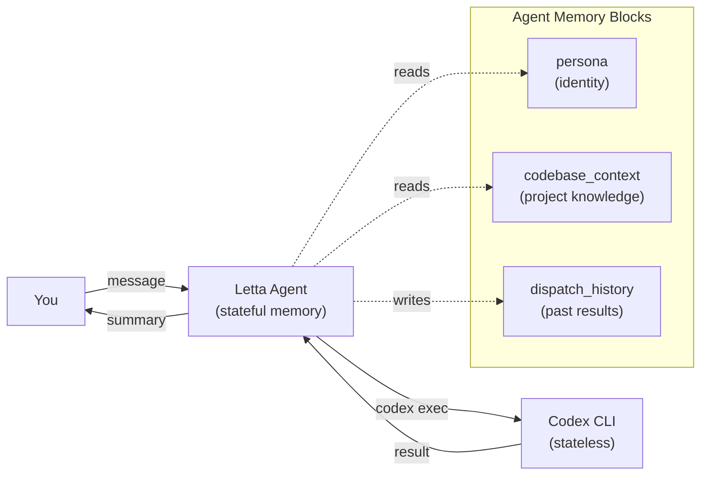
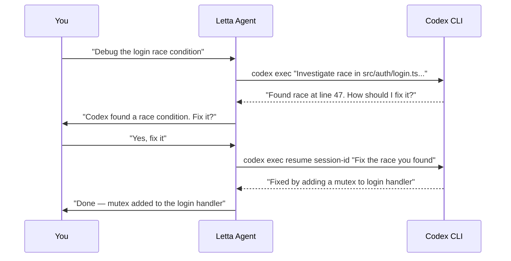
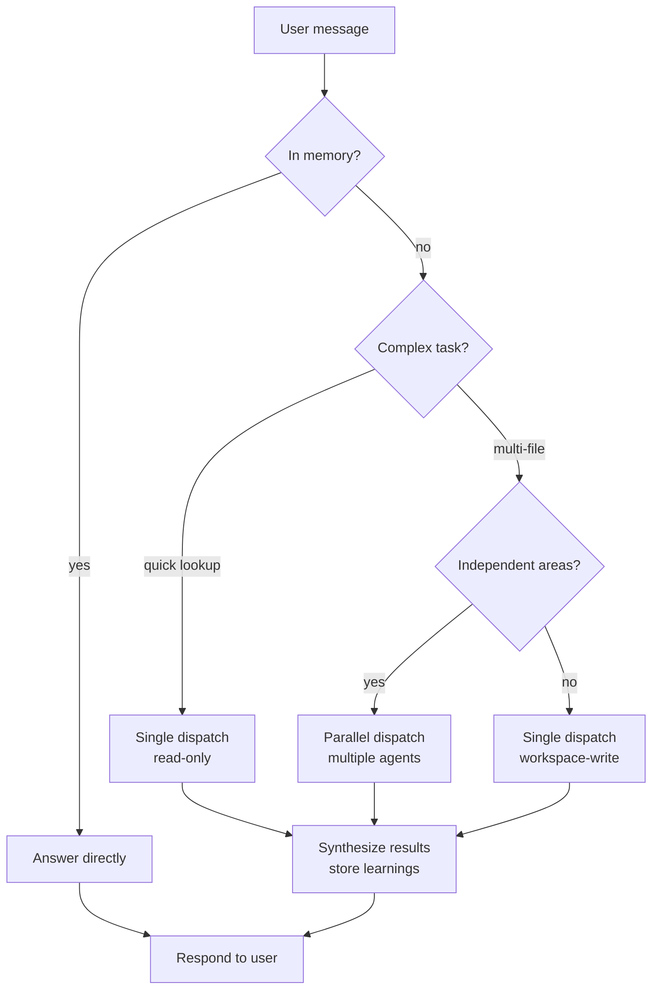

## The Problem with Stateless Agents

Codex CLI is a powerful coding agent. Give it a prompt and it can debug, refactor, and write code with frontier-level reasoning. But every `codex exec` session starts from zero. It doesn't know your codebase conventions, your past decisions, or the bug you spent three hours debugging yesterday. You have to re-explain everything, every time.

A stateless agent is like a brilliant contractor who shows up each morning with no memory of yesterday's work. Capable, but expensive to brief.

## The Solution: Letta as Orchestrator

[Letta](https://letta.com) agents are stateful. They have persistent memory blocks, recall past conversations, and accumulate knowledge about your project over time. But sometimes you want a clean, isolated context window for a hard problem — no noise, no accumulated assumptions, just the task at hand.

The best pattern combines both: **a Letta agent as the orchestrator** and **Codex CLI agents as stateless workers**. The Letta agent holds the memory, decides what to dispatch, crafts the context-rich prompt, and interprets the results. Codex executes with a clean slate and frontier reasoning.



This is the architecture Sarah Wooders described in [Letta's blog post on orchestrating coding agents](https://www.letta.com/blog/orchestrating-coding-agents/): the stateful agent manages context and dispatches tasks to isolated, stateless subagents. In this tutorial you'll build that pattern yourself using the [Letta Agent SDK](https://docs.letta.com/agent-sdk) and the [Codex CLI](https://developers.openai.com/codex).

## What You're Building

A TypeScript CLI tool that:

1. **Creates a Letta agent** with memory blocks for project context and dispatch history
2. **Registers a custom tool** that shells out to `codex exec` with a context-rich prompt
3. **Streams messages** from the Letta agent, showing reasoning and tool calls in real time
4. **Resumes Codex sessions** when the Letta agent needs to ask a follow-up
5. **Runs parallel investigations** — dispatching multiple Codex agents simultaneously

## Prerequisites

- **Node.js 22.19+** installed
- **Codex CLI** installed and authenticated (`npm i -g @openai/codex` then `codex login`)
- A **Letta API key** from [platform.letta.com/api-keys](https://platform.letta.com/api-keys), or a local Letta server
- Completed [Build Your First Letta Agent](/tutorials/letta-build-your-first-agent) and [Build a Companion Bot with the Letta Agent SDK](/tutorials/letta-companion-bot) (or equivalent familiarity with the Agent SDK)

## Project Setup

```text
codex-orchestrator/
├── package.json
├── .env
└── src/
    ├── create-orchestrator.ts    # create the Letta agent (run once)
    ├── orchestrate.ts            # interactive CLI loop
    └── codex-tool.ts             # custom tool that dispatches to Codex
```

Initialize the project:

```bash
mkdir codex-orchestrator && cd codex-orchestrator
npm init -y
npm install @letta-ai/letta-agent-sdk tsx
npm install -D @types/node typescript
```

Create a `.env` file:

```bash
LETTA_API_KEY=your-api-key-here
```

If you're using the local backend instead of Letta Cloud, omit the API key — the SDK runs Letta Code as a subprocess on your machine.

## Step 1: Create the Orchestrator Agent

The orchestrator agent needs two custom memory blocks: one for project context it learns over time, and one for tracking past Codex dispatches. The Letta agent reads these blocks before each turn to decide whether to answer directly or dispatch to Codex.

```typescript
// src/create-orchestrator.ts
import { LettaAgentClient } from "@letta-ai/letta-agent-sdk";
import { config } from "dotenv";

config();

async function main() {
  const client = new LettaAgentClient({
    backend: "cloud",
    apiKey: process.env.LETTA_API_KEY,
  });

  const agentId = await client.createAgent({
    persona: `You are an engineering orchestrator. You have persistent memory of the codebase, past decisions, and past Codex dispatches.

Your job is to decide when to answer directly and when to dispatch work to Codex CLI agents via the dispatch_codex tool.

Dispatch to Codex when:
- The task requires deep code investigation across many files
- You need a second opinion on a plan or approach
- The user asks for a hard debugging session
- You want parallel research on multiple hypotheses

Answer directly when:
- You already know the answer from memory
- The task is a quick lookup or simple explanation
- The user is asking a conceptual question

When you dispatch to Codex, you MUST provide:
1. A specific, actionable task description
2. Relevant file paths and architecture context from your memory
3. Coding conventions and constraints you've learned
4. What you've already tried (if debugging)

After Codex returns, summarize the result for the user and note any new learnings in your dispatch_history memory block.`,
    memoryBlocks: [
      {
        name: "codebase_context",
        description: "Project structure, key files, conventions, and architecture notes learned over time",
        value: "No project context learned yet.",
      },
      {
        name: "dispatch_history",
        description: "Log of past Codex dispatches — what was asked, what was returned, key learnings",
        value: "No Codex dispatches yet.",
      },
    ],
  });

  console.log("Orchestrator agent created:");
  console.log("AGENT_ID=" + agentId);

  // Save to .env for convenience
  console.log("\nAdd this to your .env file:");
  console.log(`AGENT_ID=${agentId}`);
}

main().catch(console.error);
```

Run it once:

```bash
npx tsx src/create-orchestrator.ts
```

Copy the printed `AGENT_ID` into your `.env` file:

```bash
LETTA_API_KEY=your-api-key-here
AGENT_ID=agent-abc123...
```

## Step 2: Build the Codex Dispatch Tool

The custom tool is the bridge between the Letta agent and Codex CLI. When the Letta agent calls it, the tool spawns a `codex exec` subprocess, waits for the result, and returns the final message to the agent.

The tool accepts a task prompt and optional session ID for resuming previous Codex sessions:

```typescript
// src/codex-tool.ts
import { execa } from "execa";
import { type AnyAgentTool } from "@letta-ai/letta-agent-sdk";

export interface CodexInput {
  task: string;
  sessionId?: string;
  sandbox?: "read-only" | "workspace-write";
  cwd?: string;
}

export const dispatchCodexTool: AnyAgentTool = {
  name: "dispatch_codex",
  label: "Dispatch to Codex",
  description:
    "Dispatch a task to a stateless Codex CLI agent. Codex runs in an isolated context window with no memory — provide all necessary context in the task prompt. Use sessionId to resume a previous Codex session for follow-up questions.",
  parameters: {
    type: "object",
    properties: {
      task: {
        type: "string",
        description:
          "The full task prompt for Codex. Include file paths, architecture context, constraints, and what you've already tried. Be specific — Codex has no memory of past interactions.",
      },
      sessionId: {
        type: "string",
        description:
          "Optional Codex session ID to resume. Use this when you need to ask a follow-up question in the same Codex context.",
      },
      sandbox: {
        type: "string",
        enum: ["read-only", "workspace-write"],
        description: "Sandbox mode for Codex. Use read-only for investigation, workspace-write for edits.",
      },
      cwd: {
        type: "string",
        description: "Working directory for the Codex agent. Defaults to the current directory.",
      },
    },
    required: ["task"],
  },
  async execute(_toolCallId, input, signal) {
    const { task, sessionId, sandbox = "read-only", cwd = process.cwd() } = input as CodexInput;

    const args = ["exec"];

    if (sessionId) {
      args.push("resume", sessionId);
    }

    args.push(task, "--sandbox", sandbox, "-C", cwd);

    try {
      const result = await execa("codex", args, {
        timeout: 600_000, // 10 minute timeout
        reject: false,
        signal,
      });

      if (result.failed) {
        return {
          isError: true,
          content: [
            {
              type: "text" as const,
              text: `Codex failed with exit code ${result.exitCode}: ${result.stderr}`,
            },
          ],
        };
      }

      // Extract the session ID from Codex output for potential resume
      const sessionMatch = result.stderr.match(/session id: ([a-f0-9-]+)/i);
      const codexSessionId = sessionMatch ? sessionMatch[1] : null;

      const responseText = sessionId
        ? `Codex resumed session ${sessionId} and returned:\n\n${result.stdout}`
        : `Codex completed (session: ${codexSessionId ?? "unknown"}):\n\n${result.stdout}`;

      return {
        content: [
          {
            type: "text" as const,
            text: responseText,
          },
        ],
        details: {
          sessionId: codexSessionId,
          exitCode: result.exitCode,
        },
      };
    } catch (error) {
      const message = error instanceof Error ? error.message : String(error);
      return {
        isError: true,
        content: [
          {
            type: "text" as const,
            text: `Failed to dispatch to Codex: ${message}`,
          },
        ],
      };
    }
  },
};
```

Install `execa` for subprocess management:

```bash
npm install execa
```

The tool captures the Codex session ID from stderr output. The Letta agent can pass this ID back on a future call to resume the same Codex context — useful when Codex asks a clarifying question that the Letta agent needs to answer.

## Step 3: Build the Interactive Loop

Now wire everything together. The orchestrator resumes the agent, registers the Codex dispatch tool, and streams the conversation:

```typescript
// src/orchestrate.ts
import { LettaAgentClient } from "@letta-ai/letta-agent-sdk";
import { config } from "dotenv";
import * as readline from "readline";
import { dispatchCodexTool } from "./codex-tool.js";

config();

async function main() {
  const agentId = process.env.AGENT_ID;
  if (!agentId) {
    console.error("Missing AGENT_ID in .env");
    process.exit(1);
  }

  const client = new LettaAgentClient({
    backend: "cloud",
    apiKey: process.env.LETTA_API_KEY,
  });

  const rl = readline.createInterface({
    input: process.stdin,
    output: process.stdout,
  });

  console.log("Codex Orchestrator ready. Type a message (Ctrl+C to exit).\n");

  // ANSI color codes for terminal output:
  // \x1b[90m = gray (reasoning), \x1b[33m = yellow (dispatch),
  // \x1b[32m = green (results), \x1b[0m = reset
  const GRAY = "\x1b[90m";
  const YELLOW = "\x1b[33m";
  const GREEN = "\x1b[32m";
  const RESET = "\x1b[0m";

  const ask = () => rl.question("you > ", async (input) => {
    if (!input.trim()) return ask();

    await using session = client.resumeSession(agentId, {
      tools: [dispatchCodexTool],
      allowedTools: ["dispatch_codex", "Read", "Grep", "Glob"],
    });

    await session.send(input);

    const announcedTools = new Set<string>();

    for await (const message of session.stream()) {
      switch (message.type) {
        case "reasoning":
          process.stdout.write(GRAY + message.content + RESET);
          break;
        case "tool_call":
          if (!announcedTools.has(message.toolCallId)) {
            announcedTools.add(message.toolCallId);
            console.log("\n" + YELLOW + "[dispatching to " + message.toolName + "]" + RESET);
          }
          break;
        case "tool_result":
          const preview = message.content.slice(0, 200);
          const ellipsis = message.content.length > 200 ? "..." : "";
          console.log(GREEN + "[result: " + preview + ellipsis + "]" + RESET);
          break;
        case "assistant":
          process.stdout.write(message.content);
          break;
        case "result":
          if (!message.success) {
            console.error("\nTurn failed:", message.errorCode);
          }
          console.log(); // newline after response
          break;
      }
    }

    ask();
  });

  ask();
}

main().catch(console.error);
```

Run the orchestrator:

```bash
npx tsx src/orchestrate.ts
```

Try a few messages:

```text
you > What does the auth module in this project do?
```

The Letta agent will check its memory, and if it doesn't know, it will call `dispatch_codex` with a detailed prompt that includes the project path and asks Codex to investigate. When Codex returns, the Letta agent summarizes the findings and stores key learnings in its `codebase_context` memory block.

## Step 4: Session Resumption — Back-and-Forth with Codex

Sometimes Codex needs more information. Maybe it found an issue but isn't sure how you want it fixed. The Letta agent can resume the same Codex session to continue the conversation.

The flow looks like this:



The Letta agent handles this automatically. When Codex returns a result that includes a session ID, the agent stores it. If you ask a follow-up, the agent decides whether to resume that Codex session (preserving its context) or start a fresh one.

You don't need to change any code — the tool already supports the `sessionId` parameter. The Letta agent learns to use it from the persona instructions.

## Step 5: Parallel Investigations

For hard problems, you want multiple perspectives. The Letta agent can dispatch several Codex agents simultaneously — one to investigate the database layer, another to check the API handlers, a third to review the test coverage.

To support this, add a batch dispatch tool alongside the single dispatch:

```typescript
// Add to codex-tool.ts

export interface ParallelCodexInput {
  tasks: Array<{
    task: string;
    label: string;
    sandbox?: "read-only" | "workspace-write";
  }>;
  cwd?: string;
}

export const dispatchParallelCodexTool: AnyAgentTool = {
  name: "dispatch_codex_parallel",
  label: "Dispatch multiple Codex agents in parallel",
  description:
    "Dispatch multiple Codex CLI agents simultaneously. Each runs in its own isolated context. Use for parallel investigations — e.g., one agent investigates the database layer while another checks the API handlers. Returns all results together.",
  parameters: {
    type: "object",
    properties: {
      tasks: {
        type: "array",
        items: {
          type: "object",
          properties: {
            task: { type: "string", description: "Full task prompt for this Codex agent" },
            label: { type: "string", description: "Short label for this task (e.g., 'db-investigation')" },
            sandbox: {
              type: "string",
              enum: ["read-only", "workspace-write"],
              description: "Sandbox mode for this agent",
            },
          },
          required: ["task", "label"],
        },
        description: "Array of tasks to dispatch in parallel",
      },
      cwd: { type: "string", description: "Working directory for all agents" },
    },
    required: ["tasks"],
  },
  async execute(_toolCallId, input, signal) {
    const { tasks, cwd = process.cwd() } = input as ParallelCodexInput;

    const promises = tasks.map(async ({ task, label, sandbox = "read-only" }) => {
      try {
        const result = await execa(
          "codex",
          ["exec", task, "--sandbox", sandbox, "-C", cwd],
          { timeout: 600_000, reject: false, signal }
        );

        const sessionMatch = result.stderr.match(/session id: ([a-f0-9-]+)/i);
        const sessionId = sessionMatch ? sessionMatch[1] : null;

        return {
          label,
          success: !result.failed,
          output: result.stdout,
          sessionId,
          error: result.failed ? result.stderr : null,
        };
      } catch (error) {
        const message = error instanceof Error ? error.message : String(error);
        return { label, success: false, output: "", sessionId: null, error: message };
      }
    });

    const results = await Promise.all(promises);

    const summary = results
      .map((r) => {
        const status = r.success ? "completed" : "failed";
        const session = r.sessionId ? ` (session: ${r.sessionId})` : "";
        return `--- ${r.label} [${status}${session}] ---\n${r.success ? r.output : r.error}`;
      })
      .join("\n\n");

    return {
      content: [{ type: "text" as const, text: summary }],
      details: { results },
    };
  },
};
```

Update `orchestrate.ts` to register both tools:

```typescript
// In orchestrate.ts, update the session creation:
import { dispatchCodexTool, dispatchParallelCodexTool } from "./codex-tool.js";

// ...

await using session = client.resumeSession(agentId, {
  tools: [dispatchCodexTool, dispatchParallelCodexTool],
  allowedTools: [
    "dispatch_codex",
    "dispatch_codex_parallel",
    "Read",
    "Grep",
    "Glob",
  ],
});
```

Now the Letta agent can dispatch parallel investigations. Try:

```text
you > I'm getting intermittent 500 errors. Investigate the database layer and the API handlers in parallel.
```

The agent will call `dispatch_codex_parallel` with two tasks — one focused on the database, one on the API handlers. Both Codex agents run simultaneously, and the Letta agent synthesizes their findings into a single answer.

## Step 6: Plan Critique — Second Opinions

One of the most valuable patterns is using Codex as a context-isolated reviewer. The Letta agent writes a plan to a file, then dispatches Codex to critique it. Because Codex starts with a clean slate, it's less likely to be anchored by the same assumptions.

```text
you > I'm planning to migrate from REST to GraphQL. Can you draft a plan and get a second opinion?

[Letta drafts a migration plan, writes it to /tmp/migration-plan.md, then dispatches Codex to critique it]

[dispatching to dispatch_codex]
[result: The plan is solid but misses error handling for batch queries...]

Letta: I drafted a migration plan and had Codex review it. Here's the plan with Codex's feedback incorporated...
```

The Letta agent handles this autonomously based on its persona instructions. It knows to:
1. Draft the plan itself
2. Write it to a file using its built-in tools
3. Dispatch Codex with a prompt like "Read /tmp/migration-plan.md and critique it"
4. Synthesize the feedback into a final answer

## How Memory Evolves

Over time, the Letta agent's memory blocks grow richer. After several dispatches, the `codebase_context` block might look like:

```text
Project: codex-orchestrator
Architecture: TypeScript CLI tool using Letta Agent SDK + Codex CLI
Key files:
  - src/orchestrate.ts — interactive CLI loop
  - src/codex-tool.ts — custom tool bridging Letta to Codex
  - src/create-orchestrator.ts — agent creation script
Conventions:
  - Uses execa for subprocess management
  - 10-minute timeout on Codex dispatches
  - Session IDs extracted from Codex stderr for resumption
Past investigations:
  - Auth race condition found in login.ts:47, fixed with mutex
  - 500 errors traced to missing connection pool timeout
```

The `dispatch_history` block tracks what Codex has been asked and what it returned:

```text
1. [2026-08-21] Investigated auth race condition → found mutex issue in login.ts
2. [2026-08-21] Parallel: db layer + API handlers → db had stale connections, API had missing error handler
3. [2026-08-21] Plan critique: REST→GraphQL migration → Codex flagged missing batch error handling
```

This means the next time you ask about the auth module, the Letta agent answers directly from memory — no Codex dispatch needed. It only dispatches when it encounters something genuinely new.

## Choosing When to Dispatch

The Letta agent decides when to dispatch based on its persona instructions. Here's the decision framework:



## Codex CLI Reference

Here's a quick reference for the Codex CLI flags used in this tutorial:

| Flag | Purpose |
|------|---------|
| `exec` | Non-interactive mode — runs the task and exits |
| `--sandbox read-only` | Codex can read files but not modify them (default) |
| `--sandbox workspace-write` | Codex can read and write files in the workspace |
| `-C DIR` | Set the working directory for the Codex agent |
| `--json` | Output as JSON Lines (one event per line) |
| `-o FILE` | Write the final message to a file |
| `--output-schema FILE` | Request a final response conforming to a JSON Schema |
| `resume SESSION_ID` | Resume a previous session by ID |
| `resume --last` | Resume the most recent session |

For the full reference, see the [Codex CLI documentation](https://developers.openai.com/codex/cli/reference).

## Error Handling

The dispatch tool handles several failure modes:

- **Timeout**: Codex runs longer than 10 minutes. The tool returns an error and the Letta agent can retry with a more focused prompt.
- **Non-zero exit**: Codex encountered an internal error. The stderr is returned to the Letta agent for diagnosis.
- **Process spawn failure**: Codex CLI is not installed or not in PATH. The tool returns a clear error message.

The Letta agent handles these gracefully — it reads the error, explains what happened to the user, and suggests next steps. If Codex times out, the agent might say: "Codex timed out on that investigation. Let me try a more focused prompt targeting just the database layer."

## Key Takeaways

- **Letta provides the memory, Codex provides the reasoning.** The Letta agent accumulates project knowledge over time; Codex brings a clean, isolated context for hard problems.
- **The Letta agent is the interface.** You talk to Letta, not Codex. Letta decides when to dispatch, crafts the context-rich prompt, and synthesizes the result.
- **Session resumption enables conversation.** The Letta agent can resume a Codex session to ask follow-up questions, creating a multi-turn dialogue with a stateless agent.
- **Parallel dispatch scales investigation.** Multiple Codex agents can run simultaneously on independent problems, with the Letta agent synthesizing results.
- **Memory compounds over time.** Each dispatch teaches the Letta agent something new. Eventually, it answers most questions directly — only dispatching to Codex for genuinely novel problems.

## What's Next

- Add a [Claude Code](https://docs.anthropic.com/en/docs/claude-code) dispatch tool alongside the Codex tool, and let the Letta agent choose which subagent to use based on the task type
- Wire the orchestrator into a [GitHub Action](https://docs.github.com/actions) so it runs on every PR — the Letta agent dispatches Codex for code review and posts the synthesized result as a PR comment
- Use the [Letta Agent SDK's MCP support](https://docs.letta.com/agent-sdk/mcp) to give the orchestrator access to external tools — search, databases, monitoring — that both it and Codex can use
- Explore [Letta's built-in subagent system](https://docs.letta.com/configuration/subagents) for a more integrated orchestration approach that doesn't require shelling out
