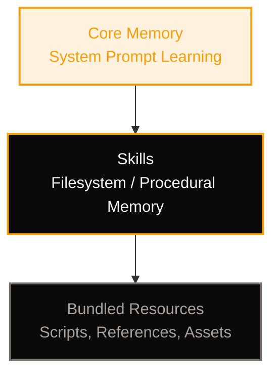
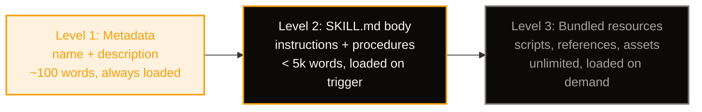
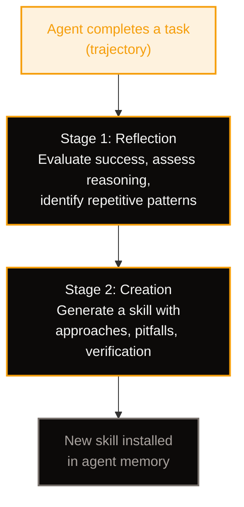
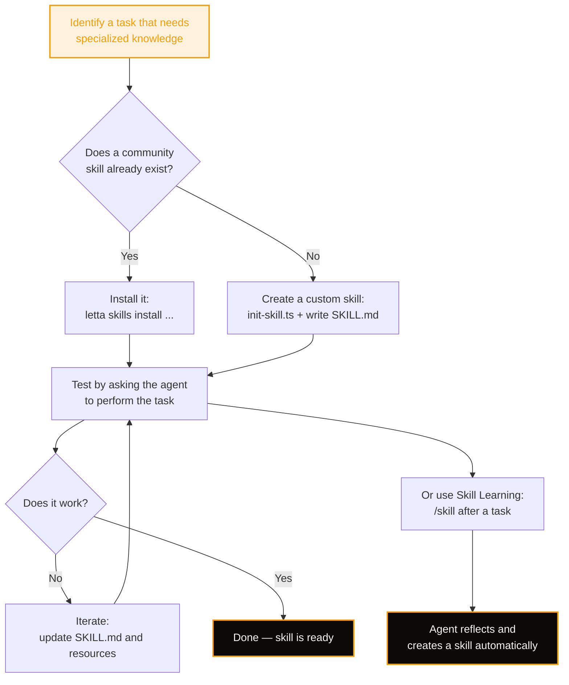

## What You're Building

Your Letta agent is capable out of the box — it can read files, run shell commands, search the web, and write code. But there are tasks where general-purpose intelligence isn't enough. Deploying to a specific cloud provider, following an internal CI/CD pipeline, parsing a proprietary file format — these require **procedural knowledge** that no model has at birth.

That's where **skills** come in. Skills are modular, self-contained packages of instructions and resources that your agent loads on demand. Think of them as reference handbooks: when the agent encounters a task that matches a skill, it consults the handbook and follows the procedure.

In this tutorial you'll:

- **Understand the skill system** — what skills are, how they're discovered, and where they live
- **Install community skills** from GitHub, Hermes, and ClawHub
- **Create a custom skill** from scratch with the proper SKILL.md format
- **Use Skill Learning** — Letta's two-stage reflection-and-creation process that lets agents learn from past experience
- **Apply progressive disclosure** to keep your agent's context window lean
- **Manage skills** across project, agent, and global scopes

If you've completed [Build Your First Letta Agent](/tutorials/letta-build-your-first-agent) and [Memory Blocks: Teaching Your Agent Who You Are](/tutorials/letta-memory-blocks), you already understand how Letta agents persist identity through memory. Skills extend that: memory is *who the agent is*, skills are *what the agent knows how to do*.

## What Are Skills?

Skills are directories containing a `SKILL.md` file and optional bundled resources. They follow the open [Agent Skills specification](https://agentskills.io/specification), which means they're portable across Letta Agent, Claude Code, Codex, Hermes Agent, OpenClaw, and any other compatible harness.

A skill transforms a general-purpose agent into a specialized one for a specific domain. Without a skill, your agent might fumble through a Kubernetes deployment by guessing at `kubectl` commands. With a skill, it follows a tested procedure: the right commands in the right order, with verification steps and common pitfalls documented.

### The Memory Hierarchy

Letta agents organize knowledge in a hierarchy:



| Layer | What it is | How it's stored | When it loads |
|-------|-----------|----------------|---------------|
| **Core Memory** | Evolving system prompt — persona, preferences, project context | Memory blocks in the system prompt | Always in context |
| **Skills** | Task-specific procedures, workflows, domain knowledge | `SKILL.md` files in skill directories | When the skill triggers |
| **Bundled Resources** | Scripts, reference docs, templates, assets | Files alongside `SKILL.md` | On demand, as needed |

Core memory shapes *who the agent is*. Skills shape *what the agent can do*. A Letta agent with both can evolve over time — its identity stays stable while its capabilities grow.

### Skill Scopes

Letta Code discovers skills from multiple locations, each with a different scope:

| Location | Scope | When to use |
|----------|-------|-------------|
| `.agents/skills/` | Project-scoped (preferred) | Skills specific to a repo — e.g., your project's deploy workflow |
| `.skills/` | Project-scoped (legacy) | Older project-local location, still supported |
| `~/.letta/agents/{id}/memory/skills/` | Agent-scoped MemFS | Persistent skills that travel with the agent across machines |
| `~/.letta/skills/` | Global | Skills shared across all agents on this machine |
| (bundled with Letta Code) | Built-in | Always available — e.g., `creating-skills`, `acquiring-skills` |

Priority order for conflicting names: **project > agent > global > built-in**. This means a project-scoped skill with the same name as a global skill will shadow the global one.

**Rule of thumb**: Default to **agent-scoped** skills (they persist with the agent's memory). Use **project-scoped** for repo-specific workflows. Use **global** only when every agent on the machine needs the same skill.

## Installing Community Skills

The fastest way to give your agent new capabilities is to install skills that others have already written.

### Skill Sources

| Source | Example | Description |
|--------|---------|-------------|
| **GitHub** | `https://github.com/owner/repo` | Any repo containing a `SKILL.md` |
| **Hermes Skills Hub** | `official/finance/stocks` | 88k+ skills across multiple registries |
| **ClawHub** | `clawhub/nano-banana-pro` | Community registry with versioning |
| **Letta Community** | `https://github.com/letta-ai/skills` | Letta-specific community skills |
| **Anthropic** | `https://github.com/anthropics/skills` | Anthropic's official Agent Skills |

### Installing via the CLI

The `letta skills install` command handles downloading, placing, and committing:

```bash
# Install from GitHub (full repo)
letta skills install https://github.com/owner/repo --agent $AGENT_ID

# Install from GitHub (subdirectory)
letta skills install https://github.com/owner/repo/tree/main/path/to/skill --agent $AGENT_ID

# Install from Hermes official skills
letta skills install official/finance/stocks --agent $AGENT_ID

# Install from ClawHub
letta skills install clawhub/nano-banana-pro --agent $AGENT_ID

# Pin a ClawHub version
letta skills install clawhub:nano-banana-pro@1.0.1 --agent $AGENT_ID
```

The `--agent` flag installs into a specific agent's MemFS. Use `$AGENT_ID` to install into your own memory.

### Installing via the Desktop App

If you're using the Letta desktop app:

1. Open the **Skills** page
2. Click **Add skill**
3. Choose **Import from GitHub**
4. Paste a GitHub URL pointing to a skill directory containing `SKILL.md`
5. Click **Import**

The app validates the URL, clones the repo, verifies the skill, and installs it globally. You can then attach it to specific agents from the Skills page.

### Installing by Asking Your Agent

The simplest method — just ask:

```text
> Can you install the skill from https://github.com/anthropics/skills/tree/main/skills/webapp-testing?
```

Your agent will use the `acquiring-skills` built-in skill to handle the download and installation.

### Managing Installed Skills

```bash
# List skills installed for a specific agent
letta skills list --agent $AGENT_ID

# Delete a skill
letta skills delete <skill-name> --agent $AGENT_ID
```

### Safety Considerations

Skills can contain:

- **Markdown files** — risk: prompt injection, misleading instructions
- **Scripts** (Python, TypeScript, Bash) — risk: malicious code execution

Always inspect skills from untrusted sources before using them. Trusted sources include `github.com/letta-ai/skills` and `github.com/anthropics/skills`. For any other source, read the `SKILL.md` and any scripts before executing them.

## The SKILL.md Format

Every skill is a directory with a `SKILL.md` file at its root. The file has two parts: YAML frontmatter (metadata) and a Markdown body (instructions).

### Directory Structure

```
deploying-to-kubernetes/
├── SKILL.md              (required — metadata + instructions)
├── scripts/
│   └── rollout-status.sh  (optional — executable code)
├── references/
│   ├── aws.md             (optional — provider-specific docs)
│   ├── gcp.md
│   └── azure.md
└── assets/
    └── manifest-template.yaml  (optional — templates used in output)
```

### Frontmatter

The frontmatter has two required fields and several optional ones:

| Field | Required | Constraints |
|-------|----------|-------------|
| `name` | Yes | Max 64 chars, lowercase letters/numbers/hyphens, must match directory name |
| `description` | Yes | Max 1024 chars, describes what the skill does and when to use it |
| `license` | No | License name or reference to a bundled license file |
| `compatibility` | No | Max 500 chars, environment requirements |
| `metadata` | No | Arbitrary key-value mapping |
| `allowed-tools` | No | Space-separated string of pre-approved tools (experimental) |

**Minimal example:**

```yaml
---
name: deploying-to-kubernetes
description: Deploys containerized applications to Kubernetes clusters using kubectl. Use when the user mentions kubectl, Kubernetes deployments, helm install, or cluster operations.
---
```

**The `description` is the most important field.** It's the only thing the agent sees at startup — it uses the description to decide whether to load the skill. Include both *what the skill does* and *when to use it*, with specific trigger keywords.

### Body

The Markdown body contains the skill's instructions. It's loaded only after the skill triggers, so it doesn't consume context until needed. There are no format restrictions — write whatever helps the agent perform the task effectively.

Keep the body under 500 lines and 5000 tokens. If you need more, split content into reference files and link to them from `SKILL.md`.

## Creating a Custom Skill

Let's create a skill that captures a reusable workflow. We'll build a skill for running database migrations in a typical web project — the kind of procedure that's easy to get wrong if you don't follow the exact steps.

### Step 1: Understand the Skill with Concrete Examples

Before writing anything, identify the concrete scenarios where this skill should trigger:

- "Run the database migrations for the staging environment"
- "I need to roll back the last migration"
- "Can you apply the pending migrations to production?"

These examples tell you what the skill needs to cover: forward migrations, rollbacks, and environment awareness.

### Step 2: Plan the Reusable Contents

Analyze each example to identify what resources would help:

- A **script** that checks the current migration status before running anything
- A **reference** documenting the migration commands for different environments
- The **core procedure** itself: check status → backup → migrate → verify

### Step 3: Initialize the Skill

Use the `init-skill.ts` script from the `creating-skills` skill to generate a template:

```bash
# Find the creating-skills skill directory
SKILL_DIR=$(find ~/.nvm -path "*/creating-skills" -type d 2>/dev/null | head -1)

# Initialize a new skill
npx tsx "$SKILL_DIR/scripts/init-skill.ts" running-database-migrations \
  --path ~/.letta/agents/$AGENT_ID/memory/skills/
```

This creates:

```
running-database-migrations/
├── SKILL.md          (template with TODO placeholders)
├── scripts/
│   └── example.sh    (example script to customize or delete)
├── references/
│   └── example.md    (example reference to customize or delete)
└── assets/
    └── example.txt   (example asset to customize or delete)
```

### Step 4: Write the SKILL.md

Replace the template content with your skill:

```yaml
---
name: running-database-migrations
description: Runs database migrations safely across environments. Use when the user mentions migrations, schema changes, database updates, rollback migrations, or applying pending migrations.
---
```

```markdown
# Running Database Migrations

## Quick start

Before running any migration, always:

1. Check the current migration status
2. Create a backup of the database
3. Apply the migration
4. Verify the schema change

## Checking status

Run the status check script to see pending migrations:

```bash
bash scripts/check-status.sh
```

The script outputs the current migration version and a list of pending migrations.

## Applying migrations

### Development

```bash
pnpm db:migrate
```

### Staging

```bash
DATABASE_URL=$STAGING_DB_URL pnpm db:migrate
```

### Production

**Always create a backup first:**

```bash
pg_dump $DATABASE_URL > backup_$(date +%Y%m%d_%H%M%S).sql
```

Then apply:

```bash
DATABASE_URL=$PRODUCTION_DB_URL pnpm db:migrate
```

## Rolling back

To roll back the last migration:

```bash
pnpm db:rollback
```

For multiple steps:

```bash
pnpm db:rollback --step 3
```

## Common pitfalls

- **Never run migrations without checking status first** — you might skip a pending migration
- **Always backup production before migrating** — rollbacks don't always reverse cleanly
- **Check for long-running queries** — migrations can lock tables in production

## Environment-specific details

For environment-specific configuration and connection strings, see:
- [references/staging.md](references/staging.md) — staging environment setup
- [references/production.md](references/production.md) — production environment setup
```

### Step 5: Add the Status Check Script

Create `scripts/check-status.sh`:

```bash
#!/usr/bin/env bash
# Check current migration status
# Usage: bash scripts/check-status.sh

set -euo pipefail

if [ -z "${DATABASE_URL:-}" ]; then
  echo "Error: DATABASE_URL is not set"
  echo "Set it with: export DATABASE_URL=postgresql://..."
  exit 1
fi

echo "Checking migration status..."
echo "Database: $(echo $DATABASE_URL | sed 's/.*@//')"
echo ""

# Run the migration status command
pnpm db:status 2>/dev/null || npx prisma migrate status 2>/dev/null || echo "Could not determine status — check your migration tool"

echo ""
echo "Done. Review the output above before proceeding."
```

### Step 6: Add Reference Files

Create `references/staging.md`:

```markdown
# Staging Environment

## Connection

- Host: staging-db.internal
- Port: 5432
- Database: app_staging
- Connection string: Set via `STAGING_DB_URL` environment variable

## Migration rules

- Always run migrations during the staging maintenance window (2-4 AM UTC)
- Notify the QA team in #staging-deploys before running migrations
- If a migration fails, roll back immediately — do not attempt to fix forward
```

Create `references/production.md`:

```markdown
# Production Environment

## Connection

- Host: prod-db.internal
- Port: 5432
- Database: app_production
- Connection string: Set via `PRODUCTION_DB_URL` environment variable

## Migration rules

- **Never run migrations during peak hours** (8 AM - 8 PM UTC)
- Create a backup before every migration, no exceptions
- Test the migration on staging first
- Have a rollback plan documented before starting
- Notify the on-call engineer in #prod-deploys
```

### Step 7: Clean Up and Test

Remove any example files you didn't use:

```bash
cd ~/.letta/agents/$AGENT_ID/memory/skills/running-database-migrations
rm -f assets/example.txt
```

Test the skill by asking your agent to use it:

```text
> Can you check the migration status for the staging environment?
```

The agent should recognize the task, load the skill, and follow the documented procedure.

## Progressive Disclosure

The most important design principle for skills is **progressive disclosure** — loading only what's needed, when it's needed. Skills use a three-level loading system:



| Level | What loads | When | Context cost |
|-------|-----------|------|-------------|
| 1. Metadata | `name` + `description` from frontmatter | Startup, for all skills | ~100 words per skill |
| 2. SKILL.md body | Full instructions | When the skill triggers | Up to 5000 words |
| 3. Bundled resources | Scripts, references, assets | As needed during execution | Unlimited (scripts can run without being read) |

This means you can have 50 skills installed and only pay the context cost for the one that triggers. The agent sees 50 descriptions (~5000 words total) but only loads the full body of the relevant skill.

### Patterns for Progressive Disclosure

**Pattern 1: High-level guide with references**

Keep the core workflow in `SKILL.md`, link to detailed guides:

```markdown
# PDF Processing

## Quick start
Extract text with pdfplumber: [code example]

## Advanced features
- Form filling: See [FORMS.md](references/FORMS.md)
- API reference: See [REFERENCE.md](references/REFERENCE.md)
```

**Pattern 2: Domain-specific organization**

Split content by domain so the agent only loads what's relevant:

```
querying-bigquery/
├── SKILL.md (overview + navigation)
└── references/
    ├── finance.md
    ├── sales.md
    └── product.md
```

**Pattern 3: Conditional details**

Show basic content, link to advanced content:

```markdown
# DOCX Processing

## Creating documents
Use docx-js for new documents. See [DOCX-JS.md](references/DOCX-JS.md).

## Editing documents
For simple edits, modify the XML directly.

**For tracked changes**: See [REDLINING.md](references/REDLINING.md)
**For OOXML details**: See [OOXML.md](references/OOXML.md)
```

**Key guidelines:**

- Keep references **one level deep** from `SKILL.md` — don't nest references inside references
- For reference files longer than 100 lines, include a table of contents at the top
- Information should live in either `SKILL.md` or references, not both
- Exclude ephemeral details (timestamps, temporary paths, commit hashes) from skills

## Skill Learning: Learning from Experience

So far we've covered manually installing and creating skills. But what if your agent could **learn skills on its own** from its past experience?

Letta's **Skill Learning** feature does exactly this. It uses a two-stage process to turn an agent's task experience into reusable skills — without changing the underlying model weights.

On Terminal Bench 2.0, learned skills boosted performance by **36.8% relative (15.7% absolute)** over the baseline, while also reducing costs by 15.7% and tool calls by 10.4%.

### The Two-Stage Process



**Stage 1 — Reflection**: Given an agent's trajectory for a task, the system generates a reflection that:

- Evaluates whether the agent solved the task
- Assesses the logical soundness of its reasoning
- Verifies that all steps are justified and edge cases are handled
- Identifies repetitive patterns or actions that could be abstracted into a skill

**Stage 2 — Creation**: The reflection feeds into a learning agent (powered by Letta Code) which uses Anthropic's skill-creator to generate a skill that provides:

- Potential approaches for the task type
- Common pitfalls and how to avoid them
- Verification strategies to confirm success

### Using Skill Learning

After your agent has worked on a task — especially a complex, multi-step one — trigger skill learning with the `/skill` command:

```text
> /skill
```

This enters skill learning mode. The agent reviews its recent trajectory, generates a reflection, and creates a skill if it identifies a reusable pattern.

### What Makes a Good Skill Learning Candidate?

Not every task should become a skill. Skill Learning works best when:

- **The task is repeatable** — you'll encounter similar tasks in the future
- **The procedure has concrete steps** — commands, tool patterns, config values
- **There are common pitfalls** — things that go wrong without specific knowledge
- **The agent struggled initially** — meaning the skill provides genuine value

One-off tasks, trivial operations, and things already covered by existing skills don't benefit from skill learning.

### Skill Learning vs. Core Memory Learning

Letta agents have two learning mechanisms that complement each other:

| Mechanism | What it learns | How it's stored | When it applies |
|-----------|---------------|----------------|-----------------|
| **Core Memory** | Preferences, corrections, project context, identity | Memory blocks in system prompt | Across all tasks, always in context |
| **Skill Learning** | Task-specific procedures, workflows, domain knowledge | `SKILL.md` files in MemFS | When a matching task triggers the skill |

Use **core memory** for things the agent should always know (who you are, how you like to work, what project you're on). Use **skills** for things the agent should know how to do when the right task comes along (deploying to a specific provider, parsing a specific format, running a specific workflow).

### Background Reflection

Letta Code also runs **background reflection agents** between your active turns. These agents review recent conversation history and update memory or create skills autonomously — similar to how human memory consolidates during sleep.

This means your agent might create a skill while you're not actively using it. The memory you wake up with may be better organized than what you left behind. This is the agent's own learning process at work.

## Invoking Skills Directly

Letta Code automatically decides when to load a relevant skill based on the description matching your request. But you can also invoke a skill explicitly:

```text
/temporal-developer help me debug a non-determinism error in my workflow
```

Or:

```text
/acquiring-skills find and install a skill for browser testing
```

Use `/skills` to browse all available skills by source before invoking one by name.

## Cross-Harness Compatibility

Skills from Hermes, OpenClaw, and other ecosystems were written for their own harnesses. After installing, read the full `SKILL.md` before using it and watch for:

| Issue | Example | What to do |
|-------|---------|------------|
| **Harness-specific commands** | `hermes skills config`, `openclaw plugins install` | Determine if the capability can be achieved with Letta tools (Bash, Skill) or if the skill doesn't apply |
| **Harness-specific paths** | `~/.hermes/skills/`, `~/.openclaw/skills/` | Adapt to Letta's paths (`~/.letta/skills/`, `$MEMORY_DIR/skills/`) |
| **Toolset assumptions** | Hermes `web` toolset, OpenClaw `browser` tool | Map to equivalent Letta tools or note when no equivalent exists |
| **Platform gating** | `platforms: [cli, discord, telegram]` | Ignore platform restrictions that don't apply to Letta |
| **Environment variables** | `requires.env` in frontmatter | Note any API keys or credentials the user needs to set up |

If a skill's core knowledge is useful but its commands are harness-specific, adapt the instructions mentally. If it's entirely about harness-specific plumbing, skip it.

## Best Practices

### Writing Good Descriptions

The `description` field is the agent's only signal for when to load a skill. Make it count:

```yaml
# Bad — vague, no trigger keywords
description: Helps with deployment tasks.

# Good — specific, includes trigger keywords
description: Deploys containerized applications to Kubernetes clusters using kubectl and helm. Use when the user mentions kubectl, Kubernetes deployments, helm install, helm upgrade, cluster operations, pod troubleshooting, or k8s manifests.
```

Rules:
- Write in **third person**: "Deploys..." not "I help deploy..." or "You can use this to..."
- Include both **what** the skill does and **when** to use it
- Include **specific trigger keywords** that match how users describe the task
- Max 1024 characters

### Naming Skills

- Use **gerund form**: `processing-pdfs`, `analyzing-data`, `creating-reports`
- Lowercase letters, numbers, and hyphens only
- Must match the directory name exactly
- Max 64 characters
- No consecutive hyphens (`--`)
- Must not start or end with a hyphen

### Setting Degrees of Freedom

Match the specificity to the task's fragility:

| Freedom level | When to use | Example |
|---------------|------------|---------|
| **High** (text-based instructions) | Multiple valid approaches, context-dependent | "Choose the right database based on the project's needs" |
| **Medium** (pseudocode with parameters) | A preferred pattern exists, some variation OK | "Use the migration script with the appropriate DATABASE_URL" |
| **Low** (specific scripts, few params) | Operations are fragile, consistency is critical | "Run `pg_backup.sh` with exactly these arguments in this order" |

Think of the agent as exploring a path: a narrow bridge with cliffs needs specific guardrails (low freedom), while an open field allows many routes (high freedom).

### What Not to Include

A skill should only contain files that directly support its functionality. Do **not** create:

- `README.md` — the `SKILL.md` is the documentation
- `INSTALLATION_GUIDE.md` — installation is handled by the CLI
- `QUICK_REFERENCE.md` — put quick reference content in `SKILL.md` or a reference file
- `CHANGELOG.md` — skills are versioned by git, not by changelogs

The skill should contain only what an AI agent needs to do the job at hand.

### Iterating on Skills

Skills improve through use. The iteration workflow:

1. Use the skill on real tasks
2. Notice struggles or inefficiencies
3. Identify how `SKILL.md` or bundled resources should be updated
4. Implement changes and test again

After testing a skill, you may discover missing edge cases, unclear instructions, or better approaches. Update the skill immediately while the context is fresh.

## Managing Skills Across Scopes

### Project-Scoped Skills

For skills specific to a repository, place them in `.agents/skills/`:

```bash
mkdir -p .agents/skills/my-deploy-workflow
# Create SKILL.md and any bundled resources
```

These skills are discovered automatically when Letta Code starts in the project directory. They're version-controlled with the repo, so the whole team gets the same skills.

### Agent-Scoped Skills

For skills that should persist with the agent across machines, use the agent's MemFS:

```bash
# Skills live at $MEMORY_DIR/skills/
mkdir -p "$MEMORY_DIR/skills/my-custom-skill"
```

These skills are part of the agent's identity — they travel with the agent's git-backed memory.

### Global Skills

For skills that every agent on the machine should have:

```bash
mkdir -p ~/.letta/skills/shared-utility
```

Use sparingly — most skills should be agent-scoped or project-scoped.

## Putting It All Together

Here's the complete workflow for giving your agent a new capability:



1. **Identify** a task where your agent needs specialized knowledge
2. **Search** for an existing community skill — check [github.com/letta-ai/skills](https://github.com/letta-ai/skills) and [github.com/anthropics/skills](https://github.com/anthropics/skills)
3. **Install** if one exists, or **create** a custom skill if not
4. **Test** by asking the agent to perform the task
5. **Iterate** — update the skill based on real usage
6. **Or use Skill Learning** — run `/skill` after a complex task and let the agent create a skill from its experience

## Summary

Skills are the procedural memory of your Letta agent — they encode *how to do things* that the model doesn't know by default. Combined with core memory (which encodes *who the agent is*), they let your agent evolve over time without changing model weights.

**Key takeaways:**

- Skills are `SKILL.md` files in directories, following the open [Agent Skills spec](https://agentskills.io/specification)
- They're discovered from project, agent, global, and built-in scopes
- Install community skills with `letta skills install`, or create your own with `init-skill.ts`
- Progressive disclosure keeps context lean: metadata always loads, body loads on trigger, resources load on demand
- Skill Learning (`/skill`) turns past experience into new skills through a two-stage reflection-and-creation process
- Skills are git-friendly, modular, and shareable across your organization

Your agent started as a generalist. Skills are how it becomes a specialist — one handbook at a time.
