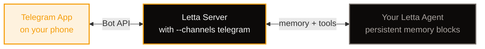

## Why Telegram + Letta?

Every tutorial in this series has run your agents from a Python script. That's fine for experimenting, but it's not how real users interact with software. They open an app on their phone. They send a message, close the app, come back tomorrow, and expect the conversation to continue where it left off. Scripts don't give you that — they give you a session that ends when the terminal closes.

Telegram makes this easy on the delivery side. The Bot API is free, the webhook model is simple, and Letta's built-in channel integration handles all the plumbing for you. But Telegram itself has no memory. Every update it sends you is stateless: a user ID, a chat ID, and a message. If you want the agent to remember who this person is across messages and sessions, you have to bring that yourself.

That's exactly what Letta provides. Each Letta agent maintains its own persistent memory blocks — the `human` block that fills in with facts about the user, the `persona` block that defines the agent's character — and those blocks survive across processes, restarts, and days. By pairing a Telegram chat to a Letta agent, you get something that no stateless chatbot can offer: a per-user assistant that genuinely knows the person it's talking to.

In [Build Your First Letta Agent](/tutorials/letta-build-your-first-agent) you saw how memory blocks persist across Python processes. In [Give Your Letta Agent Custom Tools](/tutorials/letta-agent-tools) you saw how agents can reach out to APIs. This tutorial wires a Letta agent to a real delivery channel, so the memory and tools you've built work for actual users in an interface they already have on their phones.

## What You'll Do

The old way of connecting Telegram to Letta meant writing a custom Python bot — handling long-polling, managing agent-per-chat mappings, parsing response messages, and maintaining a separate process alongside your Letta server. It worked, but it was a lot of code for what should be simple.

Letta's built-in **channels system** eliminates all of that. The entire setup is three commands:

1. **Create a bot** with Telegram's @BotFather
2. **Configure** the Telegram channel with `letta channels configure telegram`
3. **Start the server** with `--channels telegram`

Then you pair a chat to an agent and start talking. No custom bot code, no `python-telegram-bot` dependency, no agent-per-chat dictionary to persist. Letta handles the routing, the polling, and the message formatting automatically.



## Prerequisites

You need a Letta server running and at least one agent created. If you haven't done that yet:

- [Build Your First Letta Agent](/tutorials/letta-build-your-first-agent) — Docker one-liner to start the server, plus your first agent with memory blocks
- [Securely Run a Letta Server in the Cloud with Tailscale](/tutorials/letta-secure-cloud-server) — if you want the server accessible from anywhere

This tutorial assumes the server is running at `localhost:8283` with at least one agent you've already created.

## Step 1: Create a Telegram Bot

Open Telegram and search for `@BotFather`. Send it `/newbot`, follow the prompts to pick a name and username, and it will hand you a token that looks like:

```text
123456789:ABCDefghIJKlmnoPQRstuVWXyz
```

That token is all you need to send and receive messages as your bot. Copy it — you'll paste it into the Letta channel configuration in the next step.

<details>
<summary>Choosing a good bot name and username</summary>

- **Name** — what users see in the chat header (e.g., "My Memory Assistant")
- **Username** — must end in `bot` and be globally unique (e.g., `my_memory_assistant_bot`)
- You can change the name later via @BotFather, but the username is permanent
- Add a profile photo and description through @BotFather's `/setuserpic` and `/setdescription` commands to make the bot feel polished

</details>

## Step 2: Configure the Telegram Channel

Run the interactive configuration wizard:

```bash
letta channels configure telegram
```

The wizard will:

1. **Auto-install** the Telegram runtime dependencies (no manual `pip install` needed)
2. **Ask for your bot token** and validate it against the Telegram API — if the token is wrong, you'll know immediately instead of discovering it at runtime
3. **Let you choose a DM policy** — this controls who can message your bot:

| Policy | Who can message the bot | Best for |
|--------|------------------------|----------|
| `pairing` | Anyone, but they must pair with a code first | Production — prevents random users from talking to your agent |
| `allowlist` | Only pre-approved Telegram user IDs | Private bots for a known set of users |
| `open` | Anyone who finds the bot | Public bots, demos, testing |

Choose `pairing` for now — it's the safest default. New users will get a pairing code that you (the agent owner) must approve before they can chat with the agent.

The configuration is written to `~/.letta/channels/telegram/accounts.json`. You can edit this file manually later if you need to change the token or policy without re-running the wizard.

## Step 3: Start the Server with Channels

Start (or restart) your Letta server with the `--channels` flag:

```bash
letta server --channels telegram
```

You'll see confirmation in the output:

```text
[Telegram] Bot started as @my_memory_assistant_bot
```

The bot begins long-polling for messages immediately. No separate process to manage — the Telegram listener runs inside the Letta server itself.

If your server is already running without channels, stop it (`Ctrl+C`) and restart with the `--channels telegram` flag. The server picks up the configuration from Step 2 automatically.

## Step 4: Pair a Telegram Chat to an Agent

Open Telegram on your phone and send any message to your bot. With the default `pairing` policy, the bot replies with a pairing code and instructions:

```text
Bot: Welcome! Your pairing code is B5ZR5H.
To complete setup, run this command:

  letta channels pair \
    --channel telegram \
    --code B5ZR5H \
    --agent <your-agent-id>
```

Complete the pairing from your terminal:

```bash
letta channels pair \
  --channel telegram \
  --code B5ZR5H \
  --agent <your-agent-id>
```

The `--agent` flag defaults to the `LETTA_AGENT_ID` environment variable, so if you've already set that, you can omit it:

```bash
export LETTA_AGENT_ID=agent-abc123
letta channels pair --channel telegram --code B5ZR5H
```

You can also pair from within an active agent session in the Letta app, CLI, or desktop:

```text
/channels telegram pair B5ZR5H
```

Once paired, the Telegram chat is bound to that specific agent and its conversation. Messages flow directly into the agent's conversation stream — no routing code, no agent-per-chat dictionary, no manual message forwarding.

## Step 5: Chat

That's it. Send a message to your bot from Telegram:

```text
You: Hi, my name is Jordan.
Bot: Hi Jordan! Great to meet you. How can I help you today?
```

Close the app. Come back tomorrow. Ask something that requires memory:

```text
You: What's my name?
Bot: Your name is Jordan!
```

The agent remembered — not because you re-sent the name, but because it wrote it into the `human` memory block during the first exchange. That block is stored on the Letta server and loaded fresh on every call. This is the persistence payoff the whole series has been building toward: a real user, on a real device, getting a real assistant that knows them.

### Message Formatting

The agent responds using the built-in `MessageChannel` tool, which converts Markdown to Telegram-safe HTML automatically. That means your agent can send:

- **Bold** and *italic* text
- `inline code` and code blocks
- [links](https://example.com)
- Lists and structured content

No extra configuration needed — the formatting just works.

## Managing Multiple Users

Each Telegram user who messages the bot gets their own pairing code. You pair each code to a separate agent (or the same agent with a different conversation) to control the mapping:

```bash
# Pair Jordan's chat to their own agent
letta channels pair --channel telegram --code B5ZR5H --agent agent-jordan

# Pair Sam's chat to a different agent
letta channels pair --channel telegram --code K9XA2P --agent agent-sam
```

The `--conversation` flag (defaults to `LETTA_CONVERSATION_ID` or `"default"`) lets you route multiple Telegram chats to different conversations within the same agent:

```bash
# Pair a work group chat to the agent's "work" conversation
letta channels pair --channel telegram --code W3RK01 --agent agent-1 --conversation work
```

## Verifying the Connection

If you want to confirm everything is wired up correctly:

1. **Check the server output** — you should see `[Telegram] Bot started as @your_bot` when the server starts
2. **Check the Letta ADE** — open [http://localhost:8283](http://localhost:8283), find your agent, and look at the conversation. Messages sent from Telegram will appear in the message history alongside any CLI or API messages
3. **Inspect memory** — after a few exchanges, check the agent's `human` memory block in the ADE. You'll see facts the agent has learned about the Telegram user, written by the agent itself

## Troubleshooting

| Problem | Likely cause | Fix |
|---------|-------------|-----|
| Bot doesn't respond to messages | Server not started with `--channels telegram` | Restart with `letta server --channels telegram` |
| `Bot started as @...` but no reply | Pairing not completed | Send a message to get a new pairing code, then run `letta channels pair` |
| `Invalid token` error during configuration | Wrong bot token from @BotFather | Re-run `letta channels configure telegram` with the correct token |
| Bot was working, now silent | Server restarted without `--channels` flag | Always include `--channels telegram` when starting the server |
| Wrong agent responds | Pairing code was paired to the wrong agent | Re-pair with the correct `--agent` flag |

## Where to Go Next

You now have a working Telegram bot backed by a persistent Letta agent — with zero custom bot code. The delivery channel and the memory layer are both in place. A few natural next steps:

- **Add tools** — the pattern from [Give Your Letta Agent Custom Tools](/tutorials/letta-agent-tools) applies directly. Register tools with the agent and it can look things up, send notifications, or query APIs on behalf of your Telegram users.
- **Change the DM policy** — edit `~/.letta/channels/telegram/accounts.json` to switch from `pairing` to `allowlist` or `open` once you're ready for broader access.
- **Deploy to the cloud** — [Securely Run a Letta Server in the Cloud with Tailscale](/tutorials/letta-secure-cloud-server) shows you how to run the server on a VPS. Add `--channels telegram` to the startup command and your bot is live 24/7.
- **Back up your agent's memory** — [Back Up Your Letta Agent Memory to GitHub](/tutorials/letta-backup-memory-github) ensures everything your agent has learned survives server migrations and disasters.
- **Teach your agent new skills** — [Teach Your Letta Agent New Skills](/tutorials/letta-skill-learning) shows how to give your agent specialized capabilities that load on demand.
- **Run entirely offline** — if you'd rather not send data to OpenAI, [Run a Completely Local Letta Instance](/tutorials/letta-local-instance) walks through running the whole stack on your own hardware with no API keys required.
