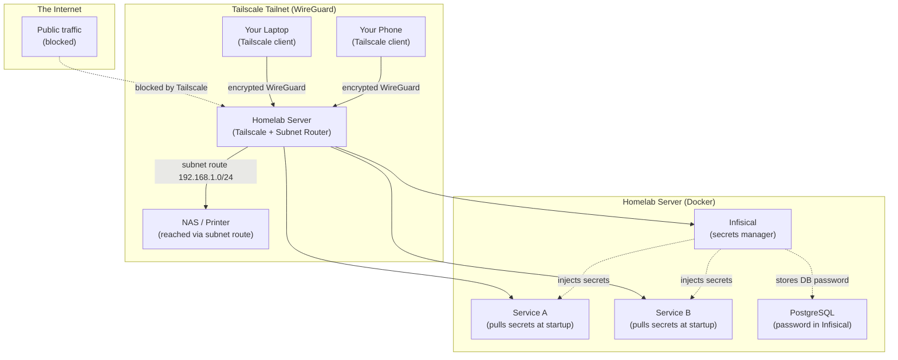

## What You're Building

A homelab has two problems that most tutorials skip: **access** and **secrets**.

**Access**: Every time you expose a service — a media server, a database dashboard, a Docker registry — you open a port on your router. Each open port is an attack surface. Dynamic DNS breaks when your IP changes. Port forwarding rules pile up. You end up with a router config nobody fully understands and a NAS that's one misconfigured firewall rule away from being public.

**Secrets**: Every service needs credentials — API keys, database passwords, TLS certificates. Most homelab operators store them in `.env` files on disk, commit them to Git by accident, or paste them into Docker Compose files. If any container is compromised, every secret in that `.env` file is exposed. There's no rotation, no audit log, no access control.

This tutorial fixes both problems with two open-source tools:

- **[Tailscale](https://tailscale.com)** replaces port forwarding with a zero-config mesh VPN. Every device in your homelab joins a private tailnet — an encrypted WireGuard network. You access services by Tailscale IP or MagicDNS name, not by opening router ports. Your home IP stays hidden. ACLs control who can reach what.
- **[Infisical](https://infisical.com)** replaces `.env` files with a self-hosted secret manager. Secrets live in an encrypted database, not on disk. You inject them into containers just-in-time with the Infisical CLI. Every access is logged. Secrets can be rotated without touching the container.

By the end of this tutorial you'll have:

- A **Tailscale tailnet** connecting your laptop, phone, and homelab server — with ACLs that restrict access to specific services and a subnet router that reaches devices too small to run Tailscale themselves.
- A **self-hosted Infisical instance** running on your homelab server, accessible only over Tailscale — storing every secret your services need in an encrypted database.
- A **Docker Compose stack** where every service pulls its secrets from Infisical at startup — no `.env` files on disk, no secrets in Git, no hardcoded passwords.
- **Tailscale Serve** exposing your services over HTTPS within your tailnet — with automatic TLS certificates and no router configuration.

The result is a homelab where the attack surface is a single Tailscale connection, every secret is encrypted and audited, and you can access everything from your phone without a single port forward.

## The Architecture

Two layers, each solving one problem:



- **Tailscale** is the access layer. Your laptop and phone connect to the tailnet. The homelab server is also on the tailnet and acts as a subnet router, bridging the tailnet to your LAN for devices that can't run Tailscale (NAS, printer, IP camera). No router ports are opened. No public IPs are needed.
- **Infisical** is the secrets layer. It runs as a Docker container on your homelab server, accessible only over Tailscale. Other containers use the Infisical CLI to pull their secrets at startup — no `.env` files, no hardcoded credentials.

## Prerequisites

- A **homelab server** running Linux (Ubuntu 20.04+ recommended) with Docker and Docker Compose installed
- A **Tailscale account** (free tier covers up to 100 devices)
- A **laptop or phone** to install the Tailscale client on
- Basic familiarity with Docker Compose and the Linux command line

## Step 1 — Set Up Tailscale

Install Tailscale on your homelab server:

```bash
# Ubuntu / Debian
curl -fsSL https://tailscale.com/install.sh | sh

# Or via apt
sudo apt update && sudo apt install -y tailscale
```

Bring Tailscale up:

```bash
sudo tailscale up
```

This opens a browser window to authenticate. Log in with your Tailscale account (Google, Microsoft, GitHub, or email). The server is now on your tailnet with a Tailscale IP (usually `100.x.y.z`) and a MagicDNS name (e.g., `homelab-server.tailnet-name.ts.net`).

Install Tailscale on your laptop and phone too:

- **macOS**: `brew install tailscale` or download from [tailscale.com/download](https://tailscale.com/download)
- **Windows**: Download from [tailscale.com/download](https://tailscale.com/download)
- **iOS / Android**: Install from the App Store / Play Store

Verify all devices are connected:

```bash
# On your laptop, ping the homelab server
tailscale status
ping homelab-server
```

You should see all your devices listed and the homelab server responding to pings over the encrypted WireGuard tunnel.

## Step 2 — Lock Down Access with ACLs

By default, Tailscale allows all devices on your tailnet to talk to each other. That's fine for two devices, but in a homelab you want least privilege — your phone should reach the media server, but not the database.

Open the Tailscale admin console at [login.tailscale.com](https://login.tailscale.com) → **Access Controls**. Replace the default policy with a deny-by-default ACL:

```jsonc
{
  // Tag owners: only admins can assign tags to devices
  "tagOwners": {
    "tag:server": ["autogroup:admin"],
    "tag:media": ["autogroup:admin"],
    "tag:database": ["autogroup:admin"]
  },

  // ACLs: deny by default, allow explicitly
  "acls": [
    // Admin devices can access everything
    { "action": "accept", "src": ["autogroup:admin"], "dst": ["*:*"] },

    // Non-admin devices can only reach tagged media services on their ports
    { "action": "accept", "src": ["autogroup:member"], "dst": ["tag:media:8096"] },

    // Deny everything else (implicit — Tailscale is deny-by-default)
  ],

  // Auto-approve subnet routes so you don't have to approve them manually
  "autoApprovers": {
    "routes": {
      "192.168.1.0/24": ["tag:server"]
    }
  }
}
```

This policy:
- **Allows admins** to access everything (SSH, all ports, all devices)
- **Allows regular members** to access only `tag:media` on port 8096 (e.g., Jellyfin)
- **Auto-approves** subnet route advertisements from `tag:server` devices — so you don't have to manually approve routes in the admin console

Tag your devices in the admin console or from the CLI:

```bash
# On the homelab server, tag it as a server
sudo tailscale up --advertise-tags=tag:server
```

Now only admin devices can SSH into the server. Non-admin devices can only reach the media service on its specific port.

## Step 3 — Set Up a Subnet Router

Not every device on your homelab can run Tailscale — your NAS, your printer, your IP camera. But they're on your LAN, and you want to reach them from your phone over the tailnet.

A **subnet router** bridges the tailnet to your LAN. Your homelab server advertises a subnet route, and Tailscale routes traffic for that subnet through the server.

Enable IP forwarding on the server:

```bash
echo 'net.ipv4.ip_forward = 1' | sudo tee -a /etc/sysctl.d/99-tailscale.conf
sudo sysctl -p /etc/sysctl.d/99-tailscale.conf
```

Advertise the subnet:

```bash
# Replace 192.168.1.0/24 with your actual LAN subnet
sudo tailscale up --advertise-routes=192.168.1.0/24 --accept-routes
```

Since you already added `autoApprovers` in your ACL (Step 2), the route is approved automatically. If you didn't, you'd need to approve it in the admin console under **Machines → Edit route settings**.

Now from your laptop (with `--accept-routes` enabled):

```bash
# Your laptop needs to accept the advertised routes
sudo tailscale up --accept-routes

# Now you can reach LAN devices by their local IP
ping 192.168.1.50    # your NAS
```

Your phone can also reach LAN devices — just enable "Accept routes" in the Tailscale app settings.

## Step 4 — Deploy Infisical with Docker Compose

Now for the secrets layer. Infisical is an open-source secret manager with a web dashboard, CLI, and SDKs. You'll self-host it on your homelab server, accessible only over Tailscale.

Create a directory for Infisical:

```bash
mkdir -p ~/infisical && cd ~/infisical
```

Download the Docker Compose file and environment template:

```bash
curl -o docker-compose.yml https://raw.githubusercontent.com/Infisical/infisical/main/docker-compose.prod.yml
curl -o .env https://raw.githubusercontent.com/Infisical/infisical/main/.env.example
```

Secure the `.env` file:

```bash
chmod 600 .env
```

Generate strong values for the required keys:

```bash
# Generate an encryption key (32-char hex)
openssl rand -hex 16

# Generate an auth secret
openssl rand -base64 32
```

Edit the `.env` file and set the critical values:

```bash
# Database connection (Infisical includes its own PostgreSQL)
POSTGRES_PASSWORD=change_me_to_a_strong_password
DB_CONNECTION_URI=postgres://infisical:change_me_to_a_strong_password@db:5432/infisical

# Encryption key (from openssl rand -hex 16)
ENCRYPTION_KEY=your_32_char_hex_string_here

# Auth secret (from openssl rand -base64 32)
AUTH_SECRET=your_auth_secret_here

# Site URL — use your Tailscale MagicDNS name
SITE_URL=https://homelab-server.tailnet-name.ts.net

# Disable telemetry for privacy
TELEMETRY_ENABLED=false
```

The key setting is `SITE_URL` — it uses your Tailscale MagicDNS name, not a public domain. Infisical is only accessible from within the tailnet.

Start Infisical:

```bash
docker compose up -d
```

Check that all three containers are running:

```bash
docker compose ps
```

You should see `infisical`, `db` (PostgreSQL), and `redis` all with `Up` status.

## Step 5 — Secure Infisical Behind Tailscale

Infisical is now running on port 80 of your homelab server. But you don't want it exposed on your LAN — only on the tailnet.

First, bind Infisical to the Tailscale interface only. Edit `docker-compose.yml` and change the port mapping:

```yaml
services:
  infisical:
    # ... other config ...
    ports:
      # Bind to Tailscale IP only, not 0.0.0.0
      - "100.x.y.z:8080:8080"  # Replace with your server's Tailscale IP
```

Alternatively, use **Tailscale Serve** to expose Infisical over HTTPS on the tailnet without touching the port mapping:

```bash
# Serve Infisical on HTTPS within the tailnet
sudo tailscale serve --bg https+insecure://localhost:8080
```

This creates an HTTPS endpoint at `https://homelab-server.tailnet-name.ts.net` that proxies to the local Infisical container. Tailscale automatically provisions and manages the TLS certificate.

Now open Infisical in your browser:

```text
https://homelab-server.tailnet-name.ts.net
```

Create your admin account. The first user becomes the instance administrator.

> **Why `https+insecure://`?** Infisical's internal container uses HTTP. Tailscale Serve terminates TLS at the Tailscale layer, so the connection from Tailscale to the local container is plain HTTP. The `https+insecure://` scheme tells Tailscale Serve not to verify the upstream certificate — it's local traffic within the same machine, so this is safe.

## Step 6 — Create a Project and Add Secrets

In the Infisical web dashboard:

1. **Create a project** — call it `homelab` (or whatever makes sense for your setup).
2. **Create an environment** — start with `dev` (you can add `prod` later).
3. **Add secrets** — click **Add Secret** and add the secrets your services need. For example:

   | Key | Value | Note |
   |-----|-------|------|
   | `POSTGRES_PASSWORD` | `a_strong_db_password` | Database password for your app |
   | `API_KEY` | `sk-xxxx` | API key for an external service |
   | `GRAFANA_ADMIN_PASSWORD` | `admin_password_here` | Grafana admin login |
   | `BACKBLAZE_B2_KEY_ID` | `xxxx` | Backup credentials |
   | `BACKBLAZE_B2_KEY_SECRET` | `xxxx` | Backup credentials |

Secrets are encrypted at rest with the `ENCRYPTION_KEY` you set in the `.env` file. They're only decrypted when a client with valid credentials requests them.

## Step 7 — Install and Authenticate the Infisical CLI

The Infisical CLI lets you pull secrets from the terminal and inject them into Docker containers.

Install the CLI on your homelab server:

```bash
# macOS
brew install infisical/get-cli/infisical

# Or via npm (any OS with Node.js)
npm install -g infisical

# Or download the binary directly
curl -fsSL https://infisical.com/install.sh | sh
```

### Linux Package Installation

If your homelab server runs Debian/Ubuntu or a RHEL-based distribution, you can install the Infisical CLI as a native Linux package instead of using the methods above. This is the recommended approach for production servers — it gives you version-pinned installs, clean upgrades, and a system-managed binary.

**Debian/Ubuntu (AMD64):**

```bash
# Add the Infisical repository
curl -1sLf 'https://artifacts-infisical-core.infisical.com/setup.deb.sh' | sudo -E bash

# Install the Infisical CLI
sudo apt-get update && sudo apt-get install -y infisical-core
```

**RHEL/CentOS/Amazon Linux (AMD64):**

```bash
# Add the Infisical repository
curl -1sLf 'https://artifacts-infisical-core.infisical.com/setup.rpm.sh' | sudo -E bash

# Install the Infisical CLI
sudo yum install infisical-core
```

Verify the installation:

```bash
infisical-ctl help
```

For production use, lock to a specific version to ensure consistency. All versions from `infisical-core-0.150.0` and above are available in the official Infisical repository. You can view available versions on the [Infisical GitHub releases page](https://github.com/Infisical/infisical/releases).

Authenticate with your self-hosted instance:

```bash
infisical login --domain https://homelab-server.tailnet-name.ts.net
```

This opens a browser window to log in. Once authenticated, the CLI stores a token locally that it uses for subsequent commands.

Link a project in your service directory:

```bash
cd ~/my-service
infisical init
```

This creates an `.infisical.json` file that links the directory to your Infisical project and environment. The file is safe to commit — it contains no secrets, just a reference to the project.

Verify you can pull secrets:

```bash
infisical secrets
```

You should see the secrets you added in Step 6.

## Step 8 — Inject Secrets into Docker Containers

Now for the payoff: running Docker containers with secrets injected from Infisical, no `.env` files needed.

The `infisical run` command wraps any command and injects secrets as environment variables:

```bash
# Run a command with secrets injected
infisical run --env=dev -- node app.js

# Run a Docker container with secrets injected
infisical run --env=dev -- docker run --rm -e POSTGRES_PASSWORD my-app:latest
```

For Docker Compose, use the Infisical CLI as an entrypoint. Create a `docker-compose.yml` for your service:

```yaml
version: "3.8"

services:
  app:
    image: my-app:latest
    entrypoint: ["/bin/sh", "-c"]
    command:
      - |
        infisical run --env=dev -- ./start.sh
    volumes:
      # Mount the Infisical config
      - ./.infisical.json:/app/.infisical.json:ro
      # Mount the Infisical CLI token
      - ~/.infisical:/root/.infisical:ro
    networks:
      - homelab

networks:
  homelab:
    external: true
```

The `infisical run` command fetches secrets from your Infisical server and injects them as environment variables before running the application. The secrets never touch disk — they exist only in the container's environment for the duration of the process.

For a simpler approach, use Infisical's **Machine Identity** — a service token that lets a machine pull secrets without interactive login:

```bash
# In the Infisical dashboard, create a Machine Identity
# Settings → Machine Identities → Add Machine Identity
# Give it access to the "homelab" project, "dev" environment
# Copy the service token
```

Then use the token in your Docker Compose:

```yaml
services:
  app:
    image: my-app:latest
    environment:
      # The service token is the only secret on disk
      - INFISICAL_TOKEN=st.dev.xxxxxxxxxxxxx
      - INFISICAL_API_URL=https://homelab-server.tailnet-name.ts.net/api
    entrypoint: ["/bin/sh", "-c"]
    command: ["infisical run --env=dev -- ./start.sh"]
```

The service token (`INFISICAL_TOKEN`) is the only secret that needs to exist on disk. Everything else — database passwords, API keys, TLS certificates — is pulled from Infisical at startup. If the token is compromised, you can rotate it in the Infisical dashboard without touching any other secret.

## Step 9 — Expose Services with Tailscale Serve

You've secured Infisical behind Tailscale Serve. Now do the same for your other homelab services — expose them over HTTPS within your tailnet, with automatic TLS certificates and no router configuration.

For each service you want to expose:

```bash
# Expose a web app on port 3000
sudo tailscale serve --bg https+insecure://localhost:3000

# Expose Grafana on port 3001
sudo tailscale serve --bg --https=3001 https+insecure://localhost:3001

# Expose Jellyfin on port 8096
sudo tailscale serve --bg --https=8096 https+insecure://localhost:8096
```

Each service is now accessible at:

```text
https://homelab-server.tailnet-name.ts.net:3000   # web app
https://homelab-server.tailnet-name.ts.net:3001   # Grafana
https://homelab-server.tailnet-name.ts.net:8096   # Jellyfin
```

All traffic is encrypted end-to-end via WireGuard. All TLS certificates are automatically provisioned and renewed by Tailscale. No router ports are opened. No public DNS is needed.

Check what's being served:

```bash
tailscale serve status
```

Remove a service:

```bash
sudo tailscale serve --https=3000 off
```

## Step 10 — Optional: Public Access with Tailscale Funnel

Some services need to be public — a webhook receiver, a status page, a shared link. Tailscale Funnel exposes a local service to the public internet through Tailscale's relay infrastructure, without opening any inbound ports on your router.

Enable Funnel in your ACL (Step 2):

```jsonc
{
  "nodeAttrs": [
    {
      "target": ["autogroup:member"],
      "attr": ["funnel"]
    }
  ]
}
```

Expose a service publicly:

```bash
# Expose a webhook receiver on port 9000 to the public internet
sudo tailscale funnel --bg --https=443 http://localhost:9000
```

The service is now accessible at:

```text
https://homelab-server.tailnet-name.ts.net
```

Anyone on the internet can reach it — but your home IP stays hidden, and no router ports are opened.

> **Warning:** Funnel provides no authentication layer. Your service must handle its own auth. Only use Funnel for services that are meant to be public — never for databases, admin panels, or anything that shouldn't be accessible to everyone.

## Troubleshooting

**`tailscale serve` returns a 502 error.** The local service isn't running or isn't listening on the port you specified. Check with `curl http://localhost:PORT` from the server. If the service binds to `127.0.0.1` only, use `https+insecure://localhost:PORT` in the `tailscale serve` command.

**Infisical CLI can't connect to the server.** Make sure you're on the tailnet — the Infisical server is only reachable over Tailscale. Run `tailscale status` to verify you're connected. Also check that `SITE_URL` in the Infisical `.env` file matches the Tailscale MagicDNS name you're using.

**`infisical run` fails with `No project found`.** Run `infisical init` in the directory where you're executing the command. This creates the `.infisical.json` file that links the directory to your Infisical project.

**Subnet routes aren't working.** Make sure IP forwarding is enabled (`sysctl net.ipv4.ip_forward` should return `1`). Check that the route is approved in the Tailscale admin console under **Machines → Edit route settings**. On the client side, make sure `--accept-routes` is set.

**ACL changes aren't taking effect.** ACL changes propagate within seconds, but existing connections may not be interrupted. Disconnect and reconnect Tailscale on the affected device to force a policy refresh.

**Docker container can't reach Infisical.** If the container is on a Docker network, it may not be able to resolve the Tailscale MagicDNS name. Either use the Tailscale IP directly (`https://100.x.y.z/api`), or add the Tailscale DNS server to the Docker daemon's DNS configuration in `/etc/docker/daemon.json`:

```json
{
  "dns": ["100.100.100.100"]
}
```

`100.100.100.100` is Tailscale's built-in DNS server. Restart Docker after making this change: `sudo systemctl restart docker`.

## Where to Go Next

You have a homelab where access is controlled by Tailscale and secrets are managed by Infisical. Here's how to take it further:

- **Add a Letta security agent.** Follow [Build an Autonomous Homelab Security Agent with Letta](/tutorials/letta-homelab-security-agent) to deploy an AI agent that scans every device on your tailnet for open ports, brute-force attacks, and misconfigured containers — then takes action autonomously.
- **Set up secret rotation.** Infisical supports secret versioning. Create a rotation schedule for your database passwords and API keys — Infisical keeps the old version around so you can roll back if something breaks. Use the Infisical CLI or API to automate rotation in a cron job or CI/CD pipeline.
- **Add device posture checks.** Tailscale's device posture feature lets you require that devices meet certain criteria before they can access your tailnet — for example, requiring a specific OS version, disk encryption, or a screen lock. Add posture rules in the admin console to enforce security baselines.
- **Use Infisical SDKs in your apps.** Instead of injecting secrets as environment variables, use Infisical's SDKs (Node.js, Python, Go, Java) to fetch secrets at runtime with auto-refresh. This means secrets are rotated without restarting the application.
- **Set up Kubernetes integration.** If you run Kubernetes in your homelab, use the Infisical Operator to sync secrets from Infisical into Kubernetes Secrets automatically. Your pods get secrets as native Kubernetes Secrets, but the source of truth is Infisical.
- **Add Tailscale Funnel for public services.** If you need to share a service with someone outside your tailnet — a webhook receiver, a status page, a shared dashboard — use Tailscale Funnel to expose it publicly without opening router ports. Just remember that Funnel provides no authentication — your service must handle its own auth.
- **Back up Infisical.** The PostgreSQL database contains all your encrypted secrets. Back up the `pg_data` Docker volume regularly: `docker exec infisical-db pg_dump -U infisical infisical > backup.sql`. Store the backup in your backup provider (e.g., Backblaze B2) using credentials that are themselves stored in Infisical — the homelab secret manager bootstrapping its own backup.

The pattern underneath all of this is worth keeping: **Tailscale** makes the network invisible and encrypted, **Infisical** makes the secrets invisible and audited, and **Docker** makes the services portable and isolated. Each layer handles one concern. Together they turn a homelab that was one misconfigured firewall rule away from disaster into something you can trust — and manage from your phone.
